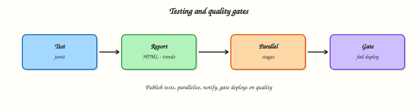

# Testing, Reports, and Quality Gates

## Overview

A green ball that hides failing tests is worse than a red ball. Jenkins should **publish JUnit results**, optional **HTML reports**, run **parallel** test stages where it helps, **notify** humans on failure, and enforce **quality gates** so deploy stages do not run on broken builds.

This is **Tutorial 12** in **Module 12: Testing and Quality Gates** of the REBASH Academy **Jenkins for Cloud & DevOps Engineers** series — written for Cloud, DevOps, Platform, and Site Reliability Engineering (SRE) engineers.

## Prerequisites

- [Pipeline Fundamentals (Declarative)](pipeline-fundamentals-declarative.md)
- [Securing Jenkins](securing-jenkins.md) — avoid leaking tokens in notify steps
- JUnit plugin (usually present with suggested plugins); HTML Publisher optional for HTML reports

## Learning Objectives

By the end of this tutorial, you will be able to:

- [ ] Publish JUnit XML and read test trends in Jenkins
- [ ] Outline HTML Publisher usage for non-JUnit reports
- [ ] Structure parallel test stages in Declarative Pipeline
- [ ] Add failure notifications without secret leakage
- [ ] Gate a deploy stage on test success

## Architecture

Test stages produce reports; publishers visualise trends; gates block deploy when quality fails.



## Theory

### What it is

**JUnit** publisher ingests XML test reports (`**/target/surefire-reports/*.xml`, pytest `--junitxml`, etc.) and shows pass/fail trends, flakes, and age of failures.

**HTML Publisher** archives HTML directories (coverage, Mutmut, custom reports) as browsable job artefacts.

**Parallel stages** run independent work concurrently (`parallel` in Declarative) to cut wall-clock time — with care for shared workspaces and agent capacity.

**Notifications** (email, Slack, Teams) alert on failure/recovery. Prefer credential-backed webhooks; never hard-code tokens.

**Quality gates** are Pipeline structure and thresholds: fail the build on test failures, require coverage minimums (tool-specific), and use `when { … }` / sequential stages so **Deploy** cannot run after a red **Test**.

### Why it matters

Without published tests, Stage View only shows that `sh './test.sh'` exited zero — or worse, that someone used `|| true`. Trends catch regressions across commits. Gates encode “no deploy on red” better than tribal knowledge.

### How it works

Typical pattern:

```groovy
stage('Test') {
  steps {
    sh 'pytest --junitxml=reports/junit.xml'
  }
  post {
    always {
      junit 'reports/junit.xml'
    }
  }
}
stage('Deploy') {
  when { branch 'main' }
  steps {
    echo 'Deploy only if previous stages succeeded'
  }
}
```

Parallel example:

```groovy
stage('Tests') {
  parallel {
    stage('Unit') { steps { sh 'make unit' } }
    stage('Lint') { steps { sh 'make lint' } }
  }
}
```

If any parallel branch fails, the stage fails (default). Use `failFast true` to abort siblings early.

### Key concepts and comparisons

| Signal | Meaning |
|--------|---------|
| Failed build | Gate should block deploy |
| Unstable | Often test failures with certain configs — treat as non-deployable unless policy says otherwise |
| Skipped deploy `when` | Explicit branch/env gates |

| Report type | Tooling |
|-------------|---------|
| JUnit XML | `junit` step |
| HTML site | HTML Publisher |
| Artefacts | `archiveArtifacts` |

### Common pitfalls

- Generating JUnit XML but forgetting `junit` in `post { always }`.
- `sh 'tests || true'` — green lies.
- Parallel stages writing the same workspace path.
- Slack token in Jenkinsfile.
- Deploy stage without `when` on every branch including PRs.

## Hands-on Lab

### Objective

Create a tiny project that emits JUnit XML, publish it from Pipeline, run a parallel lint/unit split, fail a gate intentionally once, and document a notification stub.

### Prerequisites

- Jenkins with JUnit plugin
- Python 3 on the agent **or** use `agent { docker { image 'python:3.12-alpine' } }` if Docker Pipeline available

### Lab environment

Workspace: `~/rebash-jenkins/module-12`

``` {.bash .ra-terminal title="Terminal"}
mkdir -p ~/rebash-jenkins/module-12 && cd ~/rebash-jenkins/module-12
set -euo pipefail
```

### Real-world scenario

Your service must not deploy when unit tests fail. Managers want Jenkins test trends, not screenshots of terminal output.

### Step-by-step tasks

#### Task 1 – Sample tests that emit JUnit XML

Run:

``` {.bash .ra-terminal title="Terminal"}
cd ~/rebash-jenkins/module-12
set -euo pipefail

rm -rf quality-demo
mkdir -p quality-demo/tests quality-demo/reports
cd quality-demo
```

Create `tests/test_math.py`:

```python title="test_math.py"
def test_add():
    assert 1 + 1 == 2

def test_mul():
    assert 2 * 3 == 6
```

Create `generate_junit.py`:

```python title="generate_junit.py"
"""Minimal JUnit XML writer for labs without pytest installed on the agent."""
from pathlib import Path
xml = """<?xml version="1.0" encoding="UTF-8"?>
<testsuite name="quality-demo" tests="2" failures="0" errors="0" skipped="0">
  <testcase classname="tests.test_math" name="test_add" time="0.001"/>
  <testcase classname="tests.test_math" name="test_mul" time="0.001"/>
</testsuite>
"""
Path('reports').mkdir(exist_ok=True)
Path('reports/junit.xml').write_text(xml, encoding='utf-8')
print('wrote reports/junit.xml')
```

Verify:

```bash
# Prefer pytest if available; always have generator fallback
(python3 -m pytest tests --junitxml=reports/junit.xml -q && echo pytest_ok || python3 generate_junit.py) | tee ../test-local.txt
test -f reports/junit.xml
grep -q 'testcase' reports/junit.xml
cd ..
```

!!! example "Expected output"
    `reports/junit.xml` contains `testcase` elements.


#### Task 2 – Pipeline with junit publish, parallel, and deploy gate

Run:

``` {.bash .ra-terminal title="Terminal"}
cd ~/rebash-jenkins/module-12/quality-demo
set -euo pipefail
```

Create `Jenkinsfile`:

```groovy title="Jenkinsfile"
pipeline {
  agent any
  options { timestamps() }
  stages {
    stage('Tests') {
      parallel {
        stage('Unit') {
          steps {
            sh '''
              mkdir -p reports
              if python3 -m pytest tests --junitxml=reports/junit.xml -q; then
                echo pytest_ok
              else
                python3 generate_junit.py
              fi
              test -f reports/junit.xml
            '''
          }
        }
        stage('Lint placeholder') {
          steps {
            sh 'echo lint_ok | tee reports/lint.txt'
          }
        }
      }
      post {
        always {
          junit allowEmptyResults: false, testResults: 'reports/junit.xml'
          archiveArtifacts artifacts: 'reports/**', fingerprint: true
        }
      }
    }
    stage('Quality gate') {
      steps {
        echo 'Tests stage succeeded — gate open'
      }
    }
    stage('Deploy placeholder') {
      when {
        allOf {
          branch 'main'
          expression { currentBuild.currentResult == 'SUCCESS' }
        }
      }
      steps {
        echo 'Deploy gated — only on main after green tests'
      }
    }
  }
  post {
    failure {
      echo 'NOTIFY_STUB: build failed — wire Slack/email via credentials, do not put tokens here'
    }
    success {
      echo 'NOTIFY_STUB: build success (optional)'
    }
  }
}
```

Verify:

``` {.bash .ra-terminal title="Terminal"}
grep -q 'junit' Jenkinsfile
grep -q 'parallel' Jenkinsfile
```

Create/run job `rebash-demo/quality-demo` (SCM or paste). Open the build → **Test Result**.

!!! example "Expected output"
    Tests published; parallel branches visible.


#### Task 3 – Failure gate drill

Run:

``` {.bash .ra-terminal title="Terminal"}
cd ~/rebash-jenkins/module-12/quality-demo
set -euo pipefail
```

Create `generate_junit_fail.py`:

```python title="generate_junit_fail.py"
from pathlib import Path
xml = """<?xml version="1.0" encoding="UTF-8"?>
<testsuite name="quality-demo" tests="2" failures="1" errors="0" skipped="0">
  <testcase classname="tests.test_math" name="test_add" time="0.001"/>
  <testcase classname="tests.test_math" name="test_mul" time="0.001">
    <failure message="assertion failed">expected 7</failure>
  </testcase>
</testsuite>
"""
Path('reports').mkdir(exist_ok=True)
Path('reports/junit.xml').write_text(xml, encoding='utf-8')
```

Create `failure-drill.sh`:

```bash title="failure-drill.sh"
#!/usr/bin/env bash
set -euo pipefail
python3 generate_junit_fail.py
grep -q '<failure' reports/junit.xml
echo failure_xml_ok
```

Verify:

``` {.bash .ra-terminal title="Terminal"}
chmod +x failure-drill.sh
./failure-drill.sh | tee failure-drill.txt
```

Create `Jenkinsfile.fail`:

```groovy title="Jenkinsfile.fail"
pipeline {
  agent any
  options { timestamps() }
  stages {
    stage('Tests') {
      steps {
        sh 'python3 generate_junit_fail.py'
        junit allowEmptyResults: false, testResults: 'reports/junit.xml'
      }
    }
  }
}
```

Verify:

``` {.bash .ra-terminal title="Terminal"}
grep -q generate_junit_fail Jenkinsfile.fail
```

!!! example "Expected output"
    Failing XML generator runs locally; swap `Jenkinsfile.fail` into the job to observe non-green test publishing.


#### Task 4 – HTML report stub and notification Pipeline fragment

Run:

``` {.bash .ra-terminal title="Terminal"}
cd ~/rebash-jenkins/module-12
set -euo pipefail

mkdir -p quality-demo/reports/html
```

Create `quality-demo/reports/html/index.html`:

```html title="index.html"
<html><body><h1>quality-demo coverage stub</h1><p>Module 12 lab</p></body></html>
```

Create `publish-html-snippet.groovy`:

```groovy title="publish-html-snippet.groovy"
publishHTML(target: [
  reportName: 'Coverage stub',
  reportDir: 'reports/html',
  reportFiles: 'index.html',
  keepAll: true
])
```

Create `notify-stub.Jenkinsfile`:

```groovy title="notify-stub.Jenkinsfile"
post {
  failure {
    echo 'NOTIFY_STUB: build failed — wire Slack/email via credentials, do not put tokens here'
  }
  success {
    echo 'NOTIFY_STUB: build success (optional)'
  }
}
```

Validate and archive:

``` {.bash .ra-terminal title="Terminal"}
grep -q publishHTML publish-html-snippet.groovy
grep -q NOTIFY_STUB notify-stub.Jenkinsfile

tar -czf module-12-evidence.tgz quality-demo/Jenkinsfile quality-demo/reports/junit.xml quality-demo/tests publish-html-snippet.groovy notify-stub.Jenkinsfile failure-drill.sh Jenkinsfile.fail *.txt
ls -l module-12-evidence.tgz | tee evidence.txt
```

!!! example "Expected output"
    Evidence archive created.


### Validation steps

- [ ] JUnit XML published on a Jenkins build
- [ ] Parallel Unit/Lint structure present
- [ ] Deploy stage gated (branch/`when`)
- [ ] `publish-html-snippet.groovy` and `notify-stub.Jenkinsfile` document safe patterns

### Common errors and fixes

| Error | Cause | Fix |
|-------|-------|-----|
| `Empty test results` | Wrong glob / cwd | Fix `testResults` path |
| Deploy ran on failure | No sequencing / `|| true` | Remove masking; rely on stage failure |
| Parallel workspace clash | Shared files | Separate dirs or `stash`/`unstash` |
| pytest missing | Agent image | Generator fallback or Docker agent |

### Challenge exercise

Add `publishHTML` (if plugin installed) for `reports/html`. Fail the build when failures > 0 using junit’s defaults and a follow-up `sh 'test ! -s fail.marker'` pattern of your choice. Prove the gate with `./failure-drill.sh | tee gate-evidence.txt`.

### Learning outcomes

- Emitted and published JUnit results
- Used parallel test stages
- Gated deploy behind success
- Planned safe notifications

### Cleanup

``` {.bash .ra-terminal title="Terminal"}
ls ~/rebash-jenkins/module-12
```

## Validation

- [ ] Lab completed under `~/rebash-jenkins/module-12/`
- [ ] You can find Test Result on a build page
- [ ] You can explain unstable versus failed for deploys
- [ ] You know why `|| true` destroys gates

## Code Walkthrough

1. **Always publish in `post { always }`** — failed runs still need reports.
2. **Parallel independent work** — not tightly coupled writers.
3. **Deploy after tests in the graph** — structure is the gate.
4. **Notify with credentials** — no tokens in Git.
5. **Trends over screenshots** — keep XML publishing on.

## Security Considerations

- Test reports can contain sensitive data — restrict job read access.
- Notification webhooks are secrets.
- PR jobs should not notify production incident channels noisily without filters.
- Do not archive `.env` files as “reports.”
- Quality gates are not a substitute for security scanners — add those as separate stages when required.

## Common Mistakes

!!! warning "Swallowing test failures with `|| true`"
    Deploy proceeds on lies. **Fix:** let the stage fail; publish XML in `always`.

!!! warning "JUnit path wrong → empty results allowed"
    `allowEmptyResults: true` hides missing suites. **Fix:** require results for mandatory suites.

!!! warning "Deploy stage without `when`"
    Feature branches ship. **Fix:** branch/`environment` conditions + approvals later.

!!! warning "Webhook URL in Jenkinsfile"
    Instant leak. **Fix:** credentials binding.

## Best Practices

- One mandatory unit suite per service Pipeline.
- Publish trends continuously.
- failFast for expensive parallel matrices when appropriate.
- Keep report paths stable for dashboards.
- Separate fast unit vs slow integration stages.

## Troubleshooting

| Symptom | Likely cause | Fix |
|---------|--------------|-----|
| 0 tests recorded | XML not produced | Fix generator/pytest path |
| Double-counted tests | Overlapping globs | Narrow `testResults` |
| Parallel flake | Shared pollution | Isolate workspaces |
| HTML 404 | Wrong reportDir | Match publisher paths |

## Summary

Publish tests, parallelise safely, notify without leaking secrets, and make deploy conditional on green quality signals. Next: [Kubernetes Agents and Deploys](kubernetes-agents-and-deploys.md).

## Interview Questions

**1. What does the `junit` Pipeline step do?**

??? success "Reveal answer"
    It ingests JUnit-format XML reports into Jenkins so each build shows test counts, failures, and historical trends — not just a shell exit code.

**2. Why publish test results in `post { always }`?**

??? success "Reveal answer"
    So failed runs still upload XML. If publishing only happens on success, you lose the failure details that matter most.

**3. What is a quality gate in a Jenkins Pipeline?**

??? success "Reveal answer"
    A structural or threshold check that prevents later stages (especially deploy) from running when tests/analysis fail — for example stage ordering, `when` conditions, and failing the build on test failures.

**4. When is Declarative `parallel` appropriate?**

??? success "Reveal answer"
    When stages are independent and you want lower wall-clock time (unit vs lint). Avoid parallel writers colliding on the same workspace files without isolation.

**5. What is the risk of `allowEmptyResults: true`?**

??? success "Reveal answer"
    The build can stay green even when the suite never produced XML — a broken test command looks successful.

**6. How should Slack/Teams notifications authenticate?**

??? success "Reveal answer"
    Store webhook URLs or tokens in the credentials store and inject them at runtime. Do not commit them to the Jenkinsfile.

**7. Difference between failed and unstable builds for deploy policy?**

??? success "Reveal answer"
    Both should usually block production deploy. Unstable often means tests failed while the build recorded results; treat as non-releasable unless a written policy says otherwise.

**8. How do HTML reports differ from JUnit publishing?**

??? success "Reveal answer"
    JUnit is structured test data with trends. HTML Publisher archives human-readable sites (coverage, custom reports) as browsable artefacts without the same test-case analytics.

## Related Tutorials

- [Pipeline Fundamentals (Declarative)](pipeline-fundamentals-declarative.md)
- [Kubernetes Agents and Deploys](kubernetes-agents-and-deploys.md)
- [Testing with pytest](../python/testing-with-pytest.md)

## References

- [JUnit plugin](https://plugins.jenkins.io/junit/)
- [HTML Publisher](https://plugins.jenkins.io/htmlpublisher/)
- [Pipeline Syntax — parallel](https://www.jenkins.io/doc/book/pipeline/syntax/#parallel)
