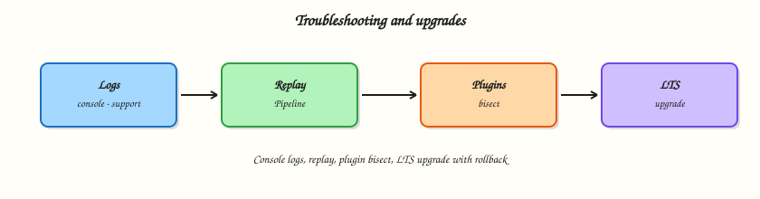

# Troubleshooting and Upgrades

## Overview

When CI is red, guesswork wastes hours. This tutorial builds a repeatable path through **failed builds**, **agent issues**, **Pipeline Replay**, **console logs**, **plugin problems**, and **performance symptoms** — then plans **Jenkins LTS upgrades** with **safe restart** and **rollback** using backups from Module 15.

This is **Tutorial 16** in **Module 16: Troubleshooting and Upgrades** of the REBASH Academy **Jenkins for Cloud & DevOps Engineers** series — written for Cloud, DevOps, Platform, and Site Reliability Engineering (SRE) engineers. Keep the [LTS upgrade guides](https://www.jenkins.io/doc/upgrade-guide/) open when you change production.

## Prerequisites

- [JCasC, Scaling, and Operations](jcasc-scaling-and-operations.md) — backups before upgrades
- A lab controller with at least one Pipeline job
- Comfort reading Stage View and console output

## Learning Objectives

By the end of this tutorial, you will be able to:

- [ ] Triage a failed build using Stage View → console → agent context
- [ ] Use Pipeline Replay safely on a lab job
- [ ] Recognise common plugin and performance failure patterns
- [ ] Draft an LTS upgrade checklist with staging and rollback
- [ ] Choose safe restart versus emergency restart

## Architecture

Incidents flow from symptom → build evidence → agent/controller health → fix or rollback; upgrades follow backup → stage → production → verify.



## Theory

### What it is

**Build triage:** identify which stage failed, read the first ERROR in console, check whether the agent was offline or mislabelled, then fix Jenkinsfile, credentials, or infra.

**Pipeline Replay:** re-run a build with an edited in-memory script (permissions required). Excellent for labs; dangerous on production without change control — prefer Git commits.

**Plugin issues:** boot failures, classloading errors, UI blanks after updates. Mitigation: staging controller, plugin pins, disable plugin via rescue patterns.

**Performance:** long queue times, GC pressure on controller, disk full from artefacts, slow Git checkouts. Fix capacity and retention, not “bigger JVM forever.”

**LTS upgrades:** read the upgrade guide for your jump, upgrade plugins as required, backup, upgrade staging, then production, then verify Pipelines.

### Why it matters

Unstructured troubleshooting leads to `safeRestart` superstition and Friday plugin updates. A written path reduces mean time to recovery (MTTR) and prevents compounding outages during upgrades.

### How it works

**Failed build path:**

1. Open red build → Stage View.
2. Console Output → first fatal error (not only the last line).
3. Confirm agent/label (`NODE_NAME`, node page).
4. Reproduce with Replay on lab or fix in Git.
5. Capture evidence for the incident channel.

**Upgrade path:**

1. Inventory core + plugins (`list-plugins`).
2. Backup/restore proof current.
3. Read LTS upgrade guide.
4. Upgrade staging; run canary Pipelines.
5. Production change window; safe restart; verify; rollback via volume restore if needed.

### Key concepts and comparisons

| Tool | Use |
|------|-----|
| Console Output | Ground truth |
| Replay | Temporary script edit |
| System log | Controller/plugin errors |
| Node log | Agent connectivity |
| `support` bundle (if available) | Deeper vendor/community debug |

| Restart | When |
|---------|------|
| Safe restart | Drain builds; plugin needs restart |
| Container recreate | Labs after Compose change |
| Restore volume | Bad upgrade / corruption |

### Common pitfalls

- Reading only the last console line.
- Replaying production without committing the fix.
- Upgrading production before staging.
- Ignoring disk-full warnings until writes fail.
- Rolling forward blindly when rollback is faster.

## Hands-on Lab

### Objective

Run a deliberate failing Pipeline, triage it with shell checks, practise Replay on lab, and complete an LTS upgrade plan as validated YAML (no requirement to upgrade production).

### Prerequisites

- Lab Jenkins with a Pipeline job you can break
- Backup runbook from Module 15 (`backup-restore.sh`)

### Lab environment

Workspace: `~/rebash-jenkins/module-16`

``` {.bash .ra-terminal title="Terminal"}
mkdir -p ~/rebash-jenkins/module-16 && cd ~/rebash-jenkins/module-16
set -euo pipefail
```

### Real-world scenario

Pager: “CI red across payments.” You need a triage checklist and an upgrade calendar before the next LTS jump.

### Step-by-step tasks

#### Task 1 – Deliberate failure and triage script

Run:

``` {.bash .ra-terminal title="Terminal"}
cd ~/rebash-jenkins/module-16
set -euo pipefail
```

Create `broken.Jenkinsfile`:

```groovy title="broken.Jenkinsfile"
pipeline {
  agent any
  stages {
    stage('Boom') {
      steps {
        sh 'echo about_to_fail'
        sh 'false'
      }
    }
  }
  post {
    failure {
      echo 'expected failure for Module 16 triage'
    }
  }
}
```

Create `triage-checks.sh`:

```bash title="triage-checks.sh"
#!/usr/bin/env bash
set -euo pipefail
LOG="${1:-console.log}"
grep -q about_to_fail "$LOG"
grep -qE 'ERROR|Finished: FAILURE' "$LOG"
grep -q 'expected failure for Module 16 triage' "$LOG"
echo triage_checks_ok
```

Verify:

``` {.bash .ra-terminal title="Terminal"}
chmod +x triage-checks.sh
```

Create `expected-failure-markers.txt`:

```text title="expected-failure-markers.txt"
about_to_fail
expected failure for Module 16 triage
```

Verify:

``` {.bash .ra-terminal title="Terminal"}
grep -q "sh 'false'" broken.Jenkinsfile
```

Create/run a lab job with `broken.Jenkinsfile`, paste Console Output to `console.log`, then run `./triage-checks.sh console.log | tee triage-result.txt`.

!!! example "Expected output"
    Triage script identifies `sh 'false'` as the cause.


#### Task 2 – Pipeline Replay drill (lab only)

1. Open the failed build → **Replay**.
2. Change `sh 'false'` to `sh 'true'`.
3. Run Replay → confirm success.
4. Note that the job definition may still be broken until you save/commit the fix.

Run:

``` {.bash .ra-terminal title="Terminal"}
cd ~/rebash-jenkins/module-16
set -euo pipefail
```

Create `fixed.Jenkinsfile`:

```groovy title="fixed.Jenkinsfile"
pipeline {
  agent any
  stages {
    stage('Boom') {
      steps {
        sh 'echo about_to_fail'
        sh 'true'
      }
    }
  }
}
```

Verify:

``` {.bash .ra-terminal title="Terminal"}
diff -u broken.Jenkinsfile fixed.Jenkinsfile | tee replay-fix.diff
grep -q "sh 'true'" fixed.Jenkinsfile
printf 'replay_lesson=commit_fix_to_git_not_replay_only\n' | tee replay-lesson.txt
```

!!! example "Expected output"
    Diff shows the one-line fix; Replay lesson captured in `replay-lesson.txt`.


#### Task 3 – Agent and performance symptom sheet

Run:

``` {.bash .ra-terminal title="Terminal"}
cd ~/rebash-jenkins/module-16
set -euo pipefail
```

Create `symptoms.yaml`:

```yaml title="symptoms.yaml"
symptoms:
  - symptom: queued_forever
    likely_cause: no_matching_agent_or_executors_zero
    first_check: nodes_and_labels
  - symptom: agent_offline
    likely_cause: network_or_secret
    first_check: node_log_and_relaunch
  - symptom: checkout_fail
    likely_cause: credentials_or_url
    first_check: credential_id_and_git_ls_remote
  - symptom: slow_controller_ui
    likely_cause: disk_cpu_plugins
    first_check: df_and_disable_heavy_plugins_on_staging
  - symptom: boot_loop_after_plugin_update
    likely_cause: bad_plugin
    first_check: disable_plugin_restore_backup
  - symptom: oomkilled_container
    likely_cause: heap_meta_space
    first_check: compose_mem_limits_and_heap_flags
```

Validate and archive:

``` {.bash .ra-terminal title="Terminal"}
python3 -c "
import yaml
with open('symptoms.yaml') as f:
    d = yaml.safe_load(f)
assert len(d['symptoms']) >= 5
print('symptoms.yaml OK')
" | tee symptoms-validate.txt
```

!!! example "Expected output"
    Symptom YAML validates.


#### Task 4 – LTS upgrade plan YAML

Run:

``` {.bash .ra-terminal title="Terminal"}
cd ~/rebash-jenkins/module-16
set -euo pipefail
```

Create `lts-upgrade-plan.yaml`:

```yaml title="lts-upgrade-plan.yaml"
current:
  core_version: fill_from_ui
  image_tag: lts-jdk17
  backup_last_tested: fill_from_module_15
target:
  lts_version: fill_from_jenkins_io
  upgrade_guide_read: false
  plugins_requiring_updates: []
stages:
  - backup_volume_and_list_plugins
  - upgrade_staging_controller
  - canary_pipelines: []
  - production_window: fill
  - verification: fill
  - rollback: restore_volume_or_previous_image_tag
safe_restart:
  drain_or_prepare_shutdown: fill
```

Validate and archive:

``` {.bash .ra-terminal title="Terminal"}
python3 -c "
import yaml
with open('lts-upgrade-plan.yaml') as f:
    d = yaml.safe_load(f)
assert 'rollback' in d['stages'][-1]
print('lts-upgrade-plan.yaml OK')
" | tee lts-plan-validate.txt

tar -czf module-16-evidence.tgz broken.Jenkinsfile fixed.Jenkinsfile triage-checks.sh symptoms.yaml lts-upgrade-plan.yaml replay-fix.diff replay-lesson.txt *.txt
ls -l module-16-evidence.tgz | tee evidence.txt
```

!!! example "Expected output"
    Upgrade plan YAML validates; evidence archived.


### Validation steps

- [ ] Failed build triaged with `triage-checks.sh`
- [ ] Replay practised on lab; fix captured in `fixed.Jenkinsfile`
- [ ] `symptoms.yaml` validates
- [ ] `lts-upgrade-plan.yaml` filled for your versions

### Common errors and fixes

| Error | Cause | Fix |
|-------|-------|-----|
| Replay button missing | Permissions / Pipeline type | Need Replay permission; Pipeline job |
| Still red after Replay | Different root cause | Re-read first ERROR |
| Upgrade boot fail | Plugin incompatibility | Restore backup; stage plugins |
| Disk full mid-upgrade | History/artefacts | Free space before upgrade |

### Challenge exercise

Capture `java -jar jenkins-cli.jar … list-plugins` output into `plugins-before.txt` (with token in env only) as the baseline artefact you would attach to an upgrade ticket.

### Learning outcomes

- Used a structured triage path
- Separated Replay experiments from durable Git fixes
- Planned LTS upgrades with rollback

### Cleanup

``` {.bash .ra-terminal title="Terminal"}
# Fix or delete the deliberately broken lab job
ls ~/rebash-jenkins/module-16
```

## Validation

- [ ] Lab completed under `~/rebash-jenkins/module-16/`
- [ ] You can narrate Stage View → console → agent
- [ ] You know when to restore versus roll forward
- [ ] You will not upgrade production without staging

## Code Walkthrough

1. **First error wins** — read from the top of the failure.
2. **Confirm the agent** — many “Pipeline bugs” are infra.
3. **Replay to learn; Git to fix** — durable changes in SCM.
4. **Backup before upgrade** — Module 15 is not optional.
5. **Stage then produce** — LTS guides are mandatory reading.

## Security Considerations

- Replay can run modified scripts — restrict permissions.
- Support bundles and console logs may contain secrets — redact.
- Upgrade windows need authenticated operators only.
- Do not disable security to “fix” upgrades.
- Rollback images/volumes carefully to avoid reintroducing known CVEs without a plan.

## Common Mistakes

!!! warning "Upgrading production on Friday without staging"
    Weekend outage. **Fix:** staging canaries; Monday-friendly windows.

!!! warning "Fixing only via Replay"
    Next build is red again. **Fix:** commit Jenkinsfile/config.

!!! warning "Ignoring disk warnings"
    Upgrades fail writing plugins. **Fix:** free space; retention policies.

!!! warning "Blaming Pipeline for offline agents"
    Wrong layer. **Fix:** node connectivity first.

## Best Practices

- Keep a living triage checklist in the platform repo.
- Pin images/tags for controllers.
- Maintain a canary job suite for post-upgrade verify.
- Record plugin inventory before/after.
- Prefer safe restart; communicate drain.

## Troubleshooting

| Symptom | Likely cause | Fix |
|---------|--------------|-----|
| `channel` / remoting errors | Agent network | Fix WebSocket/JNLP path |
| `RejectedAccessException` | Script security | Approve carefully on staging only |
| UI theme broken | Plugin/CSS conflict | Disable recent UI plugins |
| Builds stuck “after restart” | Queue/executor confusion | Check nodes; clear stale in-progress |

## Summary

Troubleshoot with evidence: stages, console, agents. Upgrade LTS with backups, staging, and an explicit rollback. You have completed the core Jenkins tutorial track — return to the [course overview](index.md) for capstone and interview practice.

## Interview Questions

**1. What is your first move when a Pipeline turns red?**

??? success "Reveal answer"
    Open the failing build’s Stage View to find the red stage, then read Console Output from the first ERROR, and confirm which agent/label ran the build before changing code.

**2. What is Pipeline Replay and when is it inappropriate?**

??? success "Reveal answer"
    Replay re-runs a build with an edited script in Jenkins. It is useful for labs and quick experiments. It is inappropriate as the only production fix because the durable definition in Git/UI may remain broken.

**3. How do you approach a Jenkins controller that will not boot after a plugin update?**

??? success "Reveal answer"
    Restore from backup or disable the offending plugin using known rescue procedures on a staging copy first; avoid random plugin deletion on the only production volume without a restore path.

**4. Name two performance symptoms that point to agent capacity issues.**

??? success "Reveal answer"
    Long queue wait times and many pending builds waiting for labels while existing agents are busy or offline.

**5. What should you read before an LTS upgrade?**

??? success "Reveal answer"
    The official LTS upgrade guide for the versions you are jumping, plus plugin compatibility notes — after taking a tested backup.

**6. Safe restart versus killing the container — which do you prefer?**

??? success "Reveal answer"
    Prefer safe restart / prepare-for-shutdown so builds can drain and configuration writes finish. Hard kills are emergency measures that risk corruption.

**7. How do backups participate in upgrade rollback?**

??? success "Reveal answer"
    If the upgraded controller misbehaves, you restore the pre-upgrade `JENKINS_HOME` volume/snapshot and/or previous image tag to return to a known good state.

**8. Why might checkout fail only on one agent label?**

??? success "Reveal answer"
    That agent pool may lack Git, network egress to the SCM host, or the correct credentials mounted — issues that would not appear on other labels.

## Related Tutorials

- [JCasC, Scaling, and Operations](jcasc-scaling-and-operations.md)
- [Managing Jenkins — Plugins, Tools, and CLI](managing-jenkins-plugins-tools-and-cli.md)
- [Course overview](index.md)

## References

- [LTS upgrade guides](https://www.jenkins.io/doc/upgrade-guide/)
- [Troubleshooting Jenkins](https://www.jenkins.io/doc/book/system-administration/troubleshooting/)
- [Pipeline development tools (Replay)](https://www.jenkins.io/doc/book/pipeline/development/)
