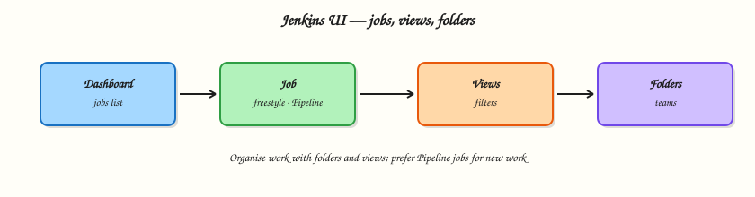

# Using Jenkins — Jobs, Views, and Folders

## Overview

A controller full of unsorted jobs becomes unusable: nobody knows which pipeline owns production, build history is noise, and credentials hide in the wrong scope. The Jenkins user interface is how operators navigate that estate — **dashboard**, **jobs**, **views**, **folders**, **build history**, and the **credentials** entry points.

This tutorial contrasts **Freestyle** jobs with **Pipeline** jobs (Pipeline wins for this course), then shows how folders and views keep multi-team controllers sane. You will leave folder and job naming conventions as files you can apply on your Module 2 controller.

This is **Tutorial 3** in **Module 3: Using Jenkins** of the REBASH Academy **Jenkins for Cloud & DevOps Engineers** series — written for Cloud, DevOps, Platform, and Site Reliability Engineering (SRE) engineers. Handbook reference: [Using Jenkins](https://www.jenkins.io/doc/book/using/).

## Prerequisites

- [Installing Jenkins LTS](installing-jenkins-lts.md) — running controller at `http://127.0.0.1:8080/` (or your mapped port)
- Admin (or equivalent) login from the setup wizard
- Suggested plugins installed (Pipeline and Git available)

## Learning Objectives

By the end of this tutorial, you will be able to:

- [ ] Navigate the dashboard, job pages, and build history
- [ ] Contrast Freestyle versus Pipeline and choose Pipeline for new work
- [ ] Create views and folders to organise jobs by team or product
- [ ] Locate credentials configuration entry points without storing secrets in jobs
- [ ] Apply a naming convention under `~/rebash-jenkins/module-03` and mirror it in the UI

## Architecture

Users reach jobs through the dashboard; folders nest jobs; views filter lists; credentials sit at global or folder scope.



## Theory

### What it is

The **dashboard** lists jobs (and folders) with status balls, weather icons, and last-success/failure information. A **job** (item) is a runnable automation unit — historically Freestyle, today usually **Pipeline**.

**Freestyle** jobs configure builders, SCM, and publishers through UI checkboxes. **Pipeline** jobs run a Groovy Domain Specific Language (DSL) defined in the job or in a `Jenkinsfile`. This course uses Pipeline for everything after the contrast.

**Views** filter which jobs appear on a tab (list view, my view). **Folders** (Folders plugin, usually present with suggested plugins) nest items, isolate credentials and role bindings later, and stop the root dashboard from becoming a landfill.

**Build history** stores each run’s console log, artefacts, and result. **Credentials** are managed under *Manage Jenkins → Credentials* (global) or inside a folder’s credentials store — never pasted into Freestyle shell builders for production.

### Why it matters

Platform teams onboard squads by giving them a **folder**, not a free-for-all root. Views help humans; folders help governance. Freestyle still appears in brownfield estates — you must recognise it — but Pipeline-as-code is reviewable, replayable, and Multibranch-ready.

Without build history literacy you cannot triage “it failed overnight.” Without knowing where credentials live you will hard-code tokens into jobs and leak them in console logs.

### How it works

1. Sign in → dashboard shows top-level items.
2. **New Item** creates a Freestyle project, Pipeline, Folder, Multibranch Pipeline, and other types.
3. Open a job → **Configure**, **Build Now**, and the build history on the left.
4. Open a build → **Console Output** for the truth of what ran.
5. Create a **View** to filter jobs by name regex or job type.
6. Create a **Folder** for a product/team; create jobs inside it.
7. Open **Manage Jenkins → Credentials** (or folder credentials) to see domains and stores — add secrets in Module 11 depth; know the door exists now.

User basics: Jenkins has its own user database after the wizard (or you later connect Lightweight Directory Access Protocol (LDAP) / Security Assertion Markup Language (SAML)). Your admin user can create items; tighten matrix/role strategy later.

### Key concepts and comparisons

| Item type | Use |
|-----------|-----|
| Freestyle | Legacy / simple UI builders — contrast only in this course |
| Pipeline | Declarative or Scripted automation — default path |
| Folder | Nest jobs; scope credentials and permissions |
| Multibranch Pipeline | One definition, many branches (Module 7) |
| Organisation Folder | Scan a GitHub/GitLab org (awareness) |

| Organiser | Strength | Limit |
|-----------|----------|-------|
| View | Fast human filter on a flat list | Does not isolate credentials |
| Folder | Hierarchy + future RBAC/credential scope | Requires discipline in naming |

| Signal on dashboard | Meaning |
|---------------------|---------|
| Blue / green ball | Success (theme-dependent) |
| Red ball | Failure |
| Yellow / orange | Unstable (often test failures) |
| Grey | Disabled or not built |
| Animated ball | Build in progress |

### Common pitfalls

- Creating every job at the root “temporarily.”
- Using Freestyle for anything that should be reviewed in Git.
- Hunting credentials inside job config instead of the credentials store.
- Ignoring failed builds because the weather icon still looks “sunny” from older history.
- Giving every engineer Overall/Administer so folders never get real boundaries.

## Hands-on Lab

### Objective

Define a folder/view naming convention on disk, create matching Folder and Pipeline stub items in your lab controller, and capture evidence with shell-generated layout files.

### Prerequisites

- Jenkins LTS from Module 2 running and unlocked
- Browser session as admin
- `curl` optional for HTTP checks

### Lab environment

Workspace: `~/rebash-jenkins/module-03`

Controller: `http://127.0.0.1:8080/` (adjust if you remapped ports).

```bash
mkdir -p ~/rebash-jenkins/module-03 && cd ~/rebash-jenkins/module-03
set -euo pipefail
curl -sS -o /dev/null -w "%{http_code}\n" http://127.0.0.1:8080/login | tee controller-login.txt
```

**Expected output:** HTTP code (commonly `200` or `403` still proves the UI responds).

### Real-world scenario

Two product squads will share one lab controller this quarter. You must create a folder layout and a list view before anyone dumps twenty root-level jobs named `test` and `test2`.

### Step-by-step tasks

#### Task 1 – Write naming and layout conventions as YAML

Run:

```bash
cd ~/rebash-jenkins/module-03
set -euo pipefail

mkdir -p folders/rebash-demo folders/team-platform folders/team-payments views
```

Create `jobs-manifest.yaml`:

```yaml
folders:
  - name: rebash-demo
    purpose: shared demos for the course
  - name: team-platform
    purpose: platform squad
  - name: team-payments
    purpose: example product squad
jobs:
  - folder: rebash-demo
    name: hello-pipeline
    type: pipeline
views:
  - name: course-labs
    type: list
    filter: rebash-demo.*
rules:
  prefer_pipeline_over_freestyle: true
  no_secrets_in_job_names: true
```

Validate and archive:

```bash
python3 -c "
import yaml
with open('jobs-manifest.yaml') as f:
    d = yaml.safe_load(f)
assert any(j['name'] == 'hello-pipeline' for j in d['jobs'])
assert d['rules']['prefer_pipeline_over_freestyle']
print('jobs-manifest.yaml OK')
" | tee manifest-validate.txt

find folders views -type d | sort | tee folder-layout.txt
```

**Expected output:** `manifest-validate.txt` shows OK; `folder-layout.txt` lists the directory tree.

#### Task 2 – Create a Folder in the UI

In Jenkins:

1. **New Item** → name `rebash-demo` → **Folder** → OK → Save.
2. Enter the folder → **New Item** → name `hello-pipeline` → **Pipeline** → OK.
3. Under Pipeline definition choose **Pipeline script** and paste:

```groovy
pipeline {
  agent any
  stages {
    stage('Hello') {
      steps {
        echo "Module 3 — folder-scoped Pipeline stub"
      }
    }
  }
}
```

4. Save → **Build Now** → open the build → **Console Output**.

Then record evidence locally:

```bash
cd ~/rebash-jenkins/module-03
set -euo pipefail
```

Create `hello-pipeline.Jenkinsfile`:

```groovy
pipeline {
  agent any
  stages {
    stage('Hello') {
      steps {
        echo "Module 3 — folder-scoped Pipeline stub"
      }
    }
  }
}
```

Create `pipeline-vs-freestyle.txt`:

```text
pipeline_job=hello-pipeline.Jenkinsfile
freestyle_legacy=recognition_only
review_in_git=pipeline
multibranch=first_class_pipeline
```

Verify:

```bash
test -f hello-pipeline.Jenkinsfile
grep -q 'pipeline_job=' pipeline-vs-freestyle.txt
printf 'ui_job_created=rebash-demo/hello-pipeline\n' | tee ui-evidence.txt
```

**Expected output:** Files present; Jenkins build console shows the echo line.

#### Task 3 – Create a List View

In Jenkins:

1. Dashboard → **New View** → name `course-labs` → **List View**.
2. Under Job Filters, include jobs matching `rebash-demo.*` (or recursively include the folder if your UI offers folder scope).
3. Save and confirm `hello-pipeline` appears in the view.

Run:

```bash
cd ~/rebash-jenkins/module-03
set -euo pipefail
```

Create `views/course-labs.yaml`:

```yaml
name: course-labs
type: list
filter: rebash-demo.*
jobs_visible:
  - rebash-demo/hello-pipeline
```

Validate and archive:

```bash
python3 -c "
import yaml
with open('views/course-labs.yaml') as f:
    d = yaml.safe_load(f)
assert d['name'] == 'course-labs'
print('course-labs.yaml OK')
" | tee view-validate.txt
```

**Expected output:** View validates; view visible in the UI.

#### Task 4 – Map credentials entry points

Run:

```bash
cd ~/rebash-jenkins/module-03
set -euo pipefail
```

Create `credentials-paths.txt`:

```text
global=Manage Jenkins/Credentials
folder=rebash-demo/Credentials
job=avoid embedding secrets in shell steps
rule=reference credential IDs from Pipeline in later modules
```

Validate and archive:

```bash
grep -q 'global=' credentials-paths.txt
tar -czf module-03-evidence.tgz jobs-manifest.yaml views/course-labs.yaml hello-pipeline.Jenkinsfile pipeline-vs-freestyle.txt credentials-paths.txt folder-layout.txt ui-evidence.txt *.txt
ls -l module-03-evidence.tgz | tee evidence.txt
```

**Expected output:** Archive created.

### Validation steps

- [ ] Folder `rebash-demo` exists with a Pipeline job inside
- [ ] At least one successful (or diagnosed) build in history
- [ ] List view `course-labs` shows the demo job
- [ ] `pipeline-vs-freestyle.txt` and `credentials-paths.txt` document the contrast

### Common errors and fixes

| Error | Cause | Fix |
|-------|-------|-----|
| Folder type missing | Plugins incomplete | Install Folders / suggested plugins |
| Pipeline type missing | Pipeline plugin absent | Plugin Manager → Pipeline |
| Build queued forever | No executors | Enable a lab executor on built-in node carefully, or add an agent |
| View empty | Filter too strict | Broaden regex or include folder jobs |

### Challenge exercise

Create a second folder `team-platform` and a Pipeline job `controller-health` that only echoes `uname` / `hostname`. Add it to the `course-labs` view (or create `platform-only` view). Keep scripts copied under `~/rebash-jenkins/module-03/`.

### Learning outcomes

- Organised jobs with folders and views
- Ran a folder-scoped Pipeline stub
- Documented Freestyle as legacy contrast in `pipeline-vs-freestyle.txt`
- Located credentials management entry points in `credentials-paths.txt`

### Cleanup

Keep the controller and `rebash-demo` folder for Module 4. Optionally delete failed experimental jobs only.

```bash
ls ~/rebash-jenkins/module-03
# Controller: leave Compose running/stopped with volume intact
```

## Validation

- [ ] Lab path completed under `~/rebash-jenkins/module-03/`
- [ ] You can explain dashboard, job, view, and folder in one sentence each
- [ ] You choose Pipeline over Freestyle for new work
- [ ] You can describe one governance benefit of folders

## Code Walkthrough

1. **Name before you click** — conventions beat cleanup sprints.
2. **Prefer Pipeline items** — UI stubs still become Jenkinsfiles next module.
3. **Use folders for teams** — views are filters; folders are boundaries.
4. **Read console output** — build history is the source of truth.
5. **Open credentials stores, do not paste secrets** — reference IDs later.

## Security Considerations

- Root-level jobs with embedded tokens are a common leak path — use the credentials store.
- Folder structure prepares Role-Based Access Control (RBAC) and folder credentials (Module 11).
- Limit who can create items at the root of a shared controller.
- Build logs may echo secrets if someone `echo $TOKEN` — never put secrets in Freestyle shell steps.
- Admin-only *Manage Jenkins* should stay admin-only.

## Common Mistakes

!!! warning "Everything at the dashboard root"
    Untagged jobs do not scale. **Fix:** create team/product folders before the second squad arrives.

!!! warning "New Freestyle jobs for CI"
    Freestyle fights Multibranch and code review. **Fix:** Pipeline (Declarative) for new automation.

!!! warning "Secrets in job configuration fields"
    Tokens end up in `config.xml` backups and console leaks. **Fix:** Credentials plugin stores + Pipeline bindings later.

!!! warning "Ignoring build history"
    Weather icons lag reality. **Fix:** open the failing build’s console when paging on CI.

## Best Practices

- One folder per team or product line on shared controllers.
- List views for human dashboards; folders for policy.
- Keep demo jobs clearly named (`rebash-demo/...`).
- Document item types you forbid (for example new Freestyle).
- Export naming conventions into Git (`jobs-manifest.yaml`).

## Troubleshooting

| Symptom | Likely cause | Fix |
|---------|--------------|-----|
| Cannot create Folder | Missing plugin | Install Folders / suggested plugins |
| Job not in view | Filter mismatch | Edit view job filters |
| Configure button missing | Insufficient permissions | Use admin for labs; fix matrix auth later |
| Old Freestyle only option | Pipeline plugin missing | Install Pipeline plugins |
| Dashboard too slow | Thousands of root jobs | Folders + trim build retention |

## Summary

Views filter; folders organise and later secure. Prefer Pipeline jobs, learn Freestyle only to migrate away from it, and know where credentials live before you need them. Next: [Pipeline Fundamentals (Declarative)](pipeline-fundamentals-declarative.md).

## Interview Questions

**1. What is the difference between a view and a folder in Jenkins?**

??? success "Reveal answer"
    A view filters which jobs appear on a dashboard tab. A folder is a hierarchical item that nests jobs and can scope credentials and permissions. Views organise attention; folders organise ownership and policy.

**2. Why does this course discourage new Freestyle jobs?**

??? success "Reveal answer"
    Freestyle definitions live mainly in the UI, which is hard to review in Git, awkward for Multibranch, and painful for complex flows. Declarative Pipeline encodes the same automation as code.

**3. Where should secrets live instead of Freestyle shell builders?**

??? success "Reveal answer"
    In the Jenkins credentials store (global or folder-scoped), referenced by credential ID from Pipeline. Hard-coding tokens in builders risks console leaks and backup exposure.

**4. What does build history give you during an incident?**

??? success "Reveal answer"
    Per-build console logs, results, parameters, and artefacts for a specific run. That is how you see which SHA failed and whether the failure is new or flaky.

**5. How do folders help multi-team controllers?**

??? success "Reveal answer"
    They create namespaces for jobs, enable folder-scoped credentials, and later support role strategies that grant a team rights inside their folder without Administer on the whole controller.

**6. What Jenkins item type should you pick for a single Declarative script in the UI?**

??? success "Reveal answer"
    A Pipeline job. Multibranch comes when the definition lives in SCM across branches. Freestyle is not the right type for new Pipeline work.

**7. What is a practical naming convention for shared lab controllers?**

??? success "Reveal answer"
    Prefix folders by team or purpose (`team-platform`, `rebash-demo`), keep job names descriptive, and avoid personal throwaway names at the root. Document the convention in Git.

**8. How do weather icons differ from the last build status?**

??? success "Reveal answer"
    Weather summarises recent history (stability over several builds). The last build ball shows the newest result. A sunny icon can coexist with a brand-new red build — always open the latest console when investigating.

## Related Tutorials

- [Installing Jenkins LTS](installing-jenkins-lts.md)
- [Pipeline Fundamentals (Declarative)](pipeline-fundamentals-declarative.md)
- [Securing Jenkins](securing-jenkins.md)

## References

- [Using Jenkins](https://www.jenkins.io/doc/book/using/)
- [Pipeline Getting Started](https://www.jenkins.io/doc/pipeline/tour/getting-started/)
- [Jenkins User Documentation](https://www.jenkins.io/doc/)
