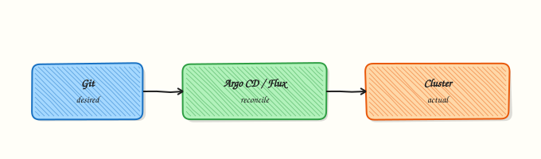

# GitOps and CI/CD with Kubernetes

## Overview


Separate CI (build/push images) from GitOps (desired cluster state in Git) and sketch an Argo CD Application sync/rollback flow.

**GitOps**: Git is source of truth; a reconciler (Argo CD / Flux) syncs the cluster. Progressive delivery (Argo Rollouts / Flagger) gates traffic.

This is a core tutorial in **Module 15 · GitOps** of the REBASH Academy **Kubernetes for Cloud & DevOps Engineers** series — written for Cloud, DevOps, Platform, and SRE engineers.

## Prerequisites


- [Helm](helm-package-management.md) · [GitOps fundamentals](../git/gitops-fundamentals.md)

## Learning Objectives


By the end of this tutorial, you will be able to:

- [ ] State GitOps principles  
- [ ] Contrast push CI deploy vs pull GitOps  
- [ ] Describe Argo CD sync / rollback  
- [ ] Layout app vs config repos

## Architecture


This topic’s control points and relationships are shown below.



## Theory


### What it is

**GitOps** keeps the desired cluster state in Git and uses a reconciler (**Argo CD**, **Flux**) to make the cluster match that state. **CI** still builds and tests images; it pushes artefacts to a registry and often opens a PR that bumps an image tag in the config repo. Progressive delivery tools (Argo Rollouts, Flagger) add traffic shifting and automated rollback on bad metrics.

### Why it matters

Push-from-CI `kubectl apply` works until credentials sprawl, drifts accumulate, and nobody knows what production *should* look like. GitOps gives auditability (Git history), pull-based credentials on the cluster side, and a single rollback story: revert the commit or hard-sync a previous revision. Platform teams standardise Application/Kustomization objects per environment.

### How it works (mental model)

1. Developers merge app code → CI builds/pushes image → updates manifest/Helm values in Git.
2. Argo CD/Flux detects the commit (webhook or poll) and **syncs** (apply/prune per policy).
3. Kubernetes controllers reconcile Deployments and friends as usual.
4. If health checks or metrics fail, roll back Git or disable auto-sync and fix forward.
5. Drift (manual `kubectl edit`) is either corrected on next sync or blocked by policy.

Desired state lives in Git; the cluster is a projection. Controllers still own runtime reconciliation.

### Key concepts / comparisons

| Model | Flow |
|-------|------|
| Push CI deploy | Pipeline kubeconfig applies YAML |
| Pull GitOps | In-cluster agent syncs from Git |

| Concern | Practice |
|---------|----------|
| App repo | Source code + Dockerfile |
| Config repo | Manifests / Helm / Kustomize per env |
| Secrets | Sealed Secrets, SOPS, ESO — not plain Git |

### Common pitfalls

- Storing plaintext Secrets in Git.
- Auto-sync with prune in a shared folder that deletes unrelated resources.
- CI and GitOps both deploying the same app — fight over image tags.
- Monorepo paths without directory-scoped Applications — one bad sync affects all.
- Treating sync success as user-success without app health/metrics gates.

## Hands-on Lab

### Objective

Create a GitOps repository layout (`apps/demo` + `clusters/dev`), a CI workflow stub that kubectl dry-runs manifests, and offline YAML validation — then apply to an isolated namespace and prove Ready.

### Prerequisites

- kubectl configured against **kind** or **minikube** (local lab cluster only)
- Python 3 with PyYAML (`python3 -c "import yaml"` — install `pyyaml` if import fails)
- Optional: `kustomize` or `kubectl kustomize` for overlay rendering
- Namespace-create rights; never target a shared production API server
- Writable workspace at `~/rebash-k8s/module-15`

### Lab environment

Workspace: `~/rebash-k8s/module-15`

```bash title="Terminal"
mkdir -p ~/rebash-k8s/module-15/{apps/demo,clusters/dev,.github/workflows}
cd ~/rebash-k8s/module-15
```

### Real-world scenario

Your platform team adopts GitOps: application manifests live in `apps/demo`, environment overlays in `clusters/dev`, and CI validates every pull request with `kubectl apply --dry-run=client` before a cluster reconciler syncs. You scaffold the repo layout, wire a dry-run workflow stub, validate YAML offline, then prove the dev overlay reaches Ready in namespace `rebash-gitops-lab`.

### Step-by-step tasks

#### Task 1 – Create base app manifests

Create `apps/demo/deployment.yaml`:

```yaml title="deployment.yaml"
apiVersion: apps/v1
kind: Deployment
metadata:
  name: demo-api
  labels:
    app: demo-api
    app.kubernetes.io/part-of: rebash-gitops
spec:
  replicas: 1
  selector:
    matchLabels:
      app: demo-api
  template:
    metadata:
      labels:
        app: demo-api
    spec:
      containers:
        - name: api
          image: nginx:1.27-alpine
          ports:
            - containerPort: 80
          readinessProbe:
            httpGet:
              path: /
              port: 80
            initialDelaySeconds: 2
            periodSeconds: 5
          resources:
            requests:
              cpu: 50m
              memory: 64Mi
            limits:
              cpu: 200m
              memory: 128Mi
```

Create `apps/demo/service.yaml`:

```yaml title="service.yaml"
apiVersion: v1
kind: Service
metadata:
  name: demo-api
  labels:
    app: demo-api
spec:
  selector:
    app: demo-api
  ports:
    - port: 80
      targetPort: 80
```

Validate offline:

```bash title="Terminal"
cd ~/rebash-k8s/module-15
set -euo pipefail
python3 -c "
import yaml, pathlib
for p in ['apps/demo/deployment.yaml', 'apps/demo/service.yaml']:
    yaml.safe_load(pathlib.Path(p).read_text())
print('apps/demo manifests OK')
"
```

!!! example "Expected output"
    `apps/demo manifests OK`


#### Task 2 – Create dev cluster overlay with Kustomize

Create `clusters/dev/kustomization.yaml`:

```yaml title="kustomization.yaml"
apiVersion: kustomize.config.k8s.io/v1beta1
kind: Kustomization
namespace: rebash-gitops-lab
resources:
  - namespace.yaml
  - ../../apps/demo/deployment.yaml
  - ../../apps/demo/service.yaml
commonLabels:
  environment: dev
```

Create `clusters/dev/namespace.yaml`:

```yaml title="namespace.yaml"
apiVersion: v1
kind: Namespace
metadata:
  name: rebash-gitops-lab
  labels:
    environment: dev
    app.kubernetes.io/managed-by: rebash-lab
```

Render and validate:

```bash title="Terminal"
cd ~/rebash-k8s/module-15
set -euo pipefail
if command -v kustomize >/dev/null 2>&1; then
  kustomize build clusters/dev | tee clusters/dev/rendered.yaml
elif kubectl kustomize clusters/dev | tee clusters/dev/rendered.yaml; then
  :
else
  echo "Install kustomize or use kubectl with kustomize support" >&2
  exit 1
fi
python3 -c "import yaml; list(yaml.safe_load_all(open('clusters/dev/rendered.yaml'))); print('rendered overlay OK')"
grep -q 'namespace: rebash-gitops-lab' clusters/dev/rendered.yaml
```

!!! example "Expected output"
    `rendered overlay OK`; rendered YAML includes `rebash-gitops-lab`.


#### Task 3 – Create CI workflow stub for kubectl dry-run

Create `.github/workflows/k8s-manifest-dry-run.yml`:


```yaml
name: Kubernetes manifest dry-run
on:
  pull_request:
    paths:
      - 'apps/**'
      - 'clusters/**'
  workflow_dispatch:

permissions:
  contents: read

jobs:
  validate:
    runs-on: ubuntu-latest
    steps:
      - uses: actions/checkout@v4
      - name: Render dev overlay
        run: |
          kubectl kustomize clusters/dev > /tmp/rendered.yaml
      - name: Client dry-run against cluster
        run: |
          kubectl apply --dry-run=client -f /tmp/rendered.yaml
        env:
          KUBECONFIG: ${{ secrets.LAB_KUBECONFIG }}
```


Validate offline (no cluster required):

```bash title="Terminal"
cd ~/rebash-k8s/module-15
set -euo pipefail
python3 -c "import yaml; yaml.safe_load(open('.github/workflows/k8s-manifest-dry-run.yml')); print('workflow YAML OK')"
grep -q 'dry-run=client' .github/workflows/k8s-manifest-dry-run.yml
grep -q 'kubectl kustomize clusters/dev' .github/workflows/k8s-manifest-dry-run.yml
```

!!! example "Expected output"
    `workflow YAML OK`


#### Task 4 – Apply dev overlay and capture evidence

Apply the GitOps dev overlay to your lab cluster and prove Ready.

```bash title="Terminal"
cd ~/rebash-k8s/module-15
set -euo pipefail
kubectl apply -k clusters/dev
kubectl rollout status deployment/demo-api -n rebash-gitops-lab --timeout=120s
kubectl get deploy,po,svc -n rebash-gitops-lab | tee gitops-evidence.txt
kubectl get events -n rebash-gitops-lab --sort-by=.lastTimestamp | tail -n 10 | tee -a gitops-evidence.txt
tar -czf module-15-gitops-evidence.tgz apps/demo clusters/dev .github/workflows/k8s-manifest-dry-run.yml gitops-evidence.txt
ls -l module-15-gitops-evidence.tgz
```

!!! example "Expected output"
    Deployment Available; tarball lists manifests and evidence.


### Validation steps

- [ ] `apps/demo` Deployment and Service parse with Python YAML
- [ ] `clusters/dev` kustomize build sets namespace `rebash-gitops-lab`
- [ ] CI workflow stub references kubectl dry-run and kustomize render
- [ ] Applied overlay reaches Ready in the lab cluster
- [ ] Evidence tarball contains manifests and `gitops-evidence.txt`

### Common errors and fixes

| Error | Cause | Fix |
|-------|-------|-----|
| Kustomize path not found | Wrong relative `resources` path | Paths in overlay are relative to `kustomization.yaml` |
| dry-run auth failure | CI secret missing or wrong context | Use local `kubectl apply -k` first; fix kubeconfig in CI later |
| Pods NotReady | Probe path wrong for image | Use `/` for nginx; check `describe pod` Events |
| MkDocs build breaks on workflow | Unescaped Actions expressions in tutorial | Wrap workflow YAML in raw Jinja blocks |
| Namespace not created | Forgot `namespace.yaml` in overlay | Add Namespace manifest to kustomization resources |

### Challenge exercise

Add a `ConfigMap` generator in `clusters/dev/kustomization.yaml` that sets `LOG_LEVEL=debug`, re-render, and prove the env var appears in the Pod spec after apply.

### Learning outcomes

- Structured a GitOps repo with app base and environment overlay
- Authored a CI workflow stub for client-side dry-run validation
- Validated manifests offline with Python and kustomize
- Applied an overlay and captured rollout evidence

### Cleanup

```bash title="Terminal"
kubectl delete namespace rebash-gitops-lab --ignore-not-found --wait=true
rm -f ~/rebash-k8s/module-15/clusters/dev/rendered.yaml ~/rebash-k8s/module-15/gitops-evidence.txt ~/rebash-k8s/module-15/module-15-gitops-evidence.tgz
```

## Validation


- [ ] Lab commands run under `~/rebash-k8s/module-15/{apps/demo,clusters/dev}/`
- [ ] You can explain each Theory section in your own words
- [ ] You used modern tooling where it applies to this topic
- [ ] You can describe one production failure mode for this topic

## Code Walkthrough


Production practice for **GitOps and CI/CD with Kubernetes** always combines:

1. Inspect before you change (status, plan, logs, dry-run)
2. Prefer reversible, documented changes (Git, IaC, drop-ins, version pins)
3. Capture evidence (command output, pipeline logs) for handovers
4. Prefer current tools and APIs over legacy shortcuts
5. Least privilege — escalate credentials only when required

Keep runbooks short enough to follow under pressure. Automate checks; keep humans for judgement.

## Security Considerations


- Treat credentials and tokens for kubernetes as privileged — never commit them
- Prefer short-lived auth (OIDC, roles, SSO) over long-lived keys
- Validate blast radius before apply/deploy/delete operations
- Restrict who can approve production changes
- Collect audit logs; limit who can read sensitive traces

## Common Mistakes


!!! warning "Storing plaintext Secrets in Git."
    Validate assumptions against the Theory section and official docs before changing production.

!!! warning "Auto-sync with prune in a shared folder that deletes unrelated resources."
    Lab shortcuts (open security groups, admin roles, skip approvals) must not ship unchanged.

!!! warning "Changing production without a rollback path"
    Always know how to revert (previous artefact, prior release, state rollback, DNS failback).

## Best Practices


- Encode GitOps and CI/CD with Kubernetes changes as code and review them in pull requests
- Pin versions (images, modules, actions, provider plugins)
- Separate environments with clear promotion gates
- Alert on symptoms with runbooks attached
- Destroy lab resources; tag everything with owner and expiry where possible

## Troubleshooting


| Symptom | Likely cause | Fix |
|---------|--------------|-----|
| Auth / permission denied | Wrong identity, policy, or scope | Check caller identity, roles, and least-privilege policies |
| Timeout / no route | Network, DNS, security group, or endpoint | Trace path, DNS, and allow-lists before retrying |
| Drift / unexpected plan | Manual change or wrong state/workspace | Reconcile desired vs actual; avoid click-ops on managed resources |
| Pipeline/job red | Flaky step, cache, or missing secret | Read failing step logs; bisect recent workflow/config changes |
| Cost spike | Idle load balancer, NAT, oversized compute | Inventory billable resources; stop/delete labs promptly |

## Summary


**GitOps and CI/CD with Kubernetes** is essential for Cloud and DevOps engineers working with kubernetes. Practise the lab until the inspection and change path is muscle memory, then continue the track.

## Interview Questions


1. What is GitOps in the context of Kubernetes delivery?
2. Why is the Git repository treated as the source of truth rather than imperative kubectl changes?
3. What is the difference between push-based CI deploy jobs and pull-based GitOps agents?
4. What security trade-offs exist when CI pipelines hold kubeconfig credentials versus a cluster-side reconciler?
5. How do you detect and remediate configuration drift?

!!! tip "Sample answer — question 2"
    Git records the desired state, enabling review, audit, and rollback through normal version control. Imperative cluster edits are easy to lose and hard to reproduce across environments.

!!! tip "Sample answer — question 4"
    CI push models concentrate powerful credentials in the pipeline. Pull-based controllers keep credentials in-cluster with narrower RBAC, reducing blast radius if the CI system is compromised, at the cost of another in-cluster component to operate.

## Related Tutorials


- [Course overview](index.md)
- [Platform Engineering on Kubernetes](platform-engineering-on-kubernetes.md)

## References


- [Argo CD](https://argo-cd.readthedocs.io/) · [OpenGitOps](https://opengitops.dev/)
