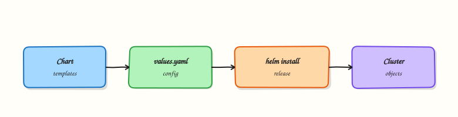

# Helm Package Management

## Overview


Install a chart from a repo with custom values, list/upgrade/rollback a release, and sketch chart structure (`Chart.yaml`, templates, values).

**Helm** packages Kubernetes manifests as **charts**. Releases track installed instances. Prefer pinned chart versions in production.

This is a core tutorial in **Module 14 · Package Management** of the REBASH Academy **Kubernetes for Cloud & DevOps Engineers** series — written for Cloud, DevOps, Platform, and SRE engineers.

## Prerequisites


- [Kubernetes Autoscaling](kubernetes-autoscaling.md)
- Helm 3 CLI installed

## Learning Objectives


By the end of this tutorial, you will be able to:

- [ ] `helm repo add` / `install` / `upgrade` / `rollback`  
- [ ] Override with `-f values.yaml`  
- [ ] Inspect `helm template` output  
- [ ] Outline chart dependencies

## Architecture


This topic’s control points and relationships are shown below.



## Theory


### What it is

**Helm** is the common package manager for Kubernetes. A **chart** is a versioned bundle of templates and default values. A **release** is a named instance of a chart installed into a cluster (and usually a namespace). Helm 3 stores release metadata in Secrets/ConfigMaps in-cluster; there is no Tiller.

### Why it matters

Hand-maintaining dozens of raw manifests per environment does not scale. Charts parameterise images, replicas, and ingress hosts via **values**, so the same package deploys to lab and production with different `-f` files. Platforms and GitOps tools often render or deliver Helm charts as the unit of install.

### How it works (mental model)

1. `helm repo add` / `pull` obtains chart packages (or you `helm create` locally).
2. Templates under `templates/` plus `values.yaml` render to Kubernetes YAML (`helm template` to preview).
3. `helm install` / `upgrade` applies the rendered objects and records a release revision.
4. `helm rollback` reverts to a previous revision’s manifest set.
5. Dependencies in `Chart.yaml` pull subcharts; OCI registries increasingly host charts alongside images.

Helm does not replace controllers — it ships the desired-state objects those controllers reconcile.

### Key concepts / comparisons

| Piece | Role |
|-------|------|
| Chart | Package (Chart.yaml, values, templates) |
| Release | Installed instance + history |
| Values | Configuration overlays |
| Repo / OCI | Distribution |

| Command | Use |
|---------|-----|
| `helm install` | Create release |
| `helm upgrade` | Move to new chart/values |
| `helm rollback` | Restore prior revision |
| `helm template` | Client-side render / debug |

Prefer pinned chart versions in production; floating `latest` charts are supply-chain risk.

### Common pitfalls

- Upgrading with incomplete values and accidentally resetting replicas or resources to chart defaults.
- Editing live objects that Helm owns — next upgrade overwrites them (use values or `lookup` patterns carefully).
- Ignoring `helm template` diffs in CI — broken YAML ships unnoticed.
- Mixing `kubectl apply` and Helm on the same resources without ownership rules.
- Trusting unverified third-party charts with cluster-admin RBAC inside.

## Hands-on Lab

### Objective

Author a minimal Helm chart (`Chart.yaml`, `values.yaml`, `templates/deployment.yaml`), validate it with `helm lint` and `helm template`, install to a **kind** cluster, and prove Pods become Ready.

### Prerequisites

- **kind** cluster running (`kubectl cluster-info`)
- Helm 3.x installed (`helm version`)
- kubectl configured against the kind context
- Writable workspace at `~/rebash-k8s/module-14`

### Lab environment

Workspace: `~/rebash-k8s/module-14` on your workstation with a disposable **kind** cluster.

```bash
mkdir -p ~/rebash-k8s/module-14/rebash-web/templates && cd ~/rebash-k8s/module-14
kubectl cluster-info | tee cluster-info.txt
kubectl get nodes | tee nodes-ready.txt
grep -q Ready nodes-ready.txt
```

### Real-world scenario

Your team packages internal microservices as Helm charts for GitOps. Before opening a pull request, you scaffold a minimal chart, lint it, render templates locally, and install into an isolated namespace on kind — then prove the release is healthy.

### Step-by-step tasks

#### Task 1 – Chart metadata and values

Create `rebash-web/Chart.yaml`:

```yaml
apiVersion: v2
name: rebash-web
description: Minimal REBASH lab web chart
type: application
version: 0.1.0
appVersion: "1.27.4"
```

Create `rebash-web/values.yaml`:

```yaml
replicaCount: 1
image:
  repository: nginxinc/nginx-unprivileged
  tag: "1.27-alpine"
  pullPolicy: IfNotPresent
service:
  port: 8080
```

#### Task 2 – Deployment template

Create `rebash-web/templates/deployment.yaml`:


```yaml
apiVersion: apps/v1
kind: Deployment
metadata:
  name: {{ include "rebash-web.fullname" . }}
  labels:
    app.kubernetes.io/name: {{ include "rebash-web.name" . }}
    app.kubernetes.io/instance: {{ .Release.Name }}
spec:
  replicas: {{ .Values.replicaCount }}
  selector:
    matchLabels:
      app.kubernetes.io/name: {{ include "rebash-web.name" . }}
      app.kubernetes.io/instance: {{ .Release.Name }}
  template:
    metadata:
      labels:
        app.kubernetes.io/name: {{ include "rebash-web.name" . }}
        app.kubernetes.io/instance: {{ .Release.Name }}
    spec:
      containers:
        - name: web
          image: "{{ .Values.image.repository }}:{{ .Values.image.tag }}"
          imagePullPolicy: {{ .Values.image.pullPolicy }}
          ports:
            - containerPort: {{ .Values.service.port }}
```


Create `rebash-web/templates/_helpers.tpl`:


```
{{- define "rebash-web.name" -}}
{{- default .Chart.Name .Values.nameOverride | trunc 63 | trimSuffix "-" }}
{{- end }}

{{- define "rebash-web.fullname" -}}
{{- printf "%s-%s" .Release.Name .Chart.Name | trunc 63 | trimSuffix "-" }}
{{- end }}
```


#### Task 3 – Lint and render offline

```bash
cd ~/rebash-k8s/module-14
helm lint rebash-web | tee helm-lint-m14.txt
helm template rebash-web-demo rebash-web --namespace rebash-m14 | tee helm-template-m14.yaml
grep -q 'kind: Deployment' helm-template-m14.yaml
grep -q 'nginxinc/nginx-unprivileged:1.27-alpine' helm-template-m14.yaml
```

**Expected output:** `helm lint` reports 0 chart(s) failed; rendered YAML contains a Deployment with the pinned image.

#### Task 4 – Install to kind and prove Ready Pods

Create `namespace.yaml`:

```yaml
apiVersion: v1
kind: Namespace
metadata:
  name: rebash-m14
```

```bash
cd ~/rebash-k8s/module-14
kubectl apply -f namespace.yaml
helm upgrade --install rebash-web-demo rebash-web -n rebash-m14 --wait --timeout 120s | tee helm-install-m14.txt
kubectl get deploy,pods -n rebash-m14 | tee helm-release-m14.txt
kubectl wait --for=condition=Ready pod -l app.kubernetes.io/instance=rebash-web-demo -n rebash-m14 --timeout=120s
kubectl get pods -n rebash-m14 -o wide | tee pods-ready-m14.txt
grep -q Running pods-ready-m14.txt
```

**Expected output:** Release installs; Pods reach Ready; `pods-ready-m14.txt` shows `Running`.

### Validation steps

- [ ] Chart contains `Chart.yaml`, `values.yaml`, and templated Deployment
- [ ] `helm lint` passes without errors
- [ ] `helm template` renders valid Deployment YAML with pinned image
- [ ] Release installs in namespace `rebash-m14` and Pods are Ready

### Common errors and fixes

| Error | Cause | Fix |
|-------|-------|-----|
| `helm lint` template undefined | Missing `_helpers.tpl` | Add helper templates for `fullname` and `name` |
| Rendered YAML invalid | Indentation in template | Run `helm template` and validate with kubeconform if available |
| Install fails watch timeout | Image pull or probes | `kubectl describe pod -n rebash-m14` |
| MkDocs build breaks on Helm expressions | Unescaped templates | Wrap template fences in raw Jinja blocks in the tutorial |

### Challenge exercise

Add a `Service` template exposing port 8080 and re-run `helm template`; verify Service selector labels match the Deployment pod template labels.

### Learning outcomes

- Scaffolded a minimal Helm chart with pinned image values
- Validated charts with `helm lint` and `helm template`
- Installed a release into an isolated namespace on kind
- Proved Pods reached Ready before cleanup

### Cleanup

```bash
helm uninstall rebash-web-demo -n rebash-m14 2>/dev/null || true
kubectl delete namespace rebash-m14 --ignore-not-found
```

## Validation


- [ ] Lab commands run under `~/rebash-k8s/module-14/`
- [ ] You can explain each Theory section in your own words
- [ ] You used modern tooling where it applies to this topic
- [ ] You can describe one production failure mode for this topic

## Code Walkthrough


Production practice for **Helm Package Management** always combines:

1. Inspect before you change (status, plan, logs, dry-run)
2. Prefer reversible, documented changes (Git, IaC, drop-ins, version pins)
3. Capture evidence (command output, pipeline logs) for handovers
4. Prefer current tools and APIs over legacy shortcuts
5. Least privilege — escalate credentials only when required

Keep runbooks short enough to follow under pressure. Automate checks; keep humans for judgement.

## Security Considerations


- Treat credentials and tokens for kubernetes as privileged — never commit them
- Prefer short-lived auth (OIDC, roles, SSO) over long-lived keys
- Validate blast radius before apply/deploy/delete operations
- Restrict who can approve production changes
- Collect audit logs; limit who can read sensitive traces

## Common Mistakes


!!! warning "Upgrading with incomplete values and accidentally resetting replicas or resources to chart"
    Validate assumptions against the Theory section and official docs before changing production.

!!! warning "Editing live objects that Helm owns — next upgrade overwrites them (use values or `lookup`"
    Lab shortcuts (open security groups, admin roles, skip approvals) must not ship unchanged.

!!! warning "Changing production without a rollback path"
    Always know how to revert (previous artefact, prior release, state rollback, DNS failback).

## Best Practices


- Encode Helm Package Management changes as code and review them in pull requests
- Pin versions (images, modules, actions, provider plugins)
- Separate environments with clear promotion gates
- Alert on symptoms with runbooks attached
- Destroy lab resources; tag everything with owner and expiry where possible

## Troubleshooting


| Symptom | Likely cause | Fix |
|---------|--------------|-----|
| Auth / permission denied | Wrong identity, policy, or scope | Check caller identity, roles, and least-privilege policies |
| Timeout / no route | Network, DNS, security group, or endpoint | Trace path, DNS, and allow-lists before retrying |
| Drift / unexpected plan | Manual change or wrong state/workspace | Reconcile desired vs actual; avoid click-ops on managed resources |
| Pipeline/job red | Flaky step, cache, or missing secret | Read failing step logs; bisect recent workflow/config changes |
| Cost spike | Idle load balancer, NAT, oversized compute | Inventory billable resources; stop/delete labs promptly |

## Summary


**Helm Package Management** is essential for Cloud and DevOps engineers working with kubernetes. Practise the lab until the inspection and change path is muscle memory, then continue the track.

## Interview Questions


1. What is a Helm chart, and what problem does it solve?
2. What is the difference between `helm install` and `helm upgrade --install`?
3. Where does Helm store release metadata in modern Helm 3?
4. What risks come from installing charts with default values in production?
5. How do values files help manage environment differences?

!!! tip "Sample answer — question 2"
    `helm upgrade --install` creates the release if missing or upgrades it if present, which is convenient for CI idempotency. Plain `helm install` fails if the release already exists.

!!! tip "Sample answer — question 4"
    Default values often enable broad permissions, public images, or weak resource settings. Production needs reviewed values, pinned versions, least privilege, and secret handling outside plain values where possible.

## Related Tutorials


- [Course overview](index.md)
- [GitOps and CI/CD with Kubernetes](gitops-and-cicd-with-kubernetes.md)

## References


- [Helm docs](https://helm.sh/docs/) · [REBASH Helm track](../helm/index.md)
