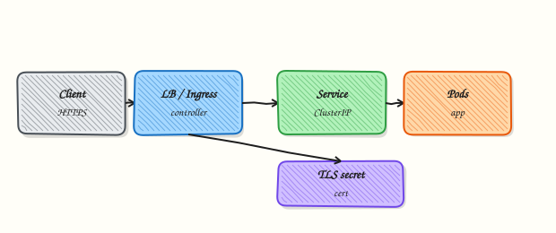

# Ingress and Gateway API

## Overview


Route external HTTP traffic to Services via Ingress (and understand Gateway API as the successor model) including TLS secrets.

**Ingress** needs a controller (nginx, Traefik, cloud LB). **Gateway API** (`Gateway`, `HTTPRoute`) is the modern, role-oriented replacement gaining adoption.

This is a core tutorial in **Module 6 · Ingress & Gateway API** of the REBASH Academy **Kubernetes for Cloud & DevOps Engineers** series — written for Cloud, DevOps, Platform, and SRE engineers.

## Prerequisites


- [Services and Cluster Networking](services-and-cluster-networking.md)
- An Ingress controller installed (kind often needs one)

## Learning Objectives


By the end of this tutorial, you will be able to:

- [ ] Write an Ingress rule (host/path → Service)  
- [ ] Attach a TLS secret  
- [ ] Name Gateway API resources  
- [ ] Know controller must exist

## Architecture


This topic’s control points and relationships are shown below.



## Theory


### What it is

**Ingress** is a Kubernetes API for **HTTP(S) routing** into the cluster: host and path rules forward to Services. An **Ingress controller** (nginx, Traefik, cloud L7) watches Ingress objects and programmes the actual proxy or load balancer. **Gateway API** (`Gateway`, `HTTPRoute`, and related resources) is the newer, role-oriented model that many platforms are adopting as the successor.

### Why it matters

Exposing every Service as a LoadBalancer is expensive and noisy. Ingress (or Gateway API) centralises TLS termination, host-based routing, and path splitting for many apps behind one entry point. DevOps teams standardise on one controller and let application teams ship Ingress/HTTPRoute manifests.

### How it works (mental model)

1. Install a controller (DaemonSet/Deployment) that has permission to watch Ingress or Gateway API resources.
2. Create Services for backends (usually ClusterIP).
3. Declare rules: `host` + `path` → Service:port; attach a TLS Secret for HTTPS.
4. The controller configures its dataplane; DNS for the host points at the controller’s external address.
5. Without a controller, Ingress objects sit idle — ADDRESS stays empty.

Gateway API separates infrastructure (**Gateway**) from application routes (**HTTPRoute**), improving multi-team ownership.

### Key concepts / comparisons

| Model | Resources | Notes |
|-------|-----------|-------|
| Ingress | Ingress, IngressClass | Widely deployed today |
| Gateway API | Gateway, HTTPRoute, … | Modern replacement path |

| Piece | Role |
|-------|------|
| Ingress / HTTPRoute | Desired HTTP routing |
| Controller | Implements routing |
| TLS Secret | Certificates for HTTPS |

On kind, install ingress-nginx (or similar). Managed clouds often provide a controller or L7 annotations on Services.

### Common pitfalls

- Creating Ingress YAML with no controller installed — nothing listens.
- Wrong `pathType` or missing trailing-slash assumptions causing 404s.
- TLS Secret in the wrong namespace or wrong keys (`tls.crt` / `tls.key`).
- Pointing DNS at a NodePort by mistake while the controller expects a LoadBalancer.
- Treating Ingress as a Service type — it is a separate API that fronts Services.

## Hands-on Lab

### Objective

Create Deployment, Service, and Ingress manifests; validate them with dry-run; expose via NodePort if no Ingress controller is installed; capture routing evidence.

### Prerequisites

- A working Kubernetes cluster (**kind**, **minikube**, or any lab cluster)
- **kubectl** with namespace-create rights
- Optional: **kind** with [ingress-ready](https://kind.sigs.k8s.io/docs/user/ingress/) or minikube ingress addon
- Writable workspace at `~/rebash-k8s/module-06`

### Lab environment

Workspace: `~/rebash-k8s/module-06`

``` {.bash .ra-terminal title="Terminal"}
mkdir -p ~/rebash-k8s/module-06 && cd ~/rebash-k8s/module-06
```

### Real-world scenario

You must publish an internal demo app at `/` on host `demo.lab.local`. Production uses an Ingress controller; your lab cluster might not have one yet. You still commit valid manifests, dry-run them against the API, and prove traffic with NodePort or port-forward if Ingress has no ADDRESS.

### Step-by-step tasks

#### Task 1 – Backend Deployment and Service

Create `namespace.yaml`:

```yaml title="namespace.yaml"
apiVersion: v1
kind: Namespace
metadata:
  name: rebash-m06
```

Create `web-backend.yaml`:

```yaml title="web-backend.yaml"
apiVersion: apps/v1
kind: Deployment
metadata:
  name: web
  namespace: rebash-m06
spec:
  replicas: 1
  selector:
    matchLabels:
      app: web
  template:
    metadata:
      labels:
        app: web
    spec:
      containers:
        - name: nginx
          image: nginx:1.27-alpine
          ports:
            - containerPort: 80
---
apiVersion: v1
kind: Service
metadata:
  name: web
  namespace: rebash-m06
spec:
  selector:
    app: web
  ports:
    - port: 80
      targetPort: 80
```

Apply and verify:

``` {.bash .ra-terminal title="Terminal"}
cd ~/rebash-k8s/module-06
kubectl apply -f namespace.yaml
kubectl apply -f web-backend.yaml
kubectl rollout status deployment/web -n rebash-m06 --timeout=120s
kubectl get svc web -n rebash-m06 | tee svc.txt
```

!!! example "Expected output"
    Service `web` exists with ClusterIP assigned.


#### Task 2 – Ingress manifest and validation

Create `ingress.yaml`:

```yaml title="ingress.yaml"
apiVersion: networking.k8s.io/v1
kind: Ingress
metadata:
  name: web
  namespace: rebash-m06
spec:
  ingressClassName: nginx
  rules:
    - host: demo.lab.local
      http:
        paths:
          - path: /
            pathType: Prefix
            backend:
              service:
                name: web
                port:
                  number: 80
```

Validate before or after apply:

``` {.bash .ra-terminal title="Terminal"}
cd ~/rebash-k8s/module-06
kubectl apply --dry-run=client -f ingress.yaml | tee ingress-dry-run.txt
kubectl apply -f ingress.yaml
kubectl get ingress web -n rebash-m06 | tee ingress-status.txt
kubectl describe ingress web -n rebash-m06 | tee ingress-describe.txt
```

!!! example "Expected output"
    Ingress object created; `ingress-status.txt` shows NAME and CLASS (ADDRESS may be empty without a controller).


#### Task 3 – NodePort fallback proof

Create `web-nodeport.yaml` (Service only—adds external access path when Ingress has no ADDRESS):

```yaml
apiVersion: v1
kind: Service
metadata:
  name: web-nodeport
  namespace: rebash-m06
spec:
  type: NodePort
  selector:
    app: web
  ports:
    - port: 80
      targetPort: 80
      nodePort: 30080
```

Apply and test (kind maps node ports to localhost):

``` {.bash .ra-terminal title="Terminal"}
cd ~/rebash-k8s/module-06
kubectl apply -f web-nodeport.yaml
kubectl get svc web-nodeport -n rebash-m06 -o wide | tee nodeport.txt
NODE_PORT=$(kubectl get svc web-nodeport -n rebash-m06 -o jsonpath='{.spec.ports[0].nodePort}')
curl -sS -o /dev/null -w '%{http_code}\n' "http://127.0.0.1:${NODE_PORT}/" | tee nodeport-curl.txt
grep -q 200 nodeport-curl.txt
```

!!! example "Expected output"
    HTTP `200` via NodePort on kind/minikube (if port reachable). If Ingress controller is installed, also test `demo.lab.local` via `/etc/hosts` and document ADDRESS in `ingress-status.txt`.


### Validation steps

- [ ] Deployment and ClusterIP Service Ready
- [ ] Ingress YAML passes client dry-run and applies
- [ ] NodePort curl returns 200 OR Ingress ADDRESS documented with controller installed
- [ ] You can explain what still runs if Ingress has no controller

### Common errors and fixes

| Error | Cause | Fix |
|-------|-------|-----|
| Ingress no ADDRESS | No controller | Use NodePort Task 3; install ingress-nginx on kind |
| nodePort already allocated | Port clash | Change `nodePort` to 30180 |
| 404 via Ingress | Wrong pathType/host | Match host header; check `pathType: Prefix` |
| Invalid ingress class | Class not installed | Set `ingressClassName` matching your controller |

### Challenge exercise

Install ingress-nginx on kind, re-apply `ingress.yaml`, add `127.0.0.1 demo.lab.local` to `/etc/hosts`, and curl `http://demo.lab.local/` without NodePort.

### Learning outcomes

- Declared HTTP routing with Ingress YAML
- Validated manifests with dry-run before apply
- Proved external access via NodePort when Ingress controller is absent

### Cleanup

``` {.bash .ra-terminal title="Terminal"}
kubectl delete namespace rebash-m06 --ignore-not-found --wait=true
```

## Validation


- [ ] Lab commands run under `~/rebash-k8s/module-06/`
- [ ] You can explain each Theory section in your own words
- [ ] You used modern tooling where it applies to this topic
- [ ] You can describe one production failure mode for this topic

## Code Walkthrough


Production practice for **Ingress and Gateway API** always combines:

1. Inspect before you change (status, plan, logs, dry-run)
2. Prefer reversible, documented changes (Git, IaC, drop-ins, version pins)
3. Capture evidence (command output, pipeline logs) for handovers
4. Prefer current tools and APIs over legacy shortcuts
5. Least privilege — escalate credentials only when required

Keep runbooks short enough to follow under pressure. Automate checks; keep humans for judgement.

## Security Considerations


- Treat credentials and tokens for kubernetes as privileged — never commit them
- Prefer short-lived auth (OIDC, roles, SSO) over long-lived keys
- Validate blast radius before apply/deploy/delete operations
- Restrict who can approve production changes
- Collect audit logs; limit who can read sensitive traces

## Common Mistakes


!!! warning "Creating Ingress YAML with no controller installed — nothing listens."
    Validate assumptions against the Theory section and official docs before changing production.

!!! warning "Wrong `pathType` or missing trailing-slash assumptions causing 404s."
    Lab shortcuts (open security groups, admin roles, skip approvals) must not ship unchanged.

!!! warning "Changing production without a rollback path"
    Always know how to revert (previous artefact, prior release, state rollback, DNS failback).

## Best Practices


- Encode Ingress and Gateway API changes as code and review them in pull requests
- Pin versions (images, modules, actions, provider plugins)
- Separate environments with clear promotion gates
- Alert on symptoms with runbooks attached
- Destroy lab resources; tag everything with owner and expiry where possible

## Troubleshooting


| Symptom | Likely cause | Fix |
|---------|--------------|-----|
| Auth / permission denied | Wrong identity, policy, or scope | Check caller identity, roles, and least-privilege policies |
| Timeout / no route | Network, DNS, security group, or endpoint | Trace path, DNS, and allow-lists before retrying |
| Drift / unexpected plan | Manual change or wrong state/workspace | Reconcile desired vs actual; avoid click-ops on managed resources |
| Pipeline/job red | Flaky step, cache, or missing secret | Read failing step logs; bisect recent workflow/config changes |
| Cost spike | Idle load balancer, NAT, oversized compute | Inventory billable resources; stop/delete labs promptly |

## Summary


**Ingress and Gateway API** is essential for Cloud and DevOps engineers working with kubernetes. Practise the lab until the inspection and change path is muscle memory, then continue the track.

## Interview Questions


1. What does an Ingress resource declare, and what still needs to exist for traffic to flow?
2. How does Ingress differ from a Service of type LoadBalancer?
3. What is pathType Prefix versus Exact?
4. What security controls should sit in front of Ingress-exposed applications?
5. Why might an Ingress show no ADDRESS even though the object is valid?

!!! tip "Sample answer — question 2"
    Ingress describes HTTP routing rules. A controller must implement them, and backends must be Ready Service Endpoints. Without a controller, the object alone does not open traffic.

!!! tip "Sample answer — question 4"
    Exposing HTTP needs TLS, authentication where appropriate, WAF or rate limiting, network policies, and careful host/path design so internal apps are not accidentally public.

## Related Tutorials


- [Course overview](index.md)
- [Persistent Volumes and Storage](persistent-volumes-and-storage.md)

## References


- [Ingress](https://kubernetes.io/docs/concepts/services-networking/ingress/) · [Gateway API](https://gateway-api.sigs.k8s.io/)
