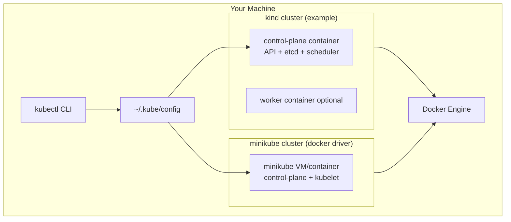

# Installing Kubernetes and kubectl

## Overview

Reading about Kubernetes without a cluster is like learning Docker without running `docker run`. You need **kubectl** — the official CLI — and a **local cluster** to practice safely. This tutorial installs kubectl on Linux, macOS, or WSL2, then creates a disposable cluster with **minikube** or **kind** (Kubernetes in Docker).

By the end, you will have a working API endpoint, kubeconfig context, and the ability to run Pods — the foundation for every hands-on lab in the REBASH Kubernetes track.

This is **Tutorial 3** in **Module 1: Foundations** of the REBASH Academy Kubernetes series. Complete [Kubernetes Architecture and Components](kubernetes-architecture-and-components.md) first. Docker experience from [Docker Installation and Setup](../docker/docker-installation-and-setup.md) helps — kind runs cluster nodes as containers. This tutorial follows our [documentation standards](../about.md#documentation-standards).

## Prerequisites

- [Kubernetes Architecture and Components](kubernetes-architecture-and-components.md)
- [Introduction to Kubernetes and Orchestration](introduction-to-kubernetes-and-orchestration.md)
- [Docker Installation and Setup](../docker/docker-installation-and-setup.md) — required for **kind**; recommended for **minikube docker driver**
- At least **4 GB RAM** free (8 GB recommended)
- **curl**, **git**, and terminal access with admin privileges where needed
- macOS, Linux, or WSL2 on Windows (native Windows PowerShell works with minor path differences)

## Learning Objectives

By the end of this tutorial, you will be able to:

- [ ] Install kubectl and verify the client version against cluster compatibility
- [ ] Choose between minikube and kind for local development
- [ ] Start, stop, and delete a local Kubernetes cluster
- [ ] Configure kubeconfig and switch contexts with kubectl
- [ ] Deploy a test application and access it via port-forward or minikube service
- [ ] Troubleshoot common installation and startup failures
- [ ] Document your lab cluster baseline for reproducibility

## Architecture Diagram

Both minikube and kind run a **single-node or multi-node cluster** on your laptop. kind launches cluster "nodes" as Docker containers; minikube can use Docker, KVM, Hyper-V, or other drivers.



## Theory

### kubectl — The Kubernetes CLI

**kubectl** communicates with the Kubernetes API server. It reads **kubeconfig** (`~/.kube/config`) for cluster URL, credentials, and current **context** (cluster + user + namespace).

| kubectl category | Examples |
|------------------|----------|
| **Resource management** | `apply`, `create`, `delete`, `patch` |
| **Inspection** | `get`, `describe`, `logs`, `exec` |
| **Cluster info** | `cluster-info`, `api-resources`, `version` |
| **Configuration** | `config get-contexts`, `config use-context` |

Install kubectl **one minor version** within your cluster version (e.g., 1.30 client with 1.29–1.31 server). See the [kubectl version skew policy](https://kubernetes.io/releases/version-skew-policy/#kubectl).

### minikube vs kind

| Aspect | minikube | kind |
|--------|----------|------|
| **Full name** | MiniKube local K8s | Kubernetes IN Docker |
| **Node model** | VM or container (driver-dependent) | Docker containers as nodes |
| **Best for** | Beginners, built-in addons (`ingress`, `metrics-server`) | CI pipelines, multi-node testing, fast recreate |
| **Default driver** | Docker on Mac/Win; KVM on Linux | Docker only |
| **Addons** | `minikube addons enable ingress` | Manual manifest install |
| **Multi-node** | Supported | Native `kind create cluster --config` |
| **Resource use** | Moderate | Lightweight |

**Recommendation:** Start with **minikube** if you want guided addons and tutorials. Use **kind** if you already live in Docker-centric CI or need multi-node clusters frequently. Many engineers install both.

### kubeconfig Structure

```yaml
apiVersion: v1
kind: Config
clusters:
  - name: minikube
    cluster:
      server: https://192.168.49.2:8443
      certificate-authority: /path/to/ca.crt
contexts:
  - name: minikube
    context:
      cluster: minikube
      user: minikube
      namespace: default
current-context: minikube
users:
  - name: minikube
    user:
      client-certificate: /path/to/client.crt
      client-key: /path/to/client.key
```

`minikube start` and `kind create cluster` merge entries into this file automatically.

### System Requirements

| Resource | Minimum | Recommended |
|----------|---------|-------------|
| RAM | 4 GB free | 8 GB free |
| CPU | 2 cores | 4 cores |
| Disk | 20 GB free | 40 GB free |
| OS | Linux, macOS, WSL2 | Ubuntu 22.04+ / macOS 13+ |

Enable virtualization (VT-x/AMD-V) for VM-based drivers. Docker Desktop must be running for docker driver on Mac/Windows.

### Version Pinning

Pin versions in lab notes for reproducibility:

```bash
kubectl version --client -o yaml | grep gitVersion
minikube version
kind version
docker version --format '{{ "{{" }}.Server.Version{{ "}}" }}'
```

## Hands-on Lab

Choose **Path A (minikube)** or **Path B (kind)**. Install kubectl first — both paths require it.

### Step 1 – Install kubectl (Linux)

**Command:**

```bash
# Linux amd64 — verify latest stable at https://kubernetes.io/releases/
curl -LO "https://dl.k8s.io/release/$(curl -L -s https://dl.k8s.io/release/stable.txt)/bin/linux/amd64/kubectl"
chmod +x kubectl
sudo mv kubectl /usr/local/bin/
kubectl version --client
```

**Explanation:** Install the stable release binary. On macOS with Homebrew: `brew install kubectl`. Match architecture (`arm64` vs `amd64`) on Apple Silicon.

**Expected output:**

```text
Client Version: v1.30.x
Kustomize Version: v5.x
```

### Step 2 – Install kubectl (macOS alternative)

**Command:**

```bash
brew install kubectl
kubectl version --client
```

**Explanation:** Homebrew tracks stable kubectl. Pin a version if your course materials target a specific release.

### Step 3 – Path A: Install and start minikube

**Command:**

```bash
# macOS
brew install minikube

# Linux — see https://minikube.sigs.k8s.io/docs/start/
curl -LO https://storage.googleapis.com/minikube/releases/latest/minikube-linux-amd64
sudo install minikube-linux-amd64 /usr/local/bin/minikube

minikube start --driver=docker --cpus=2 --memory=4096
kubectl cluster-info
kubectl get nodes
```

**Explanation:** The docker driver uses Docker Engine as the node runtime — simplest on Mac/Windows. Adjust `--memory` if your laptop has limited RAM.

**Expected output:**

```text
minikube v1.x.x on ...
✨  Using the docker driver
🏄  Done! kubectl is now configured to use "minikube"
NAME       STATUS   ROLES           AGE   VERSION
minikube   Ready    control-plane   30s   v1.30.x
```

### Step 4 – Path A: Enable useful minikube addons

**Command:**

```bash
minikube addons enable metrics-server
minikube addons list | grep enabled
kubectl get pods -n kube-system
```

**Explanation:** metrics-server powers `kubectl top nodes/pods` — useful in later tutorials. Enable `ingress` when you reach Ingress modules.

**Expected output:**

```text
| metrics-server | minikube | enabled |
```

### Step 5 – Path B: Install and start kind

**Command:**

```bash
# macOS
brew install kind

# Linux
curl -Lo ./kind https://kind.sigs.k8s.io/dl/v0.24.0/kind-linux-amd64
chmod +x ./kind && sudo mv ./kind /usr/local/bin/kind

kind create cluster --name rebash-lab
kubectl cluster-info --context kind-rebash-lab
kubectl get nodes
```

**Explanation:** kind creates a cluster named `rebash-lab` with context `kind-rebash-lab`. Deleting and recreating takes under a minute — ideal for destructive experiments.

**Expected output:**

```text
Creating cluster "rebash-lab" ...
You can now use your cluster with:
kubectl cluster-info --context kind-rebash-lab
NAME                         STATUS   ROLES           AGE   VERSION
rebash-lab-control-plane     Ready    control-plane   1m    v1.30.x
```

### Step 6 – Deploy and verify a test application

**Command:**

```bash
kubectl create deployment hello-web --image=nginx:1.27-alpine --replicas=2
kubectl wait --for=condition=available deployment/hello-web --timeout=120s
kubectl get pods -o wide
kubectl expose deployment hello-web --port=80 --type=NodePort
```

**Explanation:** Creates two nginx Pods behind a Service. NodePort exposes the Service on a high port on every node.

**Expected output:**

```text
NAME                         READY   STATUS    RESTARTS   AGE
hello-web-xxxxxxxxxx-xxxxx   1/1     Running   0          30s
hello-web-xxxxxxxxxx-xxxxx   1/1     Running   0          30s
service/hello-web exposed
```

### Step 7 – Access the application

**Command:**

```bash
# minikube
minikube service hello-web --url

# kind or generic — port-forward works everywhere
kubectl port-forward svc/hello-web 8080:80 &
sleep 2
curl -s -o /dev/null -w "%{http_code}\n" http://localhost:8080
kill %1 2>/dev/null || true
```

**Explanation:** `minikube service` opens a tunnel to NodePort. `kubectl port-forward` is universal and mirrors how developers debug Services locally.

**Expected output:**

```text
http://127.0.0.1:xxxxx
200
```

### Step 8 – Save lab baseline and clean up (optional)

**Command:**

```bash
mkdir -p ~/k8s-lab
kubectl cluster-info | tee ~/k8s-lab/cluster-baseline.txt
kubectl get nodes -o yaml | grep -E "containerRuntimeVersion|kubeletVersion" | tee -a ~/k8s-lab/cluster-baseline.txt

# Optional cleanup — removes test app only
kubectl delete deployment,svc hello-web
```

**Explanation:** Keep the cluster running for the next tutorials. Delete only lab resources unless you need to reclaim disk space.

## Commands & Code

| Command | Description | Example |
|---------|-------------|---------|
| `kubectl version` | Client and server versions | `kubectl version` |
| `minikube start` | Create/start minikube cluster | `minikube start --driver=docker` |
| `minikube stop` | Pause cluster (preserve state) | `minikube stop` |
| `minikube delete` | Remove cluster entirely | `minikube delete` |
| `kind create cluster` | Create kind cluster | `kind create cluster --name lab` |
| `kind delete cluster` | Remove kind cluster | `kind delete cluster --name lab` |
| `kubectl config get-contexts` | List kubeconfig contexts | `kubectl config get-contexts` |
| `kubectl config use-context` | Switch active context | `kubectl config use-context minikube` |
| `minikube service` | Open Service URL (minikube) | `minikube service NAME --url` |
| `kubectl port-forward` | Local access to Service/Pod | `kubectl port-forward svc/S 8080:80` |

### kind multi-node config (optional)

Save as `kind-multinode.yaml` for advanced labs:

```yaml
kind: Cluster
apiVersion: kind.x-k8s.io/v1alpha4
nodes:
  - role: control-plane
  - role: worker
  - role: worker
```

Create with: `kind create cluster --name multi --config kind-multinode.yaml`

### Cluster reset script

```bash
#!/usr/bin/env bash
# reset-local-k8s.sh — delete and recreate local lab cluster
set -euo pipefail
TOOL="${1:-minikube}"

if [ "$TOOL" = "minikube" ]; then
  minikube delete || true
  minikube start --driver=docker --cpus=2 --memory=4096
elif [ "$TOOL" = "kind" ]; then
  kind delete cluster --name rebash-lab || true
  kind create cluster --name rebash-lab
else
  echo "Usage: $0 minikube|kind"
  exit 1
fi
kubectl get nodes
kubectl cluster-info
```

## Common Mistakes

!!! warning "Skipping kubectl install and using bundled copy only"
    minikube bundles kubectl internally, but your shell should use a system-wide kubectl you control and update. CI and production use standalone kubectl.

!!! warning "Insufficient memory allocation"
    minikube/kind with 2 GB RAM causes CrashLoopBackOff on system Pods. Allocate at least 4 GB; close other apps during labs.

!!! warning "Docker not running before minikube/kind start"
    Both docker-driver minikube and kind require Docker Engine running. Start Docker Desktop first on Mac/Windows.

!!! warning "Mixing kubeconfig contexts accidentally"
    Multiple clusters merge into one kubeconfig. Always verify context before applying manifests: `kubectl config current-context`.

!!! warning "Using latest bleeding-edge kubectl with old cluster"
    Version skew can cause API errors. Keep client within one minor version of the server.

## Best Practices

!!! tip "Pick one primary local tool and stick with it"
    Switching between minikube and kind mid-module adds friction. Either works for this track — commit to one for Module 1–2.

!!! tip "Never practice on production clusters"
    Local clusters exist for destructive learning. Production credentials should not appear in your default kubeconfig during tutorials.

!!! tip "Enable metrics-server early on minikube"
    `kubectl top pods` becomes invaluable when debugging resource issues in later modules.

!!! tip "Document versions in your lab notes"
    When reporting issues or comparing behavior, include kubectl, cluster, and Docker versions.

!!! tip "Use --dry-run=client -o yaml while learning"
    Generate manifest YAML from imperative commands before applying — builds declarative habits for Tutorial 4.

## Troubleshooting

| Issue | Cause | Solution |
|-------|-------|----------|
| `minikube start` hangs | Docker not running, VT-x disabled | Start Docker; enable virtualization in BIOS |
| `Unable to connect to server` | Cluster stopped or wrong context | `minikube start` or `kubectl config use-context` |
| kind: `failed to create cluster` | Docker out of disk/RAM | `docker system prune`; increase Docker Desktop resources |
| `The connection to localhost:8080 was refused` | kubectl pointing at wrong cluster | Fix kubeconfig; run `kubectl cluster-info` |
| Pods stuck Pending | Insufficient CPU/memory on node | Increase minikube `--memory`; delete unused deployments |
| `ImagePullBackOff` for public images | Network/proxy issues | Verify `docker pull nginx:1.27-alpine` works |
| WSL2 networking issues | Old WSL kernel | Update WSL2; use Docker Desktop WSL integration |
| Permission denied on `/usr/local/bin` | Missing sudo | Use `sudo install` or install to `~/bin` and update PATH |

## Summary

- **kubectl** is the universal Kubernetes CLI; it reads **kubeconfig** for cluster access
- **minikube** offers beginner-friendly local clusters with addons; **kind** runs K8s nodes as Docker containers — great for CI and fast reset
- A successful install ends with `kubectl get nodes` showing **Ready** and a test Deployment serving HTTP 200
- Use **port-forward** or **minikube service** to reach apps; keep cluster context verified before every lab
- Module 1 Foundations complete after this tutorial — Module 2 starts with kubectl workflows
- Next: [kubectl Essentials and Workflows](kubectl-essentials-and-workflows.md)

## Interview Questions

1. What is kubeconfig, and what does a context contain?
2. Compare minikube and kind. When would you use each?
3. How do you verify kubectl can reach your cluster?
4. What is the kubectl version skew policy?
5. Why should you avoid using production kubeconfig during learning?
6. How does minikube's docker driver work at a high level?
7. What command exposes a Deployment internally in the cluster?
8. How do you switch between two clusters on the same laptop?
9. What are minikube addons, and name one useful addon.
10. How would you completely reset a local kind cluster?

??? tip "Sample Answers (Questions 1, 2, and 8)"

    **Q1 — kubeconfig:** kubeconfig (`~/.kube/config`) stores cluster connection details: API server URL, CA certificate, client credentials, and named **contexts**. A context binds a cluster, a user (credentials), and optionally a default namespace. `kubectl` uses `current-context` unless overridden with `--context`.

    **Q2 — minikube vs kind:** minikube runs a local cluster via various drivers (docker, kvm) with built-in addons like ingress and metrics-server — ideal for learning. kind (Kubernetes IN Docker) runs each node as a Docker container — fast to create/destroy, excellent for CI and multi-node testing. Both provide a real Kubernetes API for local development.

    **Q8 — Switch contexts:** List contexts with `kubectl config get-contexts`. Switch with `kubectl config use-context CONTEXT_NAME`. Each context points to a different cluster/user pair in kubeconfig — e.g., `minikube` vs `kind-rebash-lab`. Verify with `kubectl config current-context` and `kubectl cluster-info`.

## Related Tutorials

- [Kubernetes Architecture and Components](kubernetes-architecture-and-components.md) *(previous)*
- [kubectl Essentials and Workflows](kubectl-essentials-and-workflows.md) *(next — Module 2)*
- [Docker Installation and Setup](../docker/docker-installation-and-setup.md)
- [Introduction to Kubernetes and Orchestration](introduction-to-kubernetes-and-orchestration.md)
- [Kubernetes – Category Overview](index.md)
- [Learning Paths – DevOps Engineer](../learning-paths/index.md)

## References

- [Install kubectl](https://kubernetes.io/docs/tasks/tools/)
- [minikube – Get Started](https://minikube.sigs.k8s.io/docs/start/)
- [kind – User Guide](https://kind.sigs.k8s.io/docs/user/quick-start/)
- [kubectl version skew policy](https://kubernetes.io/releases/version-skew-policy/#kubectl)
- [Configure access to clusters](https://kubernetes.io/docs/tasks/access-application-cluster/configure-access-multiple-clusters/)
- [Docker Desktop – Kubernetes](https://docs.docker.com/desktop/features/kubernetes/)
