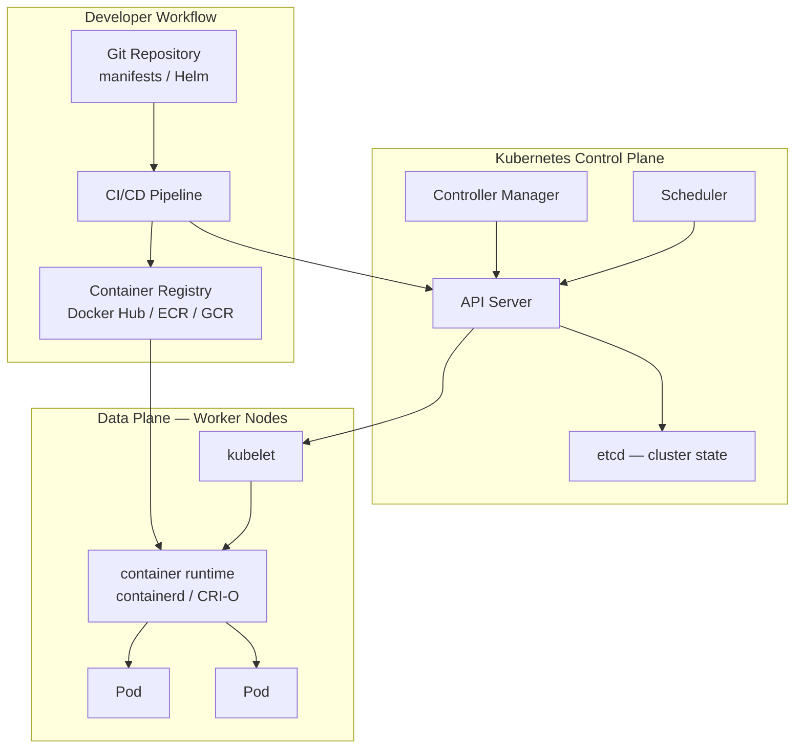
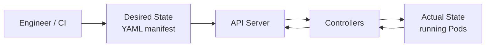

# Introduction to Kubernetes and Orchestration

## Overview

Running one container with `docker run` is straightforward. Running **five hundred** containers across **fifty** servers — with zero-downtime deploys, automatic restarts, rolling updates, secret rotation, and traffic shifting — requires **orchestration**. **Kubernetes** (often abbreviated **K8s**) is the dominant open-source container orchestrator. It schedules workloads, heals failed containers, exposes services on stable network endpoints, and provides a declarative API that teams version in Git.

This tutorial establishes your mental model: what **orchestration** means, why Kubernetes emerged after Docker, how it compares to Docker Swarm and managed platforms, and where it sits in the cloud-native stack alongside CI/CD, observability, and infrastructure as code.

This is **Tutorial 1** in **Module 1: Foundations** of the REBASH Academy Kubernetes series. Complete the [Docker track](../docker/index.md) first — especially [From Docker to Kubernetes](../docker/from-docker-to-kubernetes.md), which maps Docker concepts to Kubernetes objects. This tutorial follows our [documentation standards](../about.md#documentation-standards).

## Prerequisites

- Completion of the [Docker track](../docker/index.md), especially:
  - [Introduction to Containers and Docker](../docker/introduction-to-containers-and-docker.md)
  - [Docker Compose Fundamentals](../docker/docker-compose-fundamentals.md) *(or equivalent Compose experience)*
  - [From Docker to Kubernetes](../docker/from-docker-to-kubernetes.md)
- Comfort using a terminal on Linux, macOS, or WSL2
- Basic understanding of [Introduction to Networking](../networking/introduction-to-networking.md) — IPs, DNS, ports, load balancing
- Familiarity with [Git](../git/index.md) — manifests and Helm charts are version-controlled like Dockerfiles

## Learning Objectives

By the end of this tutorial, you will be able to:

- [ ] Explain why container orchestration is needed beyond a single Docker host
- [ ] Describe the core problems Kubernetes solves: scheduling, scaling, self-healing, and service discovery
- [ ] Articulate the declarative reconciliation model (desired state vs actual state)
- [ ] Compare Kubernetes to Docker Swarm, Nomad, and managed orchestrators at a high level
- [ ] Map Kubernetes to the CNCF cloud-native landscape and DevOps toolchain
- [ ] Identify when Kubernetes is the right tool — and when simpler alternatives suffice
- [ ] Outline the learning path for the REBASH Academy Kubernetes track

## Architecture Diagram

The diagram below shows where Kubernetes sits between your container images and production infrastructure. Images still come from the same registries you used with Docker; Kubernetes adds a control plane that continuously reconciles cluster state with your declared manifests.



## Theory

### Why Orchestration Exists

A single Docker host handles `docker run`, bridge networks, and named volumes well. Production microservices introduce problems that multiply with every new service:

| Problem at scale | Without orchestration | With Kubernetes |
|------------------|----------------------|-----------------|
| Container dies at 3 AM | Manual restart or external monitor | Controller reschedules Pod automatically |
| Traffic spike | Manual `docker run` × N | `kubectl scale` or Horizontal Pod Autoscaler |
| Rolling deploy with zero downtime | Custom scripts, load balancer juggling | Deployment with maxUnavailable / maxSurge |
| Service discovery | Hard-coded IPs or Consul sidecar | Built-in DNS: `api.default.svc.cluster.local` |
| Secret distribution | Env files on each host | Secret objects mounted at runtime |
| Multi-host scheduling | You pick the host | Scheduler places Pods based on resources and affinity |
| Config drift | SSH and hope | GitOps — cluster matches committed YAML |

Orchestration turns **imperative operations** ("run this container on host-3") into **declarative intent** ("I want three replicas of this image, always healthy").

### What Is Kubernetes?

**Kubernetes** is an open-source container orchestration platform originally designed by Google, based on lessons from internal systems Borg and Omega. The Cloud Native Computing Foundation (CNCF) hosts the project. Kubernetes:

- **Schedules** Pods onto nodes based on CPU, memory, affinity, and taints
- **Maintains** desired replica counts via controllers (Deployment, StatefulSet, DaemonSet)
- **Exposes** workloads through Services, Ingress, and Gateway API
- **Stores** configuration in etcd and serves it through a REST API
- **Integrates** with cloud load balancers, persistent disks, and identity systems

Kubernetes runs the same **OCI images** you built for Docker. The runtime layer changed (containerd, CRI-O instead of dockerd as the default), but your Dockerfile and registry workflow stay the same.

### The Declarative Reconciliation Model

Kubernetes follows a **control loop** pattern:

1. You submit **desired state** — YAML manifest or `kubectl apply`
2. The **API server** persists objects in **etcd**
3. **Controllers** watch for changes and act — create Pods, update Endpoints, attach volumes
4. The **scheduler** assigns unscheduled Pods to suitable nodes
5. The **kubelet** on each node pulls images and starts containers via the CRI runtime

If a Pod crashes, the ReplicaSet controller notices the mismatch (desired: 3, actual: 2) and creates a replacement. This is **self-healing** without custom scripts.



### Kubernetes vs Other Orchestrators

| Platform | Strengths | Typical use case |
|----------|-----------|------------------|
| **Kubernetes** | Richest ecosystem, CNCF standard, multi-cloud | Platform teams, microservices at scale |
| **Docker Swarm** | Simple, built into Docker Engine | Small clusters, legacy Swarm investments |
| **Amazon ECS / Fargate** | Deep AWS integration, minimal ops | AWS-native teams avoiding K8s complexity |
| **Google Cloud Run** | Serverless containers | Event-driven, scale-to-zero workloads |
| **HashiCorp Nomad** | Schedules containers, VMs, binaries | Mixed workload types, simpler than K8s |
| **Managed K8s** (EKS, GKE, AKS) | Control plane operated by cloud vendor | Production default for most organizations |

If you completed [Docker Swarm Orchestration Basics](../docker/docker-swarm-orchestration-basics.md), think of Kubernetes as Swarm with a larger API surface, stronger community tooling (Helm, Argo CD, Prometheus operators), and a steeper learning curve — justified when you need portability and ecosystem depth.

### The Cloud-Native Stack

Kubernetes is one layer in the CNCF **cloud-native** landscape:

| Layer | Examples | Relationship to K8s |
|-------|----------|---------------------|
| **Provisoning** | Terraform, Crossplane | Creates VPC, node pools, EKS/GKE clusters |
| **CI/CD** | GitHub Actions, GitLab CI, Argo CD | Builds images, applies manifests |
| **Registry** | ECR, GCR, Harbor | Stores images Pods pull |
| **Orchestration** | Kubernetes | Runs and manages containers |
| **Service mesh** | Istio, Linkerd | mTLS, traffic management between Pods |
| **Observability** | Prometheus, Grafana, Loki | Metrics, dashboards, logs from Pods |
| **Security** | Falco, OPA Gatekeeper, Trivy | Runtime threat detection, policy admission |

Learning Kubernetes after Docker follows the natural DevOps progression documented in [From Docker to Kubernetes](../docker/from-docker-to-kubernetes.md): package with containers, orchestrate with Kubernetes, automate with GitOps.

### Key Concepts Preview

You will dive deep into these in later tutorials; for now, know the names:

| Concept | One-line definition |
|---------|---------------------|
| **Pod** | Smallest deployable unit — one or more containers sharing network |
| **Node** | Worker machine (VM or bare metal) running kubelet and runtime |
| **Deployment** | Manages replicated stateless Pods with rolling updates |
| **Service** | Stable network endpoint for a set of Pods |
| **Namespace** | Logical cluster partition (`dev`, `staging`, `prod`) |
| **ConfigMap / Secret** | Non-sensitive / sensitive configuration data |
| **PersistentVolumeClaim** | Request for durable storage |

### When to Adopt Kubernetes

| Scenario | Recommendation |
|----------|----------------|
| 10+ microservices, multiple teams | Kubernetes (often managed) |
| Single monolith, one deploy per week | Docker Compose or PaaS may suffice |
| Strict AWS-only, minimal platform team | ECS/Fargate |
| Need multi-cloud portability | Kubernetes |
| Batch jobs with sporadic scale | K8s Jobs, Cloud Run, or Nomad |
| Learning and career growth in DevOps/SRE | Kubernetes — industry standard |

Most organizations adopt **managed Kubernetes** (EKS, GKE, AKS) rather than self-hosting the control plane. Local tools like minikube and kind (covered in [Installing Kubernetes and kubectl](installing-kubernetes-and-kubectl.md)) replicate the API for learning.

## Hands-on Lab

These steps build intuition without requiring a cluster yet. If you already have kubectl configured, skip to Step 5.

### Step 1 – Confirm Docker and container knowledge

**Command:**

```bash
docker --version 2>/dev/null || echo "Docker optional for this lab"
docker ps --format "table {{ "{{" }}.Names{{ "}}" }}\t{{ "{{" }}.Status{{ "}}" }}\t{{ "{{" }}.Ports{{ "}}" }}" 2>/dev/null | head -5
```

**Explanation:** Kubernetes schedules **containers**, not Docker-specific objects. Your Docker skills transfer directly. If Docker is not installed, you can still complete the conceptual parts of this lab.

**Expected output:**

```text
Docker version 27.x.x, build ...
NAMES     STATUS    PORTS
```

### Step 2 – Explore orchestration vocabulary

**Command:**

```bash
cat <<'EOF' > /tmp/k8s-vocab.txt
Orchestrator  — software that schedules and manages containers at scale
Control plane — brain of the cluster (API, scheduler, controllers, etcd)
Data plane    — worker nodes running your application Pods
Declarative   — describe WHAT you want; system figures out HOW
Imperative    — describe exact commands (kubectl run — learning only)
Reconciliation — loop comparing desired vs actual state
EOF
cat /tmp/k8s-vocab.txt
```

**Explanation:** Internalize these terms before reading architecture docs. They appear in every Kubernetes conversation and interview.

### Step 3 – Read the Docker-to-K8s mapping

**Command:**

```bash
echo "Open docs/docker/from-docker-to-kubernetes.md and review the mapping table"
echo "Key mappings: container→Pod, docker compose→Deployment+Service, volume→PVC"
```

**Explanation:** The mapping table in [From Docker to Kubernetes](../docker/from-docker-to-kubernetes.md) is your Rosetta Stone. Re-read it whenever a Kubernetes object feels unfamiliar.

### Step 4 – Survey the CNCF landscape

**Command:**

```bash
curl -sfL https://landscape.cncf.io/data/full.json 2>/dev/null | head -c 200 \
  || echo "Visit https://landscape.cncf.io/ — find Kubernetes in the Orchestration row"
```

**Explanation:** Kubernetes sits at the center of hundreds of complementary projects. You do not need to learn them all at once — focus on kubectl, Deployments, Services, and Ingress first.

### Step 5 – Check if kubectl is available

**Command:**

```bash
command -v kubectl && kubectl version --client 2>/dev/null || echo "kubectl not installed — Tutorial 3 covers installation"
command -v minikube && minikube version 2>/dev/null || true
command -v kind && kind version 2>/dev/null || true
```

**Explanation:** Local cluster tools come in Tutorial 3. Knowing what is missing now helps you plan lab time.

### Step 6 – Draft your first declarative manifest (do not apply yet)

**Command:**

```bash
mkdir -p ~/k8s-lab/manifests
cat <<'EOF' > ~/k8s-lab/manifests/hello-pod.yaml
apiVersion: v1
kind: Pod
metadata:
  name: hello-k8s
  labels:
    app: hello
spec:
  containers:
    - name: nginx
      image: nginx:1.27-alpine
      ports:
        - containerPort: 80
  restartPolicy: Never
EOF
cat ~/k8s-lab/manifests/hello-pod.yaml
```

**Explanation:** This Pod manifest declares desired state. After installing a cluster, you will apply it with `kubectl apply -f`. Notice there is no host specified — the scheduler decides.

### Step 7 – Document your learning baseline

**Command:**

```bash
echo "=== Kubernetes Learning Baseline ==="
echo "Docker track: from-docker-to-kubernetes completed (Y/N)"
echo "kubectl: $(command -v kubectl >/dev/null && kubectl version --client -o yaml 2>/dev/null | grep gitVersion | head -1 || echo 'not installed')"
echo "Local cluster: $(command -v minikube >/dev/null && echo minikube || command -v kind >/dev/null && echo kind || echo 'none yet')"
echo "Next tutorial: kubernetes-architecture-and-components.md"
```

**Explanation:** Capture your starting point. Include this in personal notes when tracking progress through the Kubernetes track.

## Commands & Code

| Command | Description | Example |
|---------|-------------|---------|
| `kubectl version --client` | Show installed kubectl client version | `kubectl version --client` |
| `docker ps` | List running containers (Docker baseline) | `docker ps` |
| `minikube version` | Check minikube installation | `minikube version` |
| `kind version` | Check kind installation | `kind version` |
| `curl -sfL` | Fetch remote resources (CNCF data) | `curl -sfL URL` |

### Orchestration readiness checklist script

Save as `~/bin/k8s-preflight.sh`:

```bash
#!/usr/bin/env bash
# k8s-preflight.sh — verify readiness for Kubernetes learning labs
set -euo pipefail

section() { printf '\n=== %s ===\n' "$1"; }

section "Container foundation"
if command -v docker >/dev/null 2>&1; then
  docker --version
else
  echo "Docker not found — optional for K8s labs using containerd directly"
fi

section "Kubernetes CLI"
if command -v kubectl >/dev/null 2>&1; then
  kubectl version --client 2>/dev/null | head -3
else
  echo "kubectl not installed — complete Tutorial 3"
fi

section "Local cluster tool"
if command -v minikube >/dev/null 2>&1; then
  echo "minikube: $(minikube version --short 2>/dev/null || minikube version | head -1)"
elif command -v kind >/dev/null 2>&1; then
  kind version
else
  echo "Neither minikube nor kind found — install in Tutorial 3"
fi

section "System resources"
echo "CPUs:  $(nproc 2>/dev/null || sysctl -n hw.ncpu 2>/dev/null || echo 'unknown')"
echo "RAM:   $(free -h 2>/dev/null | awk '/Mem:/{print $2}' || echo 'check Activity Monitor')"
echo "Recommend: 4+ GB RAM free for local cluster"
```

Make executable: `chmod +x ~/bin/k8s-preflight.sh && ~/bin/k8s-preflight.sh`

## Common Mistakes

!!! warning "Jumping to Kubernetes before understanding containers"
    Kubernetes orchestrates containers — it does not replace Docker fundamentals. Weak image, networking, or volume knowledge leads to confusing Pod failures. Finish the [Docker track](../docker/index.md) first.

!!! warning "Treating Kubernetes as 'Docker for many servers'"
    Kubernetes introduces new abstractions (Pod, Service, Ingress, RBAC) and operational complexity. A three-container Compose stack rarely needs K8s. Adopt when orchestration benefits exceed operational cost.

!!! warning "Learning only imperative kubectl commands"
    `kubectl run` and `kubectl expose` help exploration, but production relies on **declarative manifests** in Git. Start building YAML habits from Tutorial 1.

!!! warning "Assuming one distribution fits all"
    Managed EKS/GKE/AKS, OpenShift, Rancher, and local kind/minikube differ in setup and add-ons. Learn core Kubernetes API concepts — they transfer across distributions.

## Best Practices

!!! tip "Complete From Docker to Kubernetes first"
    The concept map in [From Docker to Kubernetes](../docker/from-docker-to-kubernetes.md) saves weeks of confusion. Refer back whenever you encounter a new Kubernetes object.

!!! tip "Think declaratively from day one"
    Write YAML manifests, store them in Git, apply with `kubectl apply`. Imperative commands are for debugging and quick experiments only.

!!! tip "Use a local cluster for all hands-on labs"
    minikube or kind provides a safe, disposable environment. Never practice destructive commands on production clusters.

!!! tip "Follow the REBASH module order"
    Module 1 (Foundations) before Module 2 (Workloads) builds concepts in the right sequence — architecture before kubectl before Pods.

## Troubleshooting

| Issue | Cause | Solution |
|-------|-------|----------|
| Overwhelmed by terminology | K8s has a large API surface | Focus on Pod, Deployment, Service first; use the glossary in this tutorial |
| "Do I need Kubernetes?" uncertainty | Hype vs actual requirements | Start with Compose/Swarm for small apps; adopt K8s when scaling, multi-team, or multi-cloud needs appear |
| Confusion between Docker and K8s runtime | dockerd deprecated as K8s runtime | Nodes use containerd/CRI-O; you still build the same OCI images |
| kubectl not found | Not installed yet | Complete [Installing Kubernetes and kubectl](installing-kubernetes-and-kubectl.md) |
| Cannot relate K8s objects to Docker | Skipped bridge tutorial | Re-read [From Docker to Kubernetes](../docker/from-docker-to-kubernetes.md) mapping tables |

## Summary

- **Container orchestration** automates scheduling, scaling, healing, and networking across many hosts — problems that `docker run` alone cannot solve at scale
- **Kubernetes** is the dominant orchestrator, using a **declarative reconciliation** model: you declare desired state; controllers continuously align reality
- Kubernetes runs the same **OCI images** from your Docker CI pipeline; it adds a **control plane** (API, etcd, scheduler, controllers) and **worker nodes** (kubelet, runtime, Pods)
- Compare alternatives (Swarm, ECS, Nomad) honestly — Kubernetes shines for multi-service, multi-team, portable platforms
- The REBASH Kubernetes track builds on the [Docker track](../docker/index.md), starting with architecture, installation, kubectl, and Pods
- Next: [Kubernetes Architecture and Components](kubernetes-architecture-and-components.md)

## Interview Questions

1. What is container orchestration, and why is it needed?
2. Explain Kubernetes' declarative reconciliation model in your own words.
3. What are the main components of the Kubernetes control plane?
4. How does Kubernetes relate to Docker? Do you still use Dockerfiles?
5. What is a Pod, at a high level?
6. Compare Kubernetes to Docker Swarm. When would you choose each?
7. What is etcd's role in a Kubernetes cluster?
8. Name three problems Kubernetes solves that a single Docker host does not.
9. What is the CNCF, and why does it matter for Kubernetes?
10. When would you **not** adopt Kubernetes?

??? tip "Sample Answers (Questions 1, 4, and 7)"

    **Q1 — Orchestration:** Container orchestration is automated management of container lifecycles across a fleet of machines. It handles scheduling (which node runs which container), scaling (adding/removing replicas), self-healing (restarting failed containers), service discovery (stable addresses for ephemeral containers), rolling updates, and resource allocation. Without orchestration, operators script these tasks manually or with fragile tooling.

    **Q4 — K8s and Docker:** Docker (or any OCI-compatible build toolchain) still builds and pushes images to registries. Kubernetes pulls those images and runs them via a CRI-compatible runtime like containerd — not dockerd on the node. Dockerfiles, image scanning, and registry workflows remain unchanged; Kubernetes replaces `docker run` at scale with Deployments, Services, and controllers.

    **Q7 — etcd:** etcd is a distributed key-value store that holds all Kubernetes cluster state — object definitions, configuration, and metadata. The API server is the only component that reads/writes etcd directly. If etcd data is lost without backup, the cluster loses its desired state configuration.

## Related Tutorials

- [Kubernetes – Category Overview](index.md)
- [From Docker to Kubernetes](../docker/from-docker-to-kubernetes.md) — recommended prerequisite
- [Docker – Category Overview](../docker/index.md)
- [Kubernetes Architecture and Components](kubernetes-architecture-and-components.md) *(next in Module 1)*
- [Learning Paths – DevOps Engineer](../learning-paths/index.md)

## References

- [Kubernetes – What is Kubernetes?](https://kubernetes.io/docs/concepts/overview/)
- [Kubernetes – Components](https://kubernetes.io/docs/concepts/overview/components/)
- [CNCF – Cloud Native Definition](https://github.com/cncf/toc/blob/main/DEFINITION.md)
- [CNCF Landscape](https://landscape.cncf.io/)
- [Kubernetes – Declarative Management](https://kubernetes.io/docs/concepts/overview/working-with-objects/object-management/)
- [REBASH Academy – Docker Overview](../docker/index.md)
- [REBASH Academy – Documentation Standards](../about.md#documentation-standards)
