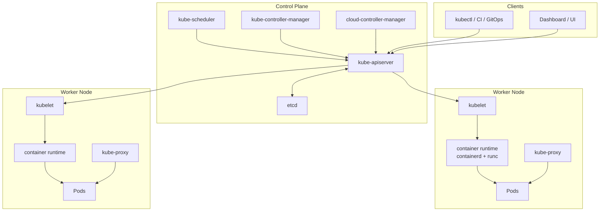
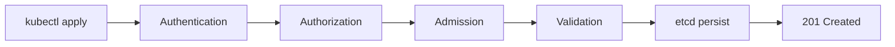
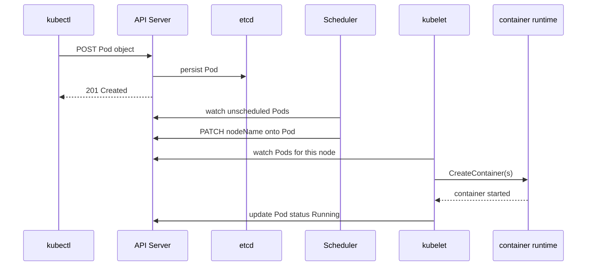

# Kubernetes Architecture and Components

## Overview

Every kubectl command, every Pod schedule, and every Service endpoint flows through a defined architecture. The **control plane** makes cluster-wide decisions; **worker nodes** execute them. Understanding **which component does what** — and how they communicate — turns cryptic failures ("scheduler pending", "kubelet not ready") into actionable debugging.

This tutorial maps the full Kubernetes architecture: API server, etcd, scheduler, controller manager, kubelet, kube-proxy, and the container runtime interface (CRI). You will learn request flows, high availability patterns, and how this compares to Docker Engine's client-daemon model.

This is **Tutorial 2** in **Module 1: Foundations** of the REBASH Academy Kubernetes series. Complete [Introduction to Kubernetes and Orchestration](introduction-to-kubernetes-and-orchestration.md) first. If you come from Docker, review [From Docker to Kubernetes](../docker/from-docker-to-kubernetes.md) for the concept bridge. This tutorial follows our [documentation standards](../about.md#documentation-standards).

## Prerequisites

- [Introduction to Kubernetes and Orchestration](introduction-to-kubernetes-and-orchestration.md)
- [From Docker to Kubernetes](../docker/from-docker-to-kubernetes.md)
- [Docker Architecture and Components](../docker/docker-architecture-and-components.md) — helpful parallel for client/server mental model
- [Introduction to Networking](../networking/introduction-to-networking.md) — IPs, DNS, ports, TLS
- No running cluster required for theory; labs use diagrams and optional kubectl commands

## Learning Objectives

By the end of this tutorial, you will be able to:

- [ ] Diagram the control plane and data plane and explain their responsibilities
- [ ] Describe the role of etcd, the API server, scheduler, and controller manager
- [ ] Explain kubelet, kube-proxy, and the container runtime on worker nodes
- [ ] Trace the lifecycle of a Pod creation request through cluster components
- [ ] Differentiate Kubernetes components from Docker Engine components
- [ ] Identify high-availability control plane patterns in production
- [ ] Use `kubectl get componentstatuses` and node conditions for basic health checks

## Architecture Diagram



## Theory

### Control Plane vs Data Plane

| Plane | Components | Responsibility |
|-------|------------|----------------|
| **Control plane** | API server, etcd, scheduler, controller manager, cloud-controller-manager | Cluster brain — stores state, validates requests, schedules, reconciles |
| **Data plane** | kubelet, kube-proxy, container runtime, CNI plugin | Runs workloads — starts containers, routes traffic, reports status |

Managed Kubernetes (EKS, GKE, AKS) operates the control plane for you. Self-managed clusters require HA etcd, load-balanced API servers, and careful upgrades. Local clusters (minikube, kind) collapse the control plane onto one VM or container.

### kube-apiserver — The Front Door

The **API server** is the only component that talks to **etcd** directly. Every other component and all `kubectl` commands go through the REST API.

Responsibilities:

- **Authentication** — who is calling (certificates, tokens, OIDC)
- **Authorization** — RBAC, webhook policies — can they perform this action?
- **Admission control** — mutating and validating webhooks (e.g., inject sidecar, enforce labels)
- **Validation** — schema checks on object specs
- **Persistence** — read/write objects in etcd



Compare to Docker: `docker` CLI → dockerd API. Kubernetes separates concerns across more components but uses the same client/server pattern from [Docker Architecture and Components](../docker/docker-architecture-and-components.md).

### etcd — Cluster Source of Truth

**etcd** is a consistent, distributed key-value store (Raft consensus). All Kubernetes object data lives here: Pods, Services, Secrets, ConfigMaps, RBAC rules, and more.

| Aspect | Detail |
|--------|--------|
| **Access** | Only API server reads/writes directly |
| **Backup** | Critical — snapshot etcd before upgrades |
| **HA** | Typically 3 or 5 members for production |
| **Performance** | Latency-sensitive; SSD storage recommended |

If etcd quorum is lost, the cluster cannot reconcile state — existing Pods may keep running, but no changes apply.

### kube-scheduler — Pod Placement

The **scheduler** watches for Pods with empty `spec.nodeName` and selects a suitable node based on:

- Resource requests (CPU, memory)
- Node selectors and affinity / anti-affinity
- Taints and tolerations
- Pod topology spread constraints
- Volume topology (zone matching for PVCs)

It **does not** run containers — it binds the Pod to a node; the kubelet on that node starts the containers.

### kube-controller-manager — Reconciliation Loops

The **controller manager** runs controllers — control loops that watch API objects and act:

| Controller | Watches | Action |
|------------|---------|--------|
| **Deployment** | Deployment, ReplicaSet, Pod | Maintain replica count, rolling updates |
| **ReplicaSet** | ReplicaSet, Pod | Create/delete Pods to match replicas |
| **Node** | Node | Update node status, evict Pods on NotReady |
| **Service** | Service, Endpoints | Maintain EndpointSlices for Service IPs |
| **Job / CronJob** | Job | Run batch workloads to completion |
| **Namespace** | Namespace | Cleanup on namespace deletion |

Each controller implements: **observe → compare desired vs actual → act → repeat**.

### cloud-controller-manager — Cloud Integration

The **cloud-controller-manager** links Kubernetes to your cloud provider:

- Attach load balancers for `Service type: LoadBalancer`
- Manage routes and node lifecycle (delete VM → mark node gone)
- Label nodes with zone/region topology

Runs only when integrated with AWS, GCP, Azure, etc. Local clusters typically omit it.

### Worker Node Components

#### kubelet

The **kubelet** is an agent on every node. It:

- Registers the node with the API server
- Watches Pod specs assigned to its node
- Instructs the container runtime to start/stop containers
- Reports Pod and node status (Ready, MemoryPressure, DiskPressure)
- Runs probes (liveness, readiness, startup) and reports results
- Mounts volumes (Secrets, ConfigMaps, PVCs)

If kubelet stops, the node becomes **NotReady** and Pods may be evicted.

#### Container Runtime (CRI)

Since Kubernetes 1.24, **dockershim** was removed. Nodes use **CRI-compatible** runtimes:

| Runtime | Notes |
|---------|-------|
| **containerd** | Default for most distros; Docker Desktop K8s uses it |
| **CRI-O** | Common on OpenShift and RHEL |
| **runc** | Low-level OCI runtime invoked by containerd/CRI-O |

Flow: kubelet → CRI gRPC API → containerd → runc → container process.

Your **images** are still OCI format from `docker build` or `buildah`.

#### kube-proxy

**kube-proxy** maintains network rules on each node so **Services** work:

- Implements ClusterIP virtual IPs via iptables, IPVS, or eBPF
- Load-balances traffic to healthy Pod endpoints
- Works with the CNI plugin (Calico, Cilium, Flannel) that assigns Pod IPs

Pod-to-Pod traffic crosses the CNI overlay; Service abstraction is kube-proxy's job.

### Pod Creation Flow

Tracing one `kubectl apply -f pod.yaml`:



### Kubernetes vs Docker Architecture

| Docker Engine | Kubernetes equivalent |
|---------------|----------------------|
| docker CLI | kubectl, CI pipelines, operators |
| dockerd | kube-apiserver + controllers (orchestration); containerd on node (execution) |
| containerd (embedded in Docker) | containerd on each node via CRI |
| bridge network | CNI plugin + kube-proxy Services |
| docker compose | Deployments, Services, Helm/Kustomize |
| Single host | Multi-node cluster with scheduler |

### High Availability Patterns

Production control planes typically deploy:

| Component | HA approach |
|-----------|-------------|
| **etcd** | 3 or 5 member cluster across failure domains |
| **API server** | Multiple replicas behind load balancer |
| **scheduler / controller manager** | Active-passive leader election (one active) |
| **Worker nodes** | Spread across availability zones |

Managed services hide this complexity — you provision node pools; the vendor runs etcd and API servers.

### Add-ons and Extensions

Not part of core architecture but present in most clusters:

| Add-on | Purpose |
|--------|---------|
| **CoreDNS** | Cluster DNS (`*.svc.cluster.local`) |
| **CNI plugin** | Pod networking |
| **Metrics Server** | Resource usage for `kubectl top` and HPA |
| **Ingress controller** | HTTP routing to Services |
| **CSI driver** | Attach cloud disks to Pods |

## Hands-on Lab

Complete [Installing Kubernetes and kubectl](installing-kubernetes-and-kubectl.md) first if you lack a cluster. These labs work with any running cluster.

### Step 1 – View cluster nodes

**Command:**

```bash
kubectl get nodes -o wide
```

**Explanation:** Each row is a worker node (control plane nodes may or may not run workloads depending on setup). Columns show kubelet version, internal IP, and OS image.

**Expected output:**

```text
NAME       STATUS   ROLES           AGE   VERSION   INTERNAL-IP
minikube   Ready    control-plane   1d    v1.30.x   192.168.49.2
```

### Step 2 – Inspect node conditions and components

**Command:**

```bash
kubectl describe node $(kubectl get nodes -o jsonpath='{.items[0].metadata.name}') | grep -A5 "Conditions:"
kubectl get cs 2>/dev/null || kubectl get --raw='/readyz?verbose' 2>/dev/null | head -20
```

**Explanation:** Node **Conditions** report Ready, MemoryPressure, DiskPressure, PIDPressure. Component status checks (deprecated in favor of `/readyz`) verify scheduler and controller-manager health on some clusters.

**Expected output:**

```text
Conditions:
  Type             Status
  Ready            True
  ...
```

### Step 3 – Observe system Pods on the node

**Command:**

```bash
kubectl get pods -n kube-system -o wide
```

**Explanation:** The `kube-system` namespace hosts CoreDNS, kube-proxy, CNI pods, and (on minikube) control plane components as static Pods. This makes architecture tangible.

**Expected output:**

```text
NAME                               READY   STATUS    RESTARTS   AGE
coredns-...                        1/1     Running   0          1d
kube-proxy-...                     1/1     Running   0          1d
```

### Step 4 – Trace API resources

**Command:**

```bash
kubectl api-resources | head -20
kubectl api-versions | grep apps
```

**Explanation:** Every object type (Pod, Deployment, Service) maps to an API group and version. The API server serves these resources; etcd stores their definitions.

**Expected output:**

```text
NAME        SHORTNAMES   APIVERSION   NAMESPACED   KIND
pods        po           v1           true         Pod
deployments deploy       apps/v1      true         Deployment
services    svc          v1           true         Service
```

### Step 5 – Watch Pod scheduling in real time

**Command:**

```bash
kubectl run schedule-demo --image=nginx:1.27-alpine --restart=Never --dry-run=client -o yaml | kubectl apply -f -
kubectl get pod schedule-demo -w
# Press Ctrl+C after status becomes Running
kubectl describe pod schedule-demo | grep -E "Node:|Events:" -A8
```

**Explanation:** The **Events** section shows scheduler assignment and kubelet pull/start actions — the sequence diagram from Theory, live.

**Expected output:**

```text
Events:
  Type    Reason     Message
  Normal  Scheduled  Successfully assigned default/schedule-demo to minikube
  Normal  Pulled     Container image "nginx:1.27-alpine" already present
  Normal  Created    Created container schedule-demo
  Normal  Started    Started container schedule-demo
```

### Step 6 – Check container runtime on the node (minikube)

**Command:**

```bash
minikube ssh -- docker ps 2>/dev/null | head -5 \
  || kubectl get nodes -o jsonpath='{.items[0].status.nodeInfo.containerRuntimeVersion}{"\n"}'
```

**Explanation:** On minikube, you can SSH into the node and see containers managed by containerd (via crictl) or docker depending on driver. The node status reports runtime version.

### Step 7 – Clean up lab Pod

**Command:**

```bash
kubectl delete pod schedule-demo --ignore-not-found
```

## Commands & Code

| Command | Description | Example |
|---------|-------------|---------|
| `kubectl get nodes` | List cluster nodes | `kubectl get nodes -o wide` |
| `kubectl describe node` | Node details, conditions, capacity | `kubectl describe node NODE` |
| `kubectl get pods -n kube-system` | System component Pods | `kubectl get pods -n kube-system` |
| `kubectl api-resources` | List supported API types | `kubectl api-resources` |
| `kubectl describe pod` | Events showing schedule/start flow | `kubectl describe pod NAME` |
| `kubectl get --raw='/readyz'` | API server readiness | `kubectl get --raw='/readyz?verbose'` |

### Node capacity inspection script

```bash
#!/usr/bin/env bash
# node-capacity.sh — summarize allocatable resources per node
kubectl get nodes -o json | python3 -c "
import json, sys
data = json.load(sys.stdin)
for n in data['items']:
    name = n['metadata']['name']
    cap = n['status']['capacity']
    alloc = n['status'].get('allocatable', {})
    print(f\"Node: {name}\")
    print(f\"  CPU capacity:    {cap.get('cpu')}  allocatable: {alloc.get('cpu')}\")
    print(f\"  Memory capacity: {cap.get('memory')}  allocatable: {alloc.get('memory')}\")
"
```

## Common Mistakes

!!! warning "Confusing scheduler with kubelet"
    The **scheduler** picks a node; the **kubelet** on that node starts containers. Pending Pods with "0/1 nodes available" are scheduling issues; ImagePullBackOff is a kubelet/runtime issue.

!!! warning "Assuming dockerd runs on Kubernetes nodes"
    Modern clusters use **containerd** via CRI. `docker ps` on a node may show nothing while `crictl ps` shows Pods. Do not install dockerd on workers unless your distribution requires it.

!!! warning "Ignoring etcd in production planning"
    etcd backup and restore procedures are mandatory for self-managed clusters. Losing etcd without backup means rebuilding the entire cluster state from Git manifests — if you have them.

!!! warning "Running workloads on control plane nodes"
    Production taints control plane nodes (`node-role.kubernetes.io/control-plane:NoSchedule`) to keep them dedicated to cluster management. Lab clusters (minikube) combine both for convenience.

## Best Practices

!!! tip "Learn the Pod creation sequence diagram"
    When debugging, ask: did the API accept the object? Did the scheduler assign a node? Did kubelet pull the image? Did probes pass? Each stage has distinct error messages.

!!! tip "Use kubectl describe for Events"
    The **Events** section at the bottom of `kubectl describe pod` is the fastest path from symptom to responsible component.

!!! tip "Separate control plane and worker concerns in runbooks"
    API/etcd issues affect the whole cluster; kubelet issues affect one node. Document escalation paths accordingly.

!!! tip "Prefer managed control planes for production"
    Operating HA etcd and API servers is a specialized skill. EKS/GKE/AKS let you focus on workloads and node pools.

## Troubleshooting

| Issue | Cause | Solution |
|-------|-------|----------|
| Pod stuck Pending | Scheduler cannot find suitable node | Check resources, taints, affinity; `kubectl describe pod` |
| Node NotReady | kubelet down, CNI failure, disk pressure | SSH/crictl on node; check kubelet logs |
| API server timeout | Control plane overload, etcd latency | Check etcd health; scale API replicas |
| Service has no endpoints | Selector mismatch or Pods not Ready | Verify labels; check readiness probes |
| ImagePullBackOff | Registry auth or wrong tag | kubelet/runtime issue — not scheduler |
| `kubectl get cs` deprecated | Removed in newer versions | Use `/readyz` or cloud provider health checks |

## Summary

- Kubernetes splits into **control plane** (decisions) and **data plane** (execution)
- **API server** is the hub; **etcd** stores all object state; **scheduler** binds Pods to nodes; **controllers** reconcile desired replica counts and endpoints
- **kubelet** runs on each node and drives the **CRI runtime**; **kube-proxy** implements Service networking
- Pod creation flows: kubectl → API → etcd → scheduler → kubelet → containerd → running container
- Managed Kubernetes hides control plane ops; local minikube/kind helps you see system Pods in `kube-system`
- Next: [Installing Kubernetes and kubectl](installing-kubernetes-and-kubectl.md)

## Interview Questions

1. Name the four main control plane components and their roles.
2. What is etcd, and why is it critical?
3. What does the kube-scheduler do — and what does it **not** do?
4. Explain the difference between kubelet and kube-proxy.
5. Trace what happens when you run `kubectl apply -f deployment.yaml`.
6. Why was dockershim removed from Kubernetes?
7. What is the Container Runtime Interface (CRI)?
8. How do Kubernetes controllers implement self-healing?
9. What is the difference between control plane and data plane?
10. How would you check if a node is healthy?

??? tip "Sample Answers (Questions 1, 5, and 6)"

    **Q1 — Control plane:** (1) **kube-apiserver** — REST front door, auth, admission, etcd access; (2) **etcd** — persistent cluster state store; (3) **kube-scheduler** — assigns Pods to nodes; (4) **kube-controller-manager** — runs reconciliation loops (Deployment, Node, Service controllers). Cloud-controller-manager is a fifth component for cloud integration.

    **Q5 — kubectl apply flow:** kubectl sends the manifest to the API server, which authenticates, authorizes, validates, and persists the object in etcd. Relevant controllers detect the new/changed object — e.g., Deployment controller creates a ReplicaSet, which creates Pods. Scheduler assigns each Pod to a node. kubelet on that node pulls the image via CRI and starts containers, then reports status back to the API server.

    **Q6 — dockershim removal:** dockershim was a maintenance bridge letting kubelet talk to dockerd. Kubernetes standardized on CRI; containerd and CRI-O implement CRI directly. Removing dockershim simplified the kubelet and reduced Docker Inc.'s critical path on node runtimes. Images remain OCI-compatible — only the node runtime changed.

## Related Tutorials

- [Introduction to Kubernetes and Orchestration](introduction-to-kubernetes-and-orchestration.md) *(previous)*
- [Installing Kubernetes and kubectl](installing-kubernetes-and-kubectl.md) *(next)*
- [From Docker to Kubernetes](../docker/from-docker-to-kubernetes.md)
- [Docker Architecture and Components](../docker/docker-architecture-and-components.md)
- [Kubernetes – Category Overview](index.md)
- [Learning Paths – DevOps Engineer](../learning-paths/index.md)

## References

- [Kubernetes – Cluster Architecture](https://kubernetes.io/docs/concepts/architecture/)
- [Kubernetes – Components](https://kubernetes.io/docs/concepts/overview/components/)
- [Kubernetes – Node Components](https://kubernetes.io/docs/concepts/architecture/nodes/)
- [Kubernetes – Controllers](https://kubernetes.io/docs/concepts/architecture/controller/)
- [Kubernetes – Container Runtime Interface](https://kubernetes.io/docs/concepts/architecture/cri/)
- [Kubernetes – etcd](https://kubernetes.io/docs/tasks/administer-cluster/configure-upgrade-etcd/)
- [REBASH Academy – Docker Architecture](../docker/docker-architecture-and-components.md)
