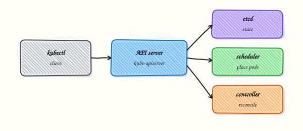

# Kubernetes Architecture and Components

## Overview


Trace a request from `kubectl` through the API server to etcd, scheduling, and the kubelet — and name every major control-plane piece.

The **control plane** stores and reconciles desired state. **Workers** run Pods. Everything goes through the **Kubernetes API**.

This is a core tutorial in **Module 1 · Kubernetes Fundamentals** of the REBASH Academy **Kubernetes for Cloud & DevOps Engineers** series — written for Cloud, DevOps, Platform, and SRE engineers.

## Prerequisites


- [Introduction to Kubernetes and Orchestration](introduction-to-kubernetes-and-orchestration.md)

## Learning Objectives


By the end of this tutorial, you will be able to:

- [ ] List API server, etcd, scheduler, controller-manager  
- [ ] Explain kubelet and kube-proxy roles  
- [ ] Describe cloud-controller-manager (when present)  
- [ ] Relate CNI to Pod networking

## Architecture


This topic’s control points and relationships are shown below.



## Theory


### What it is

A Kubernetes cluster has two logical halves: the **control plane** (brains) and **worker nodes** (muscle). Everything you do with `kubectl` is an API call against the control plane. Workers run your Pods under instructions from that API. Understanding the components lets you debug “who failed?” instead of guessing at YAML.

### Why it matters

When a Deployment will not schedule, a node goes NotReady, or `kubectl` hangs, you need to know whether the API server, etcd, the scheduler, or the kubelet is involved. Architecture knowledge is the difference between productive troubleshooting and random restarts. Certifications (CKA/KCNA) and on-call work both assume this map.

### How it works (mental model)

Trace a typical create:

1. `kubectl apply` → **kube-apiserver** (authentication, authorisation, admission).
2. Object persisted in **etcd**.
3. Controllers in **kube-controller-manager** notice desired replicas and create Pods (still unbound).
4. **kube-scheduler** writes a `nodeName` binding on the Pod.
5. The **kubelet** on that node asks the **container runtime** (via CRI — Container Runtime Interface) to pull and start containers.
6. **kube-proxy** (or an eBPF dataplane) programmes rules so Services reach Pod IPs.

Reconciliation never stops: controllers and kubelets continuously compare desired vs actual state.

### Key concepts / comparisons

| Component | Role |
|-----------|------|
| kube-apiserver | Front door; authn/authz |
| etcd | Cluster state store |
| kube-scheduler | Assign Pods to nodes |
| kube-controller-manager | Deployments, Nodes, endpoints, etc. |
| cloud-controller-manager | Cloud LB/volumes/routes (when present) |
| kubelet | Node agent; runs Pods |
| kube-proxy | Service dataplane (often) |
| container runtime | containerd / CRI-O |
| CNI plugin | Pod network addresses and routes |

**Control plane** may run on dedicated machines or as managed services (EKS/AKS/GKE). **Workers** hold application Pods. High availability means multiple API server and etcd members — a single control-plane VM is a lab pattern, not a production pattern.

### Common pitfalls

- Assuming etcd is “just a database” — corrupting or starving etcd takes the cluster down.
- Forgetting that kube-proxy is not the only Service implementation; Cilium and others may replace it.
- Expecting `kubectl get componentstatuses` to be the modern health check — prefer node Ready, API reachability, and control-plane Pods in `kube-system`.
- Confusing CNI (Pod networking) with kube-proxy (Service VIP distribution).

## Hands-on Lab

### Objective

Inspect control plane and node components running in your cluster, map each role to evidence in `arch-evidence.txt`, and prove system Pods in `kube-system` are healthy.

### Prerequisites

- A working **kind** cluster (`kubectl cluster-info`)
- **kubectl** with permission to list nodes and `kube-system` Pods
- Writable workspace at `~/rebash-k8s/module-01-arch`

### Lab environment

Workspace: `~/rebash-k8s/module-01-arch`

Use a disposable **kind** cluster. Never target a shared production API server.

``` {.bash .ra-terminal title="Terminal"}
mkdir -p ~/rebash-k8s/module-01-arch && cd ~/rebash-k8s/module-01-arch
kubectl cluster-info | tee cluster-info.txt
kubectl get nodes | tee nodes-ready-check.txt
grep -q Ready nodes-ready-check.txt
```

### Real-world scenario

During a cluster health review, your lead asks you to prove which nodes exist, which control-plane components run as Pods, and which daemons run on every node. You produce a short evidence file the on-call engineer can paste into the incident channel.

### Step-by-step tasks

#### Task 1 – Inspect node and control-plane layout

Record node roles, versions, and runtime information.

``` {.bash .ra-terminal title="Terminal"}
cd ~/rebash-k8s/module-01-arch
kubectl get nodes -o wide | tee nodes-wide.txt
kubectl get nodes -o jsonpath='{range .items[*]}{.metadata.name}{"\t"}{.status.nodeInfo.kubeletVersion}{"\t"}{.status.nodeInfo.containerRuntimeVersion}{"\n"}{end}' | tee node-runtime.txt
grep -q Ready nodes-wide.txt
```

!!! example "Expected output"
    `nodes-wide.txt` lists Ready nodes with internal IPs and container runtime versions.


#### Task 2 – List kube-system components

Identify control-plane and node agents running as Pods.

``` {.bash .ra-terminal title="Terminal"}
cd ~/rebash-k8s/module-01-arch
kubectl get pods -n kube-system -o wide | tee kube-system-pods.txt
kubectl get pods -n kube-system -o custom-columns=NAME:.metadata.name,NODE:.spec.nodeName,STATUS:.status.phase | tee kube-system-summary.txt
grep -E 'coredns|kube-proxy|etcd|apiserver|scheduler|controller' kube-system-pods.txt | tee control-plane-hits.txt || true
```

!!! example "Expected output"
    `kube-system-pods.txt` shows system Pods (names vary by distribution); most entries are `Running`.


#### Task 3 – Build arch-evidence from live cluster output

Create `build-arch-evidence.sh`:

```bash title="build-arch-evidence.sh"
#!/usr/bin/env bash
set -euo pipefail
{
  echo "# REBASH module-01-arch — cluster component evidence"
  echo "generated: $(date -Iseconds)"
  echo ""
  echo "control_plane_components:"
  grep -E 'coredns|kube-proxy|etcd|apiserver|scheduler|controller' kube-system-pods.txt || echo "  (names vary by distribution)"
  echo ""
  echo "=== nodes-wide.txt ==="
  cat nodes-wide.txt
  echo ""
  echo "=== kube-system-pods.txt ==="
  cat kube-system-pods.txt
} > arch-evidence.txt
wc -l arch-evidence.txt | tee arch-evidence-lines.txt
test "$(wc -l < arch-evidence.txt)" -gt 10
```

Run it:

``` {.bash .ra-terminal title="Terminal"}
cd ~/rebash-k8s/module-01-arch
chmod +x build-arch-evidence.sh
./build-arch-evidence.sh
grep -q 'cluster component evidence' arch-evidence.txt
```

!!! example "Expected output"
    `arch-evidence.txt` contains live command output and control-plane component hits; line count exceeds 10.


### Validation steps

- [ ] All nodes in `nodes-wide.txt` are Ready
- [ ] `kube-system-pods.txt` lists Running system Pods
- [ ] `arch-evidence.txt` maps control plane vs node agents with live output appended
- [ ] You can explain what etcd, kubelet, and CoreDNS do from this evidence

### Common errors and fixes

| Error | Cause | Fix |
|-------|-------|-----|
| Forbidden listing kube-system | RBAC limits | Use a lab cluster with admin access or ask platform team |
| No etcd Pod visible | External etcd (managed control plane) | Note "external etcd" in arch-evidence.txt |
| Different Pod names on minikube vs kind | Distribution packaging | Map by label: `kubectl get pods -n kube-system --show-labels` |
| Node NotReady | Cluster still booting | Wait and re-run `kubectl get nodes -w` |

### Challenge exercise

Add one line per node to `arch-evidence.txt` showing which `kube-system` DaemonSet Pods run on that node (`kubectl get pods -n kube-system -o wide --field-selector spec.nodeName=<node>`).

### Learning outcomes

- Correlated node Ready state with kubelet and runtime versions
- Identified control-plane and add-on Pods in `kube-system`
- Produced architecture evidence suitable for handover or review

### Cleanup

``` {.bash .ra-terminal title="Terminal"}
cd ~/rebash-k8s/module-01-arch
# Evidence files are local only — no cluster resources to delete
rm -f nodes-wide.txt node-runtime.txt kube-system-pods.txt kube-system-summary.txt control-plane-hits.txt arch-evidence-lines.txt
# Keep arch-evidence.txt if you want it for notes
```

## Validation


- [ ] Lab commands run under `~/rebash-k8s/module-01-arch/`
- [ ] You can explain each Theory section in your own words
- [ ] You used modern tooling where it applies to this topic
- [ ] You can describe one production failure mode for this topic

## Code Walkthrough


Production practice for **Kubernetes Architecture and Components** always combines:

1. Inspect before you change (status, plan, logs, dry-run)
2. Prefer reversible, documented changes (Git, IaC, drop-ins, version pins)
3. Capture evidence (command output, pipeline logs) for handovers
4. Prefer current tools and APIs over legacy shortcuts
5. Least privilege — escalate credentials only when required

Keep runbooks short enough to follow under pressure. Automate checks; keep humans for judgement.

## Security Considerations


- Treat credentials and tokens for kubernetes as privileged — never commit them
- Prefer short-lived auth (OIDC, roles, SSO) over long-lived keys
- Validate blast radius before apply/deploy/delete operations
- Restrict who can approve production changes
- Collect audit logs; limit who can read sensitive traces

## Common Mistakes


!!! warning "Assuming etcd is “just a database” — corrupting or starving etcd takes the cluster down."
    Validate assumptions against the Theory section and official docs before changing production.

!!! warning "Forgetting that kube-proxy is not the only Service implementation; Cilium and others may r"
    Lab shortcuts (open security groups, admin roles, skip approvals) must not ship unchanged.

!!! warning "Changing production without a rollback path"
    Always know how to revert (previous artefact, prior release, state rollback, DNS failback).

## Best Practices


- Encode Kubernetes Architecture and Components changes as code and review them in pull requests
- Pin versions (images, modules, actions, provider plugins)
- Separate environments with clear promotion gates
- Alert on symptoms with runbooks attached
- Destroy lab resources; tag everything with owner and expiry where possible

## Troubleshooting


| Symptom | Likely cause | Fix |
|---------|--------------|-----|
| Auth / permission denied | Wrong identity, policy, or scope | Check caller identity, roles, and least-privilege policies |
| Timeout / no route | Network, DNS, security group, or endpoint | Trace path, DNS, and allow-lists before retrying |
| Drift / unexpected plan | Manual change or wrong state/workspace | Reconcile desired vs actual; avoid click-ops on managed resources |
| Pipeline/job red | Flaky step, cache, or missing secret | Read failing step logs; bisect recent workflow/config changes |
| Cost spike | Idle load balancer, NAT, oversized compute | Inventory billable resources; stop/delete labs promptly |

## Summary


**Kubernetes Architecture and Components** is essential for Cloud and DevOps engineers working with kubernetes. Practise the lab until the inspection and change path is muscle memory, then continue the track.

## Interview Questions


1. What are the main control plane components of Kubernetes?
2. What is the role of kubelet versus kube-proxy on a node?
3. Where does etcd fit, and why is its health critical?
4. How does a highly available control plane change failure domains compared with a single API server?
5. What is the scheduler responsible for?

!!! tip "Sample answer — question 2"
    kubelet ensures Pod specs assigned to the node are running and reports status. kube-proxy programmes Service networking rules (or relies on equivalent dataplane) so ClusterIP traffic reaches Pods.

!!! tip "Sample answer — question 4"
    Multiple API server and etcd members reduce single points of failure, but you must still plan for quorum, load balancing, and zone-aware placement so correlated failures do not take the whole control plane down.

## Related Tutorials


- [Course overview](index.md)
- [Installing Kubernetes and kubectl](installing-kubernetes-and-kubectl.md)

## References


- [Cluster architecture](https://kubernetes.io/docs/concepts/architecture/)
