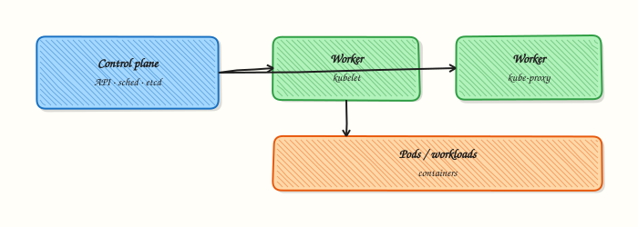

# Kubernetes Autoscaling

## Overview


Create a Horizontal Pod Autoscaler (HPA) on CPU and explain VPA, Cluster Autoscaler, and KEDA event-driven scaling.

| Scaler | Scales |
|--------|--------|
| HPA | Pod replicas (CPU/mem/custom) |
| VPA | Pod resource requests |
| Cluster Autoscaler | Nodes |
| KEDA | Replicas from events/queues |

Requests must be set for resource-based HPA. Pair with PodDisruptionBudgets in production.

This is a core tutorial in **Module 13 · Autoscaling** of the REBASH Academy **Kubernetes for Cloud & DevOps Engineers** series — written for Cloud, DevOps, Platform, and SRE engineers.

## Prerequisites


- [Observability](monitoring-and-logging-in-kubernetes.md) (Metrics Server for resource HPA)

## Learning Objectives


By the end of this tutorial, you will be able to:

- [ ] Create an HPA on CPU  
- [ ] Explain why resource requests are required  
- [ ] Contrast HPA, VPA, Cluster Autoscaler, and KEDA  
- [ ] Note PDB pairing for production scale-down

## Architecture


This topic’s control points and relationships are shown below.



## Theory


### What it is

**Autoscaling** adjusts capacity to load. **Horizontal Pod Autoscaler (HPA)** changes replica counts from CPU, memory, or custom metrics. **Vertical Pod Autoscaler (VPA)** recommends or sets container requests/limits. **Cluster Autoscaler** (or cloud equivalents / Karpenter) adds or removes nodes when Pods are unschedulable or nodes are underused. **KEDA** scales from event sources (queues, lag, cron).

### Why it matters

Fixed replica counts waste money at night and melt under spikes. Autoscaling ties capacity to demand, but only if metrics exist and requests are honest. Misconfigured HPA either never scales or flaps. Production pairs scaling with **Pod Disruption Budgets (PDBs)** so voluntary drains and scale-down stay safe.

### How it works (mental model)

1. Metrics Server (or custom metrics API / Prometheus adapter) publishes signals.
2. HPA controller computes desired replicas from target utilisation or metric value.
3. It updates the Deployment/ReplicaSet/StatefulSet scale subresource.
4. If Pods stay Pending for lack of node capacity, Cluster Autoscaler / Karpenter provisions nodes.
5. Scale-down waits for stabilisation windows; PDBs limit simultaneous voluntary evictions.

Controllers reconcile desired replica counts continuously — HPA writes the desired number; the workload controller creates Pods.

### Key concepts / comparisons

| Scaler | Scales |
|--------|--------|
| HPA | Pod replicas (CPU/mem/custom) |
| VPA | Pod resource requests |
| Cluster Autoscaler | Nodes |
| KEDA | Replicas from events/queues |

| Requirement | Why |
|-------------|-----|
| Resource requests | HPA CPU/memory % needs a denominator |
| Metrics Server | Resource metrics path |
| Custom metrics API | Non-resource signals |

Avoid running VPA auto mode and HPA on CPU/memory against the same container without understanding interactions — use documented patterns.

### Common pitfalls

- HPA with no requests — utilisation is undefined or useless.
- Min=max replicas — “autoscaler” that never moves.
- Scaling on CPU when the app is queue-bound — use KEDA or custom metrics.
- Cluster Autoscaler disabled while HPA creates unschedulable Pods.
- Aggressive scale-down without PDBs during deploys — accidental outages.

## Hands-on Lab

### Objective

Create a Deployment with resource requests and a HorizontalPodAutoscaler (HPA), apply both, and validate the HPA object with `kubectl describe hpa` even when Metrics Server is missing.

### Prerequisites

- kubectl configured against a lab cluster (kind or minikube)
- Writable workspace at `~/rebash-k8s/module-13`

### Lab environment

Workspace: `~/rebash-k8s/module-13` on a disposable lab cluster.

```bash
mkdir -p ~/rebash-k8s/module-13 && cd ~/rebash-k8s/module-13
```

### Real-world scenario

Traffic to **checkout-api** is spiky. Platform engineering wants an HPA on CPU utilisation with sane min/max bounds. You will commit the manifests, apply them, and capture HPA status — noting if metrics are unavailable on the lab cluster.

### Step-by-step tasks

#### Task 1 – Namespace and Deployment with requests

Create `namespace.yaml`:

```yaml
apiVersion: v1
kind: Namespace
metadata:
  name: rebash-m13
```

Create `deployment.yaml`:

```yaml
apiVersion: apps/v1
kind: Deployment
metadata:
  name: checkout-api
  namespace: rebash-m13
spec:
  replicas: 2
  selector:
    matchLabels:
      app: checkout-api
  template:
    metadata:
      labels:
        app: checkout-api
    spec:
      containers:
        - name: api
          image: nginxinc/nginx-unprivileged:1.27-alpine
          ports:
            - containerPort: 8080
          resources:
            requests:
              cpu: 100m
              memory: 64Mi
            limits:
              cpu: 200m
              memory: 128Mi
```

Apply:

```bash
cd ~/rebash-k8s/module-13
kubectl apply -f namespace.yaml -f deployment.yaml
kubectl rollout status deployment/checkout-api -n rebash-m13 --timeout=120s
kubectl get deploy checkout-api -n rebash-m13 | tee deploy-m13.txt
```

**Expected output:** Deployment shows `2/2` Ready replicas.

#### Task 2 – HorizontalPodAutoscaler manifest

Create `hpa.yaml`:

```yaml
apiVersion: autoscaling/v2
kind: HorizontalPodAutoscaler
metadata:
  name: checkout-api-hpa
  namespace: rebash-m13
spec:
  scaleTargetRef:
    apiVersion: apps/v1
    kind: Deployment
    name: checkout-api
  minReplicas: 2
  maxReplicas: 5
  metrics:
    - type: Resource
      resource:
        name: cpu
        target:
          type: Utilization
          averageUtilization: 50
```

Apply and describe:

```bash
cd ~/rebash-k8s/module-13
kubectl apply -f hpa.yaml
kubectl get hpa checkout-api-hpa -n rebash-m13 | tee hpa-m13.txt
kubectl describe hpa checkout-api-hpa -n rebash-m13 | tee hpa-describe-m13.txt
grep -E 'Min replicas|Max replicas|checkout-api' hpa-describe-m13.txt
```

**Expected output:** HPA exists with min 2, max 5, targeting `checkout-api`.

#### Task 3 – Interpret metrics availability

Check whether the HPA can read metrics:

```bash
cd ~/rebash-k8s/module-13
if kubectl top pods -n rebash-m13 >/dev/null 2>&1; then
  kubectl top pods -n rebash-m13 | tee hpa-metrics-m13.txt
else
  echo "Metrics Server unavailable — HPA object valid but scaling may show Unknown targets" | tee hpa-metrics-m13.txt
fi
kubectl describe hpa checkout-api-hpa -n rebash-m13 | grep -E 'AbleToScale|ScalingActive|FailedGetResourceMetric' | tee hpa-conditions-m13.txt || true
```

**Expected output:** Either live CPU metrics or conditions explaining missing metrics API — both are valid lab outcomes if documented.

### Validation steps

- [ ] Deployment has CPU/memory requests defined
- [ ] HPA references the correct Deployment scale target
- [ ] `kubectl describe hpa` shows min/max replica bounds
- [ ] Metrics availability documented honestly

### Common errors and fixes

| Error | Cause | Fix |
|-------|-------|-----|
| HPA `FailedGetResourceMetric` | No metrics-server | Install metrics-server or accept lab limitation |
| HPA never scales | Missing Pod requests | Add `resources.requests.cpu` |
| `minReplicas` > Deployment replicas | Spec mismatch | Align initial replicas with HPA minimum |
| Invalid scale target | Wrong Deployment name | Fix `scaleTargetRef.name` |

### Challenge exercise

Lower `averageUtilization` to 10 and run a CPU load Job in the namespace; capture `kubectl get hpa -w` output in `hpa-scale-watch.txt` if Metrics Server is present.

### Learning outcomes

- Created an HPA v2 manifest tied to resource requests
- Applied and inspected autoscaling configuration with kubectl
- Diagnosed metrics API dependency for scaling decisions
- Understood min/max replica guardrails

### Cleanup

```bash
kubectl delete namespace rebash-m13 --ignore-not-found
```

## Validation


- [ ] Lab commands run under `~/rebash-k8s/module-13/`
- [ ] You can explain each Theory section in your own words
- [ ] You used modern tooling where it applies to this topic
- [ ] You can describe one production failure mode for this topic

## Code Walkthrough


Production practice for **Kubernetes Autoscaling** always combines:

1. Inspect before you change (status, plan, logs, dry-run)
2. Prefer reversible, documented changes (Git, IaC, drop-ins, version pins)
3. Capture evidence (command output, pipeline logs) for handovers
4. Prefer current tools and APIs over legacy shortcuts
5. Least privilege — escalate credentials only when required

Keep runbooks short enough to follow under pressure. Automate checks; keep humans for judgement.

## Security Considerations


- Treat credentials and tokens for kubernetes as privileged — never commit them
- Prefer short-lived auth (OIDC, roles, SSO) over long-lived keys
- Validate blast radius before apply/deploy/delete operations
- Restrict who can approve production changes
- Collect audit logs; limit who can read sensitive traces

## Common Mistakes


!!! warning "HPA with no requests — utilisation is undefined or useless."
    Validate assumptions against the Theory section and official docs before changing production.

!!! warning "Min=max replicas — “autoscaler” that never moves."
    Lab shortcuts (open security groups, admin roles, skip approvals) must not ship unchanged.

!!! warning "Changing production without a rollback path"
    Always know how to revert (previous artefact, prior release, state rollback, DNS failback).

## Best Practices


- Encode Kubernetes Autoscaling changes as code and review them in pull requests
- Pin versions (images, modules, actions, provider plugins)
- Separate environments with clear promotion gates
- Alert on symptoms with runbooks attached
- Destroy lab resources; tag everything with owner and expiry where possible

## Troubleshooting


| Symptom | Likely cause | Fix |
|---------|--------------|-----|
| Auth / permission denied | Wrong identity, policy, or scope | Check caller identity, roles, and least-privilege policies |
| Timeout / no route | Network, DNS, security group, or endpoint | Trace path, DNS, and allow-lists before retrying |
| Drift / unexpected plan | Manual change or wrong state/workspace | Reconcile desired vs actual; avoid click-ops on managed resources |
| Pipeline/job red | Flaky step, cache, or missing secret | Read failing step logs; bisect recent workflow/config changes |
| Cost spike | Idle load balancer, NAT, oversized compute | Inventory billable resources; stop/delete labs promptly |

## Summary


**Kubernetes Autoscaling** is essential for Cloud and DevOps engineers working with kubernetes. Practise the lab until the inspection and change path is muscle memory, then continue the track.

## Interview Questions


1. What does the Horizontal Pod Autoscaler adjust?
2. Why do resource requests matter for CPU-based HPA?
3. What is the difference between HPA and Cluster Autoscaler?
4. What risks arise from autoscaling without PodDisruptionBudgets and readiness probes?
5. When would you choose custom metrics over CPU utilisation?

!!! tip "Sample answer — question 2"
    HPA scales Pod replica counts from metrics. Requests define the baseline for utilisation percentages; without requests, CPU targets are unreliable or unavailable.

!!! tip "Sample answer — question 4"
    Rapid scale-down can terminate Pods mid-request if PDBs and readiness are weak. Scale-up can overwhelm dependencies. Pair HPA with sensible limits, PDBs, and dependency capacity planning.

## Related Tutorials


- [Course overview](index.md)
- [Helm Package Management](helm-package-management.md)

## References


- [Horizontal Pod Autoscaling](https://kubernetes.io/docs/tasks/run-application/horizontal-pod-autoscale/) · [KEDA](https://keda.sh/)
