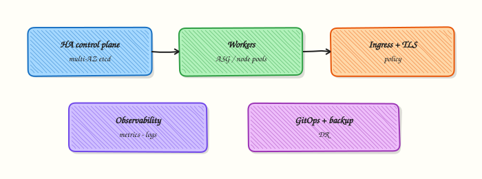

# Managed Kubernetes — EKS, AKS, GKE

## Overview


Compare EKS, AKS, and GKE on control-plane responsibility, identity, networking models, and what you still own (nodes, add-ons, workloads, cost).

Managed Kubernetes runs the **control plane** for you. You still design node pools, CNI/network plugins, IAM mapping, upgrades, and GitOps.

This is a core tutorial in **Module 19 · Managed Kubernetes** of the REBASH Academy **Kubernetes for Cloud & DevOps Engineers** series — written for Cloud, DevOps, Platform, and SRE engineers.

## Prerequisites


- [Troubleshooting](troubleshooting-kubernetes-workloads.md)
- Cloud fundamentals helpful

## Learning Objectives


By the end of this tutorial, you will be able to:

- [ ] State shared responsibility per cloud  
- [ ] Map IAM → Kubernetes RBAC (roughly)  
- [ ] Note default CNI / LB integrations  
- [ ] Plan upgrades on managed offerings

## Architecture


This topic’s control points and relationships are shown below.



## Theory


### What it is

**Managed Kubernetes** offerings — **Amazon EKS**, **Azure AKS**, and **Google GKE** — run the control plane (API server, etcd, and core controllers) as a cloud service. You consume a stable API endpoint and attach compute (node groups, serverless nodes, or autopilot-style modes). Networking, IAM mapping, add-ons, and workloads remain shared-responsibility items you must design.

### Why it matters

Self-managing etcd HA and control-plane upgrades is real toil. Managed services reduce that burden so DevOps teams focus on platforms, GitOps, and applications. Choosing among EKS/AKS/GKE usually follows your cloud, identity model, and appetite for Autopilot/Fargate-style trade-offs versus node-level control.

### How it works (mental model)

1. Create a cluster in the cloud console/API/Terraform — provider runs the control plane.
2. Configure VPC/VNet, subnets, and CNI (AWS VPC CNI, Azure CNI/overlay, GKE dataplane).
3. Map cloud identities to Kubernetes RBAC (EKS access entries / aws-auth, Entra ID integration, Google IAM).
4. Attach node pools or enable serverless/autopilot; install cluster add-ons (CSI, metrics, ingress).
5. Point kubeconfig at the API; operate workloads as on any conformant cluster — controllers still reconcile desired state.

You do not SSH to etcd; you do still patch nodes, rotate credentials, and test restores of *your* data.

### Key concepts / comparisons

| | EKS | AKS | GKE |
|--|-----|-----|-----|
| Control plane | AWS-managed | Azure-managed | Google-managed |
| Identity | IAM + access entries / aws-auth | Entra ID / AAD | Google IAM |
| Nodes | Managed node groups / Fargate / Karpenter | Node pools / Virtual nodes | Node pools / Autopilot |
| Registry | ECR | ACR | Artifact Registry |

| Mode | Trade-off |
|------|-----------|
| Standard nodes | More control, more ops |
| Autopilot / Fargate-like | Less node ops, less flexibility |

### Common pitfalls

- Treating managed as “no ops” — upgrades, IAM, and cost still need owners.
- Wrong subnet/CNI design causing Pod IP exhaustion.
- Forgetting cluster auth maps — `kubectl` works for admins but CI roles get 403.
- Leaving public API endpoints open without IP allow lists or private-only access.
- Ignoring version deprecation calendars until the control plane blocks creates.

## Hands-on Lab

### Objective

Bootstrap a **kind** cluster, run a kubeconfig context checklist against it, apply a labelled namespace, and compare local node metadata with what managed EKS/AKS/GKE clusters expose — using live command output, not a principles worksheet.

### Prerequisites

- **kind** installed (`kind version`)
- kubectl installed
- Docker Engine running (kind requirement)
- Writable workspace at `~/rebash-k8s/module-19`

### Lab environment

Workspace: `~/rebash-k8s/module-19`

``` {.bash .ra-terminal title="Terminal"}
mkdir -p ~/rebash-k8s/module-19 && cd ~/rebash-k8s/module-19
kind create cluster --name rebash-m19 2>/dev/null || kind get clusters | grep -q rebash-m19
kubectl cluster-info | tee cluster-info.txt
kubectl get nodes | tee nodes-ready.txt
grep -q Ready nodes-ready.txt
```

### Real-world scenario

Your team evaluates EKS, AKS, and GKE for a migration. Platform engineers run a pre-flight script that checks kubeconfig context, cluster endpoint, and node metadata before any cloud CLI runs. You bootstrap a local kind cluster, run the checklist, apply a labelled namespace, and document how local node fields differ from managed provider IDs.

### Step-by-step tasks

#### Task 1 – Create kubeconfig context checklist script

Create `kubeconfig-context-check.sh`:

```bash title="kubeconfig-context-check.sh"
#!/usr/bin/env bash
set -euo pipefail

OUT="${1:-context-check.txt}"
: > "${OUT}"

echo "=== kubeconfig context checklist (read-only) ===" | tee -a "${OUT}"
echo "No cloud APIs called. Uses local kubeconfig only." | tee -a "${OUT}"
echo | tee -a "${OUT}"

kubectl config current-context | tee -a "${OUT}"
kubectl config view --minify -o jsonpath='{.clusters[0].cluster.server}{"\n"}' | tee -a "${OUT}"
kubectl config view --minify -o jsonpath='{.contexts[0].context.user}{"\n"}' | tee -a "${OUT}"

echo "--- cluster info ---" | tee -a "${OUT}"
kubectl cluster-info | tee -a "${OUT}"

echo "--- nodes (if permitted) ---" | tee -a "${OUT}"
kubectl get nodes -o wide | tee -a "${OUT}" || echo "nodes: access denied or unavailable" | tee -a "${OUT}"

echo "--- auth can-i sample ---" | tee -a "${OUT}"
kubectl auth can-i get pods --all-namespaces | tee -a "${OUT}" || true

echo | tee -a "${OUT}"
echo "Checklist complete. Review ${OUT} before targeting production contexts." | tee -a "${OUT}"
```

Run against your local context:

``` {.bash .ra-terminal title="Terminal"}
cd ~/rebash-k8s/module-19
chmod +x kubeconfig-context-check.sh
./kubeconfig-context-check.sh context-check.txt
grep -q 'kubeconfig context checklist' context-check.txt
grep -q 'cluster info' context-check.txt
```

!!! example "Expected output"
    `context-check.txt` lists current context, API server URL, and cluster-info output.


#### Task 3 – Apply labelled namespace and inspect node metadata

Create `namespace.yaml`:

```yaml title="namespace.yaml"
apiVersion: v1
kind: Namespace
metadata:
  name: rebash-managed-lab
  labels:
    environment: dev
    cloud-provider: local-kind
    app.kubernetes.io/managed-by: rebash-lab
```

Apply and capture managed-style metadata:

``` {.bash .ra-terminal title="Terminal"}
cd ~/rebash-k8s/module-19
kubectl apply -f namespace.yaml
kubectl get ns rebash-managed-lab --show-labels | tee namespace-evidence.txt
kubectl get nodes -o jsonpath='{range .items[*]}{.metadata.name}{"\t"}{.spec.providerID}{"\t"}{.metadata.labels}{"\n"}{end}' | tee node-provider-metadata.txt
grep -q 'rebash-managed-lab' namespace-evidence.txt
grep -q 'local-kind' namespace-evidence.txt
```

!!! example "Expected output"
    Namespace is `Active` with labels; `node-provider-metadata.txt` shows empty or local provider IDs (kind differs from EKS/AKS/GKE cloud provider IDs).


#### Task 4 – Pack evidence for review

``` {.bash .ra-terminal title="Terminal"}
cd ~/rebash-k8s/module-19
tar -czf module-19-managed-evidence.tgz \
  cluster-info.txt nodes-ready.txt context-check.txt \
  namespace.yaml namespace-evidence.txt node-provider-metadata.txt \
  kubeconfig-context-check.sh
ls -l module-19-managed-evidence.tgz | tee evidence-ls.txt
test -s module-19-managed-evidence.tgz
```

!!! example "Expected output"
    Evidence tarball is non-empty and includes context check plus namespace/node metadata.


### Validation steps

- [ ] kind cluster `rebash-m19` is Ready
- [ ] Context checklist runs read-only against local kubeconfig
- [ ] Namespace `rebash-managed-lab` applied with GitOps-style labels
- [ ] `node-provider-metadata.txt` captured from live nodes
- [ ] Evidence tarball contains checklist and namespace output

### Common errors and fixes

| Error | Cause | Fix |
|-------|-------|-----|
| `kind: command not found` | kind not installed | Install kind; or use existing lab cluster and skip create |
| current-context empty | No kubeconfig | Export `KUBECONFIG`; run `kind create cluster --name rebash-m19` |
| cluster-info fails | Cluster stopped | `kind start` or recreate cluster |
| Namespace apply denied | Read-only kubeconfig | Use kind with admin context |
| Wrong cluster targeted | Multiple contexts | `kubectl config use-context kind-rebash-m19` first |

### Challenge exercise

Add one line to `node-provider-metadata.txt` explaining which field EKS would populate on nodes (`spec.providerID` with `aws://…`) that kind leaves empty — append via a one-line note file `managed-contrast.txt` generated from your observation, not a copied glossary.

### Learning outcomes

- Bootstrapped a disposable kind cluster for managed-Kubernetes comparisons
- Built and ran a read-only kubeconfig pre-flight checklist
- Applied labelled namespace demonstrating cloud-agnostic GitOps metadata
- Compared local node provider metadata with managed-cluster expectations

### Cleanup

``` {.bash .ra-terminal title="Terminal"}
kubectl delete namespace rebash-managed-lab --ignore-not-found --wait=true
kind delete cluster --name rebash-m19 2>/dev/null || true
rm -f ~/rebash-k8s/module-19/context-check.txt ~/rebash-k8s/module-19/namespace-evidence.txt ~/rebash-k8s/module-19/module-19-managed-evidence.tgz
```

## Validation


- [ ] Lab commands run under `~/rebash-k8s/module-19/`
- [ ] You can explain each Theory section in your own words
- [ ] You used modern tooling where it applies to this topic
- [ ] You can describe one production failure mode for this topic

## Code Walkthrough


Production practice for **Managed Kubernetes — EKS, AKS, GKE** always combines:

1. Inspect before you change (status, plan, logs, dry-run)
2. Prefer reversible, documented changes (Git, IaC, drop-ins, version pins)
3. Capture evidence (command output, pipeline logs) for handovers
4. Prefer current tools and APIs over legacy shortcuts
5. Least privilege — escalate credentials only when required

Keep runbooks short enough to follow under pressure. Automate checks; keep humans for judgement.

## Security Considerations


- Treat credentials and tokens for kubernetes as privileged — never commit them
- Prefer short-lived auth (OIDC, roles, SSO) over long-lived keys
- Validate blast radius before apply/deploy/delete operations
- Restrict who can approve production changes
- Collect audit logs; limit who can read sensitive traces

## Common Mistakes


!!! warning "Treating managed as “no ops” — upgrades, IAM, and cost still need owners."
    Validate assumptions against the Theory section and official docs before changing production.

!!! warning "Wrong subnet/CNI design causing Pod IP exhaustion."
    Lab shortcuts (open security groups, admin roles, skip approvals) must not ship unchanged.

!!! warning "Changing production without a rollback path"
    Always know how to revert (previous artefact, prior release, state rollback, DNS failback).

## Best Practices


- Encode Managed Kubernetes — EKS, AKS, GKE changes as code and review them in pull requests
- Pin versions (images, modules, actions, provider plugins)
- Separate environments with clear promotion gates
- Alert on symptoms with runbooks attached
- Destroy lab resources; tag everything with owner and expiry where possible

## Troubleshooting


| Symptom | Likely cause | Fix |
|---------|--------------|-----|
| Auth / permission denied | Wrong identity, policy, or scope | Check caller identity, roles, and least-privilege policies |
| Timeout / no route | Network, DNS, security group, or endpoint | Trace path, DNS, and allow-lists before retrying |
| Drift / unexpected plan | Manual change or wrong state/workspace | Reconcile desired vs actual; avoid click-ops on managed resources |
| Pipeline/job red | Flaky step, cache, or missing secret | Read failing step logs; bisect recent workflow/config changes |
| Cost spike | Idle load balancer, NAT, oversized compute | Inventory billable resources; stop/delete labs promptly |

## Summary


**Managed Kubernetes — EKS, AKS, GKE** is essential for Cloud and DevOps engineers working with kubernetes. Practise the lab until the inspection and change path is muscle memory, then continue the track.

## Interview Questions


1. What responsibilities typically remain with you on a managed Kubernetes service?
2. How does cloud IAM integration differ across EKS, AKS, and GKE at a high level?
3. Why pin node image/version upgrade strategies even when the control plane is managed?
4. What vendor lock-in trade-offs appear when using cloud-specific Ingress or identity add-ons?
5. How do you validate portability of an application across managed offerings?

!!! tip "Sample answer — question 2"
    You still own workloads, RBAC inside the cluster, networking design, upgrades of node pools, add-ons you install, and cost. The vendor usually operates the control plane API servers and etcd.

!!! tip "Sample answer — question 4"
    Cloud-native LB annotations and IAM roles simplify ops but couple manifests to one provider. Prefer portable core APIs where possible, and isolate provider-specific resources behind modules.

## Related Tutorials


- [Course overview](index.md)
- [Production Kubernetes Excellence](production-kubernetes-excellence.md)

## References


- [EKS](https://docs.aws.amazon.com/eks/) · [AKS](https://learn.microsoft.com/azure/aks/) · [GKE](https://cloud.google.com/kubernetes-engine/docs)
