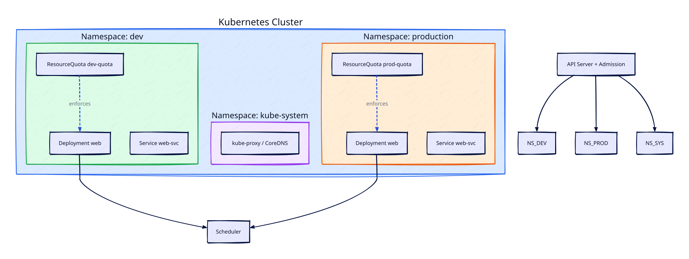

# Namespaces and Resource Management

## Overview

A production Kubernetes cluster rarely runs a single application in isolation. Platform teams host dozens of teams — each with staging, production, and experimental workloads — on shared infrastructure. **Namespaces** are Kubernetes' primary mechanism for partitioning a cluster: they scope object names, enable RBAC boundaries, and anchor resource policies. Without namespaces, every Service name must be globally unique and a runaway batch job in one team can exhaust cluster memory for everyone.

This tutorial covers namespace design, **ResourceQuota** and **LimitRange** enforcement, label-based organisation, and kubectl context workflows. You will learn how SRE and platform engineers prevent noisy-neighbor problems while keeping developer self-service intact.

This is **Tutorial 11** in **Module 4: Networking & Operations** of the REBASH Academy Kubernetes series. Complete [Ingress and External Access](ingress-and-external-access.md) first — external routing and namespace-scoped Ingress rules go hand in hand.

## Prerequisites

- Completed [Ingress and External Access](ingress-and-external-access.md) — understand Services, Ingress, and how traffic reaches pods
- A running Kubernetes cluster with `kubectl` configured (minikube, kind, k3s, or managed EKS/GKE/AKS)
- Ability to create Deployments and Services from YAML or imperative commands
- Basic understanding of CPU and memory units (`100m`, `256Mi`, `1Gi`)
- Comfort reading `kubectl get` and `kubectl describe` output

## Learning Objectives

By the end of this tutorial, you will be able to:

- [ ] Explain what a namespace is and when to create one vs using labels
- [ ] Design a namespace layout for dev, staging, and production workloads
- [ ] Apply ResourceQuota to cap aggregate resource consumption per namespace
- [ ] Use LimitRange to set default and maximum container resource requests and limits
- [ ] Switch kubectl context and namespace efficiently for multi-team operations
- [ ] Diagnose pod scheduling failures caused by quota exhaustion
- [ ] Apply labels and annotations for cost allocation and governance

## Architecture

Namespaces sit logically above workloads. The API server enforces quotas at admission time; the scheduler respects requests and limits on each node.



## Theory

### What Is a Namespace?

A **namespace** is a virtual cluster inside a physical cluster. Object names are unique *within* a namespace but can repeat across namespaces — `web-svc` in `dev` and `web-svc` in `production` are distinct resources. The API server stores objects with a fully qualified name: `namespace/name`.

Kubernetes ships with built-in namespaces:

| Namespace | Purpose |
|-----------|---------|
| `default` | Workloads without an explicit namespace land here |
| `kube-system` | Core control plane and add-on components (CoreDNS, kube-proxy) |
| `kube-public` | Publicly readable metadata (rarely used) |
| `kube-node-lease` | Node heartbeat leases for health detection |

Most user workloads should **not** live in `default` or `kube-system`. Treat `default` as a sandbox; production apps belong in purpose-named namespaces.

### Namespace vs Labels

Namespaces provide **hard boundaries** for RBAC, quotas, and DNS (`service-name.namespace.svc.cluster.local`). **Labels** provide soft grouping across namespaces — for example, `team=payments` on Deployments in both `staging` and `production`.

| Mechanism | Best for |
|-----------|----------|
| Namespace | RBAC isolation, quotas, network policies scoped to a tenant |
| Label | Cross-cutting queries, cost tags, feature flags, GitOps selectors |

Use namespaces for tenancy boundaries; use labels for metadata and filtering.

### Resource Requests, Limits, and Quality of Service

Every container should declare **requests** (guaranteed minimum) and **limits** (maximum allowed):

```yaml
resources:
  requests:
    cpu: "100m"
    memory: "128Mi"
  limits:
    cpu: "500m"
    memory: "512Mi"
```

The scheduler uses **requests** to find a node with enough allocatable capacity. The kubelet uses **limits** to enforce cgroup ceilings. Pods without requests are harder to schedule predictably and receive `BestEffort` QoS — the first evicted under memory pressure.

| QoS Class | Condition |
|-----------|-----------|
| **Guaranteed** | Every container has equal requests and limits for CPU and memory |
| **Burstable** | At least one container has requests or limits set |
| **BestEffort** | No requests or limits on any container |

### ResourceQuota

A **ResourceQuota** caps aggregate consumption in a namespace. Common quota scopes:

```yaml
apiVersion: v1
kind: ResourceQuota
metadata:
  name: team-quota
  namespace: payments
spec:
  hard:
    pods: "20"
    requests.cpu: "4"
    requests.memory: 8Gi
    limits.cpu: "8"
    limits.memory: 16Gi
    persistentvolumeclaims: "5"
    services.loadbalancers: "2"
```

When a team tries to create a Pod that would exceed the quota, the API server rejects it with a clear error. Quotas require that affected resources specify requests/limits — otherwise LimitRange defaults apply.

### LimitRange

**LimitRange** sets defaults and constraints per Pod or container in a namespace:

```yaml
apiVersion: v1
kind: LimitRange
metadata:
  name: default-limits
  namespace: payments
spec:
  limits:
    - type: Container
      default:
        cpu: "200m"
        memory: "256Mi"
      defaultRequest:
        cpu: "100m"
        memory: "128Mi"
      max:
        cpu: "2"
        memory: 2Gi
      min:
        cpu: "50m"
        memory: "64Mi"
```

LimitRange ensures every Pod entering the namespace has sane resource declarations — critical before enabling ResourceQuota.

### Multi-Tenancy Patterns

Common namespace strategies:

| Pattern | Layout | Trade-off |
|---------|--------|-----------|
| **Env per namespace** | `payments-dev`, `payments-prod` | Simple RBAC; many namespaces at scale |
| **Team per namespace** | `payments`, `catalog` with env labels | Fewer namespaces; quotas per team not env |
| **Env + team** | `dev-payments`, `prod-payments` | Clear isolation; operational overhead |

Platform teams often combine namespace-per-environment for small orgs and namespace-per-team with labels for larger ones.

### DNS and Service Discovery Within Namespaces

Services are reachable as:

- Same namespace: `http://web-svc`
- Cross namespace: `http://web-svc.production.svc.cluster.local`

NetworkPolicies (covered in later security tutorials) restrict cross-namespace traffic. Ingress rules reference Services in their own namespace unless using ExternalName or multi-namespace controllers.

## Hands-on Lab

Use a local cluster or cloud sandbox. Commands assume you can create namespaces freely.

### Step 1 – Inspect existing namespaces

**Command:**

```bash
kubectl get namespaces
kubectl get all -n kube-system | head -10
kubectl config view --minify | grep namespace
```

**Explanation:** Observe system namespaces and your current default namespace in kubeconfig. Most tutorials use `default`; production workflows set a namespace per context.

**Expected output:**

```text
NAME              STATUS   AGE
default           Active   7d
kube-node-lease   Active   7d
kube-public       Active   7d
kube-system       Active   7d
```

### Step 2 – Create team namespaces

**Command:**

```bash
kubectl create namespace payments-dev
kubectl create namespace payments-prod
kubectl label namespace payments-dev team=payments environment=dev
kubectl label namespace payments-prod team=payments environment=prod cost-center=CC-1042
kubectl get ns --show-labels | grep payments
```

**Explanation:** Namespaces are first-class API objects. Labels enable cost allocation queries and GitOps selectors without changing DNS names.

**Expected output:**

```text
payments-dev    Active   5s   environment=dev,team=payments
payments-prod   Active   3s   cost-center=CC-1042,environment=prod,team=payments
```

### Step 3 – Deploy a sample app in dev

**Command:**

```bash
kubectl create deployment web \
  --image=nginx:1.25-alpine \
  --replicas=2 \
  -n payments-dev
kubectl expose deployment web \
  --port=80 \
  --name=web-svc \
  -n payments-dev
kubectl get pods,svc -n payments-dev
```

**Explanation:** The same Deployment name `web` can exist in both namespaces independently. Service DNS inside `payments-dev` resolves `web-svc` to dev pods only.

**Expected output:**

```text
NAME                       READY   STATUS    RESTARTS   AGE
web-7d4b8c9f6-xxxxx        1/1     Running   0          20s
web-7d4b8c9f6-yyyyy        1/1     Running   0          20s

NAME      TYPE        CLUSTER-IP     EXTERNAL-IP   PORT(S)   AGE
web-svc   ClusterIP   10.96.45.123   <none>        80/TCP    10s
```

### Step 4 – Apply LimitRange defaults

**Command:**

```bash
cat <<'EOF' | kubectl apply -f -
apiVersion: v1
kind: LimitRange
metadata:
  name: default-limits
  namespace: payments-dev
spec:
  limits:
    - type: Container
      default:
        cpu: "200m"
        memory: "256Mi"
      defaultRequest:
        cpu: "100m"
        memory: "128Mi"
      max:
        cpu: "1"
        memory: 1Gi
EOF

kubectl describe limitrange default-limits -n payments-dev
```

**Explanation:** New containers without resource fields inherit defaults. Pods exceeding `max` are rejected at creation.

**Expected output:**

```text
Type        Resource  Min   Max  Default Request  Default Limit
Container   cpu       50m   1    100m             200m
Container   memory    64Mi  1Gi  128Mi            256Mi
```

### Step 5 – Apply ResourceQuota and test enforcement

**Command:**

```bash
cat <<'EOF' | kubectl apply -f -
apiVersion: v1
kind: ResourceQuota
metadata:
  name: dev-quota
  namespace: payments-dev
spec:
  hard:
    pods: "5"
    requests.cpu: "500m"
    requests.memory: 512Mi
EOF

kubectl describe resourcequota dev-quota -n payments-dev
kubectl run quota-test --image=nginx:1.25-alpine \
  --requests=cpu=400m,memory=400Mi \
  -n payments-dev --dry-run=server -o yaml | head -20
```

**Explanation:** `dry-run=server` asks the API server to validate admission without persisting. Exceeding quota returns `Forbidden` with quota details.

**Expected output:**

```text
Name:       dev-quota
Namespace:  payments-dev
Resource    Used  Hard
--------    ----  ----
pods        2     5
requests.cpu 200m 500m
```

### Step 6 – Configure kubectl namespace context

**Command:**

```bash
kubectl config set-context --current --namespace=payments-dev
kubectl config get-contexts
kubectl get deploy
kubectl config set-context --current --namespace=default
```

**Explanation:** Setting namespace on the context avoids typing `-n` on every command. CI pipelines and humans use separate contexts per environment.

**Expected output:**

```text
CURRENT   NAME             CLUSTER    AUTHINFO   NAMESPACE
*         minikube         minikube   minikube   payments-dev
NAME   READY   UP-TO-DATE   AVAILABLE   AGE
web    2/2     2            2           3m
```

### Step 7 – Clean up lab resources

**Command:**

```bash
kubectl delete namespace payments-dev payments-prod --wait=false
kubectl get ns | grep payments || echo "Namespaces terminating"
```

**Explanation:** Deleting a namespace cascades to all objects inside it. Termination can take minutes if finalizers exist — normal in production teardown workflows.

**Expected result:** Commands complete successfully and match the lab intent described above.

## Validation

Confirm the lab before moving on:

1. Re-run the critical commands from the Hands-on Lab and compare them to the expected output in each step.
2. Check that you can explain *why* each successful result matters (not only that it printed).
3. Note any warnings or unexpected output — resolve them using Troubleshooting before continuing.

| Check | Pass criteria |
|-------|----------------|
| Namespace | Lab namespace exists and is used for subsequent commands |
| Quota/limit | ResourceQuota and/or LimitRange applied and enforced as documented |
| Isolation | Resources in one namespace do not appear in another without `-A` |
| Cleanup | Lab namespace deleted |

## Code Walkthrough

| Command | Description | Example |
|---------|-------------|---------|
| `kubectl get ns` | List namespaces | `kubectl get ns --show-labels` |
| `kubectl create ns` | Create namespace | `kubectl create ns staging` |
| `kubectl config set-context` | Set default namespace | `kubectl config set-context --current --namespace=staging` |
| `kubectl describe quota` | Inspect ResourceQuota usage | `kubectl describe quota -n payments-dev` |
| `kubectl describe limitrange` | View LimitRange rules | `kubectl describe limitrange -n payments-dev` |
| `kubectl get all -A` | List resources all namespaces | `kubectl get pods -A -l app=web` |

### Namespace bootstrap manifest

Save as `namespace-bootstrap.yaml` for platform onboarding:

```yaml
apiVersion: v1
kind: Namespace
metadata:
  name: payments-prod
  labels:
    team: payments
    environment: prod
---
apiVersion: v1
kind: LimitRange
metadata:
  name: defaults
  namespace: payments-prod
spec:
  limits:
    - type: Container
      defaultRequest:
        cpu: "100m"
        memory: "128Mi"
      default:
        cpu: "500m"
        memory: "512Mi"
---
apiVersion: v1
kind: ResourceQuota
metadata:
  name: team-quota
  namespace: payments-prod
spec:
  hard:
    pods: "50"
    requests.cpu: "10"
    requests.memory: 20Gi
```

Apply: `kubectl apply -f namespace-bootstrap.yaml`

## Security Considerations

- Use namespaces as security and quota boundaries, not only organisational labels
- Apply ResourceQuotas and LimitRanges so tenants cannot exhaust the cluster
- Prefer RoleBindings scoped to a namespace over ClusterRoleBindings for app teams
- NetworkPolicy default-deny within sensitive namespaces
- Label namespaces for Pod Security admission (enforce/restricted) early
- Delete unused namespaces — leftover RBAC and Secrets accumulate risk


## Common Mistakes

!!! warning "Running production workloads in default"
    The `default` namespace has no quota guardrails and confusing RBAC. Every production Deployment should live in a named namespace with quotas and LimitRange applied.

!!! warning "Enabling ResourceQuota without LimitRange"
    Quotas count **requests** and **limits**. Pods without resource fields may be rejected or count as zero — behaviour depends on quota scope. Always pair quotas with LimitRange defaults.

!!! warning "Identical Service names across namespaces without DNS awareness"
    `curl http://api` only resolves within the current namespace. Cross-namespace calls require the FQDN `api.other-ns.svc.cluster.local` or an Ingress rule.

!!! warning "Deleting kube-system or kube-public"
    System namespaces host critical cluster components. Restrict namespace deletion to platform admins via RBAC.

## Best Practices

!!! tip "One namespace per environment minimum"
    Even small teams benefit from separating `dev`, `staging`, and `prod` namespaces. Pair with RBAC so developers cannot deploy to production accidentally.

!!! tip "Document quota rationale in annotations"
    Add `kubectl annotate quota dev-quota description="2 dev pods per engineer, max 5"` so future platform engineers understand sizing decisions.

!!! tip "Use --dry-run=server before bulk deploys"
    Validate quota and admission policies without creating objects. Integrate server-side dry-run in CI pipelines.

!!! tip "Monitor quota utilization"
    Alert when namespace quota usage exceeds 80%. Proactive quota increases prevent deployment failures during releases.

## Troubleshooting

| Issue | Cause | Solution |
|-------|-------|----------|
| `Forbidden: exceeded quota` | Namespace ResourceQuota exhausted | `kubectl describe quota -n <ns>`; scale down or raise limits |
| Pod stuck Pending, events mention resources | Node lacks allocatable CPU/memory | Check `kubectl describe node`; reduce requests or add nodes |
| `must specify limits` admission error | LimitRange requires limits; none set | Add resources block or fix LimitRange defaults |
| Wrong Service reached | DNS resolves same-namespace only | Use FQDN or verify `-n` flag and kubeconfig context |
| Namespace stuck Terminating | Finalizers on resources inside namespace | Identify blocking objects; remove finalizers only with care |
| Quota shows zero used but pods exist | Pods lack requests/limits | Update Deployments; ensure LimitRange injects defaults |

## Summary

- **Namespaces** partition a cluster for tenancy, RBAC, DNS, and policy enforcement without separate physical clusters
- **ResourceQuota** caps aggregate namespace consumption; **LimitRange** sets per-container defaults and bounds
- **Requests** drive scheduling; **limits** enforce runtime ceilings and affect QoS eviction order
- Design namespace layouts deliberately — per team, per environment, or hybrid — and use labels for cross-cutting metadata
- Configure kubectl **context namespace** to reduce operator error during multi-namespace work
- Pair quotas with monitoring and documented sizing so teams understand capacity boundaries before incidents

## Interview Questions

1. What problem do Kubernetes namespaces solve, and how do they differ from labels?
2. Explain the difference between resource requests and limits. Which component consumes each?
3. What happens when a Pod creation would exceed a ResourceQuota?
4. Why should LimitRange be applied before or alongside ResourceQuota?
5. Describe the three QoS classes and which pods the kubelet evicts first under memory pressure.
6. How does DNS resolution differ for a Service in the same namespace vs a different namespace?
7. Name three resources commonly limited in a ResourceQuota besides CPU and memory.
8. What are the risks of deploying production workloads to the `default` namespace?
9. How would you structure namespaces for three teams each with dev and prod environments?
10. What is `kubectl --dry-run=server` and why is it useful for quota validation?

??? tip "Sample Answers (Questions 2, 4, and 7)"

    **Q2 — Requests vs limits:** Requests declare the minimum guaranteed resources a container needs. The scheduler sums requests across pods to find a node with enough allocatable capacity. Limits cap maximum usage at runtime — the kubelet enforces them via cgroups. A container can burst above its request up to its limit (for CPU, it may be throttled rather than killed).

    **Q4 — LimitRange before quota:** ResourceQuota tracks aggregate requests and limits. If pods omit resource fields, admission behaviour is inconsistent — some quotas reject them, others count zero usage allowing unbounded pods. LimitRange injects defaults so every pod has predictable resource declarations before quota enforcement is meaningful.

    **Q7 — Other quota resources:** Common hard limits include `pods`, `persistentvolumeclaims`, `services.loadbalancers`, `services.nodeports`, `count/deployments.apps`, and `requests.storage` for total PVC storage claims.

## Related Tutorials

- [Kubernetes – Category Overview](index.md)
- [Ingress and External Access](ingress-and-external-access.md) *(previous — Module 4)*
- [Health Checks, Probes, and Self-Healing](health-checks-probes-and-self-healing.md) *(next in Module 4)*
- [RBAC and Kubernetes Security Basics](rbac-and-kubernetes-security-basics.md)
- [Docker – Introduction to Containers](../docker/introduction-to-containers-and-docker.md) — cgroups foundation
- Cheat sheet: [Kubernetes Cheat Sheet](../cheatsheets/kubernetes.md)
- Interview prep: [Kubernetes Interview Prep](../interview/kubernetes.md)
- Learning path: [DevOps Engineer](../learning-paths/devops-engineer.md)

## References

- [Kubernetes Namespaces](https://kubernetes.io/docs/concepts/overview/working-with-objects/namespaces/)
- [Resource Quotas](https://kubernetes.io/docs/concepts/policy/resource-quotas/)
- [Limit Ranges](https://kubernetes.io/docs/concepts/policy/limit-range/)
- [Manage Memory and CPU Resources](https://kubernetes.io/docs/tasks/configure-pod-container/assign-memory-resource/)
- [Configure a Pod to Use a QoS Class](https://kubernetes.io/docs/tasks/configure-pod-container/quality-service-pod/)
- [kubectl Cheat Sheet](https://kubernetes.io/docs/reference/kubectl/cheatsheet/)
