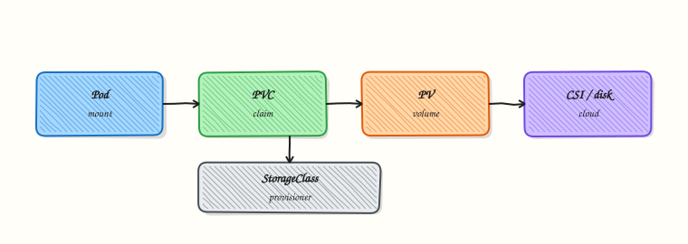

# Persistent Volumes and Storage

## Overview


Claim storage with a PVC against a StorageClass, mount it in a Pod, and explain PV vs PVC vs CSI.

**PVC** is the app’s request; **PV** is the provisioned volume; **StorageClass** selects a provisioner (CSI). Dynamic provisioning creates PVs automatically on most clouds and kind (local-path / rancher).

This is a core tutorial in **Module 7 · Storage** of the REBASH Academy **Kubernetes for Cloud & DevOps Engineers** series — written for Cloud, DevOps, Platform, and SRE engineers.

## Prerequisites


- [Ingress and External Access](ingress-and-external-access.md)

## Learning Objectives


By the end of this tutorial, you will be able to:

- [ ] Create PVC + Pod mount  
- [ ] List StorageClasses  
- [ ] Contrast access modes (RWO/RWX)  
- [ ] Outline CSI role

## Architecture


This topic’s control points and relationships are shown below.



## Theory


### What it is

Kubernetes storage separates **what the app asks for** from **what the cluster provides**. A **PersistentVolumeClaim (PVC)** is the app’s request (size, access mode). A **PersistentVolume (PV)** is the actual volume. A **StorageClass** names a provisioner — usually a **CSI** (Container Storage Interface) driver — so PVs can be created dynamically. Ephemeral **Volumes** (emptyDir, config/secret mounts) die with the Pod; PVCs outlive Pods when configured to.

### Why it matters

Databases, queues, and ML artefacts need data that survives Pod restarts and reschedules. Cloud disks, NFS, and local path provisioners all plug in through the same PV/PVC model. Understanding access modes and reclaim policy prevents “volume already attached” and accidental data loss during delete.

### How it works (mental model)

1. Admin (or platform) installs CSI drivers and defines StorageClasses.
2. User creates a PVC referencing a StorageClass (or the default).
3. The provisioner creates a PV and binds it to the PVC.
4. A Pod mounts the PVC; kubelet attaches/mounts via CSI.
5. On Pod delete, the PVC/PV remain unless reclaim policy and delete workflows remove them.

**StatefulSets** often use `volumeClaimTemplates` so each ordinal gets its own PVC.

### Key concepts / comparisons

| Object | Role |
|--------|------|
| Volume (Pod field) | Mount into containers |
| PVC | Claim for durable storage |
| PV | Provisioned volume |
| StorageClass | Provisioner + parameters |
| CSI | Standard driver interface |

| Access mode | Meaning |
|-------------|---------|
| ReadWriteOnce (RWO) | One node writer (typical disks) |
| ReadOnlyMany (ROX) | Many nodes read-only |
| ReadWriteMany (RWX) | Many nodes read-write (NFS-like) |

### Common pitfalls

- Pending PVC because no default StorageClass or provisioner is broken.
- Scheduling Pods with RWO volumes onto different nodes after a move — attach conflicts.
- Deleting PVCs in production without backups; reclaim policy `Delete` destroys the backend.
- Using emptyDir for data you thought was persistent.
- Assuming every cluster has RWX — many cloud disks are RWO only.

## Hands-on Lab

### Objective

Provision a PVC, mount it in a Pod, write data, delete the Pod, recreate it, and prove the file persists on the same volume.

### Prerequisites

- A working Kubernetes cluster (**kind**, **minikube**, or any lab cluster)
- A default **StorageClass** (kind and minikube provide one) or permission to use `standard`
- **kubectl** with namespace-create rights
- Writable workspace at `~/rebash-k8s/module-07`

### Lab environment

Workspace: `~/rebash-k8s/module-07`

```bash title="Terminal"
mkdir -p ~/rebash-k8s/module-07 && cd ~/rebash-k8s/module-07
kubectl get storageclass | tee storageclasses.txt
```

### Real-world scenario

A stateful demo app stores upload metadata on disk. You must prove that deleting the Pod does not delete user data when the PVC remains— the same guarantee teams expect before running databases on Kubernetes.

### Step-by-step tasks

#### Task 1 – Namespace, PVC, and writer Pod

Create `namespace.yaml`:

```yaml title="namespace.yaml"
apiVersion: v1
kind: Namespace
metadata:
  name: rebash-m07
```

Create `pvc.yaml`:

```yaml title="pvc.yaml"
apiVersion: v1
kind: PersistentVolumeClaim
metadata:
  name: data
  namespace: rebash-m07
spec:
  accessModes:
    - ReadWriteOnce
  resources:
    requests:
      storage: 1Gi
```

Create `writer-pod.yaml`:

```yaml title="writer-pod.yaml"
apiVersion: v1
kind: Pod
metadata:
  name: writer
  namespace: rebash-m07
spec:
  containers:
    - name: busybox
      image: busybox:1.36
      command: ["sh", "-c", "echo rebash-persist-$(date +%s) > /data/persist.txt && cat /data/persist.txt && sleep 3600"]
      volumeMounts:
        - name: data
          mountPath: /data
  volumes:
    - name: data
      persistentVolumeClaim:
        claimName: data
```

Apply and write:

```bash title="Terminal"
cd ~/rebash-k8s/module-07
kubectl apply -f namespace.yaml
kubectl apply -f pvc.yaml
kubectl wait --for=jsonpath='{.status.phase}'=Bound pvc/data -n rebash-m07 --timeout=120s
kubectl apply -f writer-pod.yaml
kubectl wait --for=condition=Ready pod/writer -n rebash-m07 --timeout=120s
kubectl logs writer -n rebash-m07 | tee write-log.txt
grep rebash-persist write-log.txt | tee persist-token.txt
```

!!! example "Expected output"
    PVC Bound; log line contains `rebash-persist-<timestamp>`.


#### Task 2 – Delete Pod and recreate reader

Create `reader-pod.yaml`:

```yaml title="reader-pod.yaml"
apiVersion: v1
kind: Pod
metadata:
  name: reader
  namespace: rebash-m07
spec:
  containers:
    - name: busybox
      image: busybox:1.36
      command: ["sh", "-c", "cat /data/persist.txt && sleep 3600"]
      volumeMounts:
        - name: data
          mountPath: /data
  volumes:
    - name: data
      persistentVolumeClaim:
        claimName: data
```

Recreate and verify same file:

```bash title="Terminal"
cd ~/rebash-k8s/module-07
kubectl delete pod writer -n rebash-m07 --wait=true
kubectl apply -f reader-pod.yaml
kubectl wait --for=condition=Ready pod/reader -n rebash-m07 --timeout=120s
kubectl logs reader -n rebash-m07 | tee read-log.txt
TOKEN=$(cat persist-token.txt)
grep -F "$(echo "$TOKEN" | tail -n1)" read-log.txt
```

!!! example "Expected output"
    `read-log.txt` contains the same token written in Task 1.


#### Task 3 – PVC status evidence

```bash title="Terminal"
cd ~/rebash-k8s/module-07
kubectl get pvc data -n rebash-m07 | tee pvc-bound.txt
kubectl describe pvc data -n rebash-m07 | sed -n '/Status:/,/Events:/p' | tee pvc-describe.txt
grep Bound pvc-bound.txt
```

!!! example "Expected output"
    PVC remains Bound with same volume after Pod replacement.


### Validation steps

- [ ] PVC reached Bound before Pod schedule
- [ ] Data written in first Pod readable after Pod delete/recreate
- [ ] PVC still Bound at end of lab
- [ ] StorageClass used matches cluster default (see `storageclasses.txt`)

### Common errors and fixes

| Error | Cause | Fix |
|-------|-------|-----|
| PVC Pending | No StorageClass/provisioner | `kubectl get sc`; install default on kind |
| Pod Pending volume | PVC not Bound | Wait for Bound; describe PVC Events |
| Multi-attach error | RWO on another node | Delete old Pod fully before reader |
| Empty read-log | Wrong mount path | Confirm `claimName: data` and `/data` |

### Challenge exercise

Add `storageClassName: standard` explicitly to `pvc.yaml` (match your cluster’s default from `storageclasses.txt`) and document reclaim policy behaviour in a comment at the top of the file.

### Learning outcomes

- Requested storage with a PersistentVolumeClaim
- Mounted PVCs in Pod specs
- Proved data survives Pod lifecycle when PVC is retained

### Cleanup

```bash title="Terminal"
kubectl delete namespace rebash-m07 --ignore-not-found --wait=true
```

## Validation


- [ ] Lab commands run under `~/rebash-k8s/module-07/`
- [ ] You can explain each Theory section in your own words
- [ ] You used modern tooling where it applies to this topic
- [ ] You can describe one production failure mode for this topic

## Code Walkthrough


Production practice for **Persistent Volumes and Storage** always combines:

1. Inspect before you change (status, plan, logs, dry-run)
2. Prefer reversible, documented changes (Git, IaC, drop-ins, version pins)
3. Capture evidence (command output, pipeline logs) for handovers
4. Prefer current tools and APIs over legacy shortcuts
5. Least privilege — escalate credentials only when required

Keep runbooks short enough to follow under pressure. Automate checks; keep humans for judgement.

## Security Considerations


- Treat credentials and tokens for kubernetes as privileged — never commit them
- Prefer short-lived auth (OIDC, roles, SSO) over long-lived keys
- Validate blast radius before apply/deploy/delete operations
- Restrict who can approve production changes
- Collect audit logs; limit who can read sensitive traces

## Common Mistakes


!!! warning "Pending PVC because no default StorageClass or provisioner is broken."
    Validate assumptions against the Theory section and official docs before changing production.

!!! warning "Scheduling Pods with RWO volumes onto different nodes after a move — attach conflicts."
    Lab shortcuts (open security groups, admin roles, skip approvals) must not ship unchanged.

!!! warning "Changing production without a rollback path"
    Always know how to revert (previous artefact, prior release, state rollback, DNS failback).

## Best Practices


- Encode Persistent Volumes and Storage changes as code and review them in pull requests
- Pin versions (images, modules, actions, provider plugins)
- Separate environments with clear promotion gates
- Alert on symptoms with runbooks attached
- Destroy lab resources; tag everything with owner and expiry where possible

## Troubleshooting


| Symptom | Likely cause | Fix |
|---------|--------------|-----|
| Auth / permission denied | Wrong identity, policy, or scope | Check caller identity, roles, and least-privilege policies |
| Timeout / no route | Network, DNS, security group, or endpoint | Trace path, DNS, and allow-lists before retrying |
| Drift / unexpected plan | Manual change or wrong state/workspace | Reconcile desired vs actual; avoid click-ops on managed resources |
| Pipeline/job red | Flaky step, cache, or missing secret | Read failing step logs; bisect recent workflow/config changes |
| Cost spike | Idle load balancer, NAT, oversized compute | Inventory billable resources; stop/delete labs promptly |

## Summary


**Persistent Volumes and Storage** is essential for Cloud and DevOps engineers working with kubernetes. Practise the lab until the inspection and change path is muscle memory, then continue the track.

## Interview Questions


1. What is the relationship between PersistentVolume, PersistentVolumeClaim, and StorageClass?
2. What does the Bound phase on a PVC mean?
3. What is the difference between ReadWriteOnce and ReadWriteMany?
4. What data-loss risks exist when deleting PVCs, and how do reclaim policies affect them?
5. Why are StatefulSets often paired with volumeClaimTemplates?

!!! tip "Sample answer — question 2"
    Bound means a PV has been allocated to the claim and is ready to mount. Until Bound, Pods needing the volume may stay Pending.

!!! tip "Sample answer — question 4"
    Deleting a PVC can delete underlying storage depending on reclaim policy (Delete vs Retain). Snapshot and backup strategies matter before destructive cleanup in production.

## Related Tutorials


- [Course overview](index.md)
- [ConfigMaps and Secrets](configmaps-and-secrets.md)

## References


- [Persistent Volumes](https://kubernetes.io/docs/concepts/storage/persistent-volumes/)
