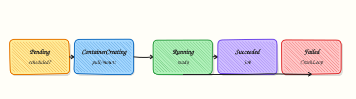

# Pods — The Atomic Unit

## Overview


Deploy a Pod with resource requests, understand lifecycle phases, and know why bare Pods are rare in production.

A **Pod** is one or more containers sharing network/storage namespaces. Controllers (Deployments) recreate Pods; bare Pods do not self-heal on node loss.

This is a core tutorial in **Module 3 · Kubernetes Objects** of the REBASH Academy **Kubernetes for Cloud & DevOps Engineers** series — written for Cloud, DevOps, Platform, and SRE engineers.

## Prerequisites


- [kubectl Essentials](kubectl-essentials-and-workflows.md)

## Learning Objectives


By the end of this tutorial, you will be able to:

- [ ] Write a Pod manifest  
- [ ] Explain Pending → Running → Succeeded/Failed  
- [ ] Set requests/limits  
- [ ] Prefer Deployments for apps

## Architecture


This topic’s control points and relationships are shown below.



## Theory


### What it is

A **Pod** is the smallest deployable object in Kubernetes: one or more containers that share a network namespace (same Pod IP and `localhost`) and optional shared volumes. Containers inside a Pod are co-scheduled onto the same node. Applications almost always run as a single main container plus optional sidecars (proxy, log shipper).

### Why it matters

Everything else — Deployments, Services, Jobs — ultimately creates or selects Pods. If you misunderstand Pod lifecycle, resource requests, or why bare Pods are fragile, later modules feel like magic. Production systems rarely create Pods by hand; controllers own them so lost nodes and crashed containers recover automatically.

### How it works (mental model)

1. A Pod object appears in the API (created by you or a controller).
2. While **Pending**, the scheduler finds a node that fits resources and constraints; kubelet pulls images.
3. Containers start → Pod becomes **Running** (if at least the required containers are up).
4. On success for batch work → **Succeeded**; on unrecoverable failure → **Failed**; communication loss → **Unknown**.
5. When a controller-owned Pod dies, the controller creates a replacement. A bare Pod deleted with its node is gone.

Resource **requests** influence scheduling; **limits** cap usage. Probes (liveness, readiness, startup) are covered in related depth — set readiness before Services send traffic.

### Key concepts / comparisons

| Phase | Meaning |
|-------|---------|
| Pending | Accepted, not yet fully running (schedule/pull) |
| Running | Bound to a node; containers active |
| Succeeded / Failed | Terminal for run-to-completion Pods |
| Unknown | Node status unclear |

| Approach | Use |
|----------|-----|
| Bare Pod | Labs, one-off debug |
| Deployment-owned Pod | Stateless apps (default) |
| Multi-container Pod | Tightly coupled sidecars |

### Common pitfalls

- Running production apps as bare Pods — no replica repair on node failure.
- Omitting CPU/memory requests — noisy neighbours and surprise Pending states.
- Assuming containers in different Pods share `localhost` — they do not; use Services.
- Putting tightly coupled processes in separate Pods when they need shared volumes or localhost.
- Ignoring `describe` Events when stuck in Pending (image pull, taints, PVC).

## Hands-on Lab

### Objective

Create a Pod from YAML with labels and resource requests, prove it reaches Ready, exec into it, delete it, and observe `restartPolicy: Never` behaviour on failure.

### Prerequisites

- A working Kubernetes cluster (**kind**, **minikube**, or any lab cluster)
- **kubectl** with namespace-create rights
- Writable workspace at `~/rebash-k8s/module-03`

### Lab environment

Workspace: `~/rebash-k8s/module-03`

```bash title="Terminal"
mkdir -p ~/rebash-k8s/module-03 && cd ~/rebash-k8s/module-03
```

### Real-world scenario

You debug a one-off batch container before the team wraps it in a Deployment. You run a single Pod manifest, confirm nginx responds, capture evidence, then test what happens when a Pod is deleted versus when it exits with `restartPolicy: Never`.

### Step-by-step tasks

#### Task 1 – Create and apply a labelled Pod

Create `namespace.yaml`:

```yaml title="namespace.yaml"
apiVersion: v1
kind: Namespace
metadata:
  name: rebash-m03
```

Create `pod.yaml`:

```yaml title="pod.yaml"
apiVersion: v1
kind: Pod
metadata:
  name: web
  namespace: rebash-m03
  labels:
    app: web
    tier: frontend
    lab: module-03
spec:
  restartPolicy: Always
  containers:
    - name: nginx
      image: nginx:1.27-alpine
      ports:
        - containerPort: 80
      resources:
        requests:
          cpu: 50m
          memory: 64Mi
        limits:
          cpu: 200m
          memory: 128Mi
```

Apply and verify:

```bash title="Terminal"
cd ~/rebash-k8s/module-03
kubectl apply -f namespace.yaml
kubectl apply -f pod.yaml
kubectl wait --for=condition=Ready pod/web -n rebash-m03 --timeout=120s
kubectl get pod web -n rebash-m03 -o wide | tee pod-ready.txt
grep -q '1/1' pod-ready.txt
```

!!! example "Expected output"
    Pod `web` shows `1/1 Running` with a node assignment.


#### Task 2 – Exec and capture evidence

```bash title="Terminal"
cd ~/rebash-k8s/module-03
kubectl exec -n rebash-m03 web -- wget -qO- http://127.0.0.1/ | head -n 5 | tee exec-html.txt
kubectl describe pod web -n rebash-m03 | sed -n '/Labels:/,/Conditions:/p' | tee pod-labels.txt
grep tier pod-labels.txt
```

!!! example "Expected output"
    HTML from nginx in `exec-html.txt`; labels include `tier=frontend`.


#### Task 3 – Delete Pod and test restartPolicy Never

Create `fail-pod.yaml`:

```yaml title="fail-pod.yaml"
apiVersion: v1
kind: Pod
metadata:
  name: fail-once
  namespace: rebash-m03
  labels:
    app: fail-once
spec:
  restartPolicy: Never
  containers:
    - name: busybox
      image: busybox:1.36
      command: ["sh", "-c", "echo failing; exit 1"]
```

Apply, wait for terminal phase, and record:

```bash title="Terminal"
cd ~/rebash-k8s/module-03
kubectl delete pod web -n rebash-m03 --wait=true
kubectl apply -f fail-pod.yaml
sleep 5
kubectl get pod fail-once -n rebash-m03 -o wide | tee fail-pod-status.txt
grep -E 'Failed|Error|Completed' fail-pod-status.txt
kubectl delete pod fail-once -n rebash-m03 --ignore-not-found
```

!!! example "Expected output"
    `web` removed; `fail-once` reaches `Failed`/`Error` and does not restart because `restartPolicy` is `Never`.


### Validation steps

- [ ] Pod `web` reached Ready with resource requests set
- [ ] Exec returned nginx HTML
- [ ] Deleted Pod `web` does not respawn (no controller)
- [ ] `fail-once` exited and stayed terminal with `restartPolicy: Never`

### Common errors and fixes

| Error | Cause | Fix |
|-------|-------|-----|
| ImagePullBackOff | Wrong tag or registry auth | Confirm `nginx:1.27-alpine` pulls on your cluster |
| Pending Pod | Insufficient CPU/memory on node | Lower requests or add cluster capacity |
| Pod recreates after delete | Deployment owns it | This lab uses bare Pods only |
| fail-once keeps Running | Still starting | Wait; `kubectl describe pod fail-once -n rebash-m03` |

### Challenge exercise

Create `sidecar-pod.yaml` with two containers sharing the Pod network (nginx + busybox sleep sidecar). Prove localhost reachability from the sidecar with `kubectl exec -c <name>`.

### Learning outcomes

- Declared a Pod with labels and resource requests
- Inspected and exec'd into a running container
- Observed delete behaviour without a controller
- Contrasted `restartPolicy: Always` vs `Never`

### Cleanup

```bash title="Terminal"
kubectl delete namespace rebash-m03 --ignore-not-found --wait=true
```

## Validation


- [ ] Lab commands run under `~/rebash-k8s/module-03/`
- [ ] You can explain each Theory section in your own words
- [ ] You used modern tooling where it applies to this topic
- [ ] You can describe one production failure mode for this topic

## Code Walkthrough


Production practice for **Pods — The Atomic Unit** always combines:

1. Inspect before you change (status, plan, logs, dry-run)
2. Prefer reversible, documented changes (Git, IaC, drop-ins, version pins)
3. Capture evidence (command output, pipeline logs) for handovers
4. Prefer current tools and APIs over legacy shortcuts
5. Least privilege — escalate credentials only when required

Keep runbooks short enough to follow under pressure. Automate checks; keep humans for judgement.

## Security Considerations


- Treat credentials and tokens for kubernetes as privileged — never commit them
- Prefer short-lived auth (OIDC, roles, SSO) over long-lived keys
- Validate blast radius before apply/deploy/delete operations
- Restrict who can approve production changes
- Collect audit logs; limit who can read sensitive traces

## Common Mistakes


!!! warning "Running production apps as bare Pods — no replica repair on node failure."
    Validate assumptions against the Theory section and official docs before changing production.

!!! warning "Omitting CPU/memory requests — noisy neighbours and surprise Pending states."
    Lab shortcuts (open security groups, admin roles, skip approvals) must not ship unchanged.

!!! warning "Changing production without a rollback path"
    Always know how to revert (previous artefact, prior release, state rollback, DNS failback).

## Best Practices


- Encode Pods — The Atomic Unit changes as code and review them in pull requests
- Pin versions (images, modules, actions, provider plugins)
- Separate environments with clear promotion gates
- Alert on symptoms with runbooks attached
- Destroy lab resources; tag everything with owner and expiry where possible

## Troubleshooting


| Symptom | Likely cause | Fix |
|---------|--------------|-----|
| Auth / permission denied | Wrong identity, policy, or scope | Check caller identity, roles, and least-privilege policies |
| Timeout / no route | Network, DNS, security group, or endpoint | Trace path, DNS, and allow-lists before retrying |
| Drift / unexpected plan | Manual change or wrong state/workspace | Reconcile desired vs actual; avoid click-ops on managed resources |
| Pipeline/job red | Flaky step, cache, or missing secret | Read failing step logs; bisect recent workflow/config changes |
| Cost spike | Idle load balancer, NAT, oversized compute | Inventory billable resources; stop/delete labs promptly |

## Summary


**Pods — The Atomic Unit** is essential for Cloud and DevOps engineers working with kubernetes. Practise the lab until the inspection and change path is muscle memory, then continue the track.

## Interview Questions


1. Why can containers in a Pod share localhost and volumes?
2. When should you use multiple containers in one Pod versus separate Pods?
3. What happens to a Pod IP when the Pod is recreated?
4. What security implication follows from containers sharing a network namespace?
5. What is an init container used for?

!!! tip "Sample answer — question 2"
    Sidecars suit tightly coupled helpers (proxy, log shipper) that must share lifecycle and network. Independent scaling or failure domains belong in separate Pods behind Services.

!!! tip "Sample answer — question 4"
    Shared network namespaces mean any container can bind ports and talk over localhost; a compromised sidecar can reach the app. Keep images minimal and apply strict securityContext settings.

## Related Tutorials


- [Course overview](index.md)
- [Labels, Selectors, and Namespaces](kubernetes-objects-labels-and-namespaces.md)

## References


- [Pods](https://kubernetes.io/docs/concepts/workloads/pods/)
