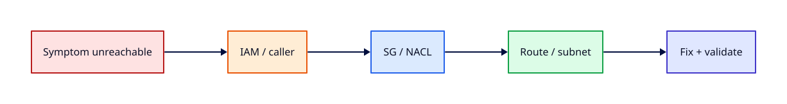

# Lab — AWS IAM and VPC Reachability Triage

## Lab Overview

**Purpose:** Combine Module 1–2 AWS skills — IAM identity, CLI profiles, VPC routing, and security groups — in one reachability triage exercise.

**Scenario:** A small web app on EC2 in a public subnet is reported unreachable. You must prove whether the failure is **identity/permissions** or **network path** before you change anything in production.

**Expected outcome:** `curl` to the instance public address returns HTTP 200; you can explain each injected fault with `aws sts get-caller-identity`, `describe-security-groups`, and `describe-route-tables` evidence.

!!! tip "This is a lab, not a tutorial"
    Prefer AWS CLI evidence over console clicks. Document what broke, how you distinguished IAM from network, and how you validated recovery.

## Business Scenario

The platform team deployed **rebash-status** — a lightweight JSON health page on a single **t2.micro** in a lab VPC. After a Friday change window, monitoring reports the endpoint down. The EC2 instance shows **running** in the console, but operators using a restricted IAM user cannot describe resources, and external `curl` times out. Your job is to stand up the baseline stack, inject IAM and VPC faults that mimic real incidents, triage with CLI evidence, restore reachability, and destroy every resource.

## Learning Objectives

By the end of this lab, you will be able to:

- [ ] Confirm caller identity with `aws sts get-caller-identity` and recognise `AccessDenied` vs network symptoms
- [ ] Build a minimal public-subnet EC2 web endpoint with correct IGW routing and security groups
- [ ] Triage ingress blocks with `aws ec2 describe-security-groups`
- [ ] Triage missing internet paths with `aws ec2 describe-route-tables`
- [ ] Distinguish IAM permission errors from SG, route, and subnet misconfiguration
- [ ] Inject faults, fix them in order, validate with `curl`, and complete cleanup

## Prerequisites

### Knowledge

- [Introduction to AWS and Global Infrastructure](../aws/introduction-to-aws-and-global-infrastructure.md) *(Module 1, Tutorial 1)*
- [Accounts, Free Tier, Billing, and Cost Hygiene](../aws/accounts-free-tier-billing-and-cost-hygiene.md) *(Module 1, Tutorial 2)*
- [IAM Fundamentals](../aws/iam-fundamentals.md) *(Module 1, Tutorial 3)*
- [AWS CLI, Credentials, and Profiles](../aws/aws-cli-credentials-and-profiles.md) *(Module 1, Tutorial 4)*
- [VPC, Subnets, and Multi-AZ Design](../aws/vpc-subnets-and-multi-az-design.md) *(Module 2, Tutorial 5)*
- [Internet Gateways, Routes, and Egress](../aws/internet-gateways-routes-and-egress.md) *(Module 2, Tutorial 6)*
- [Security Groups and NACLs](../aws/security-groups-and-nacls.md) *(Module 2, Tutorial 7)*

### Software

| Tool | Notes |
|------|--------|
| AWS account (Free Tier preferred) | Billing alarm recommended before launch |
| AWS CLI v2 | `aws --version` ≥ 2.x |
| `curl` | End-to-end HTTP validation |
| `jq` (optional) | Parse JSON CLI output |
| LocalStack (optional) | IAM/CLI identity checks only — see notes below |

**Estimated cost:** £0–£2 if you destroy resources within the session. Avoid NAT Gateways.

!!! warning "Cost and cleanup"
    Terminate the EC2 instance and delete the VPC stack at the end. Idle public IPv4 addresses and forgotten instances are common Free Tier surprises.

!!! note "LocalStack alternative"
    For **Task 2** (IAM identity) you may run LocalStack and point a profile at `http://localhost:4566` to practise `sts get-caller-identity` and simulated `AccessDenied`. VPC reachability tasks require a real AWS account (or LocalStack Pro with full EC2 networking — not assumed here).

## Architecture



## Environment

Use a dedicated lab AWS account or a sandbox OU. Set a consistent prefix:

```bash
export LAB_PREFIX="rebash-iam-vpc-$(whoami | tr '[:upper:]' '[:lower:]' | tr -cd 'a-z0-9-' | cut -c1-12)"
export AWS_REGION="${AWS_REGION:-eu-west-2}"
export AWS_PAGER=""
```

Do **not** run destructive steps against shared production VPCs.

## Initial State

You will create a working web endpoint, then inject faults in sequence:

1. Restricted IAM profile that cannot call `ec2:Describe*`
2. Security group missing HTTP ingress on port 80
3. Route table missing `0.0.0.0/0` → Internet Gateway

Your job is to prove each layer with CLI evidence before fixing it.

## Lab Tasks

### Task 1 — Confirm identity and region

**Objective:** Establish who the CLI is acting as before you trust any `describe-*` output.

**Background:** Many “AWS is broken” tickets are wrong profile, expired SSO, or missing IAM permissions — not VPC faults.

**Instructions:**

```bash
aws sts get-caller-identity --output table
aws configure get region
echo "LAB_PREFIX=$LAB_PREFIX AWS_REGION=$AWS_REGION"
```

**Expected output:**

- Account ID, ARN, and UserId displayed
- Region matches your intended lab region (e.g. `eu-west-2`)

**Validation:**

```bash
aws sts get-caller-identity --query 'Arn' --output text | grep -q 'arn:aws' && echo "identity OK"
```

### Task 2 — Create baseline VPC networking

**Objective:** Materialise a public subnet with internet egress and a security group that allows HTTP from your IP.

**Instructions:**

```bash
MY_IP="$(curl -s https://checkip.amazonaws.com)"
VPC_ID="$(aws ec2 create-vpc --cidr-block 10.42.0.0/16 \
  --tag-specifications "ResourceType=vpc,Tags=[{Key=Name,Value=${LAB_PREFIX}-vpc}]" \
  --query Vpc.VpcId --output text)"
aws ec2 modify-vpc-attribute --vpc-id "$VPC_ID" --enable-dns-hostnames

IGW_ID="$(aws ec2 create-internet-gateway \
  --tag-specifications "ResourceType=internet-gateway,Tags=[{Key=Name,Value=${LAB_PREFIX}-igw}]" \
  --query InternetGateway.InternetGatewayId --output text)"
aws ec2 attach-internet-gateway --internet-gateway-id "$IGW_ID" --vpc-id "$VPC_ID"

AZ="$(aws ec2 describe-availability-zones --query 'AvailabilityZones[0].ZoneName' --output text)"
SUBNET_ID="$(aws ec2 create-subnet --vpc-id "$VPC_ID" --cidr-block 10.42.1.0/24 --availability-zone "$AZ" \
  --tag-specifications "ResourceType=subnet,Tags=[{Key=Name,Value=${LAB_PREFIX}-public}]" \
  --query Subnet.SubnetId --output text)"
aws ec2 modify-subnet-attribute --subnet-id "$SUBNET_ID" --map-public-ip-on-launch

RTB_ID="$(aws ec2 describe-route-tables --filters "Name=vpc-id,Values=$VPC_ID" \
  --query 'RouteTables[0].RouteTableId' --output text)"
aws ec2 create-route --route-table-id "$RTB_ID" --destination-cidr-block 0.0.0.0/0 \
  --gateway-id "$IGW_ID"
aws ec2 associate-route-table --route-table-id "$RTB_ID" --subnet-id "$SUBNET_ID"

SG_ID="$(aws ec2 create-security-group --group-name "${LAB_PREFIX}-web-sg" \
  --description "Lab web SG" --vpc-id "$VPC_ID" \
  --query GroupId --output text)"
aws ec2 authorize-security-group-ingress --group-id "$SG_ID" --protocol tcp --port 80 \
  --cidr "${MY_IP}/32"
aws ec2 authorize-security-group-ingress --group-id "$SG_ID" --protocol tcp --port 443 \
  --cidr "${MY_IP}/32"

echo "VPC_ID=$VPC_ID SUBNET_ID=$SUBNET_ID SG_ID=$SG_ID RTB_ID=$RTB_ID" | tee ~/rebash-lab-iam-vpc.env
```

**Expected output:** Resource IDs printed; no CLI errors.

**Validation:**

```bash
source ~/rebash-lab-iam-vpc.env
aws ec2 describe-route-tables --route-table-ids "$RTB_ID" \
  --query 'RouteTables[0].Routes[?DestinationCidrBlock==`0.0.0.0/0`].GatewayId' --output text | grep -q "$IGW_ID" && echo "default route OK"
```

### Task 3 — Launch EC2 with user data web server

**Objective:** Run a known-good HTTP health endpoint on port 80.

**Instructions:**

```bash
source ~/rebash-lab-iam-vpc.env

AMI_ID="$(aws ssm get-parameters --names /aws/service/ami-amazon-linux-latest/al2023-ami-kernel-default-x86_64 \
  --query 'Parameters[0].Value' --output text)"

INSTANCE_ID="$(aws ec2 run-instances \
  --image-id "$AMI_ID" \
  --instance-type t2.micro \
  --subnet-id "$SUBNET_ID" \
  --security-group-ids "$SG_ID" \
  --associate-public-ip-address \
  --tag-specifications "ResourceType=instance,Tags=[{Key=Name,Value=${LAB_PREFIX}-web}]" \
  --user-data file://<(cat <<'USERDATA'
#!/bin/bash
dnf -y install nginx
cat >/usr/share/nginx/html/index.html <<'HTML'
{"service":"rebash-status","ok":true}
HTML
systemctl enable --now nginx
USERDATA
) \
  --query 'Instances[0].InstanceId' --output text)"

aws ec2 wait instance-running --instance-ids "$INSTANCE_ID"
PUBLIC_IP="$(aws ec2 describe-instances --instance-ids "$INSTANCE_ID" \
  --query 'Reservations[0].Instances[0].PublicIpAddress' --output text)"
echo "INSTANCE_ID=$INSTANCE_ID PUBLIC_IP=$PUBLIC_IP" | tee -a ~/rebash-lab-iam-vpc.env

sleep 30
curl -sS -o /dev/null -w "HTTP %{http_code}\n" "http://${PUBLIC_IP}/"
```

**Expected output:** `HTTP 200`

**Validation:** Response body contains `"ok":true`.

### Task 4 — Inject IAM fault (restricted caller)

**Objective:** Experience `AccessDenied` that looks like “AWS is down” when the network is fine.

**Background:** Read-only operators, CI roles, and break-glass profiles often lack `ec2:DescribeInstances`. That is not a reachability failure.

**Instructions:**

Create a restricted IAM user in the console (or via CLI) with **no** EC2 describe permissions — for example attach only `AWSSupportAccess` or a custom deny. Configure a second profile:

```bash
# Example profile name — adjust to your setup
export AWS_PROFILE=lab-restricted
aws sts get-caller-identity --output table

aws ec2 describe-instances --instance-ids "$INSTANCE_ID" 2>&1 | tee /tmp/rebash-iam-deny.log || true
grep -i 'AccessDenied\|UnauthorizedOperation' /tmp/rebash-iam-deny.log && echo "IAM fault reproduced"
```

**Expected output:** `AccessDenied` or `UnauthorizedOperation` — **not** a timeout.

**Validation:** Write one line: “Symptom is IAM denial; instance may still be reachable.”

!!! note "LocalStack"
    With LocalStack, create a user without `ec2:DescribeInstances` in policy and repeat the deny check against the local endpoint.

### Task 5 — Triage IAM vs network

**Objective:** Prove the app is still up while the restricted profile cannot describe it.

**Instructions:**

```bash
# Switch back to admin / lab profile
unset AWS_PROFILE   # or: export AWS_PROFILE=default

aws sts get-caller-identity --output table
source ~/rebash-lab-iam-vpc.env
curl -sS -o /dev/null -w "HTTP %{http_code}\n" "http://${PUBLIC_IP}/"
aws ec2 describe-instances --instance-ids "$INSTANCE_ID" \
  --query 'Reservations[0].Instances[0].State.Name' --output text
```

**Expected output:** `HTTP 200` and instance state `running`.

**Validation:** You can articulate: restricted profile → CLI deny; admin profile → describe works; curl still 200.

### Task 6 — Inject security group fault

**Objective:** Block HTTP ingress while the instance remains running.

**Instructions:**

```bash
source ~/rebash-lab-iam-vpc.env
aws ec2 revoke-security-group-ingress --group-id "$SG_ID" --protocol tcp --port 80 --cidr "${MY_IP}/32"
sleep 5
curl -sS -o /dev/null -w "HTTP %{http_code}\n" --connect-timeout 5 "http://${PUBLIC_IP}/" || echo "curl failed as expected"
```

**Expected output:** Connection timeout or failed curl — instance still `running`.

### Task 7 — Triage with describe-security-groups

**Objective:** Find missing port 80 ingress in SG rules.

**Instructions:**

```bash
aws ec2 describe-security-groups --group-ids "$SG_ID" \
  --query 'SecurityGroups[0].IpPermissions[?FromPort==`80`]' --output table

aws ec2 describe-instances --instance-ids "$INSTANCE_ID" \
  --query 'Reservations[0].Instances[0].SecurityGroups' --output table
```

**Expected output:** Empty or no rule allowing TCP 80 from your IP.

**Validation:** One-line root cause: “SG missing ingress tcp/80 from operator CIDR.”

### Task 8 — Fix security group and validate

**Objective:** Restore HTTP ingress.

**Instructions:**

```bash
MY_IP="$(curl -s https://checkip.amazonaws.com)"
aws ec2 authorize-security-group-ingress --group-id "$SG_ID" --protocol tcp --port 80 --cidr "${MY_IP}/32"
curl -sS "http://${PUBLIC_IP}/"
```

**Expected output:** JSON body with `"ok":true`.

### Task 9 — Inject route table fault

**Objective:** Remove internet path while SG is correct.

**Instructions:**

```bash
source ~/rebash-lab-iam-vpc.env
aws ec2 delete-route --route-table-id "$RTB_ID" --destination-cidr-block 0.0.0.0/0
sleep 5
curl -sS -o /dev/null -w "HTTP %{http_code}\n" --connect-timeout 5 "http://${PUBLIC_IP}/" || echo "curl failed as expected"
```

**Expected output:** Timeout or connection failure.

### Task 10 — Triage with describe-route-tables

**Objective:** Confirm missing default route to IGW.

**Instructions:**

```bash
aws ec2 describe-route-tables --route-table-ids "$RTB_ID" \
  --query 'RouteTables[0].Routes[*].[DestinationCidrBlock,GatewayId,State]' --output table

aws ec2 describe-internet-gateways --filters "Name=attachment.vpc-id,Values=$VPC_ID" \
  --query 'InternetGateways[0].InternetGatewayId' --output text
```

**Expected output:** No active `0.0.0.0/0` → `igw-…` route.

**Validation:** Root cause sentence mentions route table, not IAM.

### Task 11 — Fix route and final validation

**Objective:** Restore default route and prove end-to-end health.

**Instructions:**

```bash
source ~/rebash-lab-iam-vpc.env
aws ec2 create-route --route-table-id "$RTB_ID" --destination-cidr-block 0.0.0.0/0 \
  --gateway-id "$IGW_ID"
curl -sS -o /dev/null -w "HTTP %{http_code} time_connect %{time_connect}s\n" "http://${PUBLIC_IP}/"
aws ec2 describe-instances --instance-ids "$INSTANCE_ID" \
  --query 'Reservations[0].Instances[0].[State.Name,PublicIpAddress]' --output text
```

**Expected output:** `HTTP 200` with low connect time.

### Task 12 — Cleanup and destroy

**Objective:** Terminate compute and delete lab VPC resources to avoid charges.

**Instructions:**

```bash
source ~/rebash-lab-iam-vpc.env

aws ec2 terminate-instances --instance-ids "$INSTANCE_ID"
aws ec2 wait instance-terminated --instance-ids "$INSTANCE_ID"

aws ec2 delete-security-group --group-id "$SG_ID"
aws ec2 detach-internet-gateway --internet-gateway-id "$IGW_ID" --vpc-id "$VPC_ID"
aws ec2 delete-internet-gateway --internet-gateway-id "$IGW_ID"
aws ec2 delete-subnet --subnet-id "$SUBNET_ID"
aws ec2 delete-vpc --vpc-id "$VPC_ID"

rm -f ~/rebash-lab-iam-vpc.env /tmp/rebash-iam-deny.log
echo "Lab resources destroyed."
```

**Expected output:** No errors; `describe-instances` for terminated ID shows `terminated`.

!!! tip "Stuck dependencies"
    If VPC delete fails, ensure the instance terminated, ENIs released, and no NAT Gateway remains in the VPC.

## Validation

| Check | Pass criteria |
|-------|----------------|
| Identity | `aws sts get-caller-identity` succeeds on admin profile |
| IAM fault | Restricted profile returns `AccessDenied` on `describe-instances` |
| Baseline | curl → HTTP 200 before network faults |
| SG triage | `describe-security-groups` shows missing tcp/80 |
| SG fix | curl → HTTP 200 after re-authorise |
| Route triage | `describe-route-tables` missing `0.0.0.0/0` → IGW |
| Route fix | curl → HTTP 200 after `create-route` |
| Cleanup | Instance terminated; VPC and IGW deleted |

## Troubleshooting

| Symptoms | Causes | Resolution | Verification |
|----------|--------|------------|--------------|
| `AccessDenied` on all EC2 calls | Wrong profile or SCP deny | `aws sts get-caller-identity`; switch profile | Describe succeeds |
| curl timeout, instance running | SG or NACL block | `describe-security-groups`; check NACL | curl 200 |
| curl timeout, SG allows 80 | Missing IGW route or wrong subnet | `describe-route-tables`; confirm public subnet | curl 200 |
| HTTP 000 immediately | Security group or host firewall | Verify ingress CIDR matches **current** public IP | Re-run checkip |
| User data not ready | nginx still installing | Wait 60s; `aws ec2 get-console-output` | curl 200 |
| VPC delete fails | ENI or IGW still attached | Terminate instances; detach IGW | `delete-vpc` succeeds |

## Challenge Extensions

- Add a NACL deny on port 80 and triage with `describe-network-acls`
- Attach a second route table to a private subnet and explain why public IP still fails
- Map the IAM deny story to CloudTrail `AccessDenied` events

## Cleanup

See **Task 12**. Run it on every lab session. Remove the restricted IAM user if you created one solely for this exercise.

## Production Discussion

Production triage separates **who is calling the API** from **whether packets flow**. Restricted operators should get clear RBAC errors, not vague “server down” pages. Network changes go through change control: SG edits, route propagation, and NACL updates each leave CloudTrail and VPC flow log evidence. Prefer SSM Session Manager over opening SSH to the world when you need instance access during incidents.

## Best Practices

- Run `aws sts get-caller-identity` first on every incident bridge
- Capture `describe-security-groups` and `describe-route-tables` before mutating rules
- Scope security group ingress to known CIDRs — avoid `0.0.0.0/0` on admin ports
- Use resource tags (`LAB_PREFIX`) for cost allocation and cleanup sweeps
- Destroy lab VPCs the same day you create them

## Common Mistakes

| Mistake | Why | Fix |
|---------|-----|-----|
| Confusing IAM deny with network down | Different remediation paths | sts + curl in parallel |
| Opening SSH 0.0.0.0/0 “to debug” | Expands blast radius | SSM Session Manager |
| Forgetting IGW on route table | Public subnet without egress | `describe-route-tables` |
| Stale MY_IP in SG | Home IP changed | Refresh checkip before authorise |
| Leaving t2.micro running | Free Tier exhaustion | Task 12 terminate |

## Success Criteria

You built a public EC2 web endpoint, reproduced IAM vs network faults, triaged with `sts`, `describe-security-groups`, and `describe-route-tables`, restored HTTP 200, and destroyed all lab resources.

## Reflection Questions

1. Why does `AccessDenied` on `describe-instances` not prove the instance is unreachable?
2. What is the first CLI command you run when two engineers disagree about “AWS being down”?
3. How would a missing `0.0.0.0/0` route present differently from a security group block?
4. Where would CloudTrail show the SG revoke you applied in Task 6?

## Interview Connection

Tell this story: confirm identity → prove app health with curl → narrow SG → narrow routes → fix → validate. Continue with [AWS Interview Prep](../interview/aws.md).

## Related Tutorials

- [AWS](../aws/index.md)
- [IAM Fundamentals](../aws/iam-fundamentals.md)
- [Security Groups and NACLs](../aws/security-groups-and-nacls.md)
- [Internet Gateways, Routes, and Egress](../aws/internet-gateways-routes-and-egress.md)
- Quiz: [AWS Fundamentals](../quizzes/aws-fundamentals.md)
- Cheat sheet: [AWS](../cheatsheets/aws.md)

## References

1. [AWS STS get-caller-identity](https://docs.aws.amazon.com/cli/latest/reference/sts/get-caller-identity.html)
2. [AWS EC2 describe-security-groups](https://docs.aws.amazon.com/cli/latest/reference/ec2/describe-security-groups.html)
3. [AWS EC2 describe-route-tables](https://docs.aws.amazon.com/cli/latest/reference/ec2/describe-route-tables.html)
4. [AWS Shared Responsibility Model](https://aws.amazon.com/compliance/shared-responsibility-model/)
