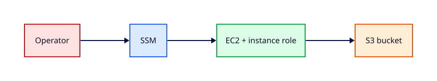

# Lab — Secure EC2 via SSM and S3

## Lab Overview

**Purpose:** Combine EC2, IAM instance profiles, Systems Manager Session Manager, and S3 object access without exposing SSH port 22 to the internet.

**Scenario:** Operations policy forbids public SSH. You must administer a lab instance through SSM, upload an artefact to S3 from the instance using its role, and verify retrieval — then tear everything down.

**Expected outcome:** You connect with `aws ssm start-session`, run `aws s3 cp` from the instance without static keys, and delete the EC2 instance and S3 bucket at the end.

!!! tip "This is a lab, not a tutorial"
    Treat missing SSM registration and Block Public Access denials as first-class faults. Capture CLI evidence before changing IAM or security groups.

## Business Scenario

The security team mandates **no inbound SSH** on application hosts. Engineers use **SSM Session Manager** for shell access and **instance roles** for S3 artefact upload. You are validating the pattern for a CI worker that writes build logs to a private bucket. Stand up the stack, prove put/get from the instance, confirm port 22 is not open publicly, and destroy all resources before end of day.

## Learning Objectives

By the end of this lab, you will be able to:

- [ ] Create an S3 bucket with Block Public Access enabled
- [ ] Attach an EC2 instance profile with `AmazonSSMManagedInstanceCore` and scoped S3 permissions
- [ ] Launch EC2 without a public SSH security group rule
- [ ] Connect via `aws ssm start-session` and run commands on the instance
- [ ] Upload and download objects with `aws s3 cp` using the instance role
- [ ] Terminate the instance and delete the bucket (empty first)

## Prerequisites

### Knowledge

- [IAM, Identity Access, and Organizations](../aws/iam-identity-access-and-organizations.md) *(Module 2)*
- [Compute — EC2, ASG, and Load Balancing](../aws/compute-ec2-asg-and-load-balancing.md) *(Module 4)*
- [Storage — S3, EBS, EFS](../aws/storage-s3-ebs-efs.md) *(Module 5)*
- [Troubleshooting AWS](../aws/troubleshooting-aws.md) *(Module 16)*

### Software

| Tool | Notes |
|------|--------|
| AWS account (Free Tier preferred) | Billing alarm recommended |
| AWS CLI v2 | Session Manager plugin installed |
| Session Manager plugin | [Install guide](https://docs.aws.amazon.com/systems-manager/latest/userguide/session-manager-working-with-install-plugin.html) |
| `curl`, `jq` (optional) | Validation |

**Estimated cost:** £0–£1 if you destroy within the session.

!!! warning "Session Manager plugin"
    `aws ssm start-session` fails with a plugin error if the Session Manager plugin is not installed locally. Install it before Task 6.

## Architecture



## Environment

```bash
export LAB_PREFIX="rebash-ssm-s3-$(whoami | tr '[:upper:]' '[:lower:]' | tr -cd 'a-z0-9-' | cut -c1-12)"
export AWS_REGION="${AWS_REGION:-eu-west-2}"
export AWS_PAGER=""
export BUCKET_NAME="${LAB_PREFIX}-artefacts-$(date +%s)"
```

Use a dedicated sandbox account. Do not attach experimental instance profiles to production roles.

## Initial State

You will create:

1. Private S3 bucket with Block Public Access
2. IAM role + instance profile for EC2 (SSM + S3)
3. EC2 in a VPC with **no** ingress on port 22 from `0.0.0.0/0`
4. SSM-managed shell access and in-instance S3 operations

## Lab Tasks

### Task 1 — Create S3 bucket with Block Public Access

**Objective:** Provision a bucket that rejects public ACLs and policies.

**Instructions:**

```bash
aws s3api create-bucket --bucket "$BUCKET_NAME" \
  --create-bucket-configuration LocationConstraint="$AWS_REGION" 2>/dev/null \
  || aws s3api create-bucket --bucket "$BUCKET_NAME"

aws s3api put-public-access-block --bucket "$BUCKET_NAME" \
  --public-access-block-configuration \
  BlockPublicAcls=true,IgnorePublicAcls=true,BlockPublicPolicy=true,RestrictPublicBuckets=true

aws s3api get-public-access-block --bucket "$BUCKET_NAME" --output table
echo "BUCKET_NAME=$BUCKET_NAME" | tee ~/rebash-lab-ssm-s3.env
```

**Expected output:** All four Block Public Access flags `true`.

**Validation:**

```bash
aws s3api head-bucket --bucket "$BUCKET_NAME" && echo "bucket exists"
```

### Task 2 — Create IAM role and instance profile

**Objective:** Grant the instance SSM connectivity and scoped S3 object access.

**Instructions:**

```bash
TRUST='{
  "Version": "2012-10-17",
  "Statement": [{
    "Effect": "Allow",
    "Principal": {"Service": "ec2.amazonaws.com"},
    "Action": "sts:AssumeRole"
  }]
}'

ROLE_NAME="${LAB_PREFIX}-ec2-role"
aws iam create-role --role-name "$ROLE_NAME" --assume-role-policy-document "$TRUST"
aws iam attach-role-policy --role-name "$ROLE_NAME" \
  --policy-arn arn:aws:iam::aws:policy/AmazonSSMManagedInstanceCore

S3_POLICY="$(cat <<EOF
{
  "Version": "2012-10-17",
  "Statement": [{
    "Effect": "Allow",
    "Action": ["s3:PutObject", "s3:GetObject", "s3:ListBucket"],
    "Resource": [
      "arn:aws:s3:::${BUCKET_NAME}",
      "arn:aws:s3:::${BUCKET_NAME}/*"
    ]
  }]
}
EOF
)"

aws iam put-role-policy --role-name "$ROLE_NAME" --policy-name "${LAB_PREFIX}-s3" \
  --policy-document "$S3_POLICY"

PROFILE_NAME="${LAB_PREFIX}-profile"
aws iam create-instance-profile --instance-profile-name "$PROFILE_NAME"
aws iam add-role-to-instance-profile --instance-profile-name "$PROFILE_NAME" --role-name "$ROLE_NAME"

echo "ROLE_NAME=$ROLE_NAME PROFILE_NAME=$PROFILE_NAME" | tee -a ~/rebash-lab-ssm-s3.env
sleep 10
```

**Expected output:** Role, inline S3 policy, and instance profile created.

### Task 3 — Create VPC and security group (no public SSH)

**Objective:** Network path for SSM without opening TCP 22 to the internet.

**Background:** SSM agent uses outbound HTTPS to AWS endpoints. You do **not** need inbound SSH for administration.

**Instructions:**

```bash
VPC_ID="$(aws ec2 create-vpc --cidr-block 10.50.0.0/16 \
  --tag-specifications "ResourceType=vpc,Tags=[{Key=Name,Value=${LAB_PREFIX}-vpc}]" \
  --query Vpc.VpcId --output text)"
aws ec2 modify-vpc-attribute --vpc-id "$VPC_ID" --enable-dns-hostnames

SUBNET_ID="$(aws ec2 create-subnet --vpc-id "$VPC_ID" --cidr-block 10.50.1.0/24 \
  --availability-zone "$(aws ec2 describe-availability-zones --query 'AvailabilityZones[0].ZoneName' --output text)" \
  --tag-specifications "ResourceType=subnet,Tags=[{Key=Name,Value=${LAB_PREFIX}-subnet}]" \
  --query Subnet.SubnetId --output text)"

SG_ID="$(aws ec2 create-security-group --group-name "${LAB_PREFIX}-no-ssh" \
  --description "No inbound SSH lab SG" --vpc-id "$VPC_ID" \
  --query GroupId --output text)"
# Explicitly no authorize-security-group-ingress for port 22

echo "VPC_ID=$VPC_ID SUBNET_ID=$SUBNET_ID SG_ID=$SG_ID" | tee -a ~/rebash-lab-ssm-s3.env
```

**Expected output:** SG created with **zero** ingress rules.

**Validation:**

```bash
source ~/rebash-lab-ssm-s3.env
aws ec2 describe-security-groups --group-ids "$SG_ID" \
  --query 'SecurityGroups[0].IpPermissions' --output text
# Expect empty
```

### Task 4 — Launch EC2 with instance profile

**Objective:** Start Amazon Linux 2023 with SSM agent and the instance profile attached.

**Instructions:**

```bash
source ~/rebash-lab-ssm-s3.env

AMI_ID="$(aws ssm get-parameters --names /aws/service/ami-amazon-linux-latest/al2023-ami-kernel-default-x86_64 \
  --query 'Parameters[0].Value' --output text)"

INSTANCE_ID="$(aws ec2 run-instances \
  --image-id "$AMI_ID" \
  --instance-type t2.micro \
  --subnet-id "$SUBNET_ID" \
  --security-group-ids "$SG_ID" \
  --iam-instance-profile Name="$PROFILE_NAME" \
  --tag-specifications "ResourceType=instance,Tags=[{Key=Name,Value=${LAB_PREFIX}-worker}]" \
  --query 'Instances[0].InstanceId' --output text)"

aws ec2 wait instance-running --instance-ids "$INSTANCE_ID"
echo "INSTANCE_ID=$INSTANCE_ID" | tee -a ~/rebash-lab-ssm-s3.env
```

**Expected output:** Instance `running`; no public SSH rule added.

### Task 5 — Wait for SSM registration

**Objective:** Confirm the instance appears as a managed node before starting a session.

**Instructions:**

```bash
source ~/rebash-lab-ssm-s3.env

for i in $(seq 1 24); do
  PING="$(aws ssm describe-instance-information \
    --filters "Key=InstanceIds,Values=$INSTANCE_ID" \
    --query 'InstanceInformationList[0].PingStatus' --output text 2>/dev/null || true)"
  echo "attempt $i: PingStatus=$PING"
  [ "$PING" = "Online" ] && break
  sleep 10
done

aws ssm describe-instance-information \
  --filters "Key=InstanceIds,Values=$INSTANCE_ID" --output table
```

**Expected output:** `PingStatus` = `Online`.

!!! note "No SSM Online?"
    Check the instance profile attachment, outbound internet or VPC endpoints for SSM, and that the SSM agent is running (default on AL2023).

### Task 6 — Connect with Session Manager

**Objective:** Open a shell without SSH port 22.

**Instructions:**

```bash
source ~/rebash-lab-ssm-s3.env
aws ssm start-session --target "$INSTANCE_ID"
```

Inside the session:

```bash
whoami
curl -s http://169.254.169.254/latest/meta-data/iam/security-credentials/ | head
exit
```

**Expected output:** Shell on the instance; instance role name visible via IMDS path.

**Validation:** Document that you never opened port 22 in the security group.

### Task 7 — S3 put and get from the instance

**Objective:** Use the instance role for object storage — no access keys on disk.

**Instructions:**

Run a non-interactive command via SSM:

```bash
source ~/rebash-lab-ssm-s3.env

aws ssm send-command \
  --instance-ids "$INSTANCE_ID" \
  --document-name AWS-RunShellScript \
  --parameters commands="[
    \"echo '{\\\"lab\\\":\\\"rebash-ssm-s3\\\",\\\"ok\\\":true}' > /tmp/artefact.json\",
    \"aws s3 cp /tmp/artefact.json s3://${BUCKET_NAME}/runs/artefact.json\",
    \"aws s3 cp s3://${BUCKET_NAME}/runs/artefact.json -\"
  ]" \
  --query 'Command.CommandId' --output text
```

Wait and fetch output:

```bash
CMD_ID="<paste-command-id>"
sleep 15
aws ssm get-command-invocation --command-id "$CMD_ID" --instance-id "$INSTANCE_ID" \
  --query '[Status, StandardOutputContent, StandardErrorContent]' --output text
```

**Expected output:** Status `Success`; stdout includes `"ok":true`.

**Validation from your workstation:**

```bash
aws s3 cp "s3://${BUCKET_NAME}/runs/artefact.json" -
```

### Task 8 — Prove SSH is not exposed

**Objective:** Confirm security posture — no public SSH listener path.

**Instructions:**

```bash
source ~/rebash-lab-ssm-s3.env
aws ec2 describe-instances --instance-ids "$INSTANCE_ID" \
  --query 'Reservations[0].Instances[0].PublicIpAddress' --output text

aws ec2 describe-security-groups --group-ids "$SG_ID" \
  --query 'SecurityGroups[0].IpPermissions[?FromPort==`22`]' --output text
# Expect empty
```

If a public IP exists, attempt SSH (should fail):

```bash
PUB="$(aws ec2 describe-instances --instance-ids "$INSTANCE_ID" \
  --query 'Reservations[0].Instances[0].PublicIpAddress' --output text)"
[ -n "$PUB" ] && nc -zv -w 3 "$PUB" 22 2>&1 || echo "no public IP or SSH blocked"
```

**Expected output:** No SG rule for port 22; connection refused or timeout if probed.

### Task 9 — Cleanup and destroy

**Objective:** Terminate EC2 and delete the S3 bucket to stop charges.

**Instructions:**

```bash
source ~/rebash-lab-ssm-s3.env

aws ec2 terminate-instances --instance-ids "$INSTANCE_ID"
aws ec2 wait instance-terminated --instance-ids "$INSTANCE_ID"

aws s3 rm "s3://${BUCKET_NAME}" --recursive
aws s3api delete-bucket --bucket "$BUCKET_NAME"

aws ec2 delete-security-group --group-id "$SG_ID"
aws ec2 delete-subnet --subnet-id "$SUBNET_ID"
aws ec2 delete-vpc --vpc-id "$VPC_ID"

aws iam remove-role-from-instance-profile --instance-profile-name "$PROFILE_NAME" --role-name "$ROLE_NAME"
aws iam delete-instance-profile --instance-profile-name "$PROFILE_NAME"
aws iam delete-role-policy --role-name "$ROLE_NAME" --policy-name "${LAB_PREFIX}-s3"
aws iam detach-role-policy --role-name "$ROLE_NAME" \
  --policy-arn arn:aws:iam::aws:policy/AmazonSSMManagedInstanceCore
aws iam delete-role --role-name "$ROLE_NAME"

rm -f ~/rebash-lab-ssm-s3.env
echo "Lab destroyed."
```

**Expected output:** Instance terminated; bucket gone; IAM role removed.

## Validation

| Check | Pass criteria |
|-------|----------------|
| S3 BPA | All four public access blocks enabled |
| No SSH SG | No ingress rule on tcp/22 |
| SSM Online | `describe-instance-information` shows Online |
| Session | `start-session` opens shell |
| S3 put/get | Object visible from workstation and instance |
| IMDS role | Instance uses profile — no static keys in commands |
| Cleanup | EC2 terminated; bucket deleted; IAM role removed |

## Troubleshooting

| Symptoms | Causes | Resolution | Verification |
|----------|--------|------------|--------------|
| SSM never Online | Missing instance profile or no egress | Attach profile; add IGW or SSM VPC endpoints | PingStatus Online |
| `AccessDenied` on s3 cp | Inline policy bucket ARN mismatch | Fix `Resource` ARNs in role policy | put succeeds |
| start-session plugin error | Plugin not installed | Install Session Manager plugin | session opens |
| Bucket delete fails | Objects remain | `aws s3 rm --recursive` | delete-bucket OK |
| IMDS empty role | Profile not attached at launch | Terminate; relaunch with profile | IMDS shows role |

## Challenge Extensions

- Move the instance to a private subnet with S3 gateway endpoint only
- Add SSE-S3 or SSE-KMS on upload
- Restrict the inline policy with `s3:prefix` condition keys

## Cleanup

See **Task 9**. Empty the bucket before deletion. IAM role deletion requires removing the instance profile association first.

## Production Discussion

Production admin access should flow through SSO → IAM → SSM with session logging to S3 or CloudWatch. Instance roles replace long-lived access keys on disk. Block Public Access is a account-level guardrail — still set bucket policies explicitly. Pair this pattern with IMDSv2 required on launch templates.

## Best Practices

- Never attach `0.0.0.0/0` on port 22
- Scope S3 policies to bucket ARN and required prefixes only
- Enable SSM session logging in production accounts
- Use `aws ssm send-command` for auditable non-interactive runs
- Destroy lab buckets the same session you create them

## Common Mistakes

| Mistake | Why | Fix |
|---------|-----|-----|
| Static keys on EC2 | Key rotation burden | Instance profile |
| Skipping BPA | Accidental public exposure | put-public-access-block |
| Public subnet without need | Larger attack surface | Private subnet + endpoints |
| Forgetting plugin | Cannot start-session | Install plugin locally |
| Non-empty bucket delete | Cleanup script fails | rm --recursive first |

## Success Criteria

You created a BPA-protected bucket, launched EC2 without public SSH, connected via SSM, put and got objects with the instance role, and destroyed the instance and bucket.

## Reflection Questions

1. Why does SSM work without inbound security group rules?
2. What does Block Public Access prevent that a private bucket name alone does not?
3. How would you audit who ran commands on the instance?
4. When would you add an S3 VPC gateway endpoint?

## Interview Connection

Explain the no-SSH admin pattern: instance profile, SSM agent outbound, Session Manager audit trail, S3 least privilege. Continue with [AWS Interview Prep](../interview/aws.md).

## Related Tutorials

- [AWS](../aws/index.md)
- [Compute — EC2, ASG, and Load Balancing](../aws/compute-ec2-asg-and-load-balancing.md)
- [Storage — S3, EBS, EFS](../aws/storage-s3-ebs-efs.md)
- Related lab: [AWS IAM and VPC Reachability Triage](aws-iam-vpc-triage.md)
- Quiz: [AWS Fundamentals](../quizzes/aws-fundamentals.md)
- Cheat sheet: [AWS](../cheatsheets/aws.md)

## References

1. [AWS Systems Manager Session Manager](https://docs.aws.amazon.com/systems-manager/latest/userguide/session-manager.html)
2. [IAM Roles for Amazon EC2](https://docs.aws.amazon.com/AWSEC2/latest/UserGuide/iam-roles-for-amazon-ec2.html)
3. [Blocking public access to your Amazon S3 storage](https://docs.aws.amazon.com/AmazonS3/latest/userguide/access-control-block-public-access.html)
