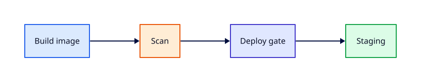

# Lab — Docker Build, Scan, and Deploy Gate

## Lab Overview

**Purpose:** Practise a production-style container pipeline — build, scan, manual promote to staging — using GitLab CI.

**Scenario:** **rebash-status** must ship as a Docker image. Policy requires a scan step before any deploy, and staging promotion is **manual** after review. You will author the pipeline, inject a scan failure, fix it, approve staging, and validate the deploy job.

**Expected outcome:** Image built and tagged with commit SHA; scan gate passes; manual staging job approved and succeeds.

!!! tip "This is a lab, not a tutorial"
    Treat the scan step as a hard gate — do not bypass with `allow_failure: true` unless the exercise explicitly asks for it.

!!! note "Other platforms"
    Jenkins and GitHub Actions come later on REBASH Academy — this lab uses **GitLab CI** only.

## Business Scenario

The platform team containerised a small status API. Security policy mandates image scanning on every merge to `main`. Staging deploys require a human click after scan success. Production is out of scope for this lab — focus on build → scan → manual staging gate.

## Learning Objectives

By the end of this lab, you will be able to:

- [ ] Build and tag a Docker image in GitLab CI with Docker-in-Docker
- [ ] Add a scan job that fails the pipeline on critical findings (or simulated policy)
- [ ] Configure `when: manual` and protected environments for staging
- [ ] Promote the same immutable SHA tag through gates without rebuilding
- [ ] Wire `needs:` so scan waits only for build, not unrelated stages

## Prerequisites

### Knowledge

- [GitLab CI/CD Fundamentals](../gitlab/gitlab-ci-fundamentals.md)
- [Building Docker Images in CI](../gitlab/building-docker-images-in-ci.md)
- [Security Scanning and DevSecOps](../gitlab/security-scanning-and-devsecops.md)
- [Production Pipelines and Environments](../gitlab/production-pipelines-and-environments.md)

### Software

| Tool | Notes |
|------|--------|
| GitLab.com project with CI/CD | Container registry enabled |
| Docker locally (optional) | Build/test Dockerfile before CI |
| Git | 2.x |

**Estimated cost:** £0 on GitLab.com free tier (within included registry/storage limits).

!!! note "Simulated scan option"
    If you cannot run Trivy or GitLab container scanning on your tier, the lab includes a **simulated scan script** that enforces the same gate behaviour (fail on a marker file or base image label).

## Architecture



## Environment

```bash title="Terminal"
export LAB_PREFIX="rebash-docker-gate-$(whoami | tr '[:upper:]' '[:lower:]' | tr -cd 'a-z0-9-' | cut -c1-12)"
mkdir -p ~/rebash-lab-docker-gate && cd ~/rebash-lab-docker-gate
git init -b main
```

## Initial State

You will build a minimal Flask status API, containerise it, and wire a pipeline with:

1. **build** — `docker build` and push `$CI_REGISTRY_IMAGE:$CI_COMMIT_SHA`
2. **scan** — Trivy or simulated scanner; fails on `CRITICAL` or policy marker
3. **deploy-staging** — `when: manual`, `environment: staging`, pulls the **same SHA tag**

## Lab Tasks

### Task 1 — Application and Dockerfile

**Objective:** Create a minimal image suitable for CI build.

**Instructions:**

```bash title="Terminal"
cd ~/rebash-lab-docker-gate

mkdir -p app
cat > app/main.py <<'EOF'
from flask import Flask, jsonify

app = Flask(__name__)

@app.get("/health")
def health():
    return jsonify(service="rebash-status", ok=True)

if __name__ == "__main__":
    app.run(host="0.0.0.0", port=8080)
EOF

cat > requirements.txt <<'EOF'
flask==3.1.0
gunicorn==23.0.0
EOF

cat > Dockerfile <<'EOF'
FROM python:3.12-slim
WORKDIR /app
COPY requirements.txt .
RUN pip install --no-cache-dir -r requirements.txt
COPY app/ ./app/
ENV PYTHONUNBUFFERED=1
EXPOSE 8080
CMD ["gunicorn", "-b", "0.0.0.0:8080", "app.main:app"]
EOF

docker build -t rebash-status:local . 2>/dev/null || echo "Local Docker optional — continue to CI"
```

!!! example "Expected output"
    Dockerfile and app present; optional local build succeeds.


### Task 2 — GitLab CI pipeline with build and scan

**Objective:** Author `.gitlab-ci.yml` with build, scan, and manual staging deploy.

**Instructions:**


```bash title="Terminal"
cat > .gitlab-ci.yml <<'EOF'
stages:
  - build
  - scan
  - deploy

variables:
  IMAGE_TAG: $CI_REGISTRY_IMAGE:$CI_COMMIT_SHA
  DOCKER_TLS_CERTDIR: "/certs"

build-image:
  stage: build
  image: docker:27-cli
  services:
    - docker:27-dind
  before_script:
    - docker login -u "$CI_REGISTRY_USER" -p "$CI_REGISTRY_PASSWORD" "$CI_REGISTRY"
  script:
    - docker build -t "$IMAGE_TAG" .
    - docker push "$IMAGE_TAG"
  rules:
    - if: $CI_COMMIT_BRANCH == $CI_DEFAULT_BRANCH

scan-image:
  stage: scan
  image: docker:27-cli
  services:
    - docker:27-dind
  needs:
    - build-image
  before_script:
    - docker login -u "$CI_REGISTRY_USER" -p "$CI_REGISTRY_PASSWORD" "$CI_REGISTRY"
  script:
    - docker pull "$IMAGE_TAG"
    - |
      echo "Simulated scan: policy check on image label"
      LABELS=$(docker inspect -f '{{ "{{" }}.Config.Labels{{ "}}" }}' "$IMAGE_TAG")
      if echo "$LABELS" | grep -q 'scan-override=fail'; then
        echo "CRITICAL: policy marker scan-override=fail present"
        exit 1
      fi
      echo "Scan passed — no blocking findings"
  rules:
    - if: $CI_COMMIT_BRANCH == $CI_DEFAULT_BRANCH

deploy-staging:
  stage: deploy
  image: alpine:3.20
  needs:
    - scan-image
  environment:
    name: staging
    url: https://staging.example.com/rebash-status
  when: manual
  script:
    - echo "Deploying immutable tag $IMAGE_TAG to staging"
    - echo "In production, kubectl/helm/terraform would run here"
  rules:
    - if: $CI_COMMIT_BRANCH == $CI_DEFAULT_BRANCH
EOF

git add .
git commit -m "feat: docker build, scan gate, manual staging deploy"
```


!!! example "Expected output"
    Valid YAML with three stages and manual deploy job.


### Task 3 — Push and verify build + scan pass

**Objective:** Confirm automated stages succeed on clean image.

**Instructions:**

```bash title="Terminal"
git remote add origin "git@gitlab.com:YOUR_GROUP/${LAB_PREFIX}.git"
git push -u origin main
```

Watch **build-image** and **scan-image** complete. **deploy-staging** should appear as **manual** (play button).

!!! example "Expected output"
    Build and scan green; deploy waiting for manual action.


**Validation:** Pipeline graph shows `build → scan → deploy(staging)` with deploy paused.

### Task 4 — Inject scan failure

**Objective:** Experience a blocked promote when scan policy fails.

**Instructions:**

Add a failing label to the Dockerfile:

```bash title="Terminal"
sed -i.bak '/^CMD/i LABEL scan-override=fail' Dockerfile
git add Dockerfile
git commit -m "test: inject scan policy failure"
git push origin main
```

!!! example "Expected output"
    **scan-image** fails; **deploy-staging** does not run.


**Validation:** Scan job log contains `CRITICAL: policy marker`.

### Task 5 — Fix scan failure and re-run

**Objective:** Restore passing scan without changing deploy semantics.

**Instructions:**

```bash title="Terminal"
git revert HEAD --no-edit
git push origin main
```

!!! example "Expected output"
    Scan passes again; manual deploy available.


### Task 6 — Manual approval and staging deploy

**Objective:** Execute the human gate and complete staging deploy.

**Instructions:**

1. Open the pipeline with passing scan
2. Click **Play** on **deploy-staging**
3. Confirm job log shows the immutable `$CI_COMMIT_SHA` tag

!!! example "Expected output"
    Deploy job succeeds after manual trigger.


**Validation:** Job log line contains `Deploying immutable tag` with registry path and SHA.

### Task 7 — Protected environment (optional)

**Objective:** Restrict who may deploy to staging.

**Instructions:**

In GitLab: **Settings → CI/CD → Protected environments** — protect `staging` so only Maintainers may deploy. Re-run manual deploy as Developer (should be denied) and as Maintainer (should succeed).

!!! example "Expected output"
    RBAC enforced on manual job.


### Task 8 — Real scanner swap (optional extension)

**Objective:** Replace simulated scan with Trivy.

**Instructions:**

Replace `scan-image` script with:

```yaml
  script:
    - docker pull "$IMAGE_TAG"
    - docker run --rm -v /var/run/docker.sock:/var/run/docker.sock
        aquasec/trivy:latest image --exit-code 1 --severity CRITICAL "$IMAGE_TAG"
```

!!! example "Expected output"
    Trivy exits non-zero on CRITICAL CVEs in base image — tune `--ignore-unfixed` per team policy.


## Validation

| Check | Pass criteria |
|-------|----------------|
| Build | Image pushed as `$CI_REGISTRY_IMAGE:$CI_COMMIT_SHA` |
| Scan pass | Clean image — scan job green |
| Scan fail | Injected label — scan job red, deploy blocked |
| Manual gate | Deploy requires play button |
| Immutable tag | Deploy log references same SHA tag as build |
| Fix | Revert restores green path |

## Troubleshooting

| Symptoms | Causes | Resolution | Verification |
|----------|--------|------------|--------------|
| `docker: not found` | Wrong executor image | Use `docker:*-cli` + dind service | Build starts |
| Registry 401 | Missing `CI_REGISTRY_*` | Enable Container Registry on project | Push succeeds |
| DinD TLS errors | `DOCKER_TLS_CERTDIR` unset | Set variable as in lab | Docker daemon connects |
| Scan always skipped | `rules:` branch mismatch | Push to default branch | Scan runs |
| Manual job missing | Prior stage failed | Fix scan first | Play button visible |
| Deploy by wrong role | Environment not protected | Configure protected environment | RBAC test passes |

## Challenge Extensions

- Add `production` deploy with `when: manual` and stricter protected environment
- Wire GitLab `dependency_scanning` or `container_scanning` template instead of simulated script
- Sign image with cosign and verify in deploy job
- Add `resource_group: staging` to prevent concurrent staging deploys

## Cleanup

Delete images from GitLab Container Registry and remove the lab project when finished.

```bash title="Terminal"
cd ~ && rm -rf ~/rebash-lab-docker-gate
```

## Production Discussion

Immutable tags (`$CI_COMMIT_SHA`) prevent "works in staging, different bits in prod". Scan gates belong **before** any deploy stage — never `allow_failure: true` on CRITICAL policy without explicit risk acceptance. Manual gates suit staging; production often adds change windows, audit logs, and break-glass procedures. Store registry credentials in CI variables — never in Dockerfile `ARG`.

## Best Practices

- One build, many promotes — do not rebuild on deploy jobs
- Fail pipeline on CRITICAL scan findings aligned with SLA
- Protect environments and scope manual jobs to senior roles
- Use `needs:` to skip unnecessary wait between build and scan
- Pin base images and scanner versions for reproducible scans

## Common Mistakes

| Mistake | Why | Fix |
|---------|-----|-----|
| Rebuild in deploy job | Tag drift | Pull `$CI_COMMIT_SHA` image |
| `allow_failure` on scan | Ships vulnerable images | Hard-fail or waiver ticket |
| `:latest` only tag | Cannot roll back | SHA + semver tags |
| Secrets in Dockerfile | Layer leak | BuildKit secrets / CI vars |
| Auto-deploy staging | Bypasses review | `when: manual` |

## Success Criteria

You built and pushed a SHA-tagged image, enforced a scan gate, blocked deploy on failure, and approved manual staging deploy with protected-environment RBAC.

## Reflection Questions

1. Why promote by SHA instead of rebuilding on the deploy job?
2. What breaks if scan runs with `allow_failure: true`?
3. How do protected environments differ from `when: manual` alone?
4. Where would you attach cosign verification relative to scan and deploy?

## Interview Connection

Walk through build → scan → manual staging with immutable tags and RBAC. Pair with [CI/CD Interview Prep](../interview/cicd.md) and [Security Scanning and DevSecOps](../gitlab/security-scanning-and-devsecops.md).

## Related Tutorials

- [CI/CD](../gitlab/index.md)
- [Building Docker Images in CI](../gitlab/building-docker-images-in-ci.md)
- [Production Pipelines and Environments](../gitlab/production-pipelines-and-environments.md)
- [GitLab Runners and Executors](../gitlab/gitlab-runners-and-executors.md)
- Quiz: [CI/CD Fundamentals](../quizzes/cicd-fundamentals.md)
- Cheat sheet: [GitLab CI/CD](../cheatsheets/cicd.md)

## References

1. [GitLab Container Registry](https://docs.gitlab.com/ee/user/packages/container_registry/)
2. [GitLab Docker-in-Docker](https://docs.gitlab.com/ee/ci/docker/using_docker_build.html)
3. [GitLab Protected environments](https://docs.gitlab.com/ee/ci/environments/protected_environments.html)
4. [Trivy CI integration](https://aquasecurity.github.io/trivy/latest/tutorials/integrations/gitlab-ci/)
