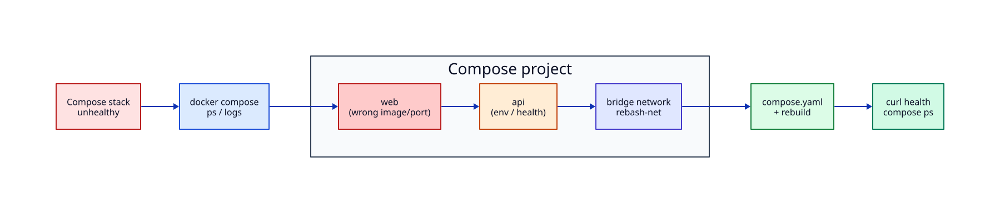

# Lab — Docker Compose Stack Recovery

## Lab Overview

**Purpose:** Practise recovering a multi-service Compose stack the way platform engineers debug staging outages.

**Scenario:** `web` and `api` are defined in Compose, but the stack is unhealthy. Customers see connection errors. You must find root cause with `compose ps`, logs, and networking checks — then fix and prove health.

**Expected outcome:** Both services are `healthy`/`running`, `curl` succeeds to the published web port, and you can state the root cause in one sentence.

!!! tip "This is a lab, not a tutorial"
    Apply Docker track skills under incomplete information. Prefer evidence over guessing.

## Business Scenario

A product team ships an internal **status page** (`web`) that calls a small **API** (`api`) over a Compose bridge network. A Friday deploy broke staging: containers restart or fail health checks. There is no Kubernetes yet for this app — Compose is the runtime. You own recovery before the Monday demo.

## Learning Objectives

By the end of this lab, you will be able to:

- [ ] Inspect Compose service state, ports, and health
- [ ] Correlate container logs with misconfigured `ports`, `environment`, and `healthcheck`
- [ ] Repair `compose.yaml` and rebuild/recreate services safely
- [ ] Validate end-to-end HTTP behaviour
- [ ] Tear down volumes and networks cleanly

## Prerequisites

### Knowledge

- [Introduction to Containers and Docker](../docker/introduction-to-containers-and-docker.md)
- [Docker Compose Fundamentals](../docker/docker-compose-fundamentals.md)
- [Docker Networking Fundamentals](../docker/docker-networking-fundamentals.md)
- [Troubleshooting Docker Containers](../docker/troubleshooting-docker-containers.md)
- [Environment Variables and Secrets](../docker/environment-variables-and-secrets.md)

### Software

| Tool | Notes |
|------|--------|
| Docker Engine + Compose v2 | `docker compose version` |
| `curl` | health checks |
| 2–4 GB free disk | image pulls |

**Estimated cost:** £0 locally.

## Architecture



## Environment

Laptop or Linux VM with Docker. Do not run against a shared production host.

## Initial State

You will create a **broken** Compose project on purpose, then triage it.

## Lab Tasks

### Task 1 — Create the broken lab project

**Objective:** Materialise the failing staging stack using create-file steps (no shell heredocs).

```bash title="Terminal"
mkdir -p ~/rebash-lab-compose/{api,web} && cd ~/rebash-lab-compose
```

Create `api/Dockerfile`:

```dockerfile title="Dockerfile"
FROM python:3.12-alpine
WORKDIR /app
COPY server.py .
EXPOSE 8080
CMD ["python", "server.py"]
```

Create `api/server.py`:

```python title="server.py"
from http.server import BaseHTTPRequestHandler, HTTPServer
import os

TOKEN = os.environ.get("API_TOKEN", "")

class H(BaseHTTPRequestHandler):
    def do_GET(self):
        if self.path == "/healthz":
            body = b'{"status":"ok","service":"api"}\n'
            self.send_response(200)
            self.send_header("Content-Type", "application/json")
            self.send_header("Content-Length", str(len(body)))
            self.end_headers()
            self.wfile.write(body)
            return
        if self.path == "/status":
            if TOKEN and self.headers.get("X-API-Token") != TOKEN:
                self.send_error(401)
                return
            body = b'{"app":"rebash-status","env":"lab"}\n'
            self.send_response(200)
            self.send_header("Content-Type", "application/json")
            self.send_header("Content-Length", str(len(body)))
            self.end_headers()
            self.wfile.write(body)
            return
        self.send_error(404)
    def log_message(self, *args):
        return

HTTPServer(("0.0.0.0", 8080), H).serve_forever()
```

Create `web/Dockerfile`:

```dockerfile title="Dockerfile"
FROM python:3.12-alpine
WORKDIR /app
COPY proxy.py .
EXPOSE 8000
CMD ["python", "proxy.py"]
```

Create `web/proxy.py`:

```python title="proxy.py"
from http.server import BaseHTTPRequestHandler, HTTPServer
from urllib.request import Request, urlopen
import os

API = os.environ.get("API_URL", "http://api:8080")
TOKEN = os.environ.get("API_TOKEN", "")

class H(BaseHTTPRequestHandler):
    def do_GET(self):
        if self.path == "/healthz":
            body = b'{"status":"ok","service":"web"}\n'
            self.send_response(200)
            self.send_header("Content-Type", "application/json")
            self.send_header("Content-Length", str(len(body)))
            self.end_headers()
            self.wfile.write(body)
            return
        try:
            req = Request(API + "/status", headers={"X-API-Token": TOKEN})
            with urlopen(req, timeout=3) as r:
                body = r.read()
            self.send_response(200)
            self.send_header("Content-Type", "application/json")
            self.send_header("Content-Length", str(len(body)))
            self.end_headers()
            self.wfile.write(body)
        except Exception as e:
            msg = ("upstream error: " + str(e)).encode()
            self.send_response(502)
            self.send_header("Content-Type", "text/plain")
            self.send_header("Content-Length", str(len(msg)))
            self.end_headers()
            self.wfile.write(msg)
    def log_message(self, *args):
        return

HTTPServer(("0.0.0.0", 8000), H).serve_forever()
```

Create `compose.yaml` with **intentional bugs** (wrong hostname, missing token on web):

```yaml
services:
  api:
    build: ./api
    environment:
      API_TOKEN: "lab-secret"
    healthcheck:
      test: ["CMD", "python", "-c", "import urllib.request; urllib.request.urlopen('http://127.0.0.1:8080/healthz')"]
      interval: 5s
      timeout: 3s
      retries: 5
    networks: [rebash-net]

  web:
    build: ./web
    ports:
      - "18080:8000"
    environment:
      API_URL: "http://api.internal:8080"
    depends_on:
      - api
    healthcheck:
      test: ["CMD", "python", "-c", "import urllib.request; urllib.request.urlopen('http://127.0.0.1:8000/healthz')"]
      interval: 5s
      timeout: 3s
      retries: 5
    networks: [rebash-net]

networks:
  rebash-net:
```

**Validation:**

```bash title="Terminal"
test -f compose.yaml && test -f api/server.py && echo "project ready" | tee task1-ready.txt
```

### Task 2 — Bring the stack up and observe failure

**Objective:** Capture evidence before editing.

```bash title="Terminal"
cd ~/rebash-lab-compose
docker compose up -d --build
docker compose ps
docker compose logs --no-color --tail=80
curl -sS -o /dev/null -w "%{http_code}\n" http://127.0.0.1:18080/ || true
curl -sS http://127.0.0.1:18080/ || true
```

!!! example "Expected output"
    `web` may be up but `/` returns 502; or healthchecks fail. Logs show connection or 401 errors.


**Validation:** Note one symptom and one hypothesis before changing YAML.

### Task 3 — Network and env triage

**Objective:** Confirm DNS/name and token issues.

```bash title="Terminal"
docker compose exec api wget -qO- http://127.0.0.1:8080/healthz || \
  docker compose exec api python -c "import urllib.request;print(urllib.request.urlopen('http://127.0.0.1:8080/healthz').read().decode())"
docker compose exec web printenv | sort | grep -E 'API_|TOKEN' || true
docker compose exec web getent hosts api || docker compose exec web nslookup api || true
```

!!! example "Expected output"
    Service DNS name is `api`, not `api.internal`. Token missing on `web`.


### Task 4 — Repair compose and recreate

**Objective:** Minimal fix: correct `API_URL`, pass `API_TOKEN`, gate on API health.

Replace `compose.yaml` with:

```yaml
services:
  api:
    build: ./api
    environment:
      API_TOKEN: "lab-secret"
    healthcheck:
      test: ["CMD", "python", "-c", "import urllib.request; urllib.request.urlopen('http://127.0.0.1:8080/healthz')"]
      interval: 5s
      timeout: 3s
      retries: 5
    networks: [rebash-net]

  web:
    build: ./web
    ports:
      - "18080:8000"
    environment:
      API_URL: "http://api:8080"
      API_TOKEN: "lab-secret"
    depends_on:
      api:
        condition: service_healthy
    healthcheck:
      test: ["CMD", "python", "-c", "import urllib.request; urllib.request.urlopen('http://127.0.0.1:8000/healthz')"]
      interval: 5s
      timeout: 3s
      retries: 5
    networks: [rebash-net]

networks:
  rebash-net:
```

Recreate the stack:

```bash title="Terminal"
cd ~/rebash-lab-compose
docker compose up -d --build
docker compose ps | tee compose-fixed-ps.txt
```

!!! example "Expected output"
    Both services healthy/running.


**Validation:**

```bash title="Terminal"
curl -sS http://127.0.0.1:18080/healthz | tee web-health-fixed.txt
curl -sS http://127.0.0.1:18080/ | tee web-root-fixed.txt
grep -q rebash-status web-root-fixed.txt
```

### Task 5 — Harden env file pattern

**Objective:** Move the token out of inline compose defaults (lab-safe pattern).

Create `.env.example`:

```bash title=".env.example"
API_TOKEN=replace-me-locally
```

Create local `.env` (do not commit):

```bash
API_TOKEN=lab-secret
```

Update `compose.yaml` to use `env_file: [.env]` on both services instead of inline `API_TOKEN`, then recreate and capture proof:

```bash title="Terminal"
cd ~/rebash-lab-compose
docker compose up -d --build
curl -sS -o /dev/null -w "%{http_code}\n" http://127.0.0.1:18080/ | tee recovery-http-code.txt
grep -q 200 recovery-http-code.txt
echo "root_cause=api.internal hostname + missing web token" | tee root-cause.txt
tar czf recovery-evidence.tar.gz compose-fixed-ps.txt web-root-fixed.txt root-cause.txt recovery-http-code.txt
test -s recovery-evidence.tar.gz
```

## Validation

| Check | Pass criteria |
|-------|----------------|
| Compose ps | `api` and `web` running; health OK if used |
| Web health | `GET /healthz` → 200 |
| Upstream | `GET /` → JSON with `rebash-status` |
| Root cause | Hostname `api.internal` + missing token explained |

## Troubleshooting

| Symptoms | Causes | Resolution | Verification |
|----------|--------|------------|--------------|
| 502 from web | Bad `API_URL` | Use Compose service name `api` | `curl /` |
| 401 upstream | Token mismatch | Align `API_TOKEN` on both services | `curl /` |
| Healthcheck fail | Missing `wget` | Python one-liner healthcheck | `compose ps` |
| Port conflict | 18080 in use | Change host port mapping | `ss` / `compose ps` |

## Challenge Extensions

- Add a reverse proxy service and TLS locally
- Scan images with Trivy before “merge”
- Split override files for `compose.override.yaml`

## Cleanup

```bash title="Terminal"
cd ~/rebash-lab-compose
docker compose down -v --remove-orphans
cd ~
rm -rf ~/rebash-lab-compose
```

## Production Discussion

Production Compose (or Swarm/K8s) would use secrets stores, not `.env` in Git; pin digests; run non-root users; centralise logs; gate deploys on healthchecks in CI.

## Best Practices

- Prefer service DNS names on the Compose network
- Healthchecks should exercise the real listener
- Recreate after config changes (`up -d --build`)
- Never commit real tokens

## Common Mistakes

| Mistake | Why | Fix |
|---------|-----|-----|
| Publishing every container port | Habit | Publish only the edge service |
| Using `localhost` inside containers | Host mental model | Use service names |
| `depends_on` without health | Race | `condition: service_healthy` |

## Success Criteria

You restored a two-service stack from evidence, validated HTTP, and cleaned up.

## Reflection Questions

1. Why did `api.internal` fail while `api` works?
2. How would you prevent token drift between services?
3. What would change if `web` ran in Kubernetes instead?

## Interview Connection

Expect Compose networking, healthchecks, and secret-handling questions. Use this recovery story. See [Docker Interview Prep](../interview/docker.md).

## Related Tutorials

- [Docker](../docker/index.md)
- [Docker Compose Fundamentals](../docker/docker-compose-fundamentals.md)
- [Troubleshooting Docker Containers](../docker/troubleshooting-docker-containers.md)
- Cheat sheet: [Docker](../cheatsheets/docker.md)
- Next lab: [Kubernetes Deployment Triage](kubernetes-deployment-triage.md)
- Project: [Status API Portfolio Build](../projects/status-api-portfolio.md)

## References

1. [Docker Compose specification](https://docs.docker.com/compose/compose-file/)
2. [Docker networking](https://docs.docker.com/network/)
3. [Container healthchecks](https://docs.docker.com/engine/reference/builder/#healthcheck)
