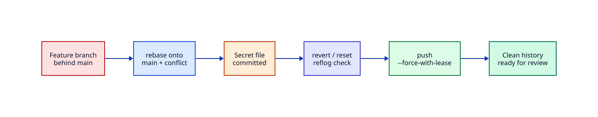

# Lab — Git History and PR Recovery

## Lab Overview

**Purpose:** Practise the collaboration recovery skills teams expect before merge: rebase, conflict resolution, undo mistakes, and safe force-push.

**Scenario:** Your feature branch is behind `main`, contains a merge conflict, and briefly held a secret file. You must produce a clean history a reviewer can trust.

**Expected outcome:** Branch is rebased on latest `main`, conflicts are resolved intentionally, the secret is gone from the tip history you push, and `git push --force-with-lease` updates the remote without clobbering unexpected commits.

!!! tip "This is a lab, not a tutorial"
    Apply Git track skills under pressure. Prefer `reflog` and `--force-with-lease` over destructive guessing.

## Business Scenario

You opened a pull request for a small **status banner** config change. Overnight, `main` moved. Your branch no longer applies cleanly. Worse, you accidentally committed `.env.local` with a demo token, then pushed. The team policy is: **rebase onto main**, no secrets in history that reaches `origin`, and never bare `--force` on shared branches — use `--force-with-lease`.

## Learning Objectives

By the end of this lab, you will be able to:

- [ ] Simulate a remote with a bare repository and two clones
- [ ] Rebase a feature branch onto an advanced `main` and resolve conflicts
- [ ] Remove a bad commit with `revert` or interactive-style reset (documented choice)
- [ ] Verify history with `log`, `show`, and `reflog`
- [ ] Publish with `git push --force-with-lease`

## Prerequisites

### Knowledge

- [Introduction to Git and Version Control](../git/introduction-to-git-and-version-control.md)
- [Basic Git Workflow](../git/basic-git-workflow-add-commit-push.md)
- [Branching Fundamentals](../git/branching-fundamentals.md)
- [Merging and Merge Conflicts](../git/merging-and-merge-conflicts.md)
- [Rebasing and Interactive Rebase](../git/rebasing-and-interactive-rebase.md)
- [Undoing Changes — Reset, Revert, Stash](../git/undoing-changes-reset-revert-stash.md)
- [Working with Remotes](../git/working-with-remotes.md)

### Software

| Tool | Notes |
|------|--------|
| Git 2.30+ | `git --version` |
| Shell | bash/zsh |
| No GitHub account required | Local bare remote is enough |

**Estimated cost:** £0.

## Architecture



## Environment

Any laptop. All remotes are local directories under `~/rebash-lab-git`.

## Initial State

Nothing exists yet. You will create:

1. A bare remote (`origin`)
2. A maintainer clone that advances `main`
3. A contributor clone with a divergent feature branch and a mistake

## Lab Tasks

### Task 1 — Create the remote and seed `main`

**Objective:** Build a tiny shared project.

**Instructions:**

``` {.bash .ra-terminal title="Terminal"}
rm -rf ~/rebash-lab-git
mkdir -p ~/rebash-lab-git
cd ~/rebash-lab-git

git init --bare origin.git

git clone origin.git maintainer
cd maintainer
git config user.email 'maintainer@rebash.lab'
git config user.name 'Maintainer'
```

Create `README.md`:

```markdown title="README.md"
# Status Banner

Internal banner text for the status page.
```

Create `banner.txt`:

```text title="banner.txt"
banner=All systems nominal
```

Seed `main`:

``` {.bash .ra-terminal title="Terminal"}
git add README.md banner.txt
git commit -m "Initial status banner config"
git push -u origin main
cd ..
```

!!! example "Expected output"
    `main` on `origin` has one commit.


**Validation:**

``` {.bash .ra-terminal title="Terminal"}
git --git-dir=origin.git log --oneline main
```

### Task 2 — Start a feature branch (contributor)

**Objective:** Implement a banner change on a branch.

**Instructions:**

``` {.bash .ra-terminal title="Terminal"}
git clone origin.git contributor
cd ~/rebash-lab-git/contributor
git config user.email 'dev@rebash.lab'
git config user.name 'Contributor'

git checkout -b feature/banner-maintenance
```

Create `banner.txt`:

```text title="banner.txt"
banner=Scheduled maintenance window — expect brief blips
```

Commit and push the feature branch:

``` {.bash .ra-terminal title="Terminal"}
git add banner.txt
git commit -m "Announce maintenance banner"
git push -u origin feature/banner-maintenance
cd ..
```

!!! example "Expected output"
    Feature branch exists on `origin`.


### Task 3 — `main` moves (simulate a teammate)

**Objective:** Create the divergence that breaks a naive merge.

**Instructions:**

``` {.bash .ra-terminal title="Terminal"}
cd ~/rebash-lab-git/maintainer
git pull origin main
```

Create `banner.txt`:

```text title="banner.txt"
banner=All systems nominal
owner=platform
```

Publish the metadata change:

``` {.bash .ra-terminal title="Terminal"}
git add banner.txt
git commit -m "Add banner owner metadata"
git push origin main
cd ..
```

**Validation:** Contributor’s feature branch tip and `main` both touch `banner.txt` differently.

### Task 4 — Rebase and resolve the conflict

**Objective:** Update the feature branch the way many teams require before merge.

**Background:** Rebase replays your commits onto latest `main`. Conflicts are normal when the same lines changed.

**Instructions:**

``` {.bash .ra-terminal title="Terminal"}
cd ~/rebash-lab-git/contributor
git fetch origin
git rebase origin/main
```

Git should stop on `banner.txt`. Resolve deliberately:

``` {.bash .ra-terminal title="Terminal"}
# Inspect
git status
cat banner.txt
```

Create `banner.txt` with both lines preserved:

```text
banner=Scheduled maintenance window — expect brief blips
owner=platform
```

Continue the rebase:

``` {.bash .ra-terminal title="Terminal"}
git add banner.txt
git rebase --continue
```

If an editor opens for the commit message, save and close to accept the original message.

!!! example "Expected output"
    Rebase completes; `git log --oneline --decorate -5` shows your commit on top of the owner metadata commit.


**Validation:**

``` {.bash .ra-terminal title="Terminal"}
git log --oneline origin/main..HEAD
cat banner.txt
```

You should see exactly one feature commit ahead of `main`, with both lines present.

!!! tip "Abort if lost"
    `git rebase --abort` returns you to the pre-rebase state.

### Task 5 — Accidental secret commit, then recover

**Objective:** Practise undoing a dangerous commit **before** it becomes permanent team history.

**Instructions:**

``` {.bash .ra-terminal title="Terminal"}
cd ~/rebash-lab-git/contributor
```

Create `.env.local` (lab-only secret — never push this in real work):

```text
API_TOKEN=lab-demo-token-do-not-ship
```

Stage the mistake commit:

``` {.bash .ra-terminal title="Terminal"}
git add .env.local
git commit -m "WIP local env"

git log --oneline -3
```

**Recover (preferred for already-pushed commits in real life: revert).** Here the bad commit is only local tip — use reset, then keep a revert drill optional:

``` {.bash .ra-terminal title="Terminal"}
# Soft undo last commit, unstage, delete the secret file
git reset --soft HEAD~1
git restore --staged .env.local
rm -f .env.local
echo '.env.local' >> .gitignore
git add .gitignore
git commit -m "Ignore local env files"

# Prove secret is not in the tip tree
git ls-files | grep env || echo 'no env files tracked'
git log --oneline origin/main..HEAD
```

**Optional revert drill** (if you had already pushed the secret commit):

```bash
# Example only — skip if you used reset above
# git revert HEAD --no-edit
```

!!! example "Expected output"
    Tip commits contain banner work + gitignore; `.env.local` is untracked/absent.


**Validation:**

``` {.bash .ra-terminal title="Terminal"}
git show --name-only --pretty=format: HEAD
test ! -f .env.local && echo 'secret file removed from worktree'
```

!!! danger "Real secrets"
    If a real token ever hit a shared remote, rotate it. History scrubbing alone is not enough.

### Task 6 — Publish with `--force-with-lease`

**Objective:** Update the remote feature branch after rebase without blind `--force`.

**Background:** `--force-with-lease` refuses to overwrite if someone else pushed commits you have not seen.

**Instructions:**

``` {.bash .ra-terminal title="Terminal"}
cd ~/rebash-lab-git/contributor
git push --force-with-lease origin feature/banner-maintenance

# Show what a reviewer would see
git log --oneline --graph --decorate origin/main..origin/feature/banner-maintenance
```

!!! example "Expected output"
    Push succeeds; remote feature branch matches your local tip.


**Validation (lease protection demo):**

``` {.bash .ra-terminal title="Terminal"}
# Simulate another push you have not fetched (optional)
cd ~/rebash-lab-git
git clone origin.git sneaky
cd sneaky
git checkout feature/banner-maintenance
echo 'note=sneaky' >> README.md
git config user.email 'sneaky@rebash.lab'
git config user.name 'Sneaky'
git add README.md
git commit -m "Unexpected remote commit"
git push origin feature/banner-maintenance
cd ~/rebash-lab-git/contributor

# Stale force-with-lease should fail until you fetch
git push --force-with-lease origin feature/banner-maintenance && echo 'UNEXPECTED SUCCESS' || echo 'lease protected as expected'
```

Fetch and decide consciously (for the lab, reset to your recovered tip or rebase again). Simplest clean-up for the demo:

``` {.bash .ra-terminal title="Terminal"}
cd ~/rebash-lab-git/contributor
git fetch origin
git reset --hard origin/feature/banner-maintenance
# Re-apply ignore commit if sneaky overwrote — or leave as lesson that lease works
git log --oneline -5
```

For a clean final state, re-checkout your known-good banner + gitignore commits and `--force-with-lease` once more after coordinating (in real teams: talk, do not force over teammates).

**Lab pass bar:** You observed lease protection fail closed at least once, **or** you successfully pushed a rebased branch with `--force-with-lease` and can explain why lease is safer than `--force`.

## Validation

| Check | Pass criteria |
|-------|----------------|
| Rebase | Feature commit(s) sit on latest `main` |
| Conflict | `banner.txt` has maintenance text + `owner=platform` |
| Secret | `.env.local` not tracked at branch tip |
| Push | Used `--force-with-lease` (not bare `--force`) |
| Story | You can explain rebase vs merge for this PR |

## Troubleshooting

| Symptoms | Causes | Resolution | Verification |
|----------|--------|------------|--------------|
| Rebase conflict loop | Incomplete `add` | `git add` resolved files; `--continue` | `rebase` finishes |
| `git rebase --continue` rejects | Empty message / editor | Save message or `--no-edit` flow | continues |
| force-with-lease rejected | Remote advanced | `fetch`, inspect, coordinate | push after intent |
| Secret still in old commit | Reset only tip; history has blob | `rebase -i` / filter / rotate token | `git log -p` / rotate |
| Detached HEAD | Checked out commit | `checkout feature/...` | branch tip |

## Challenge Extensions

- Use `git rebase -i` to squash “fixup” commits into one PR commit
- Add a pre-commit hook that blocks `.env*` (see Git hooks tutorial)
- Open a real GitHub PR from a fork and paste the recovery notes in the description

## Cleanup

``` {.bash .ra-terminal title="Terminal"}
rm -rf ~/rebash-lab-git
```

## Production Discussion

Protected branches, required reviews, and secret scanning reduce blast radius. `--force-with-lease` is the minimum bar for rewriting a **personal** feature branch; never force-push `main`. If secrets hit `origin`, rotate credentials and treat history rewrite as incomplete remediation.

## Best Practices

- Fetch before rebase; rebase often on long-lived features
- Resolve conflicts with product intent, not “accept theirs” blindly
- Prefer revert on shared commits; reset only unpushed tips
- Always `--force-with-lease` over `--force`

## Common Mistakes

| Mistake | Why | Fix |
|---------|-----|-----|
| `push --force` habit | Overwrites teammate work | `--force-with-lease` |
| Committing `.env` | Convenience | gitignore + secret scan |
| Merging instead of rebase when policy requires rebase | Review noise | Match team standard |
| Continuing rebase without `git add` | Conflict markers remain | Add then continue |

## Success Criteria

You rebased through a real conflict, removed a secret from the tip you intend to ship, and pushed with lease semantics you can explain in an interview.

## Reflection Questions

1. When is rebase preferred over merge for a feature branch?
2. Why is `--force-with-lease` safer than `--force`?
3. What do you do if a real API token was pushed?

## Interview Connection

Tell this recovery story end-to-end. Continue with [Git Interview Prep](../interview/git.md).

## Related Tutorials

- [Git](../git/index.md)
- [Rebasing and Interactive Rebase](../git/rebasing-and-interactive-rebase.md)
- [Merging and Merge Conflicts](../git/merging-and-merge-conflicts.md)
- [Cherry-pick and Reflog](../git/cherry-pick-and-reflog.md)
- Cheat sheet: [Git](../cheatsheets/git.md)
- Next practice: [Docker Compose Stack Recovery](docker-compose-stack-recovery.md)
- Project: [Status API Portfolio Build](../projects/status-api-portfolio.md)

## References

1. [Git Branching — Rebasing](https://git-scm.com/book/en/v2/Git-Branching-Rebasing)
2. [git-push — force-with-lease](https://git-scm.com/docs/git-push#Documentation/git-push.txt---force-with-leaseltrefnamegt)
3. [Undoing Changes](https://git-scm.com/book/en/v2/Git-Basics-Undoing-Things)
