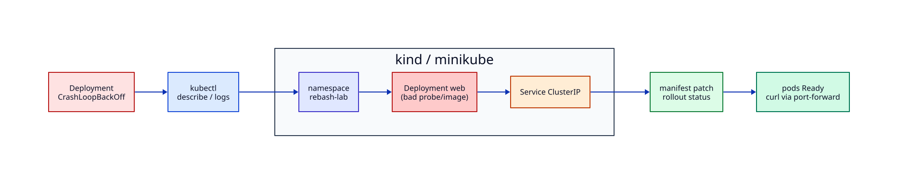

# Lab — Kubernetes Deployment Triage

## Lab Overview

**Purpose:** Practise the standard kubectl triage loop for a failing Deployment.

**Scenario:** `web` in namespace `rebash-lab` is not Ready. Events show probe or image failures. You must restore a healthy rollout without deleting the namespace blindly.

**Expected outcome:** Deployment Available, Pods Ready, `/healthz` succeeds through port-forward.

!!! tip "This is a lab, not a tutorial"
    Use evidence from `describe`, `logs`, and Events before changing manifests.

## Business Scenario

A platform team runs a demo status API on **kind** or **minikube** for stakeholder demos. After a manifest edit, the Deployment entered `CrashLoopBackOff` / failed probes. The demo is in 30 minutes. You must recover the workload with clear validation.

## Learning Objectives

By the end of this lab, you will be able to:

- [ ] Triage Pods with `get`, `describe`, `logs`, and Events
- [ ] Distinguish image pull errors from probe misconfiguration
- [ ] Patch a Deployment safely and watch rollout status
- [ ] Expose and verify with Service + port-forward
- [ ] Clean up namespaces completely

## Prerequisites

### Knowledge

- [Installing Kubernetes and kubectl](../kubernetes/installing-kubernetes-and-kubectl.md)
- [Pods — The Atomic Unit](../kubernetes/pods-the-atomic-unit.md)
- [Deployments](../kubernetes/deployments-managing-replicated-pods.md)
- [Health Checks — Probes](../kubernetes/health-checks-probes-and-self-healing.md)
- [Services and Cluster Networking](../kubernetes/services-and-cluster-networking.md)
- [Troubleshooting Kubernetes Workloads](../kubernetes/troubleshooting-kubernetes-workloads.md)

### Software

| Tool | Notes |
|------|--------|
| kubectl | configured context |
| kind **or** minikube | local cluster |
| Docker (for kind) | image runtime |

**Estimated cost:** £0 locally.

## Architecture



## Environment

Local Kubernetes (kind/minikube). Confirm:

```bash
kubectl cluster-info
kubectl get nodes
```

## Initial State

You apply a **broken** Deployment intentionally, then repair it.

## Lab Tasks

### Task 1 — Create namespace and broken workload

**Objective:** Install the failing demo.

```bash
kubectl create namespace rebash-lab --dry-run=client -o yaml | kubectl apply -f -

mkdir -p ~/rebash-lab-k8s && cd ~/rebash-lab-k8s

cat > web.yaml <<'EOF'
apiVersion: apps/v1
kind: Deployment
metadata:
  name: web
  namespace: rebash-lab
  labels:
    app: web
spec:
  replicas: 2
  selector:
    matchLabels:
      app: web
  template:
    metadata:
      labels:
        app: web
    spec:
      containers:
        - name: web
          # INTENTIONAL: valid image, but probe path wrong
          image: nginx:1.27-alpine
          ports:
            - containerPort: 80
          readinessProbe:
            httpGet:
              path: /healthz
              port: 80
            initialDelaySeconds: 2
            periodSeconds: 3
          livenessProbe:
            httpGet:
              path: /healthz
              port: 80
            initialDelaySeconds: 5
            periodSeconds: 5
          resources:
            requests:
              cpu: 50m
              memory: 64Mi
            limits:
              cpu: 200m
              memory: 128Mi
---
apiVersion: v1
kind: Service
metadata:
  name: web
  namespace: rebash-lab
spec:
  selector:
    app: web
  ports:
    - port: 80
      targetPort: 80
EOF

kubectl apply -f web.yaml
kubectl get pods -n rebash-lab -w
# Ctrl+C after you see NotReady / restarts
```

**Expected output:** Pods not Ready; Events mention probe failures (nginx has no `/healthz`).

### Task 2 — Triage with kubectl

**Objective:** Gather evidence.

```bash
kubectl get deploy,po,svc -n rebash-lab -o wide
kubectl describe deploy web -n rebash-lab | sed -n '/Conditions/,+20p'
kubectl describe po -n rebash-lab -l app=web | sed -n '/Events/,+25p'
kubectl logs -n rebash-lab -l app=web --tail=30 || true
kubectl get events -n rebash-lab --sort-by=.lastTimestamp | tail -20
```

**Expected output:** Readiness/liveness failures on `/healthz`.

**Validation:** Write symptom + cause (wrong probe path for default nginx).

### Task 3 — Repair probes and roll out

**Objective:** Align probes with a path nginx serves (`/`).

```bash
kubectl patch deploy web -n rebash-lab --type='json' -p='[
  {"op":"replace","path":"/spec/template/spec/containers/0/readinessProbe/httpGet/path","value":"/"},
  {"op":"replace","path":"/spec/template/spec/containers/0/livenessProbe/httpGet/path","value":"/"}
]'

kubectl rollout status deploy/web -n rebash-lab --timeout=120s
kubectl get po -n rebash-lab -l app=web
```

**Expected output:** `successfully rolled out`; Pods `1/1 Ready`.

Alternatively, edit `web.yaml` and `kubectl apply -f web.yaml` (preferred for GitOps habits).

### Task 4 — Verify via Service

**Objective:** Prove traffic works.

```bash
kubectl port-forward -n rebash-lab svc/web 18081:80
# in another terminal:
curl -sS -o /dev/null -w "%{http_code}\n" http://127.0.0.1:18081/
curl -sS http://127.0.0.1:18081/ | head -c 200; echo
```

**Expected output:** HTTP 200 and nginx welcome HTML.

### Task 5 — Optional second failure (image)

**Objective:** Recognise `ErrImagePull` / `ImagePullBackOff`.

```bash
kubectl set image deploy/web web=nginx:this-tag-does-not-exist -n rebash-lab
kubectl rollout status deploy/web -n rebash-lab --timeout=30s || true
kubectl describe po -n rebash-lab -l app=web | sed -n '/Events/,+20p'
kubectl set image deploy/web web=nginx:1.27-alpine -n rebash-lab
kubectl rollout status deploy/web -n rebash-lab --timeout=120s
```

**Expected output:** Image pull errors, then recovery after setting a real tag.

## Validation

| Check | Pass criteria |
|-------|----------------|
| Rollout | `rollout status` succeeds |
| Pods | All replicas Ready |
| HTTP | port-forward curl returns 200 |
| Root cause | Wrong probe path (and optional bad image) explained |

## Troubleshooting

| Symptoms | Causes | Resolution | Verification |
|----------|--------|------------|--------------|
| Probe failed | Path/port mismatch | Probe a real path | Ready 1/1 |
| ImagePullBackOff | Bad tag / registry auth | Fix image reference | Events clear |
| Pending | Resources / scheduling | `describe po` | Node assignment |
| Old pods remain | Rollout stuck | Check `maxUnavailable` / probe | `rollout status` |

## Challenge Extensions

- Add a ConfigMap-backed custom `index.html` and probe `/`
- Add NetworkPolicy allowing only port-forward testing paths
- Convert to Helm chart with values for probe paths

## Cleanup

```bash
kubectl delete namespace rebash-lab --wait=true
rm -rf ~/rebash-lab-k8s
# optional: kind delete cluster / minikube stop
```

## Production Discussion

Production clusters use GitOps for manifests, PDB/HPA for resilience, resource quotas, and image digests. Probes must match the real application contract — never copy `/healthz` blindly.

## Best Practices

- Always set requests/limits on demo workloads too
- Prefer `kubectl apply` of files over one-off patches for lasting fixes
- Watch Events sorted by time during incidents
- Use `rollout undo` when a change worsens availability

## Common Mistakes

| Mistake | Why | Fix |
|---------|-----|-----|
| Deleting Pods only | Symptom treatment | Fix Deployment template |
| Disabling probes | Hides failure | Fix the app contract |
| `:latest` in labs | Non-determinism | Pin tags |

## Success Criteria

You restored Ready Pods from probe/image failures and verified HTTP.

## Reflection Questions

1. Why did nginx fail `/healthz` while `/` worked?
2. How do readiness vs liveness failures differ in user impact?
3. How would PDB change your patch strategy?

## Interview Connection

Walk through CrashLoopBackOff diagnosis. Continue with [Kubernetes Interview Prep](../interview/kubernetes.md).

## Related Tutorials

- [Kubernetes](../kubernetes/index.md)
- [Health Checks — Probes](../kubernetes/health-checks-probes-and-self-healing.md)
- [Troubleshooting Kubernetes Workloads](../kubernetes/troubleshooting-kubernetes-workloads.md)
- Previous lab: [Docker Compose Stack Recovery](docker-compose-stack-recovery.md)
- Project: [Status API Portfolio Build](../projects/status-api-portfolio.md)

## References

1. [Configure Liveness, Readiness and Startup Probes](https://kubernetes.io/docs/tasks/configure-pod-container/configure-liveness-readiness-startup-probes/)
2. [Deployments](https://kubernetes.io/docs/concepts/workloads/controllers/deployment/)
3. [Debug Running Pods](https://kubernetes.io/docs/tasks/debug/debug-application/debug-running-pod/)
