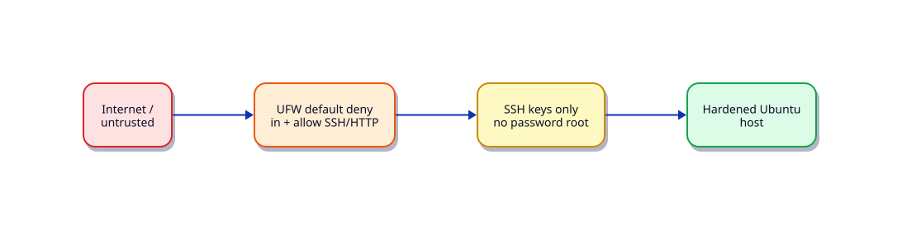

# Lab — Firewall and Server Hardening

## Lab Overview

**Purpose:** Put a host behind Uncomplicated Firewall (UFW) with deny-by-default ingress and prove services still listen where intended.

**Scenario:** A public lab VM must expose SSH (and optionally HTTP) only — everything else denied.

**Expected outcome:** UFW active with explicit allows; `ss`/`ufw status` evidence saved; SSH still works.



!!! danger "Lockout risk"
    Keep console/serial access available. Allow SSH **before** enabling UFW.

## Business Scenario

Security baseline for new Ubuntu images: default deny inbound, limited outbound discussion, SSH key auth assumed from the SSH lab.

## Learning Objectives

By the end of this lab, you will be able to:

- [ ] Set UFW default policies and allow OpenSSH
- [ ] Add application ports intentionally
- [ ] Verify listeners with `ss` and firewall rules with `ufw status verbose`
- [ ] Capture a hardening checklist (updates, users, SSH, firewall)
- [ ] Roll back cleanly

## Prerequisites

### Knowledge

- [SSH Hardening and Firewalls](../linux/ssh-hardening-and-firewalls.md)
- [Linux Networking Tools](../linux/linux-networking-tools.md)
- [SSH and Remote Access](../linux/ssh-and-remote-access.md)
- Lab: [Configure SSH Secure Access](linux-ssh-secure-access.md) recommended first

### Software

| Tool | Notes |
|------|--------|
| Ubuntu | `ufw` package |
| Console access | required safety net |

**Estimated cost:** £0.

## Environment

```bash
mkdir -p ~/rebash-lab-linux-firewall
cd ~/rebash-lab-linux-firewall
```

## Initial State

UFW may be inactive. SSH should already work via keys.

## Lab Tasks

### Task 1 — Pre-change evidence

```bash
sudo ufw status verbose | tee ~/rebash-lab-linux-firewall/ufw-before.txt
ss -tulpn | tee ~/rebash-lab-linux-firewall/ss-before.txt
ip -br a
```

### Task 2 — Default deny and allow SSH

```bash
sudo ufw default deny incoming
sudo ufw default allow outgoing
sudo ufw allow OpenSSH
sudo ufw --force enable
sudo ufw status verbose | tee ~/rebash-lab-linux-firewall/ufw-after.txt
```

Confirm a **new** SSH session still connects before closing the old one.

### Task 3 — Optional HTTP allow + local listener

```bash
# Tiny local listener for the lab (loopback demo — still practise the allow rule)
python3 - <<'PY' &
from http.server import HTTPServer, BaseHTTPRequestHandler
class H(BaseHTTPRequestHandler):
    def do_GET(self):
        self.send_response(200); self.end_headers(); self.wfile.write(b"ok\n")
    def log_message(self, *args): pass
HTTPServer(("0.0.0.0", 8080), H).serve_forever()
PY
echo $! > ~/rebash-lab-linux-firewall/http.pid
sudo ufw allow 8080/tcp comment 'rebash-lab-http'
curl -sS http://127.0.0.1:8080/
ss -tulpn | grep 8080
```

From another host (if any), confirm 8080 is reachable only when allowed; then delete the rule and confirm behaviour change.

### Task 4 — Hardening checklist card

Create `~/rebash-lab-linux-firewall/hardening-card.md`:

```bash
cat > ~/rebash-lab-linux-firewall/hardening-card.md <<'EOF'
# Lab hardening card
- [ ] apt update && unattended-upgrades considered
- [ ] SSH keys only (PasswordAuthentication no)
- [ ] PermitRootLogin no
- [ ] UFW default deny in; OpenSSH allowed
- [ ] No unexpected listeners on 0.0.0.0
- [ ] sudo group membership reviewed
EOF
ss -tulpn | tee -a ~/rebash-lab-linux-firewall/hardening-card.md
```

### Task 5 — Negative check

```bash
sudo ufw deny 8080/tcp || sudo ufw delete allow 8080/tcp
sudo ufw status numbered | tee ~/rebash-lab-linux-firewall/ufw-numbered.txt
```

## Validation

- [ ] `ufw status` shows `Status: active` and OpenSSH allow
- [ ] SSH still works after enable
- [ ] Before/after files saved
- [ ] Hardening card completed honestly

## Troubleshooting

| Symptom | Resolution |
|---------|------------|
| SSH drops after enable | Console; `ufw allow OpenSSH`; `ufw reload` |
| Rules not applied | `ufw reload`; check `iptables`/`nft` backend |
| Cloud security group also blocks | Open the same ports in the cloud SG/NSG |

## Challenge Extensions

- Rate-limit SSH with UFW `limit`
- Compare `firewalld` rich rules on a Rocky/Alma host
- Add Fail2Ban for SSH (see security module)

## Cleanup

```bash
if [[ -f ~/rebash-lab-linux-firewall/http.pid ]]; then kill "$(cat ~/rebash-lab-linux-firewall/http.pid)" 2>/dev/null || true; fi
sudo ufw delete allow 8080/tcp 2>/dev/null || true
# Optional: disable UFW on disposable lab only
# sudo ufw disable
rm -rf ~/rebash-lab-linux-firewall
```

## Production Discussion

Host firewalls complement (do not replace) cloud security groups and network policies. Manage rules as code; alert on unexpected public listeners.

## Best Practices

- Allow then enable
- Document every public port
- Pair with SSH hardening and patch cadence

## Common Mistakes

| Mistake | Correct approach |
|---------|------------------|
| `ufw enable` before allow SSH | Allow OpenSSH first |
| Relying only on UFW in cloud | Align SG/NSG + UFW |
| Leaving demo listeners up | Kill PIDs in cleanup |

## Success Criteria

You can show deny-by-default evidence and still administer the host over SSH.

## Reflection Questions

1. What is the blast radius if UFW is disabled but the cloud SG is tight?
2. When would you choose nftables directly over UFW?
3. How do you audit listening ports weekly?

## Interview Connection

“Default deny firewall on a new VM” — order of operations and dual-layer cloud+host controls.

## Related Tutorials

- [SSH Hardening and Firewalls](../linux/ssh-hardening-and-firewalls.md)
- [SELinux, AppArmor, Fail2Ban, auditd, PAM](../linux/selinux-apparmor-fail2ban-auditd-pam.md)
- Cheat sheet: [Linux](../cheatsheets/linux.md)

## References

- `man ufw`
- [Ubuntu firewall documentation](https://ubuntu.com/server/docs/firewall)
