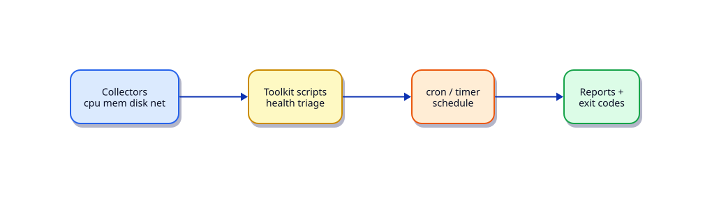

# Lab — Linux Ops Toolkit

## Lab Overview

**Purpose:** Assemble reusable host checks into a mini toolkit you can schedule and extend in later projects.

**Scenario:** Night ops wants a single `health-check.sh` plus helpers for disk, memory, and failed units — emailed later, for now written to reports.

**Expected outcome:** Toolkit scripts under `~/rebash-lab-linux-ops` run cleanly, cron (or a user crontab) produces a report, and exit codes are documented.



!!! tip "This is a lab, not a tutorial"
    Keep scripts boring and correct. Prefer `set -euo pipefail` and quoted paths.

## Business Scenario

Before a full observability stack lands, the team needs trustworthy host scripts for bastions and pet VMs. You deliver v1 of that toolkit.

## Learning Objectives

By the end of this lab, you will be able to:

- [ ] Write small, composable check scripts with clear exit codes
- [ ] Aggregate checks into a health report
- [ ] Schedule via cron or a systemd timer
- [ ] Capture failed-unit and disk thresholds
- [ ] Document usage in a one-page README

## Prerequisites

### Knowledge

- [Scheduling: cron, at, and Timers](../linux/scheduling-cron-at-and-timers.md)
- [Host Monitoring: vmstat, iostat, sar](../linux/host-monitoring-vmstat-iostat-sar.md)
- [Troubleshooting Linux Systems](../linux/troubleshooting-linux-systems.md)
- [Essential Linux Commands](../linux/essential-linux-commands.md)
- Optional: [Shell Scripting track](../shell/index.md)

### Software

| Tool | Notes |
|------|--------|
| Bash | 4.2+ |
| cron | `crontab` |
| systemd | optional timer alternative |

**Estimated cost:** £0.

## Environment

``` {.bash .ra-terminal title="Terminal"}
mkdir -p ~/rebash-lab-linux-ops/{bin,reports,logs}
cd ~/rebash-lab-linux-ops
```

## Initial State

Empty toolkit directories.

## Lab Tasks

### Task 1 — Disk check

``` {.bash .ra-terminal title="Terminal"}
cat > bin/check-disk.sh <<'EOF'
#!/usr/bin/env bash
set -euo pipefail
THRESH="${1:-90}"
worst=0
while read -r use mnt; do
  use="${use%\%}"
  if (( use > worst )); then worst=$use; fi
  if (( use >= THRESH )); then
    echo "ALERT disk ${use}% on ${mnt}" >&2
    exit 2
  fi
done < <(df -P -x tmpfs -x devtmpfs | awk 'NR>1 {print $5, $6}')
echo "OK disk worst=${worst}% threshold=${THRESH}%"
exit 0
EOF
chmod +x bin/check-disk.sh
./bin/check-disk.sh 90
```

### Task 2 — Memory and load checks

``` {.bash .ra-terminal title="Terminal"}
cat > bin/check-mem.sh <<'EOF'
#!/usr/bin/env bash
set -euo pipefail
# Alert if available memory < 10% of total (simple heuristic)
read -r total avail < <(free -b | awk '/Mem:/ {print $2, $7}')
pct=$(( avail * 100 / total ))
echo "OK mem available=${pct}%"
if (( pct < 10 )); then echo "ALERT low available memory" >&2; exit 2; fi
exit 0
EOF

cat > bin/check-load.sh <<'EOF'
#!/usr/bin/env bash
set -euo pipefail
cpus=$(nproc)
load=$(cut -d' ' -f1 /proc/loadavg)
# awk compare load vs 2x CPUs
awk -v l="$load" -v c="$cpus" 'BEGIN{
  if (l > 2*c) { print "ALERT load=" l " cpus=" c > "/dev/stderr"; exit 2 }
  print "OK load=" l " cpus=" c; exit 0
}'
EOF
chmod +x bin/check-mem.sh bin/check-load.sh
./bin/check-mem.sh
./bin/check-load.sh
```

### Task 3 — Failed units check

``` {.bash .ra-terminal title="Terminal"}
cat > bin/check-units.sh <<'EOF'
#!/usr/bin/env bash
set -euo pipefail
mapfile -t failed < <(systemctl --failed --no-legend | awk '{print $1}' || true)
failed_count=$(printf '%s\n' "${failed[@]+"${failed[@]}"}" | grep -c . || true)
if [[ "${failed_count}" -gt 0 ]]; then
  echo "ALERT failed units: ${failed[*]}" >&2
  printf '%s\n' "${failed[@]}"
  exit 2
fi
echo "OK no failed units"
exit 0
EOF
chmod +x bin/check-units.sh
./bin/check-units.sh || true
```

### Task 4 — Aggregator

``` {.bash .ra-terminal title="Terminal"}
cat > bin/health-check.sh <<'EOF'
#!/usr/bin/env bash
set -uo pipefail
ROOT="$(cd "$(dirname "$0")/.." && pwd)"
stamp="$(date -u +%Y%m%dT%H%M%SZ)"
report="$ROOT/reports/health-${stamp}.txt"
rc=0
{
  echo "host=$(hostname) time=$(date -Is)"
  for c in check-disk.sh check-mem.sh check-load.sh check-units.sh; do
    echo "=== $c ==="
    if ! "$ROOT/bin/$c"; then rc=2; fi
  done
  echo "=== RESULT rc=${rc} ==="
} | tee "$report"
exit "$rc"
EOF
chmod +x bin/health-check.sh
./bin/health-check.sh || true
ls reports/
```

The aggregator continues after individual check failures so one report captures all alerts.
### Task 5 — Cron schedule

``` {.bash .ra-terminal title="Terminal"}
crontab -l 2>/dev/null | grep -v rebash-lab-linux-ops > /tmp/cron.rebash || true
echo "*/15 * * * * $HOME/rebash-lab-linux-ops/bin/health-check.sh >> $HOME/rebash-lab-linux-ops/logs/cron.log 2>&1" >> /tmp/cron.rebash
crontab /tmp/cron.rebash
crontab -l | tee ~/rebash-lab-linux-ops/crontab.txt
```

Wait for a run or invoke manually. Confirm a new file under `reports/`.

### Task 6 — README

Document exit codes (`0` ok, `2` threshold/failure), how to run, and how to uninstall cron.

## Validation

- [ ] Each check script runs standalone
- [ ] Aggregator writes `reports/health-*.txt`
- [ ] Crontab entry present (or systemd timer equivalent)
- [ ] README lists exit taxonomy

## Troubleshooting

| Symptom | Fix |
|---------|-----|
| cron silent | Check `logs/cron.log`; ensure absolute paths |
| `systemctl --failed` needs perms | Usually fine for user session; use sudo if required |
| `set -e` aborts early | Use the aggregator pattern that continues |

## Challenge Extensions

- Add `check-sshd.sh` parsing `sshd -T`
- Ship reports with `curl` to a webhook (lab endpoint)
- Convert cron to a systemd user timer

## Cleanup

``` {.bash .ra-terminal title="Terminal"}
crontab -l 2>/dev/null | grep -v rebash-lab-linux-ops | crontab - || true
rm -rf ~/rebash-lab-linux-ops
```

## Production Discussion

These scripts are a bridge to metrics agents. Keep thresholds in config, not hard-coded, once more than one team uses them.

## Best Practices

- Absolute paths in cron
- Structured reports with timestamps
- Non-zero exits on alert (for monitoring wrappers)

## Common Mistakes

| Mistake | Correct approach |
|---------|------------------|
| Relative paths in crontab | `$HOME/...` absolute |
| Ignoring cron stderr | Log file + rotation |
| One giant script | Composable checks |

## Success Criteria

Another engineer can clone your toolkit directory pattern, run `bin/health-check.sh`, and understand exit code `2`.

## Reflection Questions

1. What belongs in cron vs a metrics agent?
2. How would you avoid alert flapping?
3. How does this evolve into the Operations Toolkit project?

## Interview Connection

“Write a disk alert script” plus “how do you schedule it safely?”

## Related Tutorials

- [Scheduling: cron, at, and Timers](../linux/scheduling-cron-at-and-timers.md)
- [Host Monitoring: vmstat, iostat, sar](../linux/host-monitoring-vmstat-iostat-sar.md)
- Project: [Linux Operations Toolkit](../projects/linux-operations-toolkit.md)
- Path: [Linux for Cloud & DevOps](../learning-paths/linux-administrator/)

## References

- `man crontab`, `man df`, `man systemctl`
