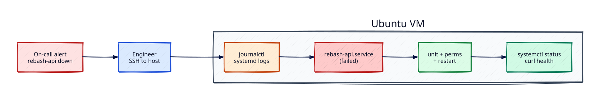

# Lab — Linux Production Incident Triage

## Lab Overview

**Purpose:** Practise the same first-hour workflow used by on-call engineers when a Linux host reports a failed application service.

**Scenario:** `rebash-api.service` is down. You must find why, fix it safely, prove it is healthy, and leave an audit trail.

**Expected outcome:** The unit is `active (running)`, a local health check succeeds, and you can explain root cause in one short paragraph.

!!! tip "This is a lab, not a tutorial"
    You already learned the tools in the Linux track. Here you apply them under pressure with incomplete information.

## Business Scenario

A small platform team runs an internal HTTP API on an Ubuntu VM behind a reverse proxy. PagerDuty fires: **rebash-api** has failed its health check for five minutes. Customers cannot load the status page. There is no staging environment for this host — you must fix production carefully, with least privilege and clear verification before you close the incident.

## Learning Objectives

By the end of this lab, you will be able to:

- [ ] Triage a failed systemd unit with `systemctl` and `journalctl`
- [ ] Identify configuration, permission, and path failures from logs
- [ ] Repair a unit file and file permissions without guessing
- [ ] Validate recovery with status, logs, and an HTTP check
- [ ] Document root cause and cleanup in an operational style

## Prerequisites

### Knowledge

- [Linux Fundamentals: Distributions and Architecture](../linux/linux-fundamentals-distributions-and-architecture.md)
- [Process Management](../linux/process-management.md)
- [systemd Services and journalctl](../linux/systemd-services-and-journalctl.md)
- [Logging: syslog, journald, logrotate](../linux/logging-syslog-journald-logrotate.md)
- [Permissions, ACLs, and Special Bits](../linux/permissions-acls-and-special-bits.md)
- [Troubleshooting Linux Systems](../linux/troubleshooting-linux-systems.md)

### Software

| Tool | Notes |
|------|--------|
| Ubuntu 22.04+ / 24.04 (VM, WSL2, or cloud) | systemd required |
| `sudo` privileges | to install packages and manage units |
| `curl` | health check |
| Optional: `python3` | used as a tiny demo API |

**Estimated cost:** £0 on a local VM / WSL. A small cloud VM is typically free-tier eligible.

## Architecture



## Environment

Use a single Ubuntu host where you can create systemd units. Do **not** run this lab against a shared production machine you do not own.

## Initial State

You will intentionally break the environment:

1. A `rebash-api` user and working directory exist
2. A simple HTTP listener script exists
3. A systemd unit is installed but **misconfigured** (wrong path and/or permissions)
4. The unit is in a failed or inactive state

Your job is to discover the breakage through logs — do not skip ahead by reading every file first unless stuck.

## Lab Tasks

### Task 1 — Create the lab workspace and demo API

**Objective:** Stand up the files the “application” needs.

**Background:** Real incidents start from existing code. You recreate a minimal API so the failure modes match production.

**Instructions:**

``` {.bash .ra-terminal title="Terminal"}
sudo useradd --system --home /opt/rebash-api --shell /usr/sbin/nologin rebash-api 2>/dev/null || true
sudo mkdir -p /opt/rebash-api/bin /var/lib/rebash-api
sudo tee /opt/rebash-api/bin/server.py >/dev/null <<'EOF'
#!/usr/bin/env python3
from http.server import BaseHTTPRequestHandler, HTTPServer

class Handler(BaseHTTPRequestHandler):
    def do_GET(self):
        if self.path in ("/", "/healthz"):
            body = b'{"status":"ok","service":"rebash-api"}\n'
            self.send_response(200)
            self.send_header("Content-Type", "application/json")
            self.send_header("Content-Length", str(len(body)))
            self.end_headers()
            self.wfile.write(body)
        else:
            self.send_error(404)

    def log_message(self, fmt, *args):
        return

if __name__ == "__main__":
    HTTPServer(("127.0.0.1", 8080), Handler).serve_forever()
EOF
sudo chmod 755 /opt/rebash-api/bin/server.py
sudo chown -R rebash-api:rebash-api /opt/rebash-api /var/lib/rebash-api
```

!!! example "Expected output"
    Commands complete with no errors. `/opt/rebash-api/bin/server.py` exists and is executable.


**Validation:**

``` {.bash .ra-terminal title="Terminal"}
sudo -u rebash-api test -x /opt/rebash-api/bin/server.py && echo "binary OK"
```

### Task 2 — Install a broken systemd unit (inject the incident)

**Objective:** Create the failed production state on purpose.

**Background:** Common real failures: wrong `ExecStart` path, missing `WorkingDirectory`, or a binary the service user cannot execute.

**Instructions:**

``` {.bash .ra-terminal title="Terminal"}
sudo tee /etc/systemd/system/rebash-api.service >/dev/null <<'EOF'
[Unit]
Description=REBASH demo API
After=network.target

[Service]
Type=simple
User=rebash-api
Group=rebash-api
WorkingDirectory=/var/lib/rebash-api
# INTENTIONAL BUG: wrong path (missing /bin)
ExecStart=/usr/bin/python3 /opt/rebash-api/server.py
Restart=on-failure
RestartSec=2

[Install]
WantedBy=multi-user.target
EOF

sudo systemctl daemon-reload
sudo systemctl enable --now rebash-api.service || true
sudo systemctl status rebash-api.service --no-pager || true
```

!!! example "Expected output"
    `systemctl status` shows **failed** or repeated restart attempts. Do not “fix” yet.


**Validation:**

``` {.bash .ra-terminal title="Terminal"}
systemctl is-failed rebash-api.service || systemctl is-active rebash-api.service
```

You should see `failed` (or brief `activating` then fail).

### Task 3 — Triage with systemctl and journalctl

**Objective:** Collect evidence before changing anything.

**Background:** On-call discipline: observe → hypothesis → change → verify.

**Instructions:**

``` {.bash .ra-terminal title="Terminal"}
systemctl status rebash-api.service --no-pager -l
journalctl -u rebash-api.service -n 50 --no-pager
journalctl -u rebash-api.service -p err..alert --no-pager | tail -20
systemctl cat rebash-api.service
ls -la /opt/rebash-api /opt/rebash-api/bin
```

!!! example "Expected output"
    Journal lines referencing a missing file or exit status; `systemctl cat` shows the wrong `ExecStart` path.


**Validation:** Write down (in your notes) one sentence for **symptom** and one for **likely cause**.

**Hint:** Compare `ExecStart=` to the real path under `/opt/rebash-api/bin/`.

### Task 4 — Repair the unit and harden permissions

**Objective:** Fix root cause with a minimal change.

**Instructions:**

``` {.bash .ra-terminal title="Terminal"}
sudo tee /etc/systemd/system/rebash-api.service >/dev/null <<'EOF'
[Unit]
Description=REBASH demo API
After=network.target

[Service]
Type=simple
User=rebash-api
Group=rebash-api
WorkingDirectory=/var/lib/rebash-api
ExecStart=/usr/bin/python3 /opt/rebash-api/bin/server.py
Restart=on-failure
RestartSec=2
NoNewPrivileges=true
PrivateTmp=true

[Install]
WantedBy=multi-user.target
EOF

sudo systemctl daemon-reload
sudo systemctl reset-failed rebash-api.service
sudo systemctl restart rebash-api.service
sudo systemctl status rebash-api.service --no-pager -l
```

!!! example "Expected output"
    `Active: active (running)` and a main PID listed.


**Validation:**

``` {.bash .ra-terminal title="Terminal"}
systemctl is-active rebash-api.service
curl -sS http://127.0.0.1:8080/healthz
```

Expected JSON includes `"status":"ok"`.

### Task 5 — Confirm stability and capture evidence

**Objective:** Prove the fix is durable, not a one-off fluke.

**Instructions:**

``` {.bash .ra-terminal title="Terminal"}
sleep 3
systemctl is-active rebash-api.service
journalctl -u rebash-api.service -n 20 --no-pager
ss -tlnp | grep 8080 || sudo ss -tlnp | grep 8080
curl -sS http://127.0.0.1:8080/ | head -c 200; echo
```

!!! example "Expected output"
    Still `active`; listener on `127.0.0.1:8080`; health JSON returns.


**Validation:** Service stays active for at least 30 seconds without entering failed state.

## Validation

| Check | Pass criteria |
|-------|----------------|
| Unit state | `systemctl is-active rebash-api.service` → `active` |
| Health | `curl` `/healthz` returns HTTP 200 JSON |
| Logs | No new crash loops in the last minute of `journalctl` |
| Root cause note | You can state the wrong `ExecStart` path in one sentence |

## Troubleshooting

| Symptoms | Possible causes | Resolution | Verification |
|----------|-----------------|------------|--------------|
| `status=203/EXEC` | Bad interpreter or missing binary | Fix `ExecStart` path; confirm `python3` exists | `systemctl restart` then `is-active` |
| Permission denied | Wrong owner on script/dir | `chown rebash-api` on `/opt/rebash-api` | Run as service user with `sudo -u` |
| Port already in use | Another process on 8080 | `ss -tlnp \| grep 8080`; stop the conflicting process | Restart unit |
| Instant exit, no logs | Script syntax error | Run manually: `sudo -u rebash-api python3 /opt/rebash-api/bin/server.py` | Fix script; restart |

## Challenge Extensions

- Bind only to localhost (already done) and put nginx/Caddy in front with TLS
- Add a `Type=notify` or readiness script and a systemd timer that curls `/healthz`
- Ship logs with `ForwardToSyslog=yes` or a journal remote sink
- Convert the unit to a non-root DynamicUser pattern and document trade-offs

## Cleanup

``` {.bash .ra-terminal title="Terminal"}
sudo systemctl disable --now rebash-api.service || true
sudo rm -f /etc/systemd/system/rebash-api.service
sudo systemctl daemon-reload
sudo rm -rf /opt/rebash-api /var/lib/rebash-api
sudo userdel rebash-api 2>/dev/null || true
```

No cloud resources to bill — still remove units so the next lab starts clean.

## Production Discussion

In production you would also:

- Page from a blackbox probe, not only local systemd state
- Use config management or IaC for unit files (avoid snowflake hosts)
- Restrict SSH with MFA, bastion hosts, and auditd
- Capture a timeline in the incident ticket (detect → mitigate → root cause → follow-ups)
- Prefer packaged releases over ad-hoc scripts on disk

## Best Practices

- Change one hypothesis at a time; reload systemd after unit edits
- Prefer `journalctl -u` over scrolling entire system logs
- Keep services off `0.0.0.0` until a reverse proxy owns exposure
- Enable `NoNewPrivileges` / `PrivateTmp` where compatible
- Record the exact fix in the ticket for the next on-call

## Common Mistakes

| Mistake | Why it happens | Correct approach |
|---------|----------------|------------------|
| Restarting forever without reading logs | Urgency bias | Read `journalctl` first |
| Fixing permissions with `chmod 777` | Fast but unsafe | Own files as the service user; least mode bits |
| Editing unit without `daemon-reload` | Habit from shell scripts | Always `daemon-reload` after unit changes |
| Declaring “fixed” without curl | Status green ≠ healthy app | Add an application health check |

## Success Criteria

You can demonstrate:

- Locating failure evidence in systemd journals
- Correcting a unit file and verifying with `systemctl` + HTTP
- Explaining root cause without hand-waving
- Cleaning up lab artefacts completely

## Reflection Questions

1. What would change if this unit ran as root instead of `rebash-api`?
2. How would you detect this failure before customers did?
3. How would you prevent the wrong path from reaching production again?
4. What metrics would you alert on besides process state?

## Interview Connection

Interviewers often ask you to **walk an incident**. Use this lab as your story:

- How you gather evidence (`systemctl`, `journalctl`)
- How you avoid risky changes under pressure
- How you verify and communicate recovery

Related tutorial questions live in [Troubleshooting Linux Systems](../linux/troubleshooting-linux-systems.md) and [systemd Services and journalctl](../linux/systemd-services-and-journalctl.md).

## Related Tutorials

- Track: [Linux](../linux/index.md)
- [systemd Services and journalctl](../linux/systemd-services-and-journalctl.md)
- [Logging: syslog, journald, logrotate](../linux/logging-syslog-journald-logrotate.md)
- Lab: [Manage Services and Analyse Logs](linux-services-and-logs-lab.md)
- Cheat sheet: [Linux Cheat Sheet](../cheatsheets/linux.md)
- Learning path: [Linux for Cloud & DevOps](../learning-paths/linux-for-cloud-devops.md)
- Next lab: [Performance Troubleshooting](linux-performance-troubleshooting-lab.md)

## References

1. [systemd.service — freedesktop.org](https://www.freedesktop.org/software/systemd/man/latest/systemd.service.html)
2. [journalctl — freedesktop.org](https://www.freedesktop.org/software/systemd/man/latest/journalctl.html)
3. [Ubuntu Server documentation](https://documentation.ubuntu.com/server/)
