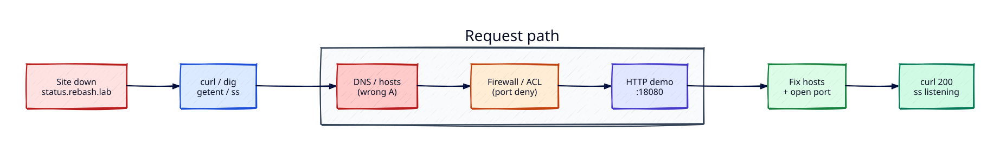

# Lab — DNS and Firewall Site-Down Triage

## Lab Overview

**Purpose:** Practise the first-hour network triage path when users report “the site is down” but the application process may still be fine.

**Scenario:** `http://status.rebash.lab:18080/healthz` fails. You must separate **name resolution**, **port reachability**, and **application health** — then fix the faults you find.

**Expected outcome:** The hostname resolves to the correct loopback address, the listener is reachable on TCP 18080, `curl` returns HTTP 200, and you can name both root causes in one sentence each.

!!! tip "This is a lab, not a tutorial"
    Apply Networking track skills under incomplete information. Prefer evidence (`curl`, `getent`, `dig`, `ss`) over guessing.

## Business Scenario

An internal **status page** is advertised to the team as `http://status.rebash.lab:18080`. After a Friday “security hardening” change, Slack fills with reports that the page is down. The VM still has CPU and disk headroom. You are on call: prove whether this is DNS, firewall/ACL, or the app itself before you escalate to the application owners.

## Learning Objectives

By the end of this lab, you will be able to:

- [ ] Reproduce a failure with `curl -v` and capture status codes vs connection errors
- [ ] Compare `/etc/hosts` resolution (`getent`/`ping`) with DNS queries (`dig`)
- [ ] Confirm a listening socket with `ss` (or `lsof`)
- [ ] Repair a wrong hosts entry and a deny rule that blocks the service port
- [ ] Validate end-to-end HTTP health and clean up lab rules

## Prerequisites

### Knowledge

- [Introduction to Networking](../networking/introduction-to-networking.md)
- [DNS Fundamentals](../networking/dns-fundamentals.md)
- [DNS Records and Troubleshooting](../networking/dns-records-and-troubleshooting.md)
- [Firewalls and Access Control](../networking/firewalls-and-access-control.md)
- [Network Troubleshooting Methodology](../networking/network-troubleshooting-methodology.md)

### Software

| Tool | Notes |
|------|--------|
| Ubuntu 22.04+ / 24.04 (VM, WSL2, or cloud) | Recommended for firewall tasks |
| `curl`, `ss` (iproute2), `python3` | Core triage tools |
| `dig` (`dnsutils`) or `getent` | Name resolution checks |
| `sudo` | hosts file + firewall rules |
| macOS | Complete DNS tasks; firewall task has a macOS note |

**Estimated cost:** £0 locally / on a free-tier VM.

## Architecture



## Environment

Use a host you own. Do **not** change firewall policy on a shared production machine.

## Initial State

You will create a working demo listener, then inject **two** faults:

1. Wrong `/etc/hosts` entry for `status.rebash.lab`
2. A firewall/ACL deny on TCP 18080 (Linux) — or a documented macOS alternative

Your job is to discover both through evidence.

## Lab Tasks

### Task 1 — Start the demo status service

**Objective:** Materialise a healthy local HTTP endpoint before you break the path.

**Background:** Real incidents start from a known-good service contract. You need a listener whose health you trust.

**Instructions:**

``` {.bash .ra-terminal title="Terminal"}
mkdir -p ~/rebash-lab-net
cd ~/rebash-lab-net
```

Create `server.py`:

```python title="server.py"
#!/usr/bin/env python3
from http.server import BaseHTTPRequestHandler, HTTPServer

class Handler(BaseHTTPRequestHandler):
    def do_GET(self):
        body = b'{"service":"rebash-status","ok":true}\n'
        if self.path not in ("/", "/healthz"):
            self.send_response(404)
            self.end_headers()
            return
        self.send_response(200)
        self.send_header("Content-Type", "application/json")
        self.send_header("Content-Length", str(len(body)))
        self.end_headers()
        self.wfile.write(body)

    def log_message(self, fmt, *args):
        return

HTTPServer(("127.0.0.1", 18080), Handler).serve_forever()
```

``` {.bash .ra-terminal title="Terminal"}
chmod +x server.py
python3 server.py >/tmp/rebash-status.log 2>&1 &
echo $! > /tmp/rebash-status.pid
sleep 1
curl -sS -o /dev/null -w "%{http_code}\n" http://127.0.0.1:18080/healthz
```

!!! example "Expected output"
    `200`


**Validation:**

``` {.bash .ra-terminal title="Terminal"}
ss -ltnp | grep 18080 || lsof -nP -iTCP:18080 -sTCP:LISTEN
```

You should see a LISTEN on `127.0.0.1:18080`.

### Task 2 — Inject the DNS (hosts) fault

**Objective:** Make the advertised hostname resolve to the wrong address.

**Background:** Many “DNS” tickets are actually bad hosts files, stale corporate overlays, or split-horizon mistakes. `/etc/hosts` overrides DNS for most libc resolvers.

**Instructions:**

``` {.bash .ra-terminal title="Terminal"}
# Backup once
sudo cp /etc/hosts /etc/hosts.rebash-lab.bak

# Wrong A: nothing useful listens on .99
echo '127.0.0.99 status.rebash.lab' | sudo tee -a /etc/hosts

# Confirm libc resolution vs dig
getent hosts status.rebash.lab || ping -c1 status.rebash.lab
dig +short status.rebash.lab A || true

curl -v --connect-timeout 3 http://status.rebash.lab:18080/healthz || true
```

!!! example "Expected output"
    - `getent` / `ping` shows `127.0.0.99`
    - `dig` typically returns **empty** (public DNS has no such name) — that contrast is the lesson
    - `curl` fails with connection refused / timeout to `.99`, not an HTTP 5xx


**Validation:** Write one line: “Hostname resolves to X; listener is on Y.”

!!! note "`dig` vs hosts"
    `dig` talks to DNS servers and usually **ignores** `/etc/hosts`. Applications using getaddrinfo honour hosts. Always check both when symptoms disagree.

### Task 3 — Triage and fix name resolution

**Objective:** Restore correct resolution without touching the firewall yet.

**Instructions:**

``` {.bash .ra-terminal title="Terminal"}
# Find the lab line
grep -n 'status.rebash.lab' /etc/hosts

# Replace wrong mapping with the correct loopback listener
sudo sed -i.bak-lab '/status.rebash.lab/d' /etc/hosts
echo '127.0.0.1 status.rebash.lab' | sudo tee -a /etc/hosts

getent hosts status.rebash.lab
curl -sS -o /dev/null -w "%{http_code}\n" http://status.rebash.lab:18080/healthz
```

!!! example "Expected output"
    `getent` shows `127.0.0.1`; `curl` returns `200` **if** no firewall fault is active yet.


**Hints:** If `sed -i` differs on macOS, edit with `sudo nano /etc/hosts` and keep a single `127.0.0.1 status.rebash.lab` line.

### Task 4 — Inject and clear the firewall / ACL fault

**Objective:** Experience a port that resolves and still fails to connect.

**Background:** Cloud security groups and host firewalls produce the same user symptom: timeouts or “connection refused” after DNS looks correct.

!!! warning "Linux primary path"
    Prefer Ubuntu/WSL2 for this task. On macOS, use the alternative at the end of the task instead of inventing unsafe `pf` rules on a work laptop.

**Linux (ufw or iptables):**

``` {.bash .ra-terminal title="Terminal"}
# Confirm DNS is healthy first
getent hosts status.rebash.lab
curl -sS -o /dev/null -w "%{http_code}\n" http://status.rebash.lab:18080/healthz

# Deny inbound TCP 18080 (lab only)
if command -v ufw >/dev/null; then
  sudo ufw deny 18080/tcp || true
  sudo ufw status | grep 18080 || true
else
  sudo iptables -I INPUT 1 -p tcp --dport 18080 -j REJECT --reject-with tcp-reset
  sudo iptables -L INPUT -n --line-numbers | head
fi

curl -v --connect-timeout 3 http://status.rebash.lab:18080/healthz || true
ss -ltn | grep 18080
```

!!! example "Expected output"
    Listener still shown by `ss`, but `curl` fails (reset/timeout). That split means **path/ACL**, not “app crashed”.


**Fix:**

``` {.bash .ra-terminal title="Terminal"}
if command -v ufw >/dev/null; then
  sudo ufw delete deny 18080/tcp || true
else
  # Delete the REJECT you inserted (adjust line number if needed)
  sudo iptables -D INPUT -p tcp --dport 18080 -j REJECT --reject-with tcp-reset
fi

curl -sS -o /dev/null -w "%{http_code}\n" http://status.rebash.lab:18080/healthz
```

**macOS alternative (no pf):** stop the listener to simulate “security change took the port offline”, then restore:

``` {.bash .ra-terminal title="Terminal"}
kill "$(cat /tmp/rebash-status.pid)" 2>/dev/null || true
curl -v --connect-timeout 2 http://status.rebash.lab:18080/healthz || true
python3 ~/rebash-lab-net/server.py >/tmp/rebash-status.log 2>&1 &
echo $! > /tmp/rebash-status.pid
sleep 1
curl -sS -o /dev/null -w "%{http_code}\n" http://status.rebash.lab:18080/healthz
```

Document in notes how this maps to a closed security group vs a dead process (`ss` empty vs `ss` listening).

**Validation:** Final `curl` → `200`; `ss` shows LISTEN.

### Task 5 — Capture root cause notes

**Objective:** Leave an incident-style summary.

Write three bullets:

1. DNS/hosts root cause
2. Firewall/reachability root cause (or macOS simulation)
3. Evidence commands that proved each

## Validation

| Check | Pass criteria |
|-------|----------------|
| Resolution | `getent hosts status.rebash.lab` → `127.0.0.1` |
| Listener | `ss`/`lsof` shows TCP 18080 LISTEN |
| HTTP | `curl` `/healthz` → 200 |
| Root causes | Wrong hosts A + blocked/absent path explained |

## Troubleshooting

| Symptoms | Causes | Resolution | Verification |
|----------|--------|------------|--------------|
| curl to IP works, name fails | Bad hosts / DNS | Fix hosts or DNS A | `getent` + `curl` name |
| dig empty, getent wrong | Hosts override | Edit `/etc/hosts` | `getent` |
| ss listening, curl times out | Firewall / SG | Remove deny / open port | `curl` |
| ss empty | Process down / wrong bind | Restart service | `ss` + `curl` |
| Permission denied editing hosts | No sudo | Use admin account | write succeeds |

## Challenge Extensions

- Capture a failing handshake with `tcpdump -ni lo port 18080` (or Wireshark)
- Add an nginx reverse proxy and break upstream `proxy_pass`
- Map the same symptoms to AWS security groups vs NACLs (theory write-up)

## Cleanup

``` {.bash .ra-terminal title="Terminal"}
# Stop demo service
kill "$(cat /tmp/rebash-status.pid)" 2>/dev/null || true
rm -f /tmp/rebash-status.pid /tmp/rebash-status.log

# Restore hosts
if [ -f /etc/hosts.rebash-lab.bak ]; then
  sudo cp /etc/hosts.rebash-lab.bak /etc/hosts
else
  sudo sed -i.bak-clean '/status.rebash.lab/d' /etc/hosts
fi

# Remove lab firewall rules (Linux)
if command -v ufw >/dev/null; then
  sudo ufw delete deny 18080/tcp 2>/dev/null || true
else
  sudo iptables -D INPUT -p tcp --dport 18080 -j REJECT --reject-with tcp-reset 2>/dev/null || true
fi

rm -rf ~/rebash-lab-net
```

## Production Discussion

Production “site down” tickets rarely start at the application. Separate **resolve → connect → TLS → HTTP**. DNS TTLs, split-horizon, and security groups cause long MTTR when engineers jump straight to redeploys. Change firewalls with tickets, expiration, and rollback — lab denies should never linger.

## Best Practices

- Reproduce with the **same hostname** users use
- Record whether the failure is DNS, TCP, TLS, or HTTP
- Prefer temporary, labelled ACL changes with owners
- Keep `/etc/hosts` experiments out of shared bastions

## Common Mistakes

| Mistake | Why | Fix |
|---------|-----|-----|
| Trusting `dig` alone | Ignores hosts | Also run `getent` |
| Restarting the app first | Treats symptom | Prove the path |
| Leaving deny rules | Next engineer suffers | Cleanup checklist |
| Testing only `127.0.0.1` | Misses DNS bugs | Test the FQDN |

## Success Criteria

You restored FQDN access after fixing resolution and reachability, validated HTTP 200, and cleaned hosts/firewall state.

## Reflection Questions

1. Why can `dig` and `curl` disagree about a hostname?
2. How do you distinguish a closed firewall from a crashed process?
3. What cloud control maps most closely to the lab deny rule?

## Interview Connection

Walk through a site-down triage: DNS → TCP → HTTP. Continue with [Networking Interview Prep](../interview/networking.md).

## Related Tutorials

- [Networking](../networking/index.md)
- [DNS Records and Troubleshooting](../networking/dns-records-and-troubleshooting.md)
- [Firewalls and Access Control](../networking/firewalls-and-access-control.md)
- Cheat sheet: [Networking](../cheatsheets/networking.md)
- Previous foundation lab: [Linux Production Incident Triage](linux-production-incident-triage.md)
- Project: [Status API Portfolio Build](../projects/status-api-portfolio.md)

## References

1. [RFC 1123 — Host requirements (name usage)](https://datatracker.ietf.org/doc/html/rfc1123)
2. [dig(1) — DNS lookup utility](https://manpages.debian.org/dig)
3. [iptables(8) / ufw](https://help.ubuntu.com/community/UFW)
