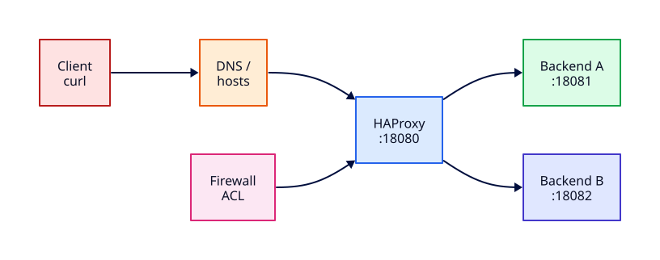

# Lab — Networking Edge Failover

## Lab Overview

**Purpose:** Combine Module 7 production networking skills — load-balancer health checks, DNS edge naming, and firewall triage — in one edge failover exercise.

**Scenario:** An internal status service is advertised as `http://status.rebash.lab` behind HAProxy on the edge. You must stand up two backends, prove round-robin and automatic failover, then recover from deliberate DNS and firewall faults.

**Expected outcome:** `curl` through `edge.rebash.lab:18080` returns healthy responses from surviving backends; you can explain health-check timing, name resolution, and ACL impact with `dig`, `curl`, and `ss` evidence.

!!! tip "This is a lab, not a tutorial"
    Prefer evidence (`curl`, `dig`, `ss`, HAProxy stats) over assumptions. Document what broke and how you proved recovery.

## Business Scenario

The platform team runs **status.rebash.lab** as a lightweight availability page for internal stakeholders. Traffic enters through **HAProxy** on port 18080, which load-balances to two Python backends on 18081 and 18082. After a deploy window, on-call reports intermittent failures: some users see errors, others do not. Your job is to stand up the stack, prove failover when backend B dies, then triage and fix DNS and firewall faults that mimic a bad Friday change — without losing console access.

## Learning Objectives

By the end of this lab, you will be able to:

- [ ] Run two distinguishable HTTP backends on loopback ports 18081 and 18082
- [ ] Configure HAProxy on 18080 with HTTP health checks and round-robin
- [ ] Map `edge.rebash.lab` via `/etc/hosts` and validate with `dig` vs `getent`
- [ ] Prove automatic failover by killing backend B and observing health-check removal
- [ ] Inject firewall deny or wrong hosts entries and triage with `curl`, `dig`, and `ss`
- [ ] Restore reachability and complete cleanup

## Prerequisites

### Knowledge

- [Network Segmentation and Trust Boundaries](../networking/network-segmentation-and-trust-boundaries.md) *(Module 7, Tutorial 21)*
- [Production DNS Operations](../networking/production-dns-operations.md) *(Module 7, Tutorial 22)*
- [Load Balancer Operations and Health Checks](../networking/load-balancer-operations-and-health-checks.md) *(Module 7, Tutorial 23)*
- [Firewall Change Control and Production ACLs](../networking/firewall-change-control-and-production-acls.md) *(Module 7, Tutorial 24)*
- [Network Incident Response and Observability](../networking/network-incident-response-and-observability.md) *(Module 7, Tutorial 25)*
- [DNS Fundamentals](../networking/dns-fundamentals.md) and [Firewalls and Access Control](../networking/firewalls-and-access-control.md)

### Software

| Tool | Notes |
|------|--------|
| Ubuntu 22.04+ / 24.04 (VM, WSL2, or cloud) | Recommended for firewall tasks |
| `haproxy` | Installed in lab steps |
| `python3` | Two backend HTTP servers |
| `curl`, `dig` (`dnsutils`), `ss` | Edge validation and triage |
| `sudo` | hosts file, HAProxy config, firewall rules |

**Estimated cost:** £0 locally.

!!! warning "Console access before firewall changes"
    Keep a serial console or cloud VM console session open before applying deny rules. Lab ACL mistakes should never lock you out of production hosts — on disposable VMs, console access is your rollback path.

## Architecture



## Environment

Use a host you own. Do **not** change HAProxy or firewall policy on shared production machines.

## Initial State

You will create two healthy backends, front them with HAProxy, then inject faults:

1. Kill backend B to trigger health-check failover
2. Wrong `/etc/hosts` entry or firewall deny on TCP 18080

Your job is to prove each layer with evidence before fixing it.

## Lab Tasks

### Task 1 — Start two Python backends with distinct body markers

**Objective:** Materialise two upstreams HAProxy can distinguish in responses and health checks.

**Background:** Production pools need identifiable backends for failover drills. Different response bodies prove which server served the request.

**Instructions:**

``` {.bash .ra-terminal title="Terminal"}
mkdir -p ~/rebash-lab-edge/{backend-a,backend-b}
cd ~/rebash-lab-edge
```

Create `backend-a/server.py`:

```python title="server.py"
#!/usr/bin/env python3
from http.server import BaseHTTPRequestHandler, HTTPServer

class Handler(BaseHTTPRequestHandler):
    def do_GET(self):
        body = b'{"service":"status.rebash.lab","backend":"A","ok":true}\n'
        if self.path not in ("/", "/healthz"):
            self.send_response(404)
            self.end_headers()
            return
        self.send_response(200)
        self.send_header("Content-Type", "application/json")
        self.send_header("Content-Length", str(len(body)))
        self.end_headers()
        self.wfile.write(body)

    def log_message(self, fmt, *args):
        return

HTTPServer(("127.0.0.1", 18081), Handler).serve_forever()
```

Create `backend-b/server.py`:

```python title="server.py"
#!/usr/bin/env python3
from http.server import BaseHTTPRequestHandler, HTTPServer

class Handler(BaseHTTPRequestHandler):
    def do_GET(self):
        body = b'{"service":"status.rebash.lab","backend":"B","ok":true}\n'
        if self.path not in ("/", "/healthz"):
            self.send_response(404)
            self.end_headers()
            return
        self.send_response(200)
        self.send_header("Content-Type", "application/json")
        self.send_header("Content-Length", str(len(body)))
        self.end_headers()
        self.wfile.write(body)

    def log_message(self, fmt, *args):
        return

HTTPServer(("127.0.0.1", 18082), Handler).serve_forever()
```

``` {.bash .ra-terminal title="Terminal"}
chmod +x backend-a/server.py backend-b/server.py
python3 backend-a/server.py >/tmp/rebash-edge-a.log 2>&1 &
echo $! > /tmp/rebash-edge-a.pid
python3 backend-b/server.py >/tmp/rebash-edge-b.log 2>&1 &
echo $! > /tmp/rebash-edge-b.pid
sleep 1

curl -sS http://127.0.0.1:18081/healthz
curl -sS http://127.0.0.1:18082/healthz
ss -tlnp | grep -E '1808[12]'
```

!!! example "Expected output"
    - Backend A JSON includes `"backend":"A"`
    - Backend B JSON includes `"backend":"B"`
    - `ss` shows LISTEN on `127.0.0.1:18081` and `127.0.0.1:18082`


**Validation:** Both health endpoints return HTTP 200 with distinct body markers.

### Task 2 — Configure HAProxy on 18080 with HTTP health checks

**Objective:** Front both backends with a load balancer that removes unhealthy nodes automatically.

**Background:** L7 health checks validate HTTP status, not just TCP accept. HAProxy `option httpchk` probes `/healthz` before sending user traffic.

**Instructions:**

``` {.bash .ra-terminal title="Terminal"}
sudo apt update
sudo apt install -y haproxy curl dig dnsutils
```

Create `haproxy.cfg`:

```text title="haproxy.cfg"
global
    log /dev/log local0
    maxconn 2048

defaults
    log     global
    mode    http
    option  httplog
    timeout connect 5s
    timeout client  30s
    timeout server  30s

frontend edge_front
    bind 127.0.0.1:18080
    default_backend status_pool

backend status_pool
    balance roundrobin
    option httpchk GET /healthz
    http-check expect status 200
    server backend_a 127.0.0.1:18081 check inter 2s fall 3 rise 2
    server backend_b 127.0.0.1:18082 check inter 2s fall 3 rise 2
```

``` {.bash .ra-terminal title="Terminal"}
sudo cp haproxy.cfg /etc/haproxy/haproxy.cfg
sudo haproxy -c -f /etc/haproxy/haproxy.cfg
sudo systemctl restart haproxy
sudo systemctl is-active haproxy
ss -tlnp | grep 18080
```

!!! example "Expected output"
    - `Configuration file is valid`
    - haproxy `active`
    - LISTEN on `127.0.0.1:18080`


**Validation:**

``` {.bash .ra-terminal title="Terminal"}
for i in {1..6}; do curl -sS http://127.0.0.1:18080/healthz; echo; done
```

You should see alternating `"backend":"A"` and `"backend":"B"` responses (round-robin).

### Task 3 — Map edge.rebash.lab via /etc/hosts

**Objective:** Simulate edge DNS with a local hosts override and contrast libc resolution with `dig`.

**Background:** Internal edges often use split-horizon or hosts overlays in lab environments. Applications honour `/etc/hosts`; `dig` queries DNS servers directly.

**Instructions:**

``` {.bash .ra-terminal title="Terminal"}
sudo cp /etc/hosts /etc/hosts.rebash-edge.bak
grep -q 'edge.rebash.lab' /etc/hosts || echo '127.0.0.1 edge.rebash.lab' | sudo tee -a /etc/hosts

getent hosts edge.rebash.lab
dig +short edge.rebash.lab A || true
curl -sS http://edge.rebash.lab:18080/healthz
```

!!! example "Expected output"
    - `getent` shows `127.0.0.1 edge.rebash.lab`
    - `dig` typically returns **empty** (no public zone) — note the contrast
    - `curl` via FQDN returns JSON through HAProxy


**Validation:** Record one line: "Applications resolve edge to 127.0.0.1; dig shows public DNS has no record."

!!! note "`dig` vs hosts"
    `dig` ignores `/etc/hosts`. Always check both when users report "DNS works in browser but curl to IP fails" or the reverse.

### Task 4 — Prove round-robin and failover by killing backend B

**Objective:** Observe HAProxy mark backend B DOWN and route all traffic to backend A.

**Background:** With `inter 2s fall 3`, three failed checks (~6 seconds) remove a backend from rotation. Surviving backends absorb load — capacity drops by half in this two-node pool.

**Instructions:**

``` {.bash .ra-terminal title="Terminal"}
# Baseline: both backends in rotation
for i in {1..4}; do curl -sS http://edge.rebash.lab:18080/healthz; echo; done

# Kill backend B
kill "$(cat /tmp/rebash-edge-b.pid)" 2>/dev/null || kill $(lsof -t -i:18082) 2>/dev/null
echo "Waiting for health checks to mark backend_b DOWN..."
sleep 8

for i in {1..5}; do curl -sS http://edge.rebash.lab:18080/healthz; echo; done
ss -tlnp | grep -E '1808[12]' || true
```

!!! example "Expected output"
    - After kill: every response shows `"backend":"A"` only
    - `ss` still shows 18081 listening; 18082 absent
    - HAProxy continues serving on 18080


**Validation:** Write one sentence explaining `inter`, `fall`, and `rise` timing for this config.

### Task 5 — Inject firewall deny or wrong hosts; triage with curl, dig, ss

**Objective:** Experience edge failures that are not "backend crashed" — DNS or ACL faults.

**Background:** On-call tickets often combine partial outages: HAProxy healthy but clients cannot connect. Separate **resolve → connect → HTTP**.

**Instructions — choose one fault path (or both):**

**5a — Wrong hosts entry:**

``` {.bash .ra-terminal title="Terminal"}
sudo sed -i.bak-edge '/edge.rebash.lab/d' /etc/hosts
echo '127.0.0.99 edge.rebash.lab' | sudo tee -a /etc/hosts

getent hosts edge.rebash.lab
curl -v --connect-timeout 3 http://edge.rebash.lab:18080/healthz || true
curl -sS http://127.0.0.1:18080/healthz
```

!!! example "Expected output"
    FQDN `curl` fails (connection to `.99`); direct IP to HAProxy still works — DNS/hosts fault, not LB down.


**5b — Firewall deny on edge port (Linux):**

!!! warning "Console session required"
    Confirm you have console access before adding deny rules on cloud VMs.

``` {.bash .ra-terminal title="Terminal"}
# Restore correct hosts first if you ran 5a
sudo sed -i.bak-edge '/edge.rebash.lab/d' /etc/hosts
echo '127.0.0.1 edge.rebash.lab' | sudo tee -a /etc/hosts

if command -v ufw >/dev/null; then
  sudo ufw deny 18080/tcp || true
  sudo ufw status | grep 18080 || true
else
  sudo iptables -I INPUT 1 -p tcp --dport 18080 -j REJECT --reject-with tcp-reset
fi

curl -v --connect-timeout 3 http://edge.rebash.lab:18080/healthz || true
ss -tlnp | grep 18080
```

!!! example "Expected output"
    `ss` shows HAProxy still listening; `curl` fails (reset/timeout) — path/ACL fault, not process crash.


**Validation:** Capture three evidence lines in notes:

1. `getent` or `dig` result
2. `curl` symptom (refused, timeout, HTTP code)
3. `ss` listener state

### Task 6 — Restore and validate edge reachability

**Objective:** Fix faults in order — name resolution first, then firewall — and prove end-to-end health.

**Instructions:**

``` {.bash .ra-terminal title="Terminal"}
# Fix hosts
sudo sed -i.bak-restore '/edge.rebash.lab/d' /etc/hosts
echo '127.0.0.1 edge.rebash.lab' | sudo tee -a /etc/hosts
getent hosts edge.rebash.lab

# Remove firewall deny
if command -v ufw >/dev/null; then
  sudo ufw delete deny 18080/tcp 2>/dev/null || true
else
  sudo iptables -D INPUT -p tcp --dport 18080 -j REJECT --reject-with tcp-reset 2>/dev/null || true
fi

# Restart backend B if still down
if ! ss -tln | grep -q ':18082 '; then
  python3 ~/rebash-lab-edge/backend-b/server.py >/tmp/rebash-edge-b.log 2>&1 &
  echo $! > /tmp/rebash-edge-b.pid
  sleep 3
fi

curl -sS -o /dev/null -w "HTTP %{http_code} connect %{time_connect}s\n" http://edge.rebash.lab:18080/healthz
for i in {1..4}; do curl -sS http://edge.rebash.lab:18080/healthz; echo; done
```

!!! example "Expected output"
    - HTTP 200 with low connect time
    - Round-robin resumes if both backends are UP (A and B alternating)


**Validation:** All checks in the Validation table below pass.

### Task 7 — Cleanup

**Objective:** Remove lab processes, HAProxy config side effects, hosts overrides, and firewall rules.

**Instructions:**

``` {.bash .ra-terminal title="Terminal"}
kill "$(cat /tmp/rebash-edge-a.pid)" 2>/dev/null || true
kill "$(cat /tmp/rebash-edge-b.pid)" 2>/dev/null || true
kill $(lsof -t -i:18081 -i:18082) 2>/dev/null || true
rm -f /tmp/rebash-edge-a.pid /tmp/rebash-edge-b.pid /tmp/rebash-edge-a.log /tmp/rebash-edge-b.log

if [ -f /etc/hosts.rebash-edge.bak ]; then
  sudo cp /etc/hosts.rebash-edge.bak /etc/hosts
else
  sudo sed -i.bak-clean '/edge.rebash.lab/d' /etc/hosts
fi

if command -v ufw >/dev/null; then
  sudo ufw delete deny 18080/tcp 2>/dev/null || true
else
  sudo iptables -D INPUT -p tcp --dport 18080 -j REJECT --reject-with tcp-reset 2>/dev/null || true
fi

sudo systemctl stop haproxy 2>/dev/null || true
rm -rf ~/rebash-lab-edge
```

!!! example "Expected output"
    No listeners on 18080–18082; hosts restored; lab directory removed.


## Validation

| Check | Pass criteria |
|-------|----------------|
| Backends | Two Python servers on 18081/18082 with distinct JSON markers |
| HAProxy | Listens `127.0.0.1:18080`; config validates; httpchk on `/healthz` |
| DNS | `getent hosts edge.rebash.lab` → `127.0.0.1` |
| Round-robin | Alternating A/B through edge before fault injection |
| Failover | After killing B, only A responses through HAProxy |
| Triage | Wrong hosts or firewall fault distinguished via curl/dig/ss |
| Recovery | FQDN `curl /healthz` → HTTP 200 after restore |
| Cleanup | Processes, hosts, firewall rules, and temp files removed |

## Troubleshooting

| Symptoms | Causes | Resolution | Verification |
|----------|--------|------------|--------------|
| HAProxy fails to start | Config syntax error | `sudo haproxy -c -f /etc/haproxy/haproxy.cfg`; fix typo | `systemctl is-active haproxy` |
| Only backend A ever appears | B not started or health check failing | Check B process; `curl 127.0.0.1:18082/healthz` | Both ports in `ss` |
| All backends DOWN in HAProxy | Wrong httpchk path | Match probe to `/healthz` | HAProxy logs |
| curl to FQDN fails, IP works | Bad `/etc/hosts` | Fix A record in hosts | `getent hosts` |
| ss listening, curl times out | Firewall deny on 18080 | Remove ufw/iptables rule | `curl` edge FQDN |
| dig shows IP, curl fails | Stale public DNS vs local hosts mismatch | Test both views; document split-horizon | `dig` + `getent` |
| No failover after kill | fall/rise not elapsed | Wait `inter × fall` seconds | Only survivor responds |

## Challenge Extensions

- Enable HAProxy stats socket and observe backend state transitions live
- Add a third backend with `weight` and compare distribution
- Capture SYN behaviour with `tcpdump -ni lo port 18080` during firewall deny
- Map the lab to AWS ALB target group health checks and security groups

## Cleanup

See **Task 7** for the full cleanup script. Run it on every disposable lab VM before shutdown.

## Production Discussion

Production edge stacks add TLS termination, WAF rules, external DNS with TTL management, and change-controlled ACLs. Failover drills should be scheduled: drain a backend, validate synthetic checks, then re-enable. Never apply firewall default-deny without documented rollback and console access. Coordinate DNS cutovers with LB pool changes — a healthy backend is useless if resolvers still point elsewhere.

## Best Practices

- Bind backends to `127.0.0.1`; expose only the LB front door
- Validate HAProxy config before every restart
- Test with the **same hostname** users and monitors use
- Keep console access before firewall experiments
- Document health-check timing (`inter`, `fall`, `rise`) in runbooks

## Common Mistakes

| Mistake | Why | Fix |
|---------|-----|-----|
| TCP-only health check on hung app | Port open but app broken | Use HTTP GET `/healthz` |
| Testing only `127.0.0.1` | Misses DNS/hosts bugs | curl the FQDN |
| Killing HAProxy instead of backend | Confuses LB vs upstream fault | Target backend PID/port |
| Leaving deny rules | Next engineer inherits outage | Cleanup checklist |
| Trusting `dig` alone | Ignores hosts override | Also run `getent` |

## Success Criteria

You stood up HAProxy with two backends, proved round-robin and failover, triaged and fixed DNS or firewall faults with evidence, validated recovery through `edge.rebash.lab`, and completed cleanup.

## Reflection Questions

1. How long until backend B is removed with `inter 2s fall 3`?
2. Why can `curl` to the IP succeed while the FQDN fails?
3. What production control maps to the lab firewall deny on 18080?
4. How would you drain backend A before maintenance without dropping user sessions?

## Interview Connection

Tell this story: stand up LB → prove failover → triage DNS vs ACL with curl/dig/ss. Continue with [Networking Interview Prep](../interview/networking.md).

## Related Tutorials

- [Networking](../networking/index.md)
- [Load Balancer Operations and Health Checks](../networking/load-balancer-operations-and-health-checks.md)
- [Production DNS Operations](../networking/production-dns-operations.md)
- [Firewall Change Control and Production ACLs](../networking/firewall-change-control-and-production-acls.md)
- [Network Incident Response and Observability](../networking/network-incident-response-and-observability.md)
- Foundation lab: [DNS and Firewall Site-Down Triage](networking-dns-firewall-triage.md)
- Quiz: [Networking Production](../quizzes/networking-production.md)
- Cheat sheet: [Networking](../cheatsheets/networking.md)

## References

1. [HAProxy Configuration Manual](https://docs.haproxy.org/)
2. [dig(1) — DNS lookup utility](https://manpages.debian.org/dig)
3. [Ubuntu UFW community help](https://help.ubuntu.com/community/UFW)
