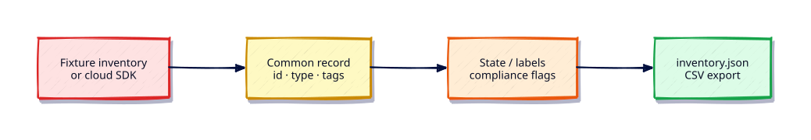

# Lab — Python Azure Resource Inventory

## Lab Overview

**Purpose:** List Azure resources (name, type, location, tags) for a subscription snapshot.

**Scenario:** Cloud Centre of Excellence wants a portable inventory tool for workshop laptops without tenant access.

**Expected outcome:** Fixture-first CLI; optional Azure SDK path when `AZURE_SUBSCRIPTION_ID` and credentials exist.

!!! tip "This is a lab, not a tutorial"
    Apply [Cloud Automation — AWS, Azure, GCP](../python/cloud-automation-aws-azure-gcp.md).

## Business Scenario

A merger imports three subscriptions. You need a normalised resource list before tagging standards are enforced.

## Learning Objectives

- [ ] Normalise heterogeneous resource records
- [ ] Fixture mode for offline/CI
- [ ] Optional `ResourceManagementClient` list
- [ ] Secrets only via environment / DefaultAzureCredential

## Prerequisites

### Knowledge

- [Cloud Automation — AWS, Azure, GCP](../python/cloud-automation-aws-azure-gcp.md)
- [Configuration Management and Secrets](../python/configuration-management-and-secrets.md)

### Software

| Tool | Notes |
|------|--------|
| azure-identity / azure-mgmt-resource | optional |
| Fixtures | required |

**Estimated cost:** £0 with fixtures.

## Architecture



## Environment

``` {.bash .ra-terminal title="Terminal"}
mkdir -p ~/rebash-lab-python-azure/{fixtures,out}
cd ~/rebash-lab-python-azure
python3 -m venv .venv && source .venv/bin/activate
# Optional live: pip install azure-identity azure-mgmt-resource
```

## Initial State

Create `fixtures/resources.json`:

```json title="resources.json"
[
  {"name": "rg-payments", "type": "Microsoft.Resources/resourceGroups", "location": "uksouth", "tags": {"env": "prod"}},
  {"name": "saops01", "type": "Microsoft.Storage/storageAccounts", "location": "uksouth", "tags": {"env": "prod"}},
  {"name": "vm-batch", "type": "Microsoft.Compute/virtualMachines", "location": "westeurope", "tags": {}}
]
```

## Task

Create `azure_inventory.py --fixture fixtures/resources.json` writing `out/inventory.json`. Filter `--type-contains Compute` optional. Live mode must catch credential errors and point to fixtures.

## Validation

``` {.bash .ra-terminal title="Terminal"}
python azure_inventory.py --fixture fixtures/resources.json
test $(python -c 'import json; print(len(json.load(open("out/inventory.json"))))') -eq 3
```

- [ ] Three resources from fixture
- [ ] No credentials required
- [ ] Empty tags handled

## Troubleshooting

| Symptom | Fix |
|---------|-----|
| SDK import errors | Skip live deps; fixture-only is enough to pass |

## Cleanup

```bash
deactivate 2>/dev/null || true
rm -rf ~/rebash-lab-python-azure
```

## Production Discussion

Prefer managed identities over service principal secrets in files. Aggregate with Azure Resource Graph for large estates.

## Related

- Previous: [AWS EC2 Inventory](python-aws-ec2-inventory.md)
- Next: [GCP Inventory](python-gcp-inventory.md)
