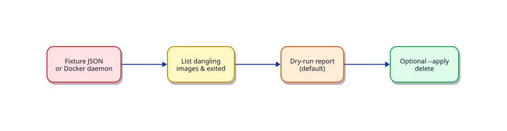

# Lab — Python Docker Cleanup Tool

## Lab Overview

**Purpose:** Inventory dangling resources and practise safe cleanup with dry-run defaults.

**Scenario:** CI agents fill disks with dangling images. Ops wants a Python tool that reports reclaimable space and only deletes with `--apply`.

**Expected outcome:** CLI that defaults to dry-run; supports `--fixture` when Docker is unavailable.

!!! tip "This is a lab, not a tutorial"
    Apply [Docker SDK Automation](../python/docker-sdk-automation.md).

## Business Scenario

Shared build hosts hit disk alerts weekly. Manual `docker system prune` is too blunt; you need a report-first tool.

## Learning Objectives

- [ ] Use Docker SDK (`docker` package) to list images/containers
- [ ] Default to dry-run; require `--apply` to delete
- [ ] Provide fixture JSON path when daemon is down
- [ ] Log actions without secrets

## Prerequisites

### Knowledge

- [Docker SDK Automation](../python/docker-sdk-automation.md)
- [CLI Applications — argparse, Click, Typer](../python/cli-applications-argparse-click-typer.md)
- [Production Engineering Patterns](../python/production-engineering-patterns.md)

### Software

| Tool | Notes |
|------|--------|
| Docker Engine | optional |
| `docker` PyPI SDK | `pip install docker` |

**Estimated cost:** £0.

## Architecture



## Environment

```bash title="Terminal"
mkdir -p ~/rebash-lab-python-docker/{fixtures,out}
cd ~/rebash-lab-python-docker
python3 -m venv .venv && source .venv/bin/activate
pip install 'docker>=7.0,<8'
```

## Initial State — fixture (always available)
Create `fixtures/dangling.json`:

```json title="dangling.json"
{
  "images": [
    {"id": "sha256:aaa", "tags": [], "size": 120000000, "dangling": true},
    {"id": "sha256:bbb", "tags": ["app:latest"], "size": 80000000, "dangling": false}
  ],
  "containers": [
    {"id": "c1", "status": "exited", "names": ["/old-job"]}
  ]
}
```

## Task

### Step 1 – Modes

- `--fixture fixtures/dangling.json` — no daemon
- Live mode: `docker.from_env()` — catch connection errors and tell the user to use fixtures

### Step 2 – Report

List dangling images and exited containers; sum sizes; write `out/report.json`.

### Step 3 – Apply

Only with `--apply` (and not with `--fixture`), remove dangling images. Print what would be removed in dry-run.

## Validation

```bash title="Terminal"
python docker_cleanup.py --fixture fixtures/dangling.json
python docker_cleanup.py --fixture fixtures/dangling.json --apply  # must refuse or no-op safely
# If daemon available:
# python docker_cleanup.py
# python docker_cleanup.py --apply
```

- [ ] Dry-run never deletes
- [ ] Fixture mode works offline
- [ ] Live connection failure is handled with a clear message

## Troubleshooting

| Symptom | Fix |
|---------|-----|
| `DockerException` | Daemon not running — use `--fixture` |
| Permission denied | User in `docker` group or rootless docs |

## Cleanup

```bash
deactivate 2>/dev/null || true
rm -rf ~/rebash-lab-python-docker
# Do not prune unrelated host resources
```

## Production Discussion

Prefer age and label filters; exclude images still referenced by running containers. Gate `--apply` behind change tickets in shared environments.

## Related

- Next: [Kubernetes Health Checker](python-kubernetes-health-checker.md)
