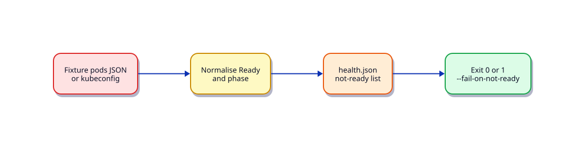

# Lab — Python Kubernetes Health Checker

## Lab Overview

**Purpose:** Summarise Pod and Deployment readiness in a namespace using the official Python client — or fixtures.

**Scenario:** On-call wants a quick “what is not Ready?” report without memorising kubectl one-liners.

**Expected outcome:** CLI prints not-ready workloads; exits `1` if any critical failures when `--fail-on-not-ready` is set.

!!! tip "This is a lab, not a tutorial"
    Apply [Kubernetes Python Client Automation](../python/kubernetes-python-client-automation.md).

## Business Scenario

A payments namespace shows intermittent 502s. You need a scripted readiness roll-up for Slack paste and CI smoke jobs against kind.

## Learning Objectives

- [ ] Load kubeconfig or use `--fixture`
- [ ] List Pods/Deployments and interpret Ready conditions
- [ ] Never mutate cluster objects
- [ ] Handle missing cluster gracefully

## Prerequisites

### Knowledge

- [Kubernetes Python Client Automation](../python/kubernetes-python-client-automation.md)
- [Error Handling and Exceptions](../python/error-handling-and-exceptions.md)

### Software

| Tool | Notes |
|------|--------|
| `kubernetes` package | optional live cluster / kind |
| Fixtures | required path for offline |

**Estimated cost:** £0.

## Architecture



## Environment

```bash
mkdir -p ~/rebash-lab-python-k8s/{fixtures,out}
cd ~/rebash-lab-python-k8s
python3 -m venv .venv && source .venv/bin/activate
pip install 'kubernetes>=29.0,<32'
```

## Initial State — fixture
Create `fixtures/pods.json`:

```json
{
  "namespace": "payments",
  "pods": [
    {"name": "api-7d9f", "phase": "Running", "ready": true, "restarts": 0},
    {"name": "api-7d9f-b", "phase": "Running", "ready": false, "restarts": 3},
    {"name": "worker-1", "phase": "CrashLoopBackOff", "ready": false, "restarts": 12}
  ]
}
```

## Task

Create `k8s_health.py`:

- `--fixture fixtures/pods.json` (default for this lab)
- Optional live: `--namespace payments` using `config.load_kube_config()`
- Write `out/health.json` with counts and not-ready names

## Validation

```bash
python k8s_health.py --fixture fixtures/pods.json
python k8s_health.py --fixture fixtures/pods.json --fail-on-not-ready; echo $?  # 1
```

- [ ] Fixture mode needs no cluster
- [ ] Not-ready pods listed
- [ ] Live mode failure message suggests `--fixture`

## Troubleshooting

| Symptom | Fix |
|---------|-----|
| `ConfigException` | No kubeconfig — use fixtures |
| Wrong namespace | Pass `--namespace` explicitly |

## Cleanup

```bash
deactivate 2>/dev/null || true
rm -rf ~/rebash-lab-python-k8s
```

## Production Discussion

Use a read-only ServiceAccount; prefer metrics-server/Prometheus for continuous health. This tool is for triage and CI gates.

## Related

- Next: [Kubernetes Deployment Validator](python-kubernetes-deployment-validator.md)
