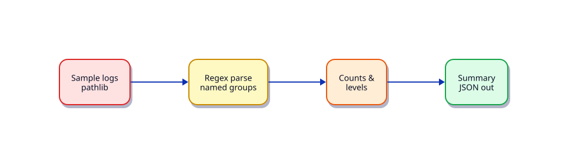

# Lab — Python Log Analyser

## Lab Overview

**Purpose:** Practise early Python skills under a realistic ops task — turn raw log lines into a machine-readable summary.

**Scenario:** On-call needs a quick count of `ERROR` / `WARN` / `INFO` lines from yesterday’s app logs before escalating. A one-off `grep | wc` is not enough — they want JSON for a dashboard paste.

**Expected outcome:** A small CLI (or script) that reads log files under a lab workspace, parses lines with `pathlib` + `re`, and writes `summary.json`.

!!! tip "This is a lab, not a tutorial"
    Apply [Python for DevOps](../python/index.md) skills. Prefer small verified steps over rewriting everything at once.

## Business Scenario

Support dropped a zip of `app-*.log` files into a shared folder. Lines look like:

```text
2026-07-28T10:01:02Z INFO  request_id=abc status=200
2026-07-28T10:01:05Z ERROR request_id=def status=500 msg="timeout"
```

You must produce counts by level plus a short list of distinct error messages — without shelling out for every file.

## Learning Objectives

By the end of this lab, you will be able to:

- [ ] Create a venv and run a Python script from it
- [ ] Walk log files with `pathlib.Path.glob`
- [ ] Parse lines with compiled regex and named groups
- [ ] Emit a summary JSON document with `json.dump`
- [ ] Exit with a clear code when input is missing

## Prerequisites

### Knowledge

- [Python Fundamentals — Install, venv, and Tooling](../python/python-fundamentals-install-venv-and-tooling.md)
- [Python Basics — Types and I/O](../python/python-basics-types-and-io.md)
- [Data Structures, Comprehensions, and Generators](../python/data-structures-comprehensions-and-generators.md)
- [File Handling — pathlib, JSON, YAML, CSV](../python/file-handling-pathlib-json-yaml-csv.md)

### Software

| Tool | Notes |
|------|--------|
| Python 3.12+ | `python3 --version` |
| venv | stdlib |

**Estimated cost:** £0.

## Architecture



## Environment

Any Linux host or WSL2. Work under `~/rebash-lab-python`.

## Initial State

```bash title="Terminal"
mkdir -p ~/rebash-lab-python/{logs,out}
cd ~/rebash-lab-python
python3 -m venv .venv
source .venv/bin/activate
```

### Sample logs

Create `logs/app-a.log`:

```text title="app-a.log"
2026-07-28T10:01:02Z INFO  request_id=abc status=200
2026-07-28T10:01:05Z ERROR request_id=def status=500 msg="timeout"
2026-07-28T10:01:06Z WARN  request_id=ghi status=429 msg="rate limited"
2026-07-28T10:01:07Z ERROR request_id=jkl status=500 msg="timeout"
```

Create `logs/app-b.log`:

```text title="app-b.log"
2026-07-28T11:00:00Z INFO  request_id=mno status=200
2026-07-28T11:00:01Z INFO  request_id=pqr status=201
2026-07-28T11:00:02Z ERROR request_id=stu status=502 msg="bad gateway"
```


## Task

### Step 1 – Skeleton and venv check

```bash title="Terminal"
which python
python -c 'import sys; print(sys.version)'
```

Create `analyse_logs.py` with a `main()` and `if __name__ == "__main__":`.

### Step 2 – Discover files with pathlib

- Accept an input directory (default: `~/rebash-lab-python/logs`)
- Use `Path.glob("*.log")`
- Exit `2` if no files found

### Step 3 – Compile a line regex

Suggested pattern (adjust as needed):

```python
import re
LINE = re.compile(
    r"^(?P<ts>\S+)\s+(?P<level>INFO|WARN|ERROR)\s+(?P<rest>.*)$"
)
```

Skip or count unparsed lines separately.

### Step 4 – Aggregate and write JSON

Build a structure similar to:

```json
{
  "files": 2,
  "lines": 7,
  "levels": {"INFO": 3, "WARN": 1, "ERROR": 3},
  "error_messages": ["timeout", "bad gateway"],
  "unparsed": 0
}
```

Write to `~/rebash-lab-python/out/summary.json` with `json.dump(..., indent=2)`.

### Step 5 – Optional argparse

Add `--input` / `--output` flags so the script is reusable in CI.

## Validation

```bash title="Terminal"
cd ~/rebash-lab-python
source .venv/bin/activate
python analyse_logs.py
python -c 'import json; print(json.load(open("out/summary.json"))["levels"])'
```

- [ ] `summary.json` exists and is valid JSON
- [ ] ERROR count is **3**, WARN **1**, INFO **3** (with the sample above)
- [ ] Missing input directory exits non-zero with a clear message on stderr
- [ ] Script runs inside the venv (not system site-packages by accident)

## Troubleshooting

| Symptom | Fix |
|---------|-----|
| `ModuleNotFoundError` | Activate `.venv` |
| Wrong counts | Check regex; strip BOM; confirm both log files |
| Empty `error_messages` | Parse `msg="..."` from `rest` with a second regex |
| Permission denied | Ensure `out/` is writable |

## Cleanup

```bash
deactivate 2>/dev/null || true
rm -rf ~/rebash-lab-python
```

## Production Discussion

In production, ship this as a package entry point, emit structured logs alongside the summary, and gate CI on ERROR thresholds. Prefer streaming large files line-by-line rather than `read_text()` for multi-gigabyte logs.

## Stretch Goals

- Add `--min-level ERROR` filter
- Emit a `RESULT status=ok errors=N` line on stdout for CI
- Package as a console script (see beginner project)

## Related

- Track: [Python for DevOps](../python/index.md)
- Cheat sheet: [Python](../cheatsheets/python.md)
- Project: [Python Log Analysis Tool](../projects/python-log-analysis-tool.md)
- Quiz: [Python for DevOps Engineers Fundamentals](../quizzes/python-for-devops-engineers-fundamentals.md)
- Lab (next): [Python Linux Health Checker](python-linux-health-checker.md)
