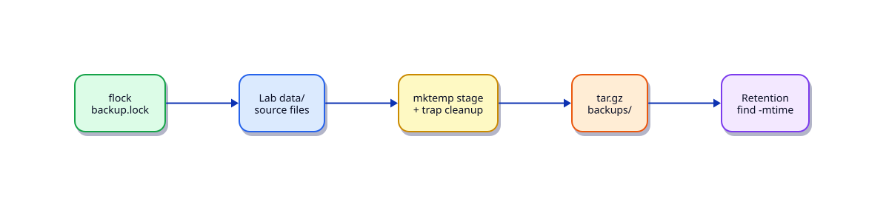

# Lab — Build a Backup Utility

## Lab Overview

**Purpose:** Automate directory backups with retention and safe concurrent execution.

**Scenario:** Nightly application data under `/var/tmp` (lab stand-in) must be archived with a 7-day retention policy.

**Expected outcome:** A working script under `~/rebash-lab-shell` with clear exit codes, stderr logging, and validation steps you can re-run.

!!! tip "This is a lab, not a tutorial"
    Apply [Shell Scripting](../shell/index.md) skills. Prefer small verified steps over rewriting everything at once.

## Business Scenario

A small product team still runs pets. They need a boring backup script before object-storage backups land.

## Learning Objectives

By the end of this lab, you will be able to:

- [ ] Create timestamped tar archives
- [ ] Apply retention (delete older than N days)
- [ ] Use `mktemp`, `trap`, and `flock`
- [ ] Log success/failure with exit codes

## Prerequisites

### Knowledge

- [Linux Admin Automation](../shell/linux-admin-automation.md)
- [Process Automation — Signals and Traps](../shell/process-automation-signals-and-traps.md)
- [File Operations in Shell](../shell/file-operations-in-shell.md)

### Software

| Tool | Notes |
|------|--------|
| Bash | required |
| tar | required |
| flock | util-linux |
| find | coreutils |

**Estimated cost:** £0.

## Architecture



## Environment

Any Linux host. Use lab directories only — never backup real `/`.

## Initial State

```bash
mkdir -p ~/rebash-lab-shell/backup/{data,backups,logs}
cd ~/rebash-lab-shell/backup
printf 'payload\n' > data/app.txt
printf 'nested\n' > data/nested.cfg
```

## Lab Tasks

### Task 1 — Backup script skeleton

Create `backup.sh` that archives `data/` into `backups/data-YYYYMMDD-HHMMSS.tar.gz`.

### Task 2 — Add trap and staging

Stage files in `mktemp -d`, `trap` cleanup on `EXIT INT TERM`, then move the archive into `backups/`.

### Task 3 — Retention

Delete archives older than `--retain-days` (default 7) using `find ... -mtime`.

### Task 4 — Locking

Use `flock` on `backup.lock` so overlapping cron runs do not corrupt archives.

### Task 5 — Validate

```bash
./backup.sh
./backup.sh --retain-days 0   # optional aggressive cleanup after creating a sample
ls -la backups/
```


## Validation

- [ ] Archive exists and extracts cleanly
- [ ] Trap removes temp directories even on interrupt
- [ ] Second concurrent run is blocked or exits cleanly via flock
- [ ] Retention deletes old archives as configured

## Troubleshooting

| Symptom | Possible cause | Resolution |
|---------|----------------|------------|
| flock missing | Non-Linux environment | Use a Linux VM |
| Permission denied writing backups | Wrong directory | Stay under `~/rebash-lab-shell` |
| Empty archive | Source path wrong | Verify `data/` before tar |

## Cleanup

```bash
rm -rf ~/rebash-lab-shell
```

## Stretch Goals

- Add a `--dry-run` mode that prints actions without changing the system
- Emit a machine-readable `RESULT status=...` line on stdout for CI
- Schedule the script with cron or a systemd timer

## Production Discussion

In production, wrap scripts with lock files, structured logging, explicit `PATH`, and documented exit codes. Prefer configuration files over hard-coded hosts and thresholds. Never embed secrets in scripts — use environment variables or a secrets manager.

## Best Practices

- Use `#!/usr/bin/env bash` and `set -euo pipefail`
- Quote every expansion that may contain spaces
- Log diagnostics to stderr; keep stdout for data
- Prefer absolute paths in scheduled jobs
- Validate inputs before destructive actions

## Common Mistakes

| Mistake | Why it happens | Correct approach |
|---------|----------------|------------------|
| Unquoted paths | Habit from interactive shell | Always `"$var"` |
| Missing `pipefail` | Default Bash pipeline behaviour | `set -o pipefail` |
| Interactive-only PATH | Cron/systemd minimal env | Set `PATH=` at top |
| Skipping dry-run | Time pressure | Default to dry-run for risky ops |

## Success Criteria

- [ ] Script runs under Bash with strict mode
- [ ] Validation and failure paths are tested
- [ ] Exit codes are documented
- [ ] Cleanup leaves no lab artefacts (or documents what remains)

## Reflection Questions

1. What would break if this ran under `/bin/sh` (dash) instead of Bash?
2. How would you make the script idempotent?
3. How would you secure credentials and host inventories?
4. How would you observe failures in production?

## Interview Connection

Interviewers often ask about quoting, exit codes, cron environment differences, and how you prevent overlapping jobs. Be ready to walk through a small script and explain failure modes.

## Related Tutorials

- [`Linux Admin Automation`](../shell/linux-admin-automation.md)
- [`Process Automation Signals And Traps`](../shell/process-automation-signals-and-traps.md)
- [`File Operations In Shell`](../shell/file-operations-in-shell.md)
- [`Scheduling Cron At And Timers`](../shell/scheduling-cron-at-and-timers.md)
- Cheat sheet: [Shell Scripting](../cheatsheets/shell.md)
- Interview: [Shell Scripting](../interview/shell.md)
- Quiz: [Shell Scripting for DevOps Fundamentals](../quizzes/shell-scripting-for-devops-fundamentals.md)
- Track: [Shell Scripting](../shell/index.md)
