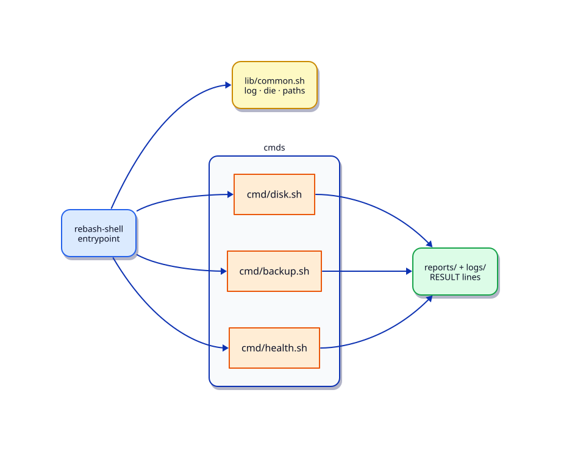

# Lab — Create a Linux Operations Toolkit

## Lab Overview

**Purpose:** Capstone-style lab: unify earlier scripts behind one entrypoint and shared logging.

**Scenario:** The team has scattered scripts. Leadership wants `rebash-shell` with subcommands.

**Expected outcome:** A working script under `~/rebash-lab-shell` with clear exit codes, stderr logging, and validation steps you can re-run.

!!! tip "This is a lab, not a tutorial"
    Apply [Shell Scripting](../shell/index.md) skills. Prefer small verified steps over rewriting everything at once.

## Business Scenario

You create a toolkit layout with `bin/rebash-shell`, `lib/common.sh`, and subcommands for disk, backup, and health.

## Learning Objectives

By the end of this lab, you will be able to:

- [ ] Design a small CLI with subcommands
- [ ] Share logging and exit helpers via `source`
- [ ] Integrate at least three operations
- [ ] Provide `--help` and a smoke `validate.sh`

## Prerequisites

### Knowledge

- [Production Shell Scripting](../shell/production-shell-scripting.md)
- [Linux Admin Automation](../shell/linux-admin-automation.md)
- [Troubleshooting Shell Scripts](../shell/troubleshooting-shell-scripts.md)

### Software

| Tool | Notes |
|------|--------|
| Bash | required |
| scripts from earlier labs | optional reuse |

**Estimated cost:** £0.

## Architecture



## Environment

Linux host under `~/rebash-lab-shell/toolkit`.

## Initial State

```bash
mkdir -p ~/rebash-lab-shell/toolkit/{bin,lib,cmd,reports,logs}
cd ~/rebash-lab-shell/toolkit
```

## Lab Tasks

### Task 1 — Shared library

`lib/common.sh`:

- `log`, `die`, `require_cmd`
- `REPO_ROOT` detection

### Task 2 — Entrypoint

`bin/rebash-shell`:

```bash
case "${1:-}" in
  disk) shift; cmd/disk.sh "$@";;
  backup) shift; cmd/backup.sh "$@";;
  health) shift; cmd/health.sh "$@";;
  *) echo "Usage: rebash-shell <disk|backup|health>" >&2; exit 2;;
esac
```

### Task 3 — Subcommands

Implement thin wrappers that call patterns from earlier labs (disk threshold, tar backup of a lab dir, health summary).

### Task 4 — Smoke test

`validate.sh` runs each subcommand once and writes `reports/smoke.txt`.


## Validation

- [ ] CLI `--help` / usage exits 2
- [ ] Subcommands share logging from `lib/common.sh`
- [ ] Smoke validation produces a report
- [ ] Layout is documented in README.md

## Troubleshooting

| Symptom | Possible cause | Resolution |
|---------|----------------|------------|
| source path wrong | Relative path from cwd | Resolve REPO_ROOT from BASH_SOURCE |
| Subcommand not executable | Missing chmod | `chmod +x cmd/*.sh` |

## Cleanup

```bash
rm -rf ~/rebash-lab-shell
```

## Stretch Goals

- Add a `--dry-run` mode that prints actions without changing the system
- Emit a machine-readable `RESULT status=...` line on stdout for CI
- Schedule the script with cron or a systemd timer

## Production Discussion

In production, wrap scripts with lock files, structured logging, explicit `PATH`, and documented exit codes. Prefer configuration files over hard-coded hosts and thresholds. Never embed secrets in scripts — use environment variables or a secrets manager.

## Best Practices

- Use `#!/usr/bin/env bash` and `set -euo pipefail`
- Quote every expansion that may contain spaces
- Log diagnostics to stderr; keep stdout for data
- Prefer absolute paths in scheduled jobs
- Validate inputs before destructive actions

## Common Mistakes

| Mistake | Why it happens | Correct approach |
|---------|----------------|------------------|
| Unquoted paths | Habit from interactive shell | Always `"$var"` |
| Missing `pipefail` | Default Bash pipeline behaviour | `set -o pipefail` |
| Interactive-only PATH | Cron/systemd minimal env | Set `PATH=` at top |
| Skipping dry-run | Time pressure | Default to dry-run for risky ops |

## Success Criteria

- [ ] Script runs under Bash with strict mode
- [ ] Validation and failure paths are tested
- [ ] Exit codes are documented
- [ ] Cleanup leaves no lab artefacts (or documents what remains)

## Reflection Questions

1. What would break if this ran under `/bin/sh` (dash) instead of Bash?
2. How would you make the script idempotent?
3. How would you secure credentials and host inventories?
4. How would you observe failures in production?

## Interview Connection

Interviewers often ask about quoting, exit codes, cron environment differences, and how you prevent overlapping jobs. Be ready to walk through a small script and explain failure modes.

## Related Tutorials

- [`Production Shell Scripting`](../shell/production-shell-scripting.md)
- [`Linux Admin Automation`](../shell/linux-admin-automation.md)
- [`Functions Parameters And Locals`](../shell/functions-parameters-and-locals.md)
- [`Troubleshooting Shell Scripts`](../shell/troubleshooting-shell-scripts.md)
- Cheat sheet: [Shell Scripting](../cheatsheets/shell.md)
- Interview: [Shell Scripting](../interview/shell.md)
- Quiz: [Shell Scripting for DevOps Fundamentals](../quizzes/shell-scripting-for-devops-fundamentals.md)
- Track: [Shell Scripting](../shell/index.md)
