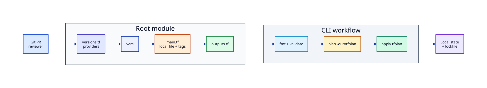

# Lab — Terraform Plan Review Workflow

## Lab Overview

**Purpose:** Practise the production Terraform loop used in pull requests: format, validate, save a plan, review it, apply **that** artefact, then destroy.

**Scenario:** Your platform team will not merge Infrastructure as Code (IaC) without a reviewed plan file. You must produce one for a small root module and prove apply matches the review.

**Expected outcome:** A lockfile committed locally, a binary `tfplan` you can show, successful apply of that plan, and a clean destroy.

!!! tip "This is a lab, not a tutorial"
    Concepts come from the Terraform track. Here you operate like CI: non-interactive flags and plan artefacts.

## Business Scenario

A SaaS startup stores environment metadata as versioned files (feature flags, banner text, owners). They use Terraform with the `hashicorp/local` provider so engineers can rehearse plan review before touching AWS. Policy: **no `apply -auto-approve` without a saved plan that passed review**.

## Learning Objectives

By the end of this lab, you will be able to:

- [ ] Author a pinned root module (`required_version`, `required_providers`, variables, outputs)
- [ ] Run `fmt`, `init`, `validate`, and `plan -out` non-interactively
- [ ] Read a plan and predict creates/updates before apply
- [ ] Apply a saved plan file (not a live re-plan)
- [ ] Destroy lab resources and leave no sensitive artefacts in Git

## Prerequisites

### Knowledge

- [Introduction to Terraform and IaC](../terraform/introduction-to-terraform-and-iac.md)
- [Installing Terraform and the CLI Workflow](../terraform/installing-terraform-and-the-cli-workflow.md)
- [Variables, Locals, and Outputs](../terraform/variables-locals-and-outputs.md)
- [Terraform in CI/CD Pipelines](../terraform/terraform-in-ci-cd-pipelines.md)

### Software

| Tool | Notes |
|------|--------|
| Terraform CLI **1.9+** (1.15.x ideal) | `terraform version` |
| Git | optional but recommended |
| Network once | to download `hashicorp/local` on first `init` |

**Estimated cost:** £0 (local provider only). No cloud account required.

## Architecture



## Environment

Any laptop or CI runner with Terraform installed. Work in an empty directory you can delete afterwards.

## Initial State

Empty workspace. You will create the root module from scratch, then operate it as if a teammate must approve your plan.

## Lab Tasks

### Task 1 — Scaffold the root module

**Objective:** Create a reviewable module layout.

**Background:** Production roots keep versions, variables, resources, and outputs in separate files for clearer pull request diffs.

**Instructions:**

```bash title="Terminal"
mkdir -p ~/rebash-lab-tf-plan && cd ~/rebash-lab-tf-plan

cat > versions.tf <<'EOF'
terraform {
  required_version = ">= 1.9.0"

  required_providers {
    local = {
      source  = "hashicorp/local"
      version = "~> 2.9"
    }
  }
}
EOF

cat > variables.tf <<'EOF'
variable "project" {
  type        = string
  description = "Short project key used in filenames and tags"
  default     = "rebash"
}

variable "environment" {
  type        = string
  description = "Environment name"
  default     = "lab"

  validation {
    condition     = contains(["lab", "dev", "staging"], var.environment)
    error_message = "environment must be lab, dev, or staging for this exercise."
  }
}

variable "banner" {
  type        = string
  description = "Customer-facing banner text"
  default     = "Plan review before apply."
}
EOF

cat > main.tf <<'EOF'
locals {
  tags = {
    project     = var.project
    environment = var.environment
    managed_by  = "terraform"
  }
  artefact_path = "${path.module}/generated/${var.project}-${var.environment}-banner.txt"
}

resource "local_file" "banner" {
  filename        = local.artefact_path
  content         = <<-EOT
    project     = ${var.project}
    environment = ${var.environment}
    banner      = ${var.banner}
    tags        = ${jsonencode(local.tags)}
  EOT
  file_permission = "0644"
}

resource "terraform_data" "review_marker" {
  input = {
    lesson = "lab-terraform-plan-review-workflow"
    project = var.project
  }
}
EOF

cat > outputs.tf <<'EOF'
output "banner_path" {
  description = "Path of the managed banner file"
  value       = local_file.banner.filename
}

output "content_md5" {
  description = "MD5 of banner content"
  value       = local_file.banner.content_md5
}

output "review_marker" {
  description = "Lab marker stored in terraform_data"
  value       = terraform_data.review_marker.output
}
EOF

cat > terraform.tfvars <<'EOF'
project     = "rebash"
environment = "lab"
banner      = "Welcome to REBASH Academy labs."
EOF

cat > .gitignore <<'EOF'
.terraform/
*.tfstate
*.tfstate.*
crash.log
tfplan
*.tfplan
EOF
```

!!! example "Expected output"
    Files listed by `ls` include `versions.tf`, `variables.tf`, `main.tf`, `outputs.tf`, `terraform.tfvars`, `.gitignore`.


**Validation:**

```bash title="Terminal"
test -f versions.tf && test -f main.tf && echo "scaffold OK"
```

### Task 2 — Format, init, and validate (CI style)

**Objective:** Run the same checks a pipeline runs before planning.

**Instructions:**

```bash title="Terminal"
export TF_IN_AUTOMATION=1
terraform fmt
terraform init -input=false
terraform validate
terraform fmt -check
```

!!! example "Expected output"
    `Success! The configuration is valid.` Lockfile `.terraform.lock.hcl` appears.


**Validation:**

```bash title="Terminal"
test -f .terraform.lock.hcl && terraform validate
```

### Task 3 — Create a saved plan artefact

**Objective:** Produce a binary plan for review — not an immediate apply.

**Instructions:**

```bash title="Terminal"
terraform plan -input=false -out=tfplan
terraform show -no-color tfplan | head -80
```

!!! example "Expected output"
    Plan shows **create** for `local_file.banner` and `terraform_data.review_marker`. File `tfplan` exists.


**Validation:**

```bash title="Terminal"
test -f tfplan
terraform show -json tfplan >/dev/null && echo "plan readable"
```

!!! warning "Treat plan files as sensitive"
    Even local plans can embed variable values. Do not commit `tfplan` (already gitignored).

### Task 4 — Simulate pull request review

**Objective:** Practise reading the plan like a reviewer.

**Background:** Reviewers ask: unexpected destroys? wrong filenames? secrets in content?

**Instructions:** Answer these in your notes while reading `terraform show tfplan`:

1. How many resources will be created?
2. What filesystem path will Terraform write?
3. What happens if you change `banner` after apply — update or replace?

Then introduce a deliberate surprise and re-plan:

```bash title="Terminal"
# Reviewer asks for a clearer filename — change local only after discussing
sed -i.bak 's/\${var.project}-\${var.environment}-banner.txt/\${var.project}-\${var.environment}-banner.v1.txt/' main.tf
# macOS/BSD sed used -i.bak; on GNU sed you may use sed -i

terraform fmt
terraform plan -input=false -out=tfplan
terraform show -no-color tfplan | head -60
```

!!! example "Expected output"
    Plan still creates (fresh lab) or shows path change intent clearly.


**Validation:** You can explain whether the filename change is in-place update or replace for `local_file`.

**Hint:** `local_file` replaces when `filename` changes because the path is ForceNew-style behaviour for that argument.

### Task 5 — Apply the reviewed plan only

**Objective:** Apply the artefact, not a new live plan.

**Instructions:**

```bash title="Terminal"
terraform apply -input=false tfplan
cat generated/rebash-lab-banner.v1.txt 2>/dev/null || cat generated/rebash-lab-banner.txt
terraform output
```

If your sed path differs, `ls generated/` and `cat` the file that exists.

!!! example "Expected output"
    Apply completes; outputs print `banner_path` and checksums.


**Validation:**

```bash title="Terminal"
test -f "$(terraform output -raw banner_path)"
terraform output -raw content_md5 | grep -E '^[a-f0-9]{32}$'
```

### Task 6 — Drift awareness and destroy

**Objective:** See drift, then tear down cleanly.

**Instructions:**

```bash
# Simulate out-of-band edit
BANNER_FILE="$(terraform output -raw banner_path)"
echo "DRIFT" >> "$BANNER_FILE"
terraform plan -input=false

terraform destroy -input=false -auto-approve
rm -f tfplan
```

!!! example "Expected output"
    Plan after drift proposes an update to restore content; destroy removes managed objects.


**Validation:**

```bash title="Terminal"
test ! -f "$BANNER_FILE"
```

## Validation

| Check | Pass criteria |
|-------|----------------|
| Pinning | `required_version` and `local ~> 2.9` present |
| Lockfile | `.terraform.lock.hcl` exists after init |
| Plan artefact | `tfplan` created before apply |
| Apply | Outputs resolve; banner file existed post-apply |
| Hygiene | `.gitignore` excludes state and plan files |
| Cleanup | Destroy removed managed files |

## Troubleshooting

| Symptoms | Possible causes | Resolution | Verification |
|----------|-----------------|------------|--------------|
| Provider download fails | Network/registry blocked | Check access to `registry.terraform.io` | `terraform init` |
| `validate` fails before init | Providers missing | Run `init` first | `terraform validate` |
| Apply differs from review | Re-planned instead of using `-out` | Always `apply tfplan` | Compare SHA of plan file in CI |
| `sed -i` confusion | GNU vs BSD sed | Edit `main.tf` in your editor instead | Re-run plan |
| Permission denied under `generated/` | Directory not writable | Ensure workspace is yours | `ls -ld .` |

## Challenge Extensions

- Split `lab` vs `dev` using `terraform.tfvars` files and `-var-file`
- Add a `terraform test` file that asserts output paths
- Encode the same workflow in GitHub Actions with `plan` artefact upload (see Terraform CI tutorial)
- Move state to a remote backend once you leave local labs

## Cleanup

```bash title="Terminal"
cd ~/rebash-lab-tf-plan
terraform destroy -input=false -auto-approve 2>/dev/null || true
cd ~
rm -rf ~/rebash-lab-tf-plan
```

No cloud spend — still delete state and plan files so secrets cannot leak from disk backups.

## Production Discussion

Production teams:

- Store plans as CI artefacts with retention and access control
- Separate plan and apply IAM roles (OIDC)
- Require human approval on destroy and on unexpected replaces
- Commit `.terraform.lock.hcl`; never commit `*.tfstate*`
- Prefer remote state with locking and encryption before a second engineer joins

## Best Practices

- `TF_IN_AUTOMATION=1` and `-input=false` in every pipeline job
- Reviewers read `terraform show` (or JSON plan) before approve
- Keep modules small; this lab’s layout scales to cloud providers unchanged
- Validation blocks catch bad environments early
- Destroy labs completely — leftover state confuses the next exercise

## Common Mistakes

| Mistake | Why it happens | Correct approach |
|---------|----------------|------------------|
| `apply -auto-approve` without `-out` | Convenience | Save and apply the reviewed plan |
| Committing `.terraform/` | Large binaries | Commit only the lockfile |
| Putting secrets in `banner` / tfvars | Demo haste | Use placeholders; mark sensitive later |
| Ignoring drift | “It still works” | Investigate every unexpected plan line |

## Success Criteria

You can demonstrate:

- A pinned root module with clear outputs
- A saved plan you can explain line-by-line
- Apply of that plan and proof via outputs
- Full destroy and gitignore hygiene

## Reflection Questions

1. Why is applying a saved plan safer than re-running plan in the apply job?
2. What belongs in Git for this root module on day one?
3. How would remote state change your cleanup and locking story?
4. How would you stop a plan that includes an unexpected destroy from reaching apply?

## Interview Connection

Expect questions on **plan vs apply**, **lockfiles**, **state sensitivity**, and **CI gates**. Use this lab as a concrete walkthrough. Continue with interview prompts in the [Terraform Interview Prep](../interview/terraform.md) guide and [Terraform in CI/CD Pipelines](../terraform/terraform-in-ci-cd-pipelines.md).

## Related Tutorials

- Track: [Terraform](../terraform/index.md)
- [Installing Terraform and the CLI Workflow](../terraform/installing-terraform-and-the-cli-workflow.md)
- [Terraform in CI/CD Pipelines](../terraform/terraform-in-ci-cd-pipelines.md)
- Cheat sheet: [Terraform Cheat Sheet](../cheatsheets/terraform.md)
- Learning path: [DevOps Engineer](../learning-paths/devops-engineer.md)
- Previous lab: [Linux Production Incident Triage](linux-production-incident-triage.md)

## References

1. [Terraform CLI: plan](https://developer.hashicorp.com/terraform/cli/commands/plan)
2. [Terraform CLI: apply](https://developer.hashicorp.com/terraform/cli/commands/apply)
3. [Dependency lock file](https://developer.hashicorp.com/terraform/language/files/dependency-lock)
4. [hashicorp/local provider](https://registry.terraform.io/providers/hashicorp/local/latest/docs)
