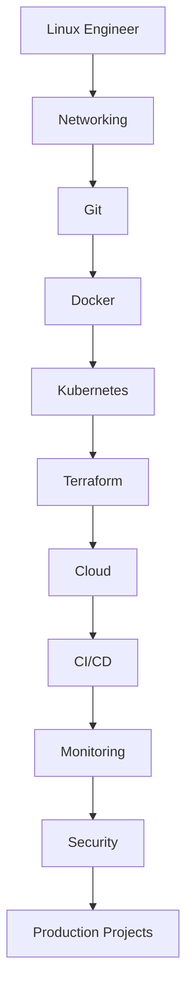

# Learning Paths

Choose a structured path based on your career goals. Each path builds on the previous sections
and ends with production-ready projects.

## Primary Path – DevOps Engineer

The recommended path for engineers building a full-stack DevOps skill set:

| Step | Section | Description |
|------|---------|-------------|
| 1 | [Linux](../linux/index.md) | Command line, system admin, shell scripting |
| 2 | [Networking](../networking/index.md) | TCP/IP, DNS, load balancing, troubleshooting |
| 3 | [Git](../git/index.md) | Version control and collaboration workflows |
| 4 | [Docker](../docker/index.md) | Containerization fundamentals |
| 5 | [Kubernetes](../kubernetes/index.md) | Container orchestration at scale |
| 6 | [Terraform](../terraform/index.md) | Infrastructure as Code |
| 7 | Cloud | AWS, Azure, or GCP specialization |
| 8 | [GitLab CI/CD](../gitlab/index.md) | Pipeline automation and GitOps |
| 9 | [Monitoring](../monitoring/index.md) | Observability and alerting |
| 10 | [Security](../security/index.md) | Hardening and compliance |
| 11 | [Projects](../projects/index.md) | Portfolio-ready production projects |

---

## Specialized Career Paths

### :material-aws: AWS Engineer

| Order | Topic | Link |
|-------|-------|------|
| 1 | Linux fundamentals | [Linux](../linux/index.md) |
| 2 | Networking basics | [Networking](../networking/index.md) |
| 3 | Infrastructure as Code | [Terraform](../terraform/index.md) |
| 4 | AWS core services | [AWS](../aws/index.md) |
| 5 | CI/CD on AWS | [GitLab](../gitlab/index.md) |
| 6 | Security & compliance | [Security](../security/index.md) |

### :material-microsoft-azure: Azure Engineer

| Order | Topic | Link |
|-------|-------|------|
| 1 | Linux fundamentals | [Linux](../linux/index.md) |
| 2 | Networking basics | [Networking](../networking/index.md) |
| 3 | Infrastructure as Code | [Terraform](../terraform/index.md) |
| 4 | Azure services | [Azure](../azure/index.md) |
| 5 | CI/CD pipelines | [GitLab](../gitlab/index.md) |
| 6 | Security & compliance | [Security](../security/index.md) |

### :material-google-cloud: Google Cloud Engineer

| Order | Topic | Link |
|-------|-------|------|
| 1 | Linux fundamentals | [Linux](../linux/index.md) |
| 2 | Networking basics | [Networking](../networking/index.md) |
| 3 | Infrastructure as Code | [Terraform](../terraform/index.md) |
| 4 | GCP services | [GCP](../gcp/index.md) |
| 5 | CI/CD pipelines | [GitLab](../gitlab/index.md) |
| 6 | Security & compliance | [Security](../security/index.md) |

### :material-security: DevSecOps Engineer

| Order | Topic | Link |
|-------|-------|------|
| 1 | Linux & networking | [Linux](../linux/index.md) |
| 2 | Container security | [Docker](../docker/index.md) |
| 3 | K8s security | [Kubernetes](../kubernetes/index.md) |
| 4 | CI/CD integration | [GitLab](../gitlab/index.md) |
| 5 | DevSecOps practices | [DevSecOps](../devsecops/index.md) |
| 6 | Cloud security | [Security](../security/index.md) |

### :material-kubernetes: Platform Engineer

| Order | Topic | Link |
|-------|-------|------|
| 1 | Linux & networking | [Linux](../linux/index.md) |
| 2 | Containers | [Docker](../docker/index.md) |
| 3 | Kubernetes deep dive | [Kubernetes](../kubernetes/index.md) |
| 4 | IaC & GitOps | [Terraform](../terraform/index.md) |
| 5 | Observability | [Monitoring](../monitoring/index.md) |
| 6 | Platform projects | [Projects](../projects/index.md) |

### :material-sitemap: Cloud Architect

| Order | Topic | Link |
|-------|-------|------|
| 1 | All cloud platforms | [AWS](../aws/index.md) · [Azure](../azure/index.md) · [GCP](../gcp/index.md) |
| 2 | Architecture patterns | [Architecture](../architecture/index.md) |
| 3 | IaC at scale | [Terraform](../terraform/index.md) |
| 4 | Security architecture | [Security](../security/index.md) |
| 5 | Production projects | [Projects](../projects/index.md) |

!!! tip "Not sure where to start?"
    Begin with [Getting Started](../getting-started/index.md) if you're new to DevOps,
    or jump directly into the section that matches your current role.
