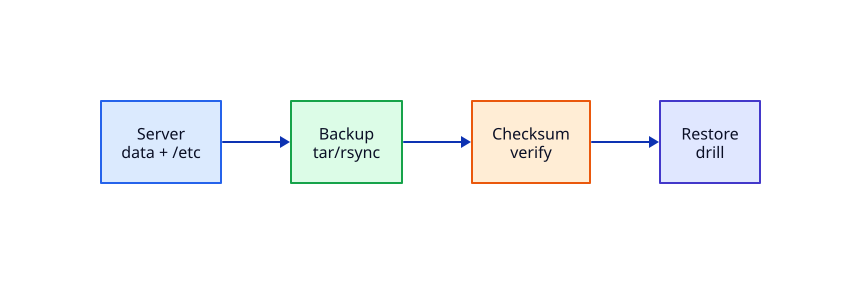

# Backup, Restore, and Recovery Drills

## Overview

A server without a tested restore is a hope strategy. Snapshots help, but **application-consistent backups** of `/etc`, app data, and secrets-handling procedures are what get you through mistakes, ransomware, and failed upgrades.

This tutorial inventories what to back up on a Linux app server, creates a tar/rsync backup with verification, destroys a copy on purpose, restores it, and records a minimal recovery checklist.

This is **Tutorial 25** in **Module 7: Advanced Linux Servers** — the Module 7 capstone skill.

## Prerequisites

- Complete Module 7 tutorials 21–24 (baseline through LVM)
- Complete [File Archiving and Compression](file-archiving-and-compression.md)
- Ubuntu lab VM with `sudo`

## Learning Objectives

By the end of this tutorial, you will be able to:

- [ ] List critical paths to back up on an app server
- [ ] Create verified tar and rsync backups
- [ ] Perform a restore drill with checksum proof
- [ ] Distinguish snapshots from backups
- [ ] Write a short recovery checklist for incidents

## Architecture

Source data → backup artefact → checksum verify → restore drill → proof.



## Theory

### What to back up on an app server

| Path / item | Why |
|-------------|-----|
| `/etc` (selectively) | nginx, sshd, sudoers, fstab, ssl metadata |
| App unit files | `/etc/systemd/system/*.service` |
| Application data | `/var/lib/myapp`, uploads, SQLite, etc. |
| TLS material | Keys — encrypt at rest; restrict access |
| Package manifest | `dpkg --get-selections` for rebuild hints |

Do **not** blindly back up caches, `/tmp`, or multi-GB logs without rotation.

### Snapshot vs backup

| | Snapshot | Backup |
|--|----------|--------|
| Purpose | Fast rollback on same system | Copy elsewhere for disaster |
| Survives disk loss? | Often no | Yes if off-box |
| App consistency | Must freeze/flush | Same concern |

Use both: snapshots for operator mistakes; off-box backups for disk/region loss.

### Verify or it did not happen

Always store a checksum (`sha256sum`) and restore to a scratch directory periodically. Untested backups fail in incidents.


### Secrets in backups

TLS private keys and `.env` files turn a backup share into a credential store. Encrypt backup artefacts (age/gpg) or use a secrets manager and restore certificates from a controlled vault. Restrict who can read backup mounts.

### Scheduling

Use a systemd timer or cron for nightly backups; alert if the checksum file is older than 36 hours. Pair with the Module 7 baseline reboot window so backups finish before kernel updates.


## Hands-on Lab

### Step 1 – Create sample app data

```bash
mkdir -p ~/rebash-app/{bin,data,config}
echo 'version=1' > ~/rebash-app/config/app.conf
echo 'user-data' > ~/rebash-app/data/state.txt
printf '%s\n' '#!/bin/sh' 'echo ok' > ~/rebash-app/bin/health.sh
chmod +x ~/rebash-app/bin/health.sh
# Fake /etc snippet copy for lab
mkdir -p ~/rebash-app/etc-snippet
cp /etc/hostname ~/rebash-app/etc-snippet/hostname
find ~/rebash-app -type f
```

**Expected output:** Config, data, and hostname snippet present.

### Step 2 – Tar backup with checksum

```bash
mkdir -p ~/rebash-backups
TS=$(date +%Y%m%d-%H%M%S)
BACKUP=~/rebash-backups/app-$TS.tar.gz
tar -C ~ -czf "$BACKUP" rebash-app
sha256sum "$BACKUP" | tee ~/rebash-backups/app-$TS.sha256
ls -lh "$BACKUP"
```

**Expected output:** `.tar.gz` and matching `.sha256` file.

### Step 3 – rsync copy

```bash
rsync -a --delete ~/rebash-app/ ~/rebash-backups/app-rsync/
find ~/rebash-backups/app-rsync -type f
```

**Expected output:** Mirror of app tree under `app-rsync`.

### Step 4 – Verify checksum and list tar

```bash
cd ~/rebash-backups
sha256sum -c app-$TS.sha256
tar -tzf "app-$TS.tar.gz" | head -20
```

**Expected output:** `OK` from sha256sum; tar lists `rebash-app/...` paths.

### Step 5 – Destroy and restore drill

```bash
rm -rf ~/rebash-app
test ! -d ~/rebash-app && echo 'app tree removed'
tar -C ~ -xzf ~/rebash-backups/app-$TS.tar.gz
cat ~/rebash-app/data/state.txt
~/rebash-app/bin/health.sh
```

**Expected output:** `user-data` restored; `health.sh` prints `ok`.

### Step 6 – Recovery checklist note

```bash
cat > ~/rebash-backups/RESTORE.md << 'EOF'
# App server restore checklist
1. Confirm incident / declare scope
2. Stop writers (systemctl stop myapp / nginx if needed)
3. Verify backup checksum
4. Restore to staging path first
5. Promote / fix permissions / restart units
6. Smoke test URLs and logs
7. Record timeline + improve backup job
EOF
cat ~/rebash-backups/RESTORE.md
```

**Expected output:** Checklist saved beside backups.

### Step 7 – Cleanup lab artefacts (optional keep backups)

```bash
# Keep ~/rebash-backups for your notes, or remove:
# rm -rf ~/rebash-app ~/rebash-backups
true
```

## Validation

| Check | Pass criteria |
|-------|----------------|
| Backup exists | tar.gz + sha256 present |
| Verify | `sha256sum -c` OK |
| Restore | state.txt and health.sh work after delete |
| Checklist | RESTORE.md written |

## Code Walkthrough

| Command | Description |
|---------|-------------|
| `tar -czf` | Create compressed archive |
| `sha256sum` | Integrity fingerprint |
| `rsync -a` | Incremental mirror |
| `tar -xzf` | Extract restore |

## Code Examples

```bash
# Daily-style rsync to a mounted backup disk (sketch)
# rsync -aHAX --delete /var/lib/myapp/ /mnt/backup/myapp/
# Prefer off-box copies for disaster scenarios
```

## Security Considerations

Encrypt backups that contain keys or PII; restrict backup share permissions; do not store production private keys in unencrypted tar on laptops; rotate credentials if a backup escapes.

## Common Mistakes

| Mistake | Why it hurts | Fix |
|---------|--------------|-----|
| Never restoring | False confidence | Schedule drills |
| Backing up only root disk snapshot | App consistency / off-box gaps | App-aware + off-site |
| Absolute tar paths | Dangerous extracts | Prefer `-C` relative |
| No checksum | Silent corruption | sha256 + verify |

## Best Practices

1. 3-2-1 rule: copies, media types, off-site
2. Automate with systemd timers or cron; alert on failure
3. Restore to a scratch host monthly
4. Document RPO/RTO with stakeholders
5. Include package lists and infra-as-code pointers

## Troubleshooting

| Symptom | Likely cause | Resolution |
|---------|--------------|------------|
| Checksum fail | Truncated copy | Re-run backup; check disk |
| Permission denied on restore | Ownership | Extract with sudo; fix chown |
| rsync deleted too much | `--delete` misuse | Dry-run first (`-n`) |
| Huge backups | Logs/cache included | Exclude lists |

## Summary

You produced a verified backup, destroyed data on purpose, restored it, and wrote a recovery checklist — the operational proof that Module 7 servers can survive mistakes.

## Interview Questions

**Q1 — Snapshot versus backup?**

*Sample answer:* Snapshots are fast local rollback; backups are durable copies that survive disk/site loss when stored off-box.

**Q2 — How do you know a backup is good?**

*Sample answer:* Checksums plus a successful restore drill to a non-production path.

**Q3 — What must be backed up on an nginx app VM?**

*Sample answer:* Site configs, TLS material (protected), unit files, app data, and enough OS config to rebuild.

**Q4 — Why is `--delete` on rsync dangerous?**

*Sample answer:* It mirrors removals — a bad source can wipe the backup target.

**Q5 — What is RPO?**

*Sample answer:* Recovery Point Objective — how much data you can afford to lose in time.

## Related Tutorials

- Previous: [Server Storage — LVM and fstab](server-storage-lvm-and-fstab.md)
- [File Archiving and Compression](file-archiving-and-compression.md)
- [Linux Security Hardening Basics](linux-security-hardening-basics.md)
- Lab: [Linux Production Incident Triage](../labs/linux-production-incident-triage.md)
- [Docker](../docker/index.md)

## References

1. [rsync(1)](https://download.samba.org/pub/rsync/rsync.html)
2. [GNU tar manual](https://www.gnu.org/software/tar/manual/)
3. [3-2-1 backup rule (industry practice)](https://www.veeam.com/blog/321-backup-rule.html)
