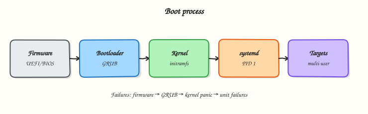

# Boot Process and Filesystem Hierarchy

## Overview

When a cloud instance fails to come up, you need the boot chain and FHS landmarks. This tutorial maps both.

This is **Tutorial 2** in **Module 1: Linux Fundamentals** of the REBASH Academy **Linux for Cloud & DevOps Engineers** series — written for administrators, DevOps engineers, SREs, and platform engineers operating production Linux.

## Prerequisites

- Linux Fundamentals — Distributions and Architecture
- Terminal access with a regular user account (sudo where noted)

## Learning Objectives

By the end of this tutorial, you will be able to:

- [ ] Apply the core ideas of “Boot Process and Filesystem Hierarchy” on a real Linux host
- [ ] Use modern tools (`ip`/`ss`, `systemctl`/`journalctl`) where they apply
- [ ] Complete the lab under `~/rebash-linux/` with clear outputs
- [ ] Relate this topic to Cloud, DevOps, and production operations
- [ ] Explain the failure modes you would check first in an incident

## Architecture

Linux ops work sits between humans/automation and the kernel, services, and network. This topic’s control points are shown below.



## Theory

### What it is

The **boot process** is the ordered path from firmware power-on to a usable multi-user system: firmware (BIOS or UEFI), bootloader (usually GRUB), kernel plus initial RAM filesystem (initramfs), then PID 1 (**systemd**), which reaches a default **target** such as `multi-user.target`. On cloud images, **cloud-init** often runs next to apply instance metadata, Secure Shell (SSH) keys, hostname, and first-boot packages. The **Filesystem Hierarchy Standard (FHS)** is the conventional layout of directories under `/` so packages, scripts, and operators know where configuration, binaries, logs, and runtime state belong.

### Why it matters

When a Virtual Machine (VM) fails to come up, hangs in emergency mode, or loses `/etc` after a disk mistake, you diagnose along this chain. Misplaced data — logs filling `/` instead of `/var`, or apps writing under `/tmp` that vanish on reboot — looks like an application fault but is often layout or mounts. FHS landmarks help separate Operating System (OS) state from application data on cloud volumes.

### How it works

Firmware initialises hardware (or the hypervisor presents virtual firmware). The bootloader loads the kernel and initramfs; the kernel mounts the real root (often after initramfs helpers) and starts systemd. systemd mounts filesystems, starts units in dependency order, and enters the default target. Rescue and emergency targets skip most services so you can remount root read-write and repair `/etc`, `fstab`, or disk labels. Persist mounts with `/etc/fstab` or systemd `.mount` units; inspect timing with `systemd-analyze` and `systemd-analyze blame`.

### Key concepts and comparisons

| Stage | Role |
|-------|------|
| Firmware | Hardware init; boot device selection |
| Bootloader | Loads kernel + initramfs |
| Kernel / initramfs | Drivers, early root mount, start PID 1 |
| systemd target | Desired system state (rescue vs multi-user) |
| cloud-init | Instance customisation after first boot stages |

| Path | Purpose |
|------|---------|
| `/etc` | Host configuration |
| `/var`, `/var/log` | Variable data and traditional logs |
| `/boot` | Kernel, initramfs, bootloader configs |
| `/proc`, `/sys`, `/run` | Kernel interfaces and runtime state |
| `/home`, `/opt`, `/srv` | Users, optional software, site data |

Merged `/usr` layouts are common. Separate data disks often mount at `/var`, `/data`, or `/mnt/data`.

### Common pitfalls

- Treating hung cloud-init as “kernel failure” without checking `systemctl status cloud-init` and the journal.
- Editing GRUB or `fstab` without a recovery plan; a wrong UUID drops you into emergency mode.
- Assuming one root volume has infinite space — `/var` or container storage fills first.
- Confusing `/tmp` (often cleared on reboot) with `/var/tmp` (preserved).
- Looking only at `systemd-analyze` totals without checking failed units and mount order.

## Hands-on Lab

Create a workspace for this tutorial.

```bash
mkdir -p ~/rebash-linux/lab02 && cd ~/rebash-linux/lab02
```

**Focus:** trace boot with systemd-analyze; map FHS directories; document mounts

### Step 1 – Boot and FHS map

```bash
systemd-analyze 2>/dev/null || true
systemctl get-default
{
  echo "# FHS landmarks"
  for d in / /etc /var /var/log /home /usr /opt /boot /proc /sys /run; do
    printf '%s -> ' "$d"
    readlink -f "$d" 2>/dev/null || echo missing
  done
} | tee fhs-map.txt
findmnt -T / | tee root-mount.txt
```

### Final step – Cleanup note

```bash
# Keep ~/rebash-linux/ for later tutorials; destroy disposable cloud resources from this lab
```

## Validation

- [ ] Lab commands run under `~/rebash-linux/lab02/`
- [ ] You can explain each Theory bullet in your own words
- [ ] You used modern tooling where applicable (`ip`/`ss`, `systemctl`/`journalctl`)
- [ ] You can describe one production failure mode for this topic

## Code Walkthrough

Production Linux practice for **Boot Process and Filesystem Hierarchy** always combines:

1. Inspect before you change (`status`, `df`, `ip`, logs)
2. Prefer reversible, documented changes (config management, drop-ins)
3. Capture evidence (command output, journal snippets) for handovers
4. Prefer `systemctl`/`journalctl` and `ip`/`ss` over legacy tools
5. Least privilege — escalate with `sudo` only when required

Keep runbooks short enough to follow at 03:00. Automate the boring checks; keep humans for judgement.

## Security Considerations

- Treat host access and sudo as privileged — audit who can do what
- Never paste secrets into shell history, tickets, or screenshots
- Validate device names and paths before destructive disk or `rm` operations
- Prefer key-based SSH and deny password auth on internet-facing hosts
- Collect logs centrally; restrict who can read authentication and audit trails

## Common Mistakes

!!! warning "Using legacy networking tools by default"
    `ifconfig`/`netstat` are missing or incomplete on modern images. **Fix:** use `ip` and `ss`.

!!! warning "Editing vendor unit files in place"
    Package upgrades overwrite `/lib/systemd/system`. **Fix:** `systemctl edit` drop-ins under `/etc`.

!!! warning "Trusting df without checking inodes and mounts"
    A full `/var` or exhausted inodes looks different from root. **Fix:** `df -h`, `df -i`, and `findmnt`.

## Best Practices

- Golden images + config as code over snowflake hosts
- Alert on symptoms (failed units, disk, load) with runbooks attached
- Time-sync (chrony) everywhere — logs and TLS depend on it
- Separate OS and data volumes on Cloud VMs
- Practise restore and rescue paths before you need them

## Troubleshooting

| Symptom | Likely cause | Fix |
|---------|--------------|-----|
| Permission denied | Mode/owner/ACL/MAC | `namei -l`, `id`, `getfacl`, SELinux/AppArmor logs |
| No route / timeout | Routing, DNS, firewall | `ip route`, `dig`, `ss`, security groups |
| Service won’t start | Unit/config/deps | `systemctl status`, `journalctl -u`, config `-t` |
| Disk full | Logs, containers, deleted-open | `df`/`du`, `lsof +L1`, rotate/expand |
| High load | CPU, I/O wait, thrash | `vmstat`, `iostat`, `ps` |

## Summary

**Boot Process and Filesystem Hierarchy** is essential for Cloud and DevOps engineers operating Linux hosts. Practise the lab until the inspection path is muscle memory, then continue the track.

## Interview Questions

1. How does this topic show up when operating Cloud VMs or Kubernetes nodes?
2. What would you check first if this area misbehaves in production?
3. Which modern Linux tools replace older equivalents here?
4. What security control should accompany this capability?
5. How would you automate verification of this topic in CI or a cron/timer job?

!!! tip "Sample answer — question 2"
    Start with blast radius and recent changes, then gather host signals (`systemctl --failed`, `df`, `ip`/`ss`, `journalctl`) before making changes. Fix forward with evidence, not guesswork.

## Related Tutorials

- [Linux for Cloud & DevOps – Category Overview](index.md)
- [Linux Fundamentals — Distributions and Architecture](linux-fundamentals-distributions-and-architecture.md) *(previous)*
- [Essential Linux Commands](essential-linux-commands.md) *(next)*
- [Learning Paths](../learning-paths/index.md)

## References

- [Linux man-pages project](https://www.kernel.org/doc/man-pages/)
- [systemd documentation](https://systemd.io/)
- [Filesystem Hierarchy Standard](https://refspecs.linuxfoundation.org/FHS_3.0/fhs-3.0.html)
- Track index: [Linux for Cloud & DevOps Engineers](index.md)
