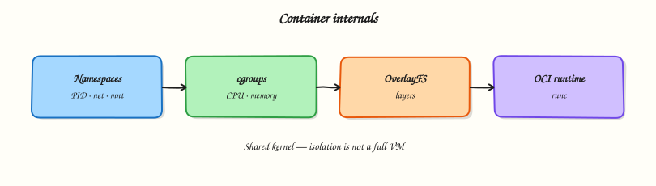

# Containers — Namespaces, cgroups, OverlayFS, and OCI

## Overview

Kubernetes nodes are Linux. A **container** is not a tiny virtual machine (VM). It is a normal process with an isolated view of the system (**namespaces**) and resource limits (**control groups / cgroups**), usually with a layered root filesystem such as **OverlayFS**. The **Open Container Initiative (OCI)** defines image and runtime standards so engines (Docker, containerd, CRI-O) can build and run portable images.

When a pod is Out-Of-Memory (OOM) killed, when a node disk fills with image layers, or when “it works in Docker but not in the cluster”, the real story is often namespaces, cgroups, and filesystems on the host. Brand names sit on top of these kernel features.

In production, Site Reliability Engineering (SRE) and platform engineers debug both the YAML and the node: `lsns`, cgroup paths under `/sys/fs/cgroup`, `findmnt` for overlay mounts, and runtime versions (`runc` / `crun`). Understanding the kernel contract makes Docker and Kubernetes less magical and easier to operate.

This is **Tutorial 22** in **Module 14: Containers & Cloud** of the REBASH Academy **Linux for Cloud & DevOps Engineers** series. It is written for Linux administrators, DevOps engineers, SREs, and platform engineers. By the end, you will have host-level evidence of namespaces, cgroups, and overlay/runtime facts you can explain in an interview.

## Prerequisites

- [SELinux, AppArmor, Fail2Ban, Auditd, and PAM](selinux-apparmor-fail2ban-auditd-pam.md)
- A **practice Ubuntu 22.04/24.04 VM** with sudo
- Optional: Docker or Podman installed (lab works with kernel tools alone; runtime steps are optional extras)
- Do **not** run heavy container clean-ups on a shared production node

## Learning Objectives

By the end of this tutorial, you will be able to:

- [ ] Explain how namespaces and cgroups differ (what you see vs what you can consume)
- [ ] List namespaces with `lsns` and read your process cgroup path
- [ ] Detect OverlayFS mounts and relate them to image layers
- [ ] Identify OCI runtime pieces (`runc`/`crun`/engine) when present
- [ ] Capture a container-internals evidence pack under `~/rebash-linux/lab22`

## Architecture

Container engines sit above an OCI runtime. The runtime asks the kernel for namespaces, cgroups, and a root filesystem (often OverlayFS). The application process runs with that isolated view and those limits.



## Theory

### What it is

**Namespaces** isolate what a process can *see*: process IDs (PID), network, mounts, hostname (UTS), Inter-Process Communication (IPC), user IDs, cgroup view, and time.

**cgroups** limit and account what a process can *consume*: CPU, memory, I/O, PIDs. Modern systems use **cgroup v2** under `/sys/fs/cgroup`.

**OverlayFS** stacks read-only image layers under a writable upper layer (copy-on-write).

**OCI** defines the image format and the runtime lifecycle (`create`, `start`, …). Engines add UX, networking plugins, and distribution.

```bash
lsns
cat /proc/self/cgroup
findmnt -t overlay 2>/dev/null | head || true
command -v runc; command -v crun; command -v docker; command -v podman
```

### Why it matters

Node disk fill, noisy-neighbour CPU, and mysterious OOM kills are kernel-feature issues underneath the container brand. Ops roles debug the host as much as the manifest. Interviewers expect you to say “namespaces isolate; cgroups limit” without confusing them with VMs.

### How it works

1. **Engine** pulls/builds an OCI image (layers + config).
2. **Runtime** (`runc`/`crun`) creates namespaces and joins/creates cgroups.
3. **Rootfs** is assembled (often OverlayFS) and the entrypoint starts as PID 1 *inside* the PID namespace.
4. **Host tools** still see the process: `ps`, `lsns`, `systemd-cgls`, `/sys/fs/cgroup`.

You can also explore namespaces without Docker using `unshare` / `nsenter` (careful: practice VM only).

### Key concepts and comparisons

| Mechanism | Isolates / limits |
|-----------|-------------------|
| Namespaces | What the process can *see* |
| cgroups | What the process can *consume* |
| OverlayFS | Layered filesystem view |
| OCI runtime | Standard create/start lifecycle |

| Stack piece | Role |
|-------------|------|
| Engine (Docker / containerd) | Images, API, UX |
| OCI runtime (`runc` / `crun`) | Kernel plumbing |
| Kernel | Namespaces, cgroups, OverlayFS |

### Common pitfalls

- Treating containers as strong security boundaries without MAC, user namespaces, and least privilege.
- Ignoring cgroup OOM kills while chasing application “random exits”.
- Filling the node with image layers and container logs under `/var/lib`.
- Debugging only inside the container when `lsns` / cgroup paths on the host show the truth.
- Assuming PID 1 behaviour inside containers matches a full systemd operating system.

## Hands-on Lab

### Objective

On a practice Ubuntu VM, inspect namespaces and cgroups, create a short-lived user namespace demo with `unshare`, check for OverlayFS / runtime tools, and save evidence under `~/rebash-linux/lab22`.

### Prerequisites

- Ubuntu 22.04/24.04 with `util-linux` (`lsns`, `unshare`, `findmnt`)
- sudo for some cgroup listings
- Optional: Docker or Podman for Task 3 extras

### Lab environment

Workspace: `~/rebash-linux/lab22`

``` {.bash .ra-terminal title="Terminal"}
mkdir -p ~/rebash-linux/lab22 && cd ~/rebash-linux/lab22
set -euo pipefail
whoami | tee admin-user.txt
uname -r | tee kernel.txt
cat /proc/self/cgroup | tee self-cgroup-initial.txt
test -n "$(command -v lsns)"
test -n "$(command -v unshare)"
```

!!! example "Expected output"
    kernel and cgroup files exist; `lsns` and `unshare` are available.


### Real-world scenario

A Kubernetes node shows high disk use and occasional OOM kills. Before you blame the app YAML, you need host-level proof: which namespaces exist, how cgroups are mounted, whether overlay mounts are piling up, and which OCI runtime the engine uses. You practise that inspection path on a lab VM.

### Step-by-step tasks

#### Task 1 – Namespaces inventory and a safe unshare demo

``` {.bash .ra-terminal title="Terminal"}
cd ~/rebash-linux/lab22
set -euo pipefail

lsns | tee lsns.txt
lsns -t pid,net,mnt,uts,user 2>/dev/null | tee lsns-filtered.txt || lsns | tee lsns-filtered.txt

# Short-lived UTS namespace: hostname change must NOT affect the host
HOST_BEFORE="$(hostname)"
unshare --uts /bin/bash -c 'hostname rebash-lab22-ns; hostname' | tee unshare-uts.txt
HOST_AFTER="$(hostname)"
echo "host_before=$HOST_BEFORE" | tee hostname-check.txt
echo "host_after=$HOST_AFTER" | tee -a hostname-check.txt
test "$HOST_BEFORE" = "$HOST_AFTER"
grep -F 'rebash-lab22-ns' unshare-uts.txt

# Show your process namespace IDs from /proc
ls -l /proc/self/ns | tee self-ns.txt
```

!!! example "Expected output"
    `lsns.txt` lists namespaces; `unshare-uts.txt` shows the temporary hostname; host hostname unchanged.


#### Task 2 – cgroup v2 paths and controllers

``` {.bash .ra-terminal title="Terminal"}
cd ~/rebash-linux/lab22
set -euo pipefail

findmnt /sys/fs/cgroup | tee cgroup-mount.txt
# cgroup.controllers lists available controllers on cgroup v2
if [[ -f /sys/fs/cgroup/cgroup.controllers ]]; then
  cat /sys/fs/cgroup/cgroup.controllers | tee cgroup-controllers.txt
  echo 'cgroup_v2=yes' | tee cgroup-version.txt
else
  echo 'cgroup_v2=no_or_hybrid' | tee cgroup-version.txt
  ls /sys/fs/cgroup | head | tee cgroup-controllers.txt
fi

cat /proc/self/cgroup | tee self-cgroup.txt
# If systemd is present, show a small slice of the tree
systemd-cgls --no-pager 2>/dev/null | head -n 40 | tee systemd-cgls.txt || \
  echo 'systemd-cgls not available' | tee systemd-cgls.txt

# Memory pressure / basic facts (read-only)
grep -E 'MemTotal|MemAvailable' /proc/meminfo | tee meminfo-snip.txt
```

!!! example "Expected output"
    cgroup mount and controllers (or honest hybrid note); `self-cgroup.txt` non-empty.


#### Task 3 – OverlayFS, OCI runtime detection, optional engine

``` {.bash .ra-terminal title="Terminal"}
cd ~/rebash-linux/lab22
set -euo pipefail

findmnt -t overlay 2>/dev/null | tee overlay-mounts.txt || true
if [[ ! -s overlay-mounts.txt ]]; then
  echo 'no overlay mounts right now (normal without running containers)' | tee overlay-mounts.txt
fi

{
  echo "runc=$(command -v runc || true)"
  echo "crun=$(command -v crun || true)"
  echo "docker=$(command -v docker || true)"
  echo "podman=$(command -v podman || true)"
  echo "containerd=$(command -v containerd || true)"
} | tee runtime-paths.txt

if command -v runc >/dev/null 2>&1; then runc --version 2>&1 | tee runc-version.txt; else echo 'runc absent' | tee runc-version.txt; fi
if command -v docker >/dev/null 2>&1; then
  docker version 2>&1 | head -n 20 | tee docker-version.txt
  # Optional tiny pull-less demo if docker works: run busybox echo (needs network/image)
  # Skip automatic pull in locked-down labs — document only
  echo 'docker present — optional: docker run --rm public.ecr.aws/docker/library/busybox:1.36 echo ok' | tee docker-note.txt
else
  echo 'docker absent' | tee docker-version.txt
  echo 'engine optional for this lab' | tee docker-note.txt
fi

# Disk hint for image stores (common paths)
du -sh /var/lib/docker 2>/dev/null | tee docker-disk.txt || echo 'no /var/lib/docker' | tee docker-disk.txt
du -sh /var/lib/containerd 2>/dev/null | tee containerd-disk.txt || echo 'no /var/lib/containerd' | tee containerd-disk.txt

tar -czf container-internals-evidence.tgz \
  admin-user.txt kernel.txt \
  lsns.txt lsns-filtered.txt unshare-uts.txt hostname-check.txt self-ns.txt \
  cgroup-mount.txt cgroup-controllers.txt cgroup-version.txt self-cgroup.txt \
  systemd-cgls.txt meminfo-snip.txt \
  overlay-mounts.txt runtime-paths.txt runc-version.txt docker-version.txt docker-note.txt \
  docker-disk.txt containerd-disk.txt

ls -l container-internals-evidence.tgz | tee evidence-ls.txt
test -s container-internals-evidence.tgz
```

!!! example "Expected output"
    runtime paths file exists; overlay note or mounts listed; evidence tarball non-empty.


### Validation steps

- [ ] `lsns.txt` lists namespaces on the host
- [ ] `unshare` UTS demo changed hostname only inside the namespace
- [ ] cgroup mount / controllers captured
- [ ] Overlay and runtime detection files exist (even if “absent”)
- [ ] `container-internals-evidence.tgz` exists under `~/rebash-linux/lab22`

### Common errors and fixes

| Error | Cause | Fix |
|-------|-------|-----|
| `unshare: operation not permitted` | Restricted environment | Use a full VM; some shared hosts block namespace creation |
| No overlay mounts | No containers running | Expected — keep the note file |
| `docker: permission denied` | User not in `docker` group | Use `sudo docker` on practice VM, or skip engine extras |
| Confusing cgroup v1 paths | Older/hybrid setup | Record what you see; prefer documenting v2 `cgroup.controllers` when present |

### Challenge exercise

Write `~/rebash-linux/lab22/ns-report.sh` that prints: count of namespaces from `lsns`, whether `/sys/fs/cgroup/cgroup.controllers` exists, and whether any of `runc`/`crun`/`docker`/`podman` is on `PATH`. Save output to `ns-report.out` and exit 0 on success.

### Learning outcomes

- Separated “isolation” (namespaces) from “limits” (cgroups)
- Used `unshare` safely for a UTS demo
- Inspected cgroup v2 and overlay/runtime signals on the host
- Packed evidence for node-level container debugging

### Cleanup

``` {.bash .ra-terminal title="Terminal"}
cd ~/rebash-linux/lab22
set -euo pipefail
# No persistent namespaces from the UTS demo
# If you started containers manually, remove them yourself
# Keep container-internals-evidence.tgz if useful
```

## Validation

- [ ] Lab finished under `~/rebash-linux/lab22/` with evidence files
- [ ] You can explain namespaces vs cgroups in one clear sentence each
- [ ] You can relate OverlayFS to image layers and node disk growth
- [ ] You know where OCI runtimes fit under Docker/Kubernetes

## Code Walkthrough

Host-level container debugging usually follows this order:

1. **See isolation** — `lsns`, `/proc/<pid>/ns`  
2. **See limits** — `/proc/<pid>/cgroup`, `/sys/fs/cgroup`, OOM logs  
3. **See filesystem** — `findmnt -t overlay`, disk under `/var/lib/...`  
4. **See runtime** — engine + `runc`/`crun` versions  
5. **Change least first** — fix requests/limits and image GC before exotic kernel tweaks  

## Security Considerations

- Containers are not a full security boundary by themselves  
- Prefer non-root containers, read-only rootfs, and drop capabilities  
- Combine with MAC (AppArmor/SELinux) and seccomp profiles  
- Limit who can talk to the Docker/containerd socket (root-equivalent)  
- Scan images and pin digests in production pipelines  

## Common Mistakes

!!! warning "Calling a container a lightweight VM"
    It shares the host kernel. **Fix:** say “isolated process with namespaces and cgroups”; use VMs when you need a separate kernel.

!!! warning "Debugging only inside the container"
    Node pressure and overlay growth are host facts. **Fix:** check `df`, `lsns`, cgroup OOM, and runtime disk paths on the node.

!!! warning "Ignoring cgroup memory limits"
    The kernel OOM-kills the cgroup; the app looks “random”. **Fix:** read events under the cgroup, `dmesg`/`journalctl -k`, and right-size limits.

!!! warning "Leaving docker.sock world-accessible"
    Socket access is effectively root. **Fix:** restrict group membership; prefer rootless or moderated APIs in platforms.

## Best Practices

- Standardise on cgroup v2-capable node images  
- Set resource requests/limits with evidence from monitoring  
- Garbage-collect images and manage container log size  
- Know your runtime chain: kubelet → CRI → containerd → `runc`/`crun`  
- Practise host inspection before the first production page-out  

## Troubleshooting

| Symptom | Likely cause | Fix |
|---------|--------------|-----|
| OOMKilled | cgroup memory limit / node pressure | Raise limit carefully or fix leak; check node `MemAvailable` |
| Disk full on node | Images, overlays, logs | `du` on `/var/lib/containerd` or docker; prune safely |
| Network weird in pod | netns / CNI / NetworkPolicy | Debug from host `ip netns` / CNI docs — not only `curl` in pod |
| `operation not permitted` | seccomp/AppArmor/caps | Inspect securityContext and MAC profiles |
| Slow pulls | Registry / disk I/O | Check `iostat`, mirror registry, slim images |

## Summary

Containers are kernel features plus an OCI runtime contract. Namespaces isolate views; cgroups limit resources; OverlayFS layers filesystems; engines make it usable. Next, practise a disciplined host debugging loop in [Troubleshooting Linux Systems](troubleshooting-linux-systems.md).

## Interview Questions

**1. In one sentence each, what do namespaces and cgroups do?**

??? success "Reveal answer"
    **Namespaces** change what a process can *see* (PID list, network stack, mounts, hostname, and more). **cgroups** limit and account what a process can *consume* (CPU, memory, I/O, PIDs). Interviewers listen for this see-vs-consume split.

**2. Why is a container not a virtual machine?**

??? success "Reveal answer"
    A VM runs a guest kernel on a hypervisor. A container is a process on the **host kernel** with isolation and limits applied. That is why kernel CVEs and host tuning affect all containers on the node.

**3. How does OverlayFS relate to Docker/container image layers?**

??? success "Reveal answer"
    Image layers are usually stacked as read-only lower layers with a writable upper layer. OverlayFS makes that stack look like one root filesystem. Deleted data and unused images can still consume disk until garbage collection — node `df` matters.

**4. A pod is OOMKilled. Where do you look on the Linux node?**

??? success "Reveal answer"
    Check the container/pod cgroup memory events, node `journalctl -k` / `dmesg` for OOM, `free`/`MemAvailable`, and whether limits in the manifest are too low or the app leaked. Do not restart forever without reading cgroup evidence.

**5. What is the OCI runtime’s job compared to Docker/containerd?**

??? success "Reveal answer"
    Docker/containerd handle images, API, and higher-level lifecycle. An OCI runtime such as `runc` or `crun` performs the low-level create/start work: namespaces, cgroups, rootfs, and exec of the entrypoint. Kubernetes talks CRI to a runtime that ultimately uses OCI.

**6. How can you demonstrate a namespace on a host without Docker?**

??? success "Reveal answer"
    Use `unshare` (for example `--uts`) to change hostname inside a new namespace and show the host hostname is unchanged. Use `lsns` and `/proc/self/ns` to list namespace inodes. Keep demos on a practice VM.

**7. Why can access to `docker.sock` be dangerous?**

??? success "Reveal answer"
    Clients of the Docker socket can often run privileged containers and mount the host filesystem — effectively **root on the host**. Restrict membership, prefer rootless where possible, and treat socket access as highly privileged in audits.

## Related Tutorials

- [Linux for Cloud & DevOps – Overview](index.md)
- [SELinux, AppArmor, Fail2Ban, Auditd, and PAM](selinux-apparmor-fail2ban-auditd-pam.md) *(previous)*
- [Troubleshooting Linux Systems](troubleshooting-linux-systems.md) *(next)*
- [Introduction to Containers and Docker](../docker/introduction-to-containers-and-docker.md) *(Docker track)*

## References

- [`namespaces(7)`](https://man7.org/linux/man-pages/man7/namespaces.7.html) — Linux namespaces  
- [`cgroups(7)`](https://man7.org/linux/man-pages/man7/cgroups.7.html) — control groups  
- [OCI Runtime Specification](https://github.com/opencontainers/runtime-spec) — OCI runtime  
- [OCI Image Specification](https://github.com/opencontainers/image-spec) — OCI image  
- Track index: [Linux for Cloud & DevOps Engineers](index.md)
