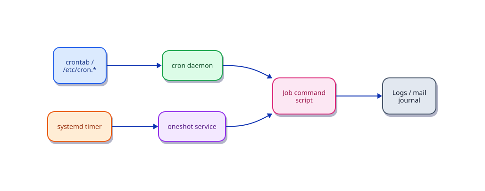

# Cron and Task Scheduling

## Overview

Linux systems need reliable ways to run maintenance tasks — backups, log rotation, certificate renewal, and health checks — without human intervention. **cron** is the classic time-based scheduler: it runs commands at specified minute, hour, day, and month intervals. System-wide cron directories under `/etc/cron.*` handle distribution maintenance, while user crontabs manage per-user jobs.

Modern distributions also offer **systemd timers** as an alternative with better logging, dependency awareness, and calendar expressions. Understanding both cron and timers helps you choose the right tool and debug missed jobs in production.

This tutorial is part of **Module 6: Storage, Logs, Networking & Operations** in the REBASH Academy Linux series. You will learn crontab syntax, system cron layout, build a real backup cron job, and compare cron with systemd timers.

## Prerequisites

- Complete [Shell Scripting Fundamentals](shell-scripting-fundamentals.md) or equivalent experience
- A Linux VM or cloud instance with cron installed (`cron` on Debian/Ubuntu, `crond` on RHEL)
- `sudo` privileges for system cron and timer exercises
- Write access to `/tmp` or a home directory for lab files

## Learning Objectives

By the end of this tutorial, you will be able to:

- [ ] Read and write crontab entries using standard five-field syntax
- [ ] Distinguish user crontabs from `/etc/cron.d`, `/etc/cron.daily`, and related directories
- [ ] Build a production-style backup cron job with logging and error handling
- [ ] Compare cron with systemd timers and choose the appropriate scheduler
- [ ] Diagnose why scheduled jobs fail or never run

## Architecture

Schedulers wake jobs by calendar or interval; cron and systemd timers both end in a user or system command with logs you can audit.



## Theory

### Crontab syntax

Each cron line has five time fields followed by the command:

```text
┌───────────── minute (0–59)
│ ┌───────────── hour (0–23)
│ │ ┌───────────── day of month (1–31)
│ │ │ ┌───────────── month (1–12)
│ │ │ │ ┌───────────── day of week (0–7, 0 and 7 = Sunday)
│ │ │ │ │
* * * * * command-to-run
```

Special strings in some implementations:

| String | Meaning |
|--------|---------|
| `@reboot` | Run once at startup |
| `@daily` | Once per day at midnight |
| `@hourly` | Once per hour |
| `@weekly` | Once per week |
| `@monthly` | First day of month, midnight |

Use `%` carefully in crontab — it means newline to cron; escape as `\%` when needed.

### User vs system crontabs

| Location | Managed by | Purpose |
|----------|------------|---------|
| `crontab -e` (user) | Individual user | Personal automation; runs as that user |
| `/etc/crontab` | root | System jobs with explicit user column |
| `/etc/cron.d/` | root | Package drop-in files (same format as `/etc/crontab`) |
| `/etc/cron.hourly/` | root | Scripts run hourly |
| `/etc/cron.daily/` | root | Scripts run daily (logrotate, apt, etc.) |
| `/etc/cron.weekly/` | root | Weekly maintenance scripts |
| `/etc/cron.monthly/` | root | Monthly maintenance scripts |

Files in `cron.daily` and siblings must be executable and are invoked by `run-parts`.

### Environment and PATH in cron

Cron jobs run with a **minimal environment** — often `/usr/bin:/bin` only. Always use absolute paths for scripts and binaries, or set variables at the top of the crontab:

```cron
PATH=/usr/local/sbin:/usr/local/bin:/usr/sbin:/usr/bin:/sbin:/bin
MAILTO=admin@example.com
```

### Cron vs systemd timers

| Feature | cron | systemd timer |
|---------|------|---------------|
| Logging | Email or redirect to file | Native journal integration |
| Dependencies | None | Can require network, mounts, other units |
| Missed runs | Skipped if machine off (unless anacron) | `Persistent=true` catches up |
| Randomized delay | Manual | Built-in `RandomizedDelaySec` |
| Complexity | Simple one-liners | Requires `.timer` + `.service` units |

Use cron for straightforward schedules; use timers when you need journal visibility, boot coordination, or systemd integration.

### Anacron and at

**anacron** runs daily/weekly/monthly jobs that may have been missed if the machine was powered off — common on laptops. **at** schedules one-time jobs: `echo "backup.sh" | at 02:00 tomorrow`.

## Hands-on Lab

### Step 1 – Inspect existing cron configuration

```bash
crontab -l 2>/dev/null || echo "No user crontab"
sudo cat /etc/crontab
ls -la /etc/cron.d/ /etc/cron.daily/ 2>/dev/null | head -20
```

**Expected output:** System crontab shows fields including a user column; `cron.daily` contains scripts like `logrotate`, `apt-compat`, or `0anacron`.

### Step 2 – Create a test user crontab entry

Add a job that runs every 2 minutes and logs to a file:

```bash
(crontab -l 2>/dev/null; echo "*/2 * * * * date >> /tmp/cron-test.log") | crontab -
crontab -l
```

**Expected output:**

```text
*/2 * * * * date >> /tmp/cron-test.log
```

Wait 2–4 minutes, then verify:

```bash
cat /tmp/cron-test.log
```

**Expected output:** Timestamps appended every two minutes.

### Step 3 – Build a backup script

Create a small directory tree and a backup script:

```bash
mkdir -p ~/lab-data ~/backups
echo "important config" > ~/lab-data/app.conf
echo "user data" > ~/lab-data/data.txt

cat > ~/backup-lab.sh << 'EOF'
#!/bin/bash
set -euo pipefail
SRC="$HOME/lab-data"
DEST="$HOME/backups"
STAMP=$(date +%Y%m%d-%H%M%S)
ARCHIVE="$DEST/lab-backup-$STAMP.tar.gz"
mkdir -p "$DEST"
tar -czf "$ARCHIVE" -C "$HOME" lab-data
find "$DEST" -name 'lab-backup-*.tar.gz' -mtime +7 -delete
echo "$(date -Iseconds) Backup OK: $ARCHIVE"
EOF
chmod +x ~/backup-lab.sh
~/backup-lab.sh
ls -lh ~/backups/
```

**Expected output:** A `.tar.gz` archive created with size > 0 and a success message with timestamp.

### Step 4 – Schedule the backup with cron

```bash
(crontab -l 2>/dev/null; echo "0 2 * * * $HOME/backup-lab.sh >> $HOME/backups/backup.log 2>&1") | crontab -
crontab -l | grep backup
```

**Expected output:** Entry showing daily run at 02:00 with stdout/stderr redirected to a log file.

Run manually to simulate and populate the log:

```bash
~/backup-lab.sh >> ~/backups/backup.log 2>&1
tail -3 ~/backups/backup.log
```

### Step 5 – Explore system cron directories

```bash
grep -r "" /etc/cron.d/ 2>/dev/null | head -5
ls /etc/cron.daily/
head -5 /etc/cron.daily/logrotate 2>/dev/null || head -5 /etc/cron.daily/* | head -20
```

**Expected output:** Package-specific cron drop-ins; daily scripts invoked by `run-parts`.

### Step 6 – Compare with systemd timers

```bash
systemctl list-timers --all | head -15
systemctl cat apt-daily.timer 2>/dev/null | head -20 || \
  systemctl cat dnf-makecache.timer 2>/dev/null | head -20
```

**Expected output:** Table of timers with NEXT and LAST run times; unit file showing `OnCalendar` or `OnBootSec` directives.

### Step 7 – Create a simple systemd timer (optional)

```bash
sudo tee /etc/systemd/system/lab-backup.service << EOF
[Unit]
Description=Lab backup job

[Service]
Type=oneshot
ExecStart=$HOME/backup-lab.sh
User=$USER
EOF

sudo tee /etc/systemd/system/lab-backup.timer << EOF
[Unit]
Description=Run lab backup daily

[Timer]
OnCalendar=*-*-* 03:00:00
Persistent=true

[Install]
WantedBy=timers.target
EOF

sudo systemctl daemon-reload
sudo systemctl enable --now lab-backup.timer
systemctl list-timers | grep lab-backup
```

**Expected output:** Timer listed with next trigger at 03:00; `Persistent=true` ensures catch-up after downtime.

### Step 8 – Clean up test crontab (optional)

```bash
crontab -l | grep -v cron-test.log | grep -v backup-lab | crontab -
crontab -l 2>/dev/null || echo "Crontab cleared"
```

**Expected result:** Command completes successfully; output matches the tutorial intent for this step.


## Validation

Confirm the lab before moving on:

1. Re-run the critical commands from the Hands-on Lab and compare them to the expected output in each step.
2. Check that you can explain *why* each successful result matters (not only that it printed).
3. Note any warnings or unexpected output — resolve them using Troubleshooting before continuing.

| Check | Pass criteria |
|-------|----------------|
| Crontab | `crontab -l` shows the lab schedule entries |
| Execution | Test job appended log lines (or manual run succeeded) |
| Timers | `systemctl list-timers` shows lab timer if you created one |
| Cleanup | Lab crontab lines and optional timer units removed |

## Code Walkthrough

| Command | Description |
|---------|-------------|
| `crontab -e` | Edit current user's crontab |
| `crontab -l` | List current user's crontab |
| `crontab -r` | Remove current user's crontab (use carefully) |
| `crontab -u user -e` | Edit another user's crontab (root) |
| `sudo cat /etc/crontab` | View system-wide crontab |
| `ls /etc/cron.d/` | List drop-in cron files |
| `run-parts --test /etc/cron.daily` | Dry-run daily cron scripts |
| `grep CRON /var/log/syslog` | Cron execution log (Debian/Ubuntu) |
| `journalctl -u cron` | Cron service logs via systemd |
| `systemctl status cron` | Cron daemon status (Debian) |
| `systemctl status crond` | Cron daemon status (RHEL) |
| `systemctl list-timers` | List active systemd timers |
| `systemctl enable --now timer.timer` | Enable and start a timer |
| `atq` | List pending at jobs |
| `echo "cmd" \| at 14:30` | Schedule one-time job |
| `anacron -T` | Test anacron configuration |

## Code Examples

### Production backup crontab with locking

```bash
#!/bin/bash
# /usr/local/bin/backup-www.sh — example production backup
set -euo pipefail

LOCK="/var/run/backup-www.lock"
SRC="/var/www"
DEST="/backups/www"
LOG="/var/log/backup-www.log"

exec 9>"$LOCK"
flock -n 9 || { echo "$(date -Iseconds) Already running" >> "$LOG"; exit 0; }

STAMP=$(date +%Y%m%d-%H%M%S)
tar -czf "$DEST/www-$STAMP.tar.gz" "$SRC" 2>> "$LOG"
find "$DEST" -name 'www-*.tar.gz' -mtime +14 -delete
echo "$(date -Iseconds) Success: www-$STAMP.tar.gz" >> "$LOG"
```

Crontab entry:

```cron
0 1 * * * /usr/local/bin/backup-www.sh
```

### Systemd timer pair for the same backup

```ini
# /etc/systemd/system/backup-www.service
[Unit]
Description=Website backup

[Service]
Type=oneshot
ExecStart=/usr/local/bin/backup-www.sh
```

```ini
# /etc/systemd/system/backup-www.timer
[Unit]
Description=Nightly website backup

[Timer]
OnCalendar=*-*-* 01:00:00
RandomizedDelaySec=900
Persistent=true

[Install]
WantedBy=timers.target
```

## Security Considerations

- Cron jobs inherit a minimal environment — never hard-code secrets in crontab lines; use locked credential files
- Redirect stdout/stderr to logs with restricted permissions; cron mail can leak sensitive output
- Prefer dedicated service users for scheduled jobs rather than root whenever possible
- Use absolute paths in crontab to avoid PATH-based binary substitution
- Audit `/etc/cron.*` and user crontabs after incidents; unexpected jobs are a common persistence mechanism

## Common Mistakes

!!! warning "Relying on relative paths in cron"
    Cron's minimal `PATH` causes `command not found`. Use absolute paths: `/usr/bin/tar`, not `tar` unless `PATH` is set in crontab.

!!! warning "No output redirection"
    Failures go unnoticed without `>> /var/log/job.log 2>&1` or `MAILTO`. Silent failures are the #1 cron production issue.

!!! warning "Overlapping long-running jobs"
    A backup exceeding its interval starts duplicate processes. Use `flock` or systemd timer concurrency settings.

!!! warning "Editing /etc/cron.d files without proper syntax"
    Files in `/etc/cron.d` require a user field (six fields total). Missing the user column causes jobs to fail silently.

!!! warning "Wrong timezone assumptions"
    Cron uses the system timezone. Verify with `timedatectl` before scheduling critical maintenance windows.

## Best Practices

!!! tip "Wrap jobs in scripts, not inline commands"
    Scripts support `set -euo pipefail`, logging, locking, and testing independent of the scheduler.

!!! tip "Log start, success, and failure"
    Every job should append timestamps to a dedicated log file or write to journald via systemd.

!!! tip "Test as the cron user"
    Run `sudo -u www-data /path/to/script.sh` to reproduce permission issues before scheduling.

!!! tip "Prefer systemd timers for new system services"
    Timers integrate with `journalctl -u backup.service` and support `Persistent=true` for missed runs.

!!! tip "Document schedules in your runbook"
    Maintain a table of cron jobs, owners, and expected runtime to avoid conflicts during maintenance.

## Troubleshooting

| Issue | Cause | Solution |
|-------|-------|----------|
| Job never runs | Cron daemon stopped | `sudo systemctl start cron` or `crond`; check `systemctl status` |
| `command not found` | Minimal PATH in cron | Use absolute paths or set `PATH` in crontab |
| Permission denied | Wrong user or file permissions | Run script as correct user; verify script is executable |
| No log output | Missing redirect | Add `>> /var/log/job.log 2>&1` to crontab line |
| Job runs twice | Duplicate entries in crontab and `/etc/cron.d` | Audit all cron sources with `grep -r scriptname /etc/cron*` |
| `%` breaks command | `%` is newline in cron | Escape percent signs in time-related commands |
| Timer not firing | Timer not enabled | `systemctl enable --now timer`; check `systemctl list-timers` |
| Wrong run time | Timezone mismatch | Verify `timedatectl`; use UTC in global teams |

## Summary

- Cron uses five-field syntax (minute, hour, day, month, weekday) for recurring schedules.
- User crontabs (`crontab -e`) differ from system files in `/etc/crontab`, `/etc/cron.d`, and `/etc/cron.daily`.
- Production cron jobs need absolute paths, logging, error handling, and optional locking to prevent overlap.
- Systemd timers offer better observability and catch-up behaviour — prefer them for system-level automation.
- Debug missed jobs by checking cron logs, verifying the daemon is running, and testing scripts manually as the target user.

## Interview Questions

**1. Explain the five fields in a crontab line.**

*Sample answer:* Minute (0–59), hour (0–23), day of month (1–31), month (1–12), day of week (0–7). The command follows the fifth field. Example: `0 2 * * *` runs daily at 02:00.

**2. What is the difference between `/etc/crontab` and a user crontab?**

*Sample answer:* `/etc/crontab` is system-wide and includes a username field (six fields before the command). User crontabs edited with `crontab -e` run as that user and have only five time fields plus the command.

**3. Why do cron jobs often fail with "command not found"?**

*Sample answer:* Cron runs with a minimal environment and limited PATH. Scripts should use absolute paths or define PATH at the top of the crontab.

**4. How would you schedule a job to run every 15 minutes?**

*Sample answer:* `*/15 * * * * /path/to/script.sh`

**5. When would you choose systemd timers over cron?**

*Sample answer:* When you need journal integration, dependency on other units (network-online), randomized delays, persistent catch-up after downtime, or tighter integration with systemd-managed services.

**6. How do you prevent two backup jobs from running simultaneously?**

*Sample answer:* Use `flock` in the script, or configure systemd service with concurrency controls. Example: `flock -n /var/lock/backup.lock script.sh`.

**7. Where do cron execution logs appear on Ubuntu vs RHEL?**

*Sample answer:* Ubuntu often logs to `/var/log/syslog` with a CRON prefix. On systemd systems, `journalctl -u cron` or `journalctl -u crond` shows daemon activity. Application output depends on redirection in the crontab.

**8. What does `@reboot` do, and what is a caveat?**

*Sample answer:* It runs the command once when cron starts, typically at boot. Caveat: it may run before network or filesystems are ready — systemd timers with `After=network-online.target` are more reliable for boot-time tasks.

**9. How do you list all cron jobs on a system?**

*Sample answer:* Check user crontabs in `/var/spool/cron/crontabs/` or `/var/spool/cron/`, read `/etc/crontab`, `/etc/cron.d/*`, and inspect `cron.daily/weekly/monthly`. Also run `systemctl list-timers --all`.

**10. Write a crontab line that runs a backup at 1 AM daily and logs output.**

*Sample answer:* `0 1 * * * /usr/local/bin/backup.sh >> /var/log/backup.log 2>&1`

1. How would you explain cron and task scheduling to a junior engineer in two minutes?
2. What production failure mode appears when teams ignore cron and task scheduling?
3. Which metrics or logs would you check first when cron and task scheduling misbehaves?
4. What is a secure default related to cron and task scheduling?
5. How would you validate a change involving cron and task scheduling in CI or a staging environment?
6. What trade-off would you accept to simplify operations around cron and task scheduling?
7. Describe a common anti-pattern with cron and task scheduling and how you fix it.
8. How does cron and task scheduling interact with networking, identity, or storage in a real system?
9. What would you put on a runbook checklist for cron and task scheduling?
10. When would you intentionally not follow the default approach taught here?

## Related Tutorials

- [Linux – Category Overview](index.md)
- [Log Management with journalctl](log-management-journalctl.md) *(previous)*
- [Environment Variables and Shell Configuration](environment-variables-shell-config.md) *(next)*
- [File Archiving and Compression](file-archiving-and-compression.md)
- [systemd Service Management](systemd-service-management.md)
- [Learning Paths – DevOps Engineer](../learning-paths/index.md)
- Cheat sheet: [Linux Cheat Sheet](../cheatsheets/linux.md)
- Interview prep: [Linux Interview Prep](../interview/linux.md)
- Learning path: [DevOps Engineer](../learning-paths/devops-engineer.md)

## References

- [crontab man page](https://man7.org/linux/man-pages/man5/crontab.5.html)
- [cron man page](https://man7.org/linux/man-pages/man8/cron.8.html)
- [systemd.timer documentation](https://www.freedesktop.org/software/systemd/man/systemd.timer.html)
- [Debian cron documentation](https://wiki.debian.org/Cron)
- [REBASH Academy – Linux Overview](index.md)
