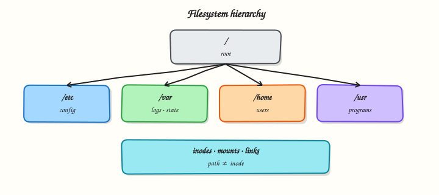

# Disk Usage and File Attributes

## Overview

Disk-full alerts look like this in real operations:

**“Disk full — cannot write file.”**

You need two answers fast:

1. **Which filesystem (mount) is full?** → **`df`**
2. **Which folder tree grew?** → **`du`**

Sometimes the error says “No space left” but `df -h` shows free megabytes — then you check **inodes** with **`df -i`**. Sometimes `df` and `du` disagree because a deleted log is still held open by a running process.

**File attributes** are metadata — permissions, owner, size, timestamps — that you read with `ls -l` and **`stat`**. “Permission denied” is often an attribute problem, not a disk problem.

This is **Tutorial 5** in **Module 3: Linux Filesystem** of the REBASH Academy **Linux for Cloud & DevOps Engineers** series — practical Linux for Cloud and DevOps work.

## Prerequisites

- [Paths, Links, Mounts, and Inodes](filesystem-paths-links-mounts-and-inodes.md) — you know mounts and inodes
- A **practice Ubuntu 22.04/24.04 VM** with write access under your home directory
- Optional: `sudo` for system-wide `lsof` examples later in your career

## Learning Objectives

By the end of this tutorial, you will be able to:

- [ ] Explain the difference between `df` (per mount) and `du` (per directory tree)
- [ ] Check block space and inode capacity with `df -h` and `df -i`
- [ ] Find large directories with `du` and sort human-readable sizes
- [ ] Read mode, owner, size, and timestamps with `stat`
- [ ] Pack evidence under `~/rebash-linux/lab05` for a capacity ticket

## Architecture

Disk capacity is tracked per **mount**. File **attributes** live on the **inode**. `df`, `du`, and `stat` report different layers of the same storage story.



## Theory

### The problem (before any jargon)

On-call message: *“App cannot write logs.”* You SSH in and run `df -h`. Root `/` looks fine. You panic anyway and delete random files.

A senior engineer asks: *“Which **mount** failed? Did you check `/var`? Inodes? `du` on the hot path?”*

This section teaches the checklist before you delete anything.

### `df` — how full is each mount?

**Analogy:** **`df`** is the **fuel gauge per petrol tank**. Your car may have two tanks (OS disk and data disk). A full data tank does not help if the OS tank is empty.

| Flag | Plain meaning |
|------|----------------|
| **`df -h`** | Human-readable free space per mount |
| **`df -hT`** | Also show filesystem **type** (ext4, xfs, …) |
| **`df -i`** | **Inode** free count — how many new files you can still create |

**What you can say in an interview:** “`df` answers whether the **mount** has free blocks or inodes. I always check both `-h` and `-i` on ‘no space left’ errors.”

**Tiny example:**

``` {.bash .ra-terminal title="Terminal"}
df -hT
df -i
df -hT / /var
```

### `du` — which directory tree grew?

**Analogy:** **`du`** is weighing **each room** in the building to find who hoarded boxes.

| Command | Plain meaning |
|---------|----------------|
| **`du -sh path`** | Total size of path (summary) |
| **`du -h --max-depth=1 path`** | Size of each immediate child |
| **`du -ah path \| sort -h`** | All files, sorted by size |

**What you can say in an interview:** “`df` tells me the mount is full; `du` tells me which subdirectory to clean — on **that** mount, not always on `/` alone.”

**Tiny example:**

``` {.bash .ra-terminal title="Terminal"}
du -sh ~
du -h --max-depth=1 /var 2>/dev/null | sort -h | tail
```

### File attributes with `stat`

**Analogy:** **`stat`** is the **ID card** for one file: who owns it, how big, when touched, what permissions.

| Field | Plain meaning |
|-------|----------------|
| **Mode** | Permissions (`rwx` for user/group/other) |
| **Uid/Gid** | Owner user and group |
| **Size** | Bytes |
| **Inode** | Number on this filesystem |
| **Access/Modify/Change times** | atime, mtime, ctime |

**What you can say in an interview:** “Before blaming ‘disk full’, I run `stat` — permission errors are often mode/owner, not capacity.”

**Tiny example:**

``` {.bash .ra-terminal title="Terminal"}
stat /etc/passwd
stat -c '%n %A %U %G %s inode=%i' /etc/passwd
```

### When `df` and `du` disagree

| Situation | What happened |
|-----------|----------------|
| `df` full, `du` on `/` smaller | Another mount is full, or **deleted-but-open** file still holds space |
| Create fails, `df -h` OK | **Inode exhaustion** — run `df -i` |
| `Permission denied` on write | Mode/owner — not a capacity issue |

**What you can say in an interview:** “If I delete a huge log but space does not return, I look for processes still holding the file open — often with `lsof +L1` under sudo.”

### Common pitfalls

- Checking only `/` while `/var` or a data volume is full
- Ignoring inodes — many tiny files exhaust them first
- Deleting open log files without restarting the writer — space does not return
- Running `du /` on a huge host without depth limits — very slow
- Confusing “cannot write” (permissions) with “disk full”

## Hands-on Lab

### Objective

Build a controlled sample tree, measure it with **`du`**, compare mounts with **`df`**, inspect attributes with **`stat`**, and save ticket-ready evidence under `~/rebash-linux/lab05`.

### Prerequisites

| Item | Notes |
|------|--------|
| Ubuntu practice VM | `df`, `du`, `stat` from coreutils |
| Write access | Under `$HOME` only |

### Lab environment

``` {.bash .ra-terminal title="Terminal"}
mkdir -p ~/rebash-linux/lab05 && cd ~/rebash-linux/lab05
set -euo pipefail
whoami | tee lab-user.txt
df -hT . | tee df-workspace.txt
```

!!! example "Expected output"
    `lab-user.txt` and `df-workspace.txt` exist; workspace is on a real mount.


### Real-world scenario

Ticket: *“Disk almost full on practice VM — before expanding the volume, prove which mount is tight, which folder grew, and show normal file attributes on a sample config.”*

### Step-by-step tasks

#### Task 1 – Build sample tree and measure with `du`

Create controlled “log” and “cache” sizes so **`du`** has something real to report.

``` {.bash .ra-terminal title="Terminal"}
cd ~/rebash-linux/lab05
set -euo pipefail

rm -rf sample-tree
mkdir -p sample-tree/{logs,cache,data}

dd if=/dev/zero of=sample-tree/logs/app.log bs=1M count=8 status=none
dd if=/dev/zero of=sample-tree/cache/pkg.bin bs=1M count=4 status=none

printf 'config=ok\n' > sample-tree/data/app.conf
for i in $(seq 1 50); do
  printf 'x' > "sample-tree/cache/tiny-$i.dat"
done

du -sh sample-tree | tee du-total.txt
du -h --max-depth=1 sample-tree | sort -h | tee du-depth1.txt
du -ah sample-tree | sort -h | tail -n 8 | tee du-largest.txt

test "$(du -sb sample-tree/logs | awk '{print $1}')" -gt "$(du -sb sample-tree/data | awk '{print $1}')"
```

!!! example "Expected output"
    `du-total.txt` shows roughly 12M+ for the tree. `du-depth1.txt` lists `logs`, `cache`, `data`; `logs` is largest.


#### Task 2 – Mount capacity: blocks and inodes

``` {.bash .ra-terminal title="Terminal"}
cd ~/rebash-linux/lab05
set -euo pipefail

df -hT | tee df-hT.txt
df -i | tee df-i.txt
df -hT . / | tee df-here-and-root.txt
findmnt -T . | tee findmnt-here.txt || true

find sample-tree -printf '.' | wc -c | tee file-count-ish.txt
test -s df-hT.txt && test -s df-i.txt
```

!!! example "Expected output"
    `df-hT.txt` shows filesystem type and free space. `df-i.txt` shows inode use percentage.


#### Task 3 – Attributes with `stat` and evidence pack

``` {.bash .ra-terminal title="Terminal"}
cd ~/rebash-linux/lab05
set -euo pipefail

stat sample-tree/data/app.conf | tee stat-app.conf.txt
stat -c 'name=%n mode=%A owner=%U group=%G size=%s inode=%i' \
  sample-tree/data/app.conf sample-tree/logs/app.log | tee stat-summary.txt
ls -l sample-tree/data/app.conf | tee ls-app.conf.txt

stat -c '%s' sample-tree/logs/app.log | tee log-bytes.txt
test "$(cat log-bytes.txt)" -eq $((8 * 1024 * 1024))

tar -czf disk-usage-evidence.tgz \
  lab-user.txt df-workspace.txt \
  du-total.txt du-depth1.txt du-largest.txt \
  df-hT.txt df-i.txt df-here-and-root.txt findmnt-here.txt \
  stat-app.conf.txt stat-summary.txt ls-app.conf.txt log-bytes.txt
ls -l disk-usage-evidence.tgz | tee evidence-ls.txt
test -s disk-usage-evidence.tgz
```

!!! example "Expected output"
    `stat-summary.txt` shows mode/owner/size. `log-bytes.txt` is `8388608`. Archive is non-empty.


### Validation steps

- [ ] `du -sh sample-tree` matches the sizes you created (~12M+)
- [ ] Both `df -hT` and `df -i` output files exist
- [ ] `stat` shows owner and mode for `app.conf`
- [ ] `disk-usage-evidence.tgz` exists under `~/rebash-linux/lab05`

### Common errors and fixes

| Error | Cause | Fix |
|-------|-------|-----|
| `du: cannot read directory` | Permission on system paths | Stay under `$HOME` in this lab |
| Create fails; `df -h` OK | Inodes full or wrong mount | `df -i`; `findmnt -T .` |
| Space not returned after delete | File still open | Find process with `lsof`; restart writer |

### Challenge exercise

Create `capacity-scan.sh`:

```bash title="capacity-scan.sh"
#!/usr/bin/env bash
set -euo pipefail
echo "=== df for workspace ==="
df -hT .
echo "=== top 3 under sample-tree ==="
du -ah sample-tree 2>/dev/null | sort -h | tail -n 3
AVAIL_K=$(df -P . | awk 'NR==2 {print $4}')
if [ "$AVAIL_K" -lt 102400 ]; then
  echo "FAIL: less than 100M free on ."
  exit 1
fi
echo "OK: sufficient free space on ."
```

``` {.bash .ra-terminal title="Terminal"}
cd ~/rebash-linux/lab05
chmod +x capacity-scan.sh
./capacity-scan.sh | tee capacity-scan.out
grep -q '^OK:' capacity-scan.out
```

!!! example "Expected output"
    Script prints `df`, top three `du` entries, and `OK: sufficient free space`.


### Learning outcomes

- Separated mount capacity (`df`) from tree usage (`du`)
- Checked inode capacity with `df -i`
- Inspected file attributes with `stat`
- Saved ticket-ready evidence

### Cleanup

``` {.bash .ra-terminal title="Terminal"}
cd ~/rebash-linux/lab05
rm -rf sample-tree
# Keep disk-usage-evidence.tgz for revision if you want.
```

## Validation

- [ ] Lab completed under `~/rebash-linux/lab05`
- [ ] Can explain when `df` and `du` disagree
- [ ] Know to check `df -i` on “no space left” errors
- [ ] Can read mode/owner/size from `stat`

## Code Walkthrough

1. **`df -hT` + `df -i` on the failing path** — blocks and inodes.
2. **`findmnt -T path`** — confirm which mount you are on.
3. **`du --max-depth=1` on that mount** — find the hot directory.
4. **`stat` before delete** — permission vs capacity.
5. **`lsof +L1` when space does not return** — deleted-but-open files.

## Security Considerations

- Do not run destructive `rm -rf` on production paths from a capacity ticket without a second check
- Restrict who can read log trees that may contain secrets
- Treat `sudo lsof` output carefully — paths may expose credentials
- Immutable flags (`chattr +i`) protect configs — document them
- Prefer measuring under the app user’s directories when possible

# Common Mistakes

❌ Checking only the root filesystem.

✅ `/var` or a data disk can be full while `/` looks fine. **Fix:** read the **Mounted on** column for the path that failed.

---

❌ Ignoring inodes.

✅ Creates fail with “No space left” even when `df -h` shows free megabytes. **Fix:** always run `df -i`.

---

❌ Deleting large files still held open.

✅ Space does not return until the process closes the file. **Fix:** find the process (`lsof`), restart or reopen logs, confirm with `df`.

---

❌ Using `du /` without depth limits.

✅ Very slow on large hosts. **Fix:** `du` the specific mount path with `--max-depth=1` first.

