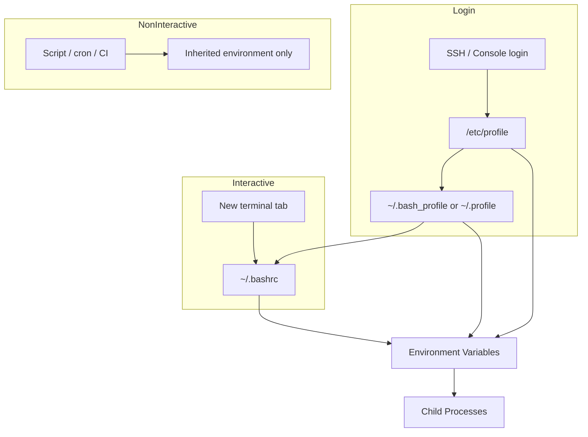

# Environment Variables and Shell Configuration

## Overview

Environment variables shape how every process behaves on Linux — where binaries are found (`PATH`), which editor opens (`EDITOR`), how locale formats dates (`LANG`), and how applications locate configuration (`HOME`, `XDG_CONFIG_HOME`). Shell startup files load these values when you log in or open a terminal.

Misconfigured environment variables cause some of the most frustrating production issues: "command not found" in cron jobs, missing variables in CI pipelines, and settings that work in SSH but not in scripts. Understanding **login vs non-login shells** and the difference between `.bashrc`, `.profile`, and `.bash_profile` is essential for any Linux administrator or DevOps engineer.

This tutorial is part of **Module 6: Storage, Logs, Networking & Operations** in the REBASH Academy Linux series.

## Prerequisites

- Complete [Essential Linux Commands](essential-linux-commands.md) and [Shell Scripting Fundamentals](shell-scripting-fundamentals.md)
- A Linux system with bash as the default shell
- Terminal access for hands-on exercises
- Optional: `sudo` for system-wide `/etc/profile.d/` examples

## Learning Objectives

By the end of this tutorial, you will be able to:

- [ ] Distinguish shell variables from environment variables and use `export` correctly
- [ ] Explain how `PATH` determines command resolution and modify it safely
- [ ] Describe login vs non-login and interactive vs non-interactive shells
- [ ] Know which startup file to edit: `.bashrc`, `.profile`, or `.bash_profile`
- [ ] Debug missing variables in scripts, SSH sessions, and cron jobs

## Architecture Diagram



## Theory

### Shell variables vs environment variables

A **shell variable** exists only in the current shell session:

```bash
MYVAR="hello"
```

An **environment variable** is exported to child processes:

```bash
export MYVAR="hello"
./child-script.sh   # child-script.sh can read $MYVAR
```

List all environment variables with `env` or `printenv`. List shell and environment variables with `set` (includes functions and shell-only vars).

### The PATH variable

When you type a command, the shell searches directories in `PATH` left to right:

```bash
echo $PATH
# /usr/local/bin:/usr/bin:/bin:/usr/sbin:/sbin
```

Prepend custom paths for user-installed tools:

```bash
export PATH="$HOME/.local/bin:$PATH"
```

Never carelessly put `.` or writable directories early in `PATH` — that enables privilege escalation via trojan binaries.

### Login vs non-login shells

| Shell type | Started by | Reads |
|------------|------------|-------|
| Login | SSH, `su -`, console login | `/etc/profile`, then `~/.bash_profile` or `~/.profile` |
| Non-login | New terminal in GUI, `bash`, scripts | `~/.bashrc` (if interactive) |

Test your shell type:

```bash
shopt -q login_shell && echo "login" || echo "non-login"
```

Or:

```bash
echo $0   # -bash indicates login shell on many systems
```

### Interactive vs non-interactive

| Type | Example | Reads startup files? |
|------|---------|----------------------|
| Interactive login | SSH session | profile + bashrc |
| Interactive non-login | Terminal emulator tab | bashrc |
| Non-interactive | `bash script.sh`, cron | Only if explicitly sourced; inherits parent env |

Non-interactive shells **do not** automatically source `.bashrc` unless `BASH_ENV` is set.

### Startup file hierarchy

**System-wide:**

- `/etc/profile` — login shell setup for all users
- `/etc/bash.bashrc` or `/etc/bashrc` — interactive non-login defaults
- `/etc/profile.d/*.sh` — modular snippets (Java, Node, custom tools)

**User-specific (bash on Linux):**

| File | When loaded |
|------|-------------|
| `~/.bash_profile` | Login shells (bash) — often sources `.bashrc` |
| `~/.profile` | Login shells (POSIX fallback) |
| `~/.bashrc` | Interactive non-login shells |
| `~/.bash_logout` | On logout (cleanup) |

**macOS note:** Terminal.app runs login shells by default, so `.bash_profile` matters more on macOS than on typical Linux desktops.

Recommended pattern in `~/.bash_profile`:

```bash
if [ -f ~/.bashrc ]; then
    . ~/.bashrc
fi
```

### Common environment variables

| Variable | Purpose |
|----------|---------|
| `HOME` | User home directory |
| `USER` / `LOGNAME` | Username |
| `SHELL` | Default login shell |
| `PATH` | Command search path |
| `LANG` / `LC_*` | Locale and formatting |
| `EDITOR` / `VISUAL` | Default text editor |
| `HISTSIZE` / `HISTFILESIZE` | Command history limits |
| `PS1` | Prompt format |
| `SSH_AUTH_SOCK` | SSH agent socket |

## Hands-on Lab

### Step 1 – Inspect your current environment

```bash
echo "Shell: $SHELL"
echo "Home: $HOME"
echo "PATH: $PATH"
env | sort | head -25
```

**Expected output:** Your login shell path, home directory, colon-separated PATH, and sorted environment listing including `USER`, `LANG`, and `PWD`.

### Step 2 – Create and export variables

```bash
LOCAL_VAR="not exported"
export GLOBAL_VAR="exported"

bash -c 'echo "LOCAL_VAR=${LOCAL_VAR:-empty}"; echo "GLOBAL_VAR=$GLOBAL_VAR"'
```

**Expected output:**

```
LOCAL_VAR=empty
GLOBAL_VAR=exported
```

The child shell sees only exported variables.

### Step 3 – Modify PATH safely

```bash
mkdir -p ~/bin
echo '#!/bin/bash
echo "Hello from custom bin"' > ~/bin/hello-rebash
chmod +x ~/bin/hello-rebash

export PATH="$HOME/bin:$PATH"
which hello-rebash
hello-rebash
```

**Expected output:**

```
/home/you/bin/hello-rebash
Hello from custom bin
```

### Step 4 – Determine shell type

```bash
echo "Shell name: $0"
shopt -q login_shell && echo "Login shell" || echo "Non-login shell"
[[ $- == *i* ]] && echo "Interactive" || echo "Non-interactive"
```

**Expected output:** Varies by how you connected — SSH typically shows "Login shell" and "Interactive".

### Step 5 – Trace startup file loading

Add temporary markers (remove after lab):

```bash
grep -l "REBASH-LAB" ~/.bashrc ~/.bash_profile ~/.profile 2>/dev/null || true

echo '# REBASH-LAB marker' >> ~/.bashrc
# Open a new non-login interactive shell:
bash --rcfile ~/.bashrc -i -c 'echo loaded bashrc'
```

**Expected output:** New interactive bash prints `loaded bashrc`; marker confirms `.bashrc` was read.

### Step 6 – Persist PATH in the correct file

For login shells, append to `~/.profile` or `~/.bash_profile`:

```bash
grep -q 'PATH="$HOME/bin:$PATH"' ~/.profile 2>/dev/null || \
  echo 'export PATH="$HOME/bin:$PATH"' >> ~/.profile
tail -3 ~/.profile
```

**Expected output:** Export line visible at end of profile. After re-login, `hello-rebash` works without manual export.

### Step 7 – System-wide variable via profile.d

```bash
echo 'export REBASH_ACADEMY="linux-module-6"' | sudo tee /etc/profile.d/rebash-lab.sh
sudo chmod 644 /etc/profile.d/rebash-lab.sh
bash --login -c 'echo $REBASH_ACADEMY'
```

**Expected output:**

```
linux-module-6
```

### Step 8 – Simulate cron's minimal environment

```bash
env -i HOME="$HOME" USER="$USER" /bin/bash -c 'echo "PATH=$PATH"; hello-rebash' 2>&1 || true
env -i HOME="$HOME" USER="$USER" PATH="/usr/bin:/bin" /bin/bash -c \
  "$HOME/bin/hello-rebash"
```

**Expected output:** First command fails or shows empty/minimal PATH; second succeeds when full path or PATH is set explicitly — demonstrating why cron needs absolute paths.

## Commands

| Command | Description |
|---------|-------------|
| `env` | Print all environment variables |
| `printenv VAR` | Print a specific variable |
| `export VAR=value` | Export variable to environment |
| `unset VAR` | Remove variable |
| `echo $PATH` | Display search path |
| `which command` | Show resolved binary path |
| `type command` | Show command type (alias, function, file) |
| `set` | List all shell variables and functions |
| `declare -p VAR` | Show variable attributes |
| `source ~/.bashrc` | Reload bashrc in current session |
| `. ~/.profile` | Source profile (same as source) |
| `bash --login` | Start a login shell |
| `bash -i` | Start interactive shell |
| `env -i VAR=val cmd` | Run command with clean environment |
| `readlink -f /proc/$$/exe` | Show current shell binary |

## Code Examples

### Recommended ~/.bashrc structure

```bash
# ~/.bashrc — interactive settings

# If not running interactively, don't do anything
case $- in
    *i*) ;;
    *) return;;
esac

# History settings
HISTCONTROL=ignoreboth
HISTSIZE=1000
HISTFILESIZE=2000
shopt -s histappend

# Custom aliases
alias ll='ls -alF'
alias gs='git status'

# Local bin in PATH
export PATH="$HOME/.local/bin:$HOME/bin:$PATH"

# Prompt
export PS1='\[\033[01;32m\]\u@\h\[\033[00m\]:\[\033[01;34m\]\w\[\033[00m\]\$ '
```

### Recommended ~/.bash_profile

```bash
# ~/.bash_profile — login shell entry point

if [ -f ~/.bashrc ]; then
    . ~/.bashrc
fi

# Login-only settings (e.g., ssh-agent, one-time messages)
export EDITOR=vim
```

### Script-safe variable defaults

```bash
#!/bin/bash
set -euo pipefail

: "${BACKUP_DIR:=$HOME/backups}"
: "${RETENTION_DAYS:=7}"

mkdir -p "$BACKUP_DIR"
echo "Backing up to $BACKUP_DIR, retention ${RETENTION_DAYS} days"
```

### Loading env file in application deployment

```bash
#!/bin/bash
# load-env.sh — source production variables safely
set -a
source /etc/app/environment
set +a
exec /usr/bin/myapp
```

## Common Mistakes

!!! warning "Putting interactive-only settings in .profile"
    Settings like aliases and `PS1` belong in `.bashrc`. Putting them in `.profile` breaks non-bash login shells and duplicates config.

!!! warning "Editing .bashrc but testing with login SSH"
    SSH login shells may skip `.bashrc` unless `.bash_profile` sources it. Always verify which file your session actually loads.

!!! warning "Prepending untrusted directories to PATH"
    Never put world-writable directories first in PATH — attackers can plant malicious binaries.

!!! warning "Assuming cron inherits your shell environment"
    Cron jobs start with a minimal environment. Set variables inside the script or crontab explicitly.

!!! warning "Using export in subshells incorrectly"
    `(export VAR=1; command)` exports only within the subshell. Export before running scripts in the current shell.

## Best Practices

!!! tip "Keep secrets out of shell profiles"
    Do not store API keys in `.bashrc`. Use secret managers, `/etc/environment` with restricted permissions, or systemd `EnvironmentFile`.

!!! tip "Use /etc/profile.d for team-wide tools"
    Package-specific PATH and variables belong in modular `/etc/profile.d/` scripts, not edited directly into `/etc/profile`.

!!! tip "Guard .bashrc with interactive check"
    Use the standard `case $- in *i*)` guard so non-interactive scripts sourcing bashrc do not load aliases and echo statements.

!!! tip "Document required variables for applications"
    Maintain an `.env.example` listing every variable your app needs, with defaults and descriptions.

!!! tip "Test with env -i"
    Simulate clean environments before deploying scripts to cron, systemd, or CI.

## Troubleshooting

| Issue | Cause | Solution |
|-------|-------|----------|
| Command not found | Directory not in PATH | Add to PATH in correct startup file; use `which cmd` |
| Variable empty in script | Not exported | Use `export VAR` before calling script |
| Settings work in terminal, not SSH | Different shell types | Ensure `.bash_profile` sources `.bashrc` |
| Changes not applied | Wrong file edited | Identify login vs non-login; `source` the file or re-login |
| Duplicate PATH entries | Sourced multiple times | Use path deduplication or check before appending |
| Cron job missing variables | Non-interactive minimal env | Define variables in script or crontab |
| `sudo cmd` loses variables | sudo resets environment | Use `sudo -E` sparingly or configure `env_keep` in sudoers |

## Summary

- Environment variables are inherited by child processes; shell-only variables require `export` to propagate.
- `PATH` controls command lookup order — prepend custom directories safely and never trust writable paths.
- Login shells read profile files; interactive non-login shells read `.bashrc`. SSH sessions are typically login + interactive.
- On Linux, put interactive config in `.bashrc` and source it from `.bash_profile` for login sessions.
- Cron and CI run with minimal environments — always test with `env -i` and use absolute paths or explicit exports.

## Interview Questions

**1. What is the difference between a shell variable and an environment variable?**

*Sample answer:* A shell variable exists only in the current shell. An environment variable is exported with `export` and passed to child processes. Use `printenv` to see exported variables.

**2. How does the shell find commands you type?**

*Sample answer:* It searches directories listed in `PATH` from left to right for an executable file matching the command name. If not found, it returns "command not found."

**3. What files does bash read on SSH login vs opening a new terminal tab?**

*Sample answer:* SSH login starts a login shell: `/etc/profile`, then `~/.bash_profile` or `~/.profile`, which should source `~/.bashrc`. A new GUI terminal tab typically starts a non-login interactive shell that reads only `~/.bashrc`.

**4. What is the difference between .bashrc and .bash_profile?**

*Sample answer:* `.bash_profile` runs for login shells (SSH, console). `.bashrc` runs for interactive non-login shells. Best practice: put shared config in `.bashrc` and source it from `.bash_profile`.

**5. Why do cron jobs fail to find commands that work interactively?**

*Sample answer:* Cron provides a minimal environment without your full PATH. Use absolute paths in crontab entries or set PATH explicitly at the top of the crontab.

**6. How do you make a variable available to a script you run?**

*Sample answer:* Export it before running: `export MYVAR=value; ./script.sh`. Or define it inside the script, or pass inline: `MYVAR=value ./script.sh`.

**7. What is the purpose of /etc/profile.d/?**

*Sample answer:* It holds modular shell scripts sourced by `/etc/profile` at login. Packages and admins add files here instead of editing `/etc/profile` directly.

**8. How can you reload .bashrc without logging out?**

*Sample answer:* Run `source ~/.bashrc` or `. ~/.bashrc` in the current shell.

**9. What does set -a do in a shell script?**

*Sample answer:* Automatically exports all variables that are set or modified afterward. Useful when sourcing an environment file before starting an application.

**10. How do you run a command with a clean environment for testing?**

*Sample answer:* `env -i HOME="$HOME" PATH="/usr/bin:/bin" command` starts with an empty environment except specified variables.

## Related Tutorials

- [Linux – Category Overview](index.md)
- [Cron and Task Scheduling](cron-and-task-scheduling.md) *(previous)*
- [Linux Networking Essentials](linux-networking-essentials.md) *(next)*
- [Shell Scripting Fundamentals](shell-scripting-fundamentals.md)
- [Essential Linux Commands](essential-linux-commands.md)
- [Learning Paths – DevOps Engineer](../learning-paths/index.md)

## References

- [bash man page – INVOCATION](https://man7.org/linux/man-pages/man1/bash.1.html)
- [GNU Bash Reference Manual – Startup Files](https://www.gnu.org/software/bash/manual/html_node/Bash-Startup-Files.html)
- [Linux Filesystem Hierarchy – /etc/profile](https://refspecs.linuxfoundation.org/FHS_3.0/fhs-3.0.html)
- [environment.d systemd spec](https://www.freedesktop.org/software/systemd/man/latest/environment.d.html)
- [REBASH Academy – Linux Overview](index.md)
