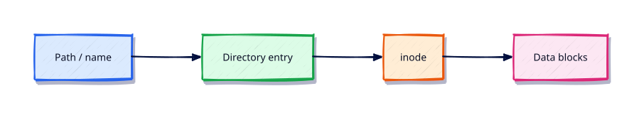

# Filesystem Paths, Links, Mounts, and Inodes

## Overview

Broken symlinks, surprise bind mounts, and inode exhaustion look like “disk full” until you know the model.

This is **Tutorial 4** in **Module 3: Linux Filesystem** of the REBASH Academy **Linux for Cloud & DevOps Engineers** series — written for administrators, DevOps engineers, SREs, and platform engineers operating production Linux.

## Prerequisites

- Essential Linux Commands
- Terminal access with a regular user account (sudo where noted)

## Learning Objectives

By the end of this tutorial, you will be able to:

- [ ] Apply the core ideas of “Filesystem Paths, Links, Mounts, and Inodes” on a real Linux host
- [ ] Use modern tools (`ip`/`ss`, `systemctl`/`journalctl`) where they apply
- [ ] Complete the lab under `~/rebash-linux/` with clear outputs
- [ ] Relate this topic to Cloud, DevOps, and production operations
- [ ] Explain the failure modes you would check first in an incident

## Architecture

Linux ops work sits between humans/automation and the kernel, services, and network. This topic’s control points are shown below.



## Theory

### Directory structure

A Linux filesystem is a single rooted tree. Devices appear as **mount points** grafted into that tree — not as drive letters.

### Absolute versus relative paths

| Type | Example | Notes |
|------|---------|-------|
| Absolute | `/var/log/nginx/error.log` | Starts at `/`; stable from any cwd |
| Relative | `../configs/app.toml` | Depends on current directory |
| Home-relative | `~/rebash-linux` | Expanded by the shell |

Scripts should prefer absolute paths or resolve from a known base directory.

### Inodes

An **inode** stores metadata (owner, mode, timestamps, size, data block pointers) — not the filename. A directory entry maps a name → inode number.

```bash
ls -i file.txt
stat -c '%i %n' file.txt
df -i   # inode capacity
```

You can run out of inodes while `df -h` still shows free space (many tiny files).

### Hard links

A **hard link** is another directory entry pointing at the same inode (same filesystem only). Deleting one name decrements the link count; data remains until count reaches zero.

```bash
ln original.txt hardlink.txt
```

### Symbolic links (symlinks)

A **symlink** is a special file storing a path string. It can cross filesystems and point at directories.

```bash
ln -s /etc/os-release os-release.link
readlink -f os-release.link
```

Broken symlinks are common after moves — validate with `test -e` / `readlink`.

### Mount points

`mount` attaches a filesystem at a directory. `findmnt` and `/proc/mounts` show the live table; `/etc/fstab` (or systemd `.mount` units) persists mounts across reboot.

```bash
findmnt
lsblk -f
```

## Hands-on Lab

Create a workspace for this tutorial.

```bash
mkdir -p ~/rebash-linux/lab04 && cd ~/rebash-linux/lab04
```

**Focus:** create hard/symlink pairs; inspect inodes; explore findmnt

### Step 1 – Skeleton

```bash
cat > lab.sh << 'EOF'
#!/usr/bin/env bash
set -euo pipefail
echo "lab04 filesystem-paths-links-mounts-and-inodes on $(hostname -s)"
EOF
chmod +x lab.sh
./lab.sh
```

### Step 2 – Links and inodes

```bash
echo payload > original.txt
ln original.txt hard.txt
ln -s original.txt soft.txt
ls -li original.txt hard.txt soft.txt | tee links.txt
stat -c '%i %h %n' original.txt hard.txt
readlink soft.txt
findmnt | head | tee mounts.txt
```

### Final step – Cleanup note

```bash
./lab.sh
# keep ~/rebash-linux for later labs
```

## Validation

- [ ] Lab commands run under `~/rebash-linux/lab04/`
- [ ] You can explain each Theory bullet in your own words
- [ ] You used modern tooling where applicable (`ip`/`ss`, `systemctl`/`journalctl`)
- [ ] You can describe one production failure mode for this topic

## Code Walkthrough

Production Linux practice for **Filesystem Paths, Links, Mounts, and Inodes** always combines:

1. Inspect before you change (`status`, `df`, `ip`, logs)
2. Prefer reversible, documented changes (config management, drop-ins)
3. Capture evidence (command output, journal snippets) for handovers
4. Prefer `systemctl`/`journalctl` and `ip`/`ss` over legacy tools
5. Least privilege — escalate with `sudo` only when required

Keep runbooks short enough to follow at 03:00. Automate the boring checks; keep humans for judgement.

## Security Considerations

- Treat host access and sudo as privileged — audit who can do what
- Never paste secrets into shell history, tickets, or screenshots
- Validate device names and paths before destructive disk or `rm` operations
- Prefer key-based SSH and deny password auth on internet-facing hosts
- Collect logs centrally; restrict who can read authentication and audit trails

## Common Mistakes

!!! warning "Using legacy networking tools by default"
    `ifconfig`/`netstat` are missing or incomplete on modern images. **Fix:** use `ip` and `ss`.

!!! warning "Editing vendor unit files in place"
    Package upgrades overwrite `/lib/systemd/system`. **Fix:** `systemctl edit` drop-ins under `/etc`.

!!! warning "Trusting df without checking inodes and mounts"
    A full `/var` or exhausted inodes looks different from root. **Fix:** `df -h`, `df -i`, and `findmnt`.

## Best Practices

- Golden images + config as code over snowflake hosts
- Alert on symptoms (failed units, disk, load) with runbooks attached
- Time-sync (chrony) everywhere — logs and TLS depend on it
- Separate OS and data volumes on Cloud VMs
- Practise restore and rescue paths before you need them

## Troubleshooting

| Symptom | Likely cause | Fix |
|---------|--------------|-----|
| Permission denied | Mode/owner/ACL/MAC | `namei -l`, `id`, `getfacl`, SELinux/AppArmor logs |
| No route / timeout | Routing, DNS, firewall | `ip route`, `dig`, `ss`, security groups |
| Service won’t start | Unit/config/deps | `systemctl status`, `journalctl -u`, config `-t` |
| Disk full | Logs, containers, deleted-open | `df`/`du`, `lsof +L1`, rotate/expand |
| High load | CPU, I/O wait, thrash | `vmstat`, `iostat`, `ps` |

## Summary

**Filesystem Paths, Links, Mounts, and Inodes** is essential for Cloud and DevOps engineers operating Linux hosts. Practise the lab until the inspection path is muscle memory, then continue the track.

## Interview Questions

1. How does this topic show up when operating Cloud VMs or Kubernetes nodes?
2. What would you check first if this area misbehaves in production?
3. Which modern Linux tools replace older equivalents here?
4. What security control should accompany this capability?
5. How would you automate verification of this topic in CI or a cron/timer job?

!!! tip "Sample answer — question 2"
    Start with blast radius and recent changes, then gather host signals (`systemctl --failed`, `df`, `ip`/`ss`, `journalctl`) before making changes. Fix forward with evidence, not guesswork.

## Related Tutorials

- [Linux for Cloud & DevOps – Category Overview](index.md)
- [Essential Linux Commands](essential-linux-commands.md) *(previous)*
- [Disk Usage and File Attributes](disk-usage-and-file-attributes.md) *(next)*
- [Learning Paths](../learning-paths/index.md)

## References

- [Linux man-pages project](https://www.kernel.org/doc/man-pages/)
- [systemd documentation](https://systemd.io/)
- [Filesystem Hierarchy Standard](https://refspecs.linuxfoundation.org/FHS_3.0/fhs-3.0.html)
- Track index: [Linux for Cloud & DevOps Engineers](index.md)
