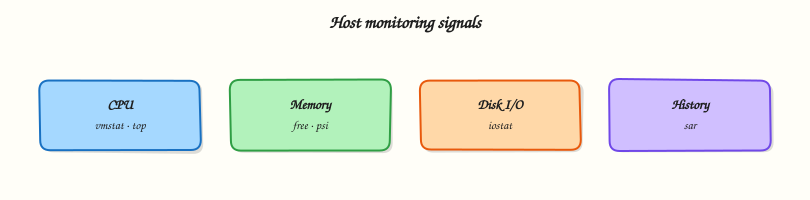

# Host Monitoring — vmstat, iostat, and sar

## Overview

When someone says “the server feels slow”, you need numbers — not guesses. Cloud dashboards help, but host tools such as **vmstat**, **iostat**, and **sar** still matter when agents fail or you are on SSH only.

**Plain problem:** CPU at 100%, disk light blinking constantly, or swap churning — three different stories. **`vmstat`**, **`iostat`**, and **`sar`** (from the **sysstat** package) give quick host-level signals for **CPU**, **memory**, **swap**, and **disk Input/Output (I/O)**.

This is **Tutorial 12b** in **Module 12: Logging & Monitoring** of the REBASH Academy **Linux for Cloud & DevOps Engineers** series.

## Prerequisites

- Ubuntu practice VM with `sudo`
- Basic comfort with `top` or `htop` (helpful but not required)
- Completed logging tutorial (you know where to save evidence)

## Learning Objectives

By the end of this tutorial, you will be able to:

- [ ] Explain what vmstat, iostat, and sar measure in plain language
- [ ] Install **sysstat** and capture baseline samples
- [ ] Generate controlled load and compare before/after metrics
- [ ] Read CPU idle, swap activity, and disk utilisation columns
- [ ] Relate CLI signals to “slow server” interview stories
- [ ] Answer fresher interview questions on host monitoring

## Architecture

The kernel tracks CPU scheduling, memory pages, swap, and block I/O. **sysstat** tools read `/proc` and kernel counters and print human-readable tables. **sar** can store history when the sysstat collector is enabled.



## Theory

### The problem (before any jargon)

Ticket: “API latency high.” You restart the app. Still slow. Later someone notices **disk utilisation at 100%** — the database on the same disk was the bottleneck, not the API process. Monitoring narrows *which* resource is saturated.

### vmstat — virtual memory statistics

**Analogy:** **vmstat** is a five-second health snapshot of the whole host — processes waiting, memory pressure, swap in/out, CPU idle.

``` {.bash .ra-terminal title="Terminal"}
vmstat 1 5
```

Columns to watch first:

| Column | Plain meaning |
|--------|----------------|
| `r` | Runnable processes (CPU queue) |
| `si` / `so` | Swap in / swap out (memory pressure) |
| `us` / `sy` / `id` | User / system / **idle** CPU |
| `wa` | CPU waiting on I/O |

**Interview line:** “High `wa` suggests I/O wait; high `si/so` suggests memory pressure and swap.”

### iostat — disk I/O

**Analogy:** **iostat** zooms into each disk — reads/writes per second and **%util** (how busy the device is).

``` {.bash .ra-terminal title="Terminal"}
iostat -xz 1 3
```

**%util** near 100% on a disk serving your database is a smoking gun.

### sar — history and trends

**Analogy:** **sar** is yesterday’s notebook if sysstat collection is enabled — CPU, memory, I/O over time.

``` {.bash .ra-terminal title="Terminal"}
sar -u 1 3        # CPU
sar -r 1 3        # memory
sar -b 1 3        # I/O
```

On Ubuntu, enable ongoing collection by setting `ENABLED="true"` in `/etc/default/sysstat` if your policy allows.

### When CLI beats the dashboard

- Jump box with no agent during an outage
- Interview whiteboard: “How would you prove disk-bound?”
- Validating that a cloud graph matches ground truth

Pair CLI checks with Prometheus node exporter, CloudWatch, Datadog, etc. in production.

### Common pitfalls

- Staring at CPU only while disk is saturated
- Ignoring swap (`si/so`) until OOM kills appear
- One sample only — transients mislead; take 5–10 seconds
- Confusing load average with CPU % (load includes waiting tasks)

## Hands-on Lab

### Objective

Install **sysstat**, capture baseline **vmstat**/**iostat**/**sar**, generate controlled CPU and disk load, compare metrics, and save proof under `~/rebash-linux/lab19`.

### Prerequisites

| Item | Notes |
|------|--------|
| Ubuntu VM | 1+ CPU, a few GB RAM |
| `sudo` | For sysstat install and enabling collector |
| `stress-ng` optional | Or use built-in `dd` for disk load |

### Lab environment

``` {.bash .ra-terminal title="Terminal"}
mkdir -p ~/rebash-linux/lab19 && cd ~/rebash-linux/lab19
sudo apt update && sudo apt install -y sysstat
```

### Real-world scenario

Mentor: “Users report slowness at 14:00. Show me baseline vmstat/iostat, then reproduce mild CPU and disk pressure in the lab and point at which columns changed.”

### Step-by-step tasks

#### Task 1 – Baseline samples

``` {.bash .ra-terminal title="Terminal"}
cd ~/rebash-linux/lab19
vmstat 1 5 | tee vmstat-baseline.txt
iostat -xz 1 3 | tee iostat-baseline.txt
sar -u 1 3 | tee sar-cpu-baseline.txt
test -s vmstat-baseline.txt
grep -E ' id ' vmstat-baseline.txt | tail -3 | tee idle-sample.txt
```

!!! example "Expected output"
    `idle-sample.txt` shows CPU idle (`id`) typically high on an idle lab VM.


#### Task 2 – Controlled CPU load and re-measure

``` {.bash .ra-terminal title="Terminal"}
cd ~/rebash-linux/lab19
( yes >/dev/null ) & pid=$!
sleep 2
vmstat 1 5 | tee vmstat-under-cpu-load.txt
kill "$pid" 2>/dev/null || true
wait "$pid" 2>/dev/null || true
grep -E ' [0-9]+ [0-9]+ [0-9]+ [0-9]+ [0-9]+ [0-9]+ [0-9]+ [0-9]+ [0-9]+ [0-9]+ [0-9]+ [0-9]+ [0-9]+ [0-9]+ [0-9]+ ' vmstat-under-cpu-load.txt | tail -3 | tee cpu-load-idle.txt
```

!!! example "Expected output"
    Under `yes` load, idle (`id`) drops compared to baseline — CPU is busy.


#### Task 3 – Disk load, break interpretation, fix understanding

``` {.bash .ra-terminal title="Terminal"}
cd ~/rebash-linux/lab19
dd if=/dev/zero of=/tmp/lab19-diskload bs=1M count=256 oflag=direct 2>&1 | tee dd-write.txt &
sleep 1
iostat -xz 1 5 | tee iostat-under-disk-load.txt
wait
iostat -xz 1 3 | tee iostat-after-disk-load.txt
echo "mistake: only checked CPU during disk incident" > misread-notes.txt
echo "fix: check iostat %util and vmstat wa column" >> misread-notes.txt
cat misread-notes.txt | tee break-fix-notes.txt
echo "lab19 monitoring OK" | tee evidence.txt
```

!!! example "Expected output"
    During `dd`, `iostat` shows higher **%util** on the disk device; `break-fix-notes.txt` documents the CPU-vs-disk diagnostic mistake.


### Validation steps

- [ ] sysstat installed; baseline and under-load files saved
- [ ] CPU load lowered idle column visibly
- [ ] Disk load raised I/O utilisation during `dd`
- [ ] You can explain one column from vmstat and iostat

### Common errors and fixes

| Error | Cause | Fix |
|-------|-------|-----|
| `vmstat: command not found` | sysstat not installed | `sudo apt install sysstat` |
| sar shows no history | Collector disabled | `/etc/default/sysstat` ENABLED=true |
| All zeros in iostat | Wrong interval / no activity | Run during `dd` or app load |
| Misread load average | Includes I/O wait tasks | Cross-check vmstat `wa`, iostat |

### Challenge exercise

Enable sysstat history (if policy allows), reboot not required — set `ENABLED="true"` and `sudo systemctl enable --now sysstat`, then run `sar -u` after a few minutes.

### Learning outcomes

- You captured real vmstat/iostat/sar samples
- You linked load types to metric columns
- You documented a common diagnostic misread (CPU-only tunnel vision)

### Cleanup

``` {.bash .ra-terminal title="Terminal"}
rm -f /tmp/lab19-diskload
pkill -f 'yes >/dev/null' 2>/dev/null || true
```

## Validation

- [ ] Evidence under `~/rebash-linux/lab19`
- [ ] Can narrate “slow server” triage in three tools
- [ ] Ready for SSH hardening next

## Code Walkthrough

1. **`vmstat 1 5`** — 1-second interval, 5 samples; good incident habit.
2. **`iostat -xz 1 3`** — extended, skip zero devices, human sizes.
3. **`sar -u`** — CPU breakdown when sysstat history exists.
4. **Background `yes`** — cheap CPU burner for lab only.
5. **`dd … oflag=direct`** — bypasses cache somewhat — shows disk pressure in lab.

## Security Considerations

- Do not run destructive stress tools on shared production hosts without approval.
- Monitoring data can reveal workload patterns — protect sar archives.
- High load tests in cloud may trigger alerts — use sandbox accounts.
- Read-only monitoring commands are safe; load generation is not.

# Common Mistakes

❌ CPU tunnel vision.

✅ Check disk (`iostat`) and memory/swap (`vmstat`) before scaling CPU.

---

❌ Single snapshot.

✅ Take several intervals; spikes and sustained saturation tell different stories.

---

❌ Ignoring swap.

✅ Rising `si/so` means RAM pressure — fix memory or swap config before buying CPUs.

