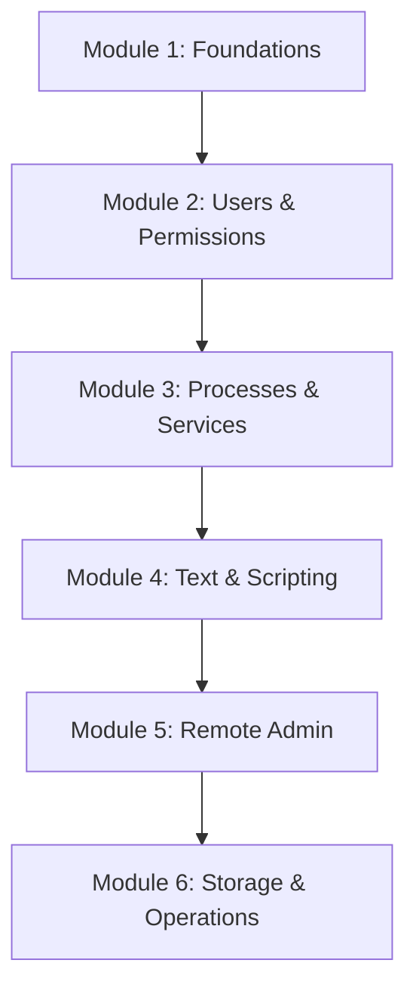

# Linux

Master the command line, system administration, and shell scripting — from first login to production troubleshooting.

## Overview

The REBASH Academy **Linux** track is a structured, 20-tutorial curriculum designed for students
and professionals. Each tutorial follows our [documentation standards](../about.md#documentation-standards)
with theory, step-by-step labs, commands, best practices, and interview questions.

!!! tip "Learning Path"
    Linux is the first step in the [DevOps Engineer learning path](../learning-paths/index.md).

## Curriculum Plan

### Module 1 – Foundations

| # | Tutorial | Level | Time |
|---|----------|-------|------|
| 1 | [Introduction to Linux](introduction-to-linux.md) | Beginner | 30 min |
| 2 | [Linux Filesystem Hierarchy](linux-filesystem-hierarchy.md) | Beginner | 25 min |
| 3 | [Essential Linux Commands](essential-linux-commands.md) | Beginner | 40 min |

### Module 2 – Users, Groups & Permissions

| # | Tutorial | Level | Time |
|---|----------|-------|------|
| 4 | [File Permissions and Ownership](file-permissions-and-ownership.md) | Beginner | 35 min |
| 5 | [User and Group Management](user-and-group-management.md) | Beginner | 35 min |

### Module 3 – Processes, Services & Packages

| # | Tutorial | Level | Time |
|---|----------|-------|------|
| 6 | [Process Management](process-management.md) | Intermediate | 40 min |
| 7 | [systemd Service Management](systemd-service-management.md) | Intermediate | 45 min |
| 8 | [Package Management](package-management.md) | Beginner | 35 min |

### Module 4 – Text Processing & Shell Scripting

| # | Tutorial | Level | Time |
|---|----------|-------|------|
| 9 | [Text Processing with grep, sed, and awk](text-processing-grep-sed-awk.md) | Intermediate | 50 min |
| 10 | [Shell Scripting Fundamentals](shell-scripting-fundamentals.md) | Intermediate | 60 min |

### Module 5 – Remote Administration

| # | Tutorial | Level | Time |
|---|----------|-------|------|
| 11 | [SSH and Remote Administration](ssh-remote-administration.md) | Intermediate | 40 min |
| 12 | [Remote systemd Service Control](remote-systemd-services.md) | Intermediate | 45 min |

### Module 6 – Storage, Logs, Networking & Operations

| # | Tutorial | Level | Time |
|---|----------|-------|------|
| 13 | [Disk and Filesystem Management](disk-and-filesystem-management.md) | Intermediate | 45 min |
| 14 | [Log Management with journalctl](log-management-journalctl.md) | Intermediate | 35 min |
| 15 | [Cron and Task Scheduling](cron-and-task-scheduling.md) | Beginner | 30 min |
| 16 | [Environment Variables and Shell Configuration](environment-variables-shell-config.md) | Beginner | 25 min |
| 17 | [Linux Networking Essentials](linux-networking-essentials.md) | Intermediate | 45 min |
| 18 | [File Archiving and Compression](file-archiving-and-compression.md) | Beginner | 25 min |
| 19 | [Linux Security Hardening Basics](linux-security-hardening-basics.md) | Advanced | 50 min |
| 20 | [Troubleshooting Linux Systems](troubleshooting-linux-systems.md) | Advanced | 55 min |

**Total estimated time:** ~13 hours of hands-on learning

## Learning Objectives

After completing this track, you will be able to:

- [ ] Navigate and administer a Linux server confidently
- [ ] Manage users, permissions, processes, and services
- [ ] Write Bash scripts and process text from the CLI
- [ ] Administer remote servers over SSH and systemd
- [ ] Monitor logs, schedule tasks, and troubleshoot production issues

## Who Is This For?

| Audience | Benefit |
|----------|---------|
| **Students** | Build job-ready Linux skills from zero |
| **Developers** | Understand the OS your applications run on |
| **DevOps / SRE** | Foundation for Docker, Kubernetes, and cloud |
| **Sysadmins** | Structured refresher with modern systemd practices |

## Related Sections

- [Networking](../networking/index.md) — next step in the DevOps path
- [Docker](../docker/index.md) — containerize your applications
- [Interview Prep](../interview/index.md) — Linux interview questions
