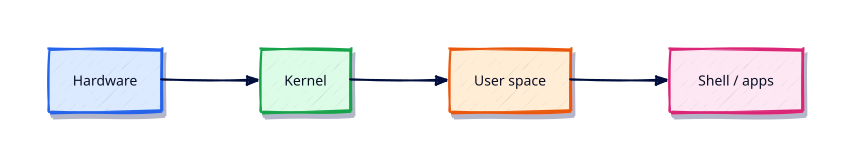

# Linux Fundamentals — Distributions and Architecture

## Overview

Cloud VMs, Kubernetes nodes, and CI runners are almost always Linux. This tutorial builds the mental model you need before touching files, services, or networking.

This is **Tutorial 1** in **Module 1: Linux Fundamentals** of the REBASH Academy **Linux for Cloud & DevOps Engineers** series — written for administrators, DevOps engineers, SREs, and platform engineers operating production Linux.

## Prerequisites

- Basic computer knowledge; a Linux VM, WSL2, or cloud instance
- Terminal access with a regular user account (sudo where noted)

## Learning Objectives

By the end of this tutorial, you will be able to:

- [ ] Apply the core ideas of “Linux Fundamentals — Distributions and Architecture” on a real Linux host
- [ ] Use modern tools (`ip`/`ss`, `systemctl`/`journalctl`) where they apply
- [ ] Complete the lab under `~/rebash-linux/` with clear outputs
- [ ] Relate this topic to Cloud, DevOps, and production operations
- [ ] Explain the failure modes you would check first in an incident

## Architecture

Linux ops work sits between humans/automation and the kernel, services, and network. This topic’s control points are shown below.



## Theory

### What is Linux?

**Linux** is a free, open-source **kernel** — the core that manages CPU, memory, devices, and process isolation. A complete system also needs user-space tools (GNU coreutils, systemd, package managers, shells). People say “a Linux server” to mean that whole stack.

For Cloud and DevOps engineers, Linux is the default OS for:

- Virtual machines on AWS, Azure, GCP, and on-prem
- Container hosts and Kubernetes worker nodes
- CI/CD runners and build agents
- Network appliances and bastion hosts

### Linux distributions

A **distribution** (distro) packages the kernel with userspace, an installer, a package manager, and a release policy.

| Family | Examples | Package tool | Typical Cloud use |
|--------|----------|--------------|-------------------|
| Debian | Debian, Ubuntu | `apt` | Popular cloud images, docs, CI |
| RHEL | RHEL, Rocky, Alma, Fedora | `dnf`/`yum` | Enterprise, OpenShift, compliance |
| SUSE | SLES, openSUSE | `zypper` | Enterprise SAP/cloud niches |
| Minimal | Alpine, Amazon Linux | `apk` / `dnf` | Containers, AWS-tuned hosts |

Choose for support windows, package freshness, and organisational standards — not fashion. Cloud images pin a known AMI/image version so fleets stay reproducible.

### Linux architecture

Layers (bottom to top):

1. **Hardware** — CPU, RAM, disks, NICs (or virtual equivalents)
2. **Kernel** — drivers, scheduling, memory, networking stack, namespaces/cgroups
3. **User space** — daemons, libraries, CLI tools, containers
4. **Shell / applications** — Bash, Python, nginx, kubelet

System calls (`open`, `read`, `fork`, `exec`, `socket`) are the contract between user space and the kernel.

### Kernel

The kernel:

- Schedules processes and threads
- Manages virtual memory and page cache
- Mediates block and network I/O
- Enforces permissions, capabilities, and Mandatory Access Control (MAC) hooks (SELinux/AppArmor)

Inspect with `uname -r`, `hostnamectl`, and `/proc` (`/proc/cpuinfo`, `/proc/meminfo`).

### User space

Everything that is not the kernel: `systemd`, `sshd`, package managers, shells, libraries under `/usr`, application binaries. Failures here are often recoverable without a reboot; kernel panics are not.

### Shell versus terminal

| Concept | Role |
|---------|------|
| **Terminal** (emulator) | UI that accepts keystrokes and displays text (GNOME Terminal, Windows Terminal, `tmux`) |
| **Shell** | Program that interprets commands (`bash`, `zsh`, `sh`) |
| **TTY / PTY** | Kernel device pairing the terminal to a login session |

You SSH into a PTY running a shell. Scripts skip the interactive terminal but still need a shell interpreter via the shebang.

## Hands-on Lab

Create a workspace for this tutorial.

```bash
mkdir -p ~/rebash-linux/lab01 && cd ~/rebash-linux/lab01
```

**Focus:** fingerprint distro/kernel; map layers; prove shell vs terminal

### Step 1 – Skeleton

```bash
cat > lab.sh << 'EOF'
#!/usr/bin/env bash
set -euo pipefail
echo "lab01 linux-fundamentals-distributions-and-architecture on $(hostname -s)"
EOF
chmod +x lab.sh
./lab.sh
```

### Step 2 – Fingerprint the host

```bash
cat > fingerprint.sh << 'EOF'
#!/usr/bin/env bash
set -euo pipefail
echo "=== OS ==="
cat /etc/os-release | head -n 8
echo "=== Kernel ==="
uname -srm
echo "=== Shell / TTY ==="
echo "SHELL=$SHELL"
tty || true
ps -p $$ -o args=
EOF
chmod +x fingerprint.sh
./fingerprint.sh | tee fingerprint.txt
```

### Final step – Cleanup note

```bash
./lab.sh
# keep ~/rebash-linux for later labs
```

## Validation

- [ ] Lab commands run under `~/rebash-linux/lab01/`
- [ ] You can explain each Theory bullet in your own words
- [ ] You used modern tooling where applicable (`ip`/`ss`, `systemctl`/`journalctl`)
- [ ] You can describe one production failure mode for this topic

## Code Walkthrough

Production Linux practice for **Linux Fundamentals — Distributions and Architecture** always combines:

1. Inspect before you change (`status`, `df`, `ip`, logs)
2. Prefer reversible, documented changes (config management, drop-ins)
3. Capture evidence (command output, journal snippets) for handovers
4. Prefer `systemctl`/`journalctl` and `ip`/`ss` over legacy tools
5. Least privilege — escalate with `sudo` only when required

Keep runbooks short enough to follow at 03:00. Automate the boring checks; keep humans for judgement.

## Security Considerations

- Treat host access and sudo as privileged — audit who can do what
- Never paste secrets into shell history, tickets, or screenshots
- Validate device names and paths before destructive disk or `rm` operations
- Prefer key-based SSH and deny password auth on internet-facing hosts
- Collect logs centrally; restrict who can read authentication and audit trails

## Common Mistakes

!!! warning "Using legacy networking tools by default"
    `ifconfig`/`netstat` are missing or incomplete on modern images. **Fix:** use `ip` and `ss`.

!!! warning "Editing vendor unit files in place"
    Package upgrades overwrite `/lib/systemd/system`. **Fix:** `systemctl edit` drop-ins under `/etc`.

!!! warning "Trusting df without checking inodes and mounts"
    A full `/var` or exhausted inodes looks different from root. **Fix:** `df -h`, `df -i`, and `findmnt`.

## Best Practices

- Golden images + config as code over snowflake hosts
- Alert on symptoms (failed units, disk, load) with runbooks attached
- Time-sync (chrony) everywhere — logs and TLS depend on it
- Separate OS and data volumes on Cloud VMs
- Practise restore and rescue paths before you need them

## Troubleshooting

| Symptom | Likely cause | Fix |
|---------|--------------|-----|
| Permission denied | Mode/owner/ACL/MAC | `namei -l`, `id`, `getfacl`, SELinux/AppArmor logs |
| No route / timeout | Routing, DNS, firewall | `ip route`, `dig`, `ss`, security groups |
| Service won’t start | Unit/config/deps | `systemctl status`, `journalctl -u`, config `-t` |
| Disk full | Logs, containers, deleted-open | `df`/`du`, `lsof +L1`, rotate/expand |
| High load | CPU, I/O wait, thrash | `vmstat`, `iostat`, `ps` |

## Summary

**Linux Fundamentals — Distributions and Architecture** is essential for Cloud and DevOps engineers operating Linux hosts. Practise the lab until the inspection path is muscle memory, then continue the track.

## Interview Questions

1. How does this topic show up when operating Cloud VMs or Kubernetes nodes?
2. What would you check first if this area misbehaves in production?
3. Which modern Linux tools replace older equivalents here?
4. What security control should accompany this capability?
5. How would you automate verification of this topic in CI or a cron/timer job?

!!! tip "Sample answer — question 2"
    Start with blast radius and recent changes, then gather host signals (`systemctl --failed`, `df`, `ip`/`ss`, `journalctl`) before making changes. Fix forward with evidence, not guesswork.

## Related Tutorials

- [Linux for Cloud & DevOps – Category Overview](index.md)
- [Boot Process and Filesystem Hierarchy](boot-process-and-filesystem-hierarchy.md) *(next)*
- [Learning Paths](../learning-paths/index.md)

## References

- [Linux man-pages project](https://www.kernel.org/doc/man-pages/)
- [systemd documentation](https://systemd.io/)
- [Filesystem Hierarchy Standard](https://refspecs.linuxfoundation.org/FHS_3.0/fhs-3.0.html)
- Track index: [Linux for Cloud & DevOps Engineers](index.md)
