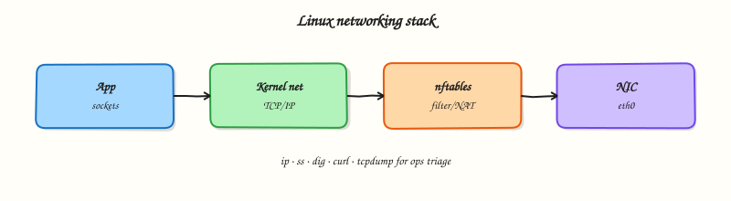

# Linux Networking Tools

## Overview

Prefer the modern `ip`/`ss` stack — ifconfig/netstat are legacy on current Cloud images.

This is **Tutorial 14** in **Module 9: Linux Networking** of the REBASH Academy **Linux for Cloud & DevOps Engineers** series — written for administrators, DevOps engineers, SREs, and platform engineers operating production Linux.

## Prerequisites

- LVM, Swap, and Disk Monitoring
- Terminal access with a regular user account (sudo where noted)

## Learning Objectives

By the end of this tutorial, you will be able to:

- [ ] Apply the core ideas of “Linux Networking Tools” on a real Linux host
- [ ] Use modern tools (`ip`/`ss`, `systemctl`/`journalctl`) where they apply
- [ ] Complete the lab under `~/rebash-linux/` with clear outputs
- [ ] Relate this topic to Cloud, DevOps, and production operations
- [ ] Explain the failure modes you would check first in an incident

## Architecture

Linux ops work sits between humans/automation and the kernel, services, and network. This topic’s control points are shown below.



## Theory

### What it is

Linux networking tools inspect and verify host connectivity: **ip** for addresses, routes, and neighbours; **ss** for sockets; **ping**/**traceroute** (or `tracepath`) for path checks; **dig**/**host**/**nslookup** for Domain Name System (DNS); **curl**/**wget** for Hypertext Transfer Protocol (HTTP) clients; **tcpdump** and **netcat (`nc`)** for packet capture and port probes. Prefer these modern tools over legacy `ifconfig`/`netstat` on current distributions.

### Why it matters

Most “the app is down” tickets are network or DNS until proven otherwise. Security groups and host firewalls fail closed; wrong routes black-hole traffic; broken resolvers make every Fully Qualified Domain Name (FQDN) look dead. Fast, accurate use of `ip`, `ss`, and `dig` separates host problems from platform networking and from application bugs.

### How it works

`ip -br a` shows interface addresses; `ip route` the routing table; `ip neigh` Address Resolution Protocol (ARP)/neighbour cache. `ss -tulpn` lists listening TCP/UDP sockets with processes. ping proves Internet Control Message Protocol (ICMP) reachability (which firewalls may block even when TCP works). dig queries DNS deliberately (`dig +short example.com A`). curl exercises TLS and HTTP status (`-I`, `-v`, write-out formats). tcpdump captures packets for short, targeted windows; always consider privacy — payloads may hold secrets. netcat checks whether a port accepts connections (`nc -vz host port`).

### Key concepts and comparisons

| Question | Tool |
|----------|------|
| Do I have an address/route? | `ip` |
| Is anything listening? | `ss -tulpn` |
| Does DNS resolve? | `dig` / `host` |
| Does HTTP(S) respond? | `curl` |
| Where does the path break? | `traceroute` / `tracepath` |
| What packets hit the NIC? | `tcpdump` |

| Legacy | Prefer |
|--------|--------|
| `ifconfig` | `ip` |
| `netstat` | `ss` |
| `nslookup` alone | `dig` (more controllable) |

### Common pitfalls

- Declaring the network dead because ping is blocked while TCP 443 works.
- Using `curl` without noticing certificate or proxy errors hidden by scripts.
- Capturing traffic for too long or on shared hosts without authorisation.
- Debugging the guest while the cloud security group or Network ACL is the real deny.
- Ignoring DNS search domains and split-horizon results that differ from public resolvers.

## Hands-on Lab

Create a workspace for this tutorial.

```bash
mkdir -p ~/rebash-linux/lab14 && cd ~/rebash-linux/lab14
```

**Focus:** fingerprint ip/ss; DNS checks; curl health; nc port probe

### Step 1 – Skeleton

```bash
cat > lab.sh << 'EOF'
#!/usr/bin/env bash
set -euo pipefail
echo "lab14 linux-networking-tools on $(hostname -s)"
EOF
chmod +x lab.sh
./lab.sh
```

### Step 2 – Network toolkit

```bash
ip -br a | tee ip.txt
ip route | tee route.txt
ss -tulpn | head | tee ss.txt
ping -c 2 1.1.1.1 | tee ping.txt || true
dig +short example.com A | tee dig.txt || true
curl -fsSI https://example.com | head | tee curl.txt || true
nc -vz example.com 443 2>&1 | tee nc.txt || true
```

### Final step – Cleanup note

```bash
./lab.sh
# keep ~/rebash-linux for later labs
```

## Validation

- [ ] Lab commands run under `~/rebash-linux/lab14/`
- [ ] You can explain each Theory bullet in your own words
- [ ] You used modern tooling where applicable (`ip`/`ss`, `systemctl`/`journalctl`)
- [ ] You can describe one production failure mode for this topic

## Code Walkthrough

Production Linux practice for **Linux Networking Tools** always combines:

1. Inspect before you change (`status`, `df`, `ip`, logs)
2. Prefer reversible, documented changes (config management, drop-ins)
3. Capture evidence (command output, journal snippets) for handovers
4. Prefer `systemctl`/`journalctl` and `ip`/`ss` over legacy tools
5. Least privilege — escalate with `sudo` only when required

Keep runbooks short enough to follow at 03:00. Automate the boring checks; keep humans for judgement.

## Security Considerations

- Treat host access and sudo as privileged — audit who can do what
- Never paste secrets into shell history, tickets, or screenshots
- Validate device names and paths before destructive disk or `rm` operations
- Prefer key-based SSH and deny password auth on internet-facing hosts
- Collect logs centrally; restrict who can read authentication and audit trails

## Common Mistakes

!!! warning "Using legacy networking tools by default"
    `ifconfig`/`netstat` are missing or incomplete on modern images. **Fix:** use `ip` and `ss`.

!!! warning "Editing vendor unit files in place"
    Package upgrades overwrite `/lib/systemd/system`. **Fix:** `systemctl edit` drop-ins under `/etc`.

!!! warning "Trusting df without checking inodes and mounts"
    A full `/var` or exhausted inodes looks different from root. **Fix:** `df -h`, `df -i`, and `findmnt`.

## Best Practices

- Golden images + config as code over snowflake hosts
- Alert on symptoms (failed units, disk, load) with runbooks attached
- Time-sync (chrony) everywhere — logs and TLS depend on it
- Separate OS and data volumes on Cloud VMs
- Practise restore and rescue paths before you need them

## Troubleshooting

| Symptom | Likely cause | Fix |
|---------|--------------|-----|
| Permission denied | Mode/owner/ACL/MAC | `namei -l`, `id`, `getfacl`, SELinux/AppArmor logs |
| No route / timeout | Routing, DNS, firewall | `ip route`, `dig`, `ss`, security groups |
| Service won’t start | Unit/config/deps | `systemctl status`, `journalctl -u`, config `-t` |
| Disk full | Logs, containers, deleted-open | `df`/`du`, `lsof +L1`, rotate/expand |
| High load | CPU, I/O wait, thrash | `vmstat`, `iostat`, `ps` |

## Summary

**Linux Networking Tools** is essential for Cloud and DevOps engineers operating Linux hosts. Practise the lab until the inspection path is muscle memory, then continue the track.

## Interview Questions

1. How does this topic show up when operating Cloud VMs or Kubernetes nodes?
2. What would you check first if this area misbehaves in production?
3. Which modern Linux tools replace older equivalents here?
4. What security control should accompany this capability?
5. How would you automate verification of this topic in CI or a cron/timer job?

!!! tip "Sample answer — question 2"
    Start with blast radius and recent changes, then gather host signals (`systemctl --failed`, `df`, `ip`/`ss`, `journalctl`) before making changes. Fix forward with evidence, not guesswork.

## Related Tutorials

- [Linux for Cloud & DevOps – Category Overview](index.md)
- [LVM, Swap, and Disk Monitoring](lvm-swap-and-disk-monitoring.md) *(previous)*
- [SSH and Remote Access](ssh-and-remote-access.md) *(next)*
- [Learning Paths](../learning-paths/index.md)

## References

- [Linux man-pages project](https://www.kernel.org/doc/man-pages/)
- [systemd documentation](https://systemd.io/)
- [Filesystem Hierarchy Standard](https://refspecs.linuxfoundation.org/FHS_3.0/fhs-3.0.html)
- Track index: [Linux for Cloud & DevOps Engineers](index.md)
