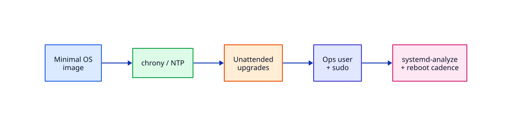

# Linux Server Baseline and Lifecycle

## Overview

A golden server image is not “latest Ubuntu with everything installed”. Production hosts start from a **minimal baseline**: correct time, predictable patching, least-privilege operators, and a known boot/service profile. Without that baseline, nginx and TLS labs sit on sand.

This tutorial teaches the lifecycle of a Linux app server before you add workloads: inspect what shipped in the image, synchronise time, configure unattended security updates thoughtfully, create an ops identity, and measure boot cost with `systemd-analyze`.

This is **Tutorial 21** in **Module 7: Advanced Linux Servers** — the golden-track server path.

## Prerequisites

- Complete Modules 1–6 of the Linux track, especially SSH, systemd, networking, hardening, and troubleshooting
- Ubuntu 22.04+ / 24.04 VM with `sudo` and console/out-of-band access
- Ability to install packages (`apt`)

## Learning Objectives

By the end of this tutorial, you will be able to:

- [ ] Describe a minimal golden-image mindset for Ubuntu servers
- [ ] Verify and troubleshoot time synchronisation (chrony/systemd-timesyncd)
- [ ] Configure unattended-upgrades with a clear reboot policy
- [ ] Create an ops user with limited sudo for service reloads
- [ ] Use systemd-analyze to profile boot and justify reboot windows

## Architecture

Baseline controls sit under every workload: image → time → patch → identity → measured boot.



## Theory

### Golden image mindset

Treat every VM as cattle with a pedigree:

1. **Minimal packages** — install only what the role needs; fewer packages mean fewer CVEs and less drift
2. **Immutable preference** — bake common tools into an image; configure per-environment with cloud-init or Ansible later
3. **Known identity** — named ops users, not shared `ubuntu` with NOPASSWD everything
4. **Measured change** — patch and reboot on a calendar with monitoring coverage

### Time synchronisation

TLS, logs, Kerberos, and distributed systems all depend on accurate clocks.

| Stack | Service | Check |
|-------|---------|-------|
| Ubuntu default | `systemd-timesyncd` | `timedatectl status` |
| Preferred for servers | `chrony` | `chronyc tracking` |

Skew of even a few minutes breaks certificate validation and confuses incident timelines.

### Unattended upgrades

`unattended-upgrades` can apply security updates automatically. Production policy choices:

- Apply **security** updates automatically; hold major version jumps for change windows
- Decide whether **automatic reboot** is allowed (often no on stateful single hosts)
- Monitor `/var/log/unattended-upgrades/` and pending kernels (`needrestart`)

### Ops user and sudo

Create a dedicated user for deploys/reloads. Use `/etc/sudoers.d/` fragments edited with `visudo -f`. Prefer command allow-lists (`systemctl reload nginx`) over blanket root.

### Boot and lifecycle

`systemd-analyze blame` and `critical-chain` show what delays boot. Reboot cadence matters for kernel CVE remediation — document the window and app drain procedure even on a single VM.


### Package inventory for rebuilds

Capture `dpkg --get-selections` and `/etc/apt/sources.list*` (plus keyrings) in your golden image docs. When a host is irrecoverable, you rebuild from image + backups — not from memory.

### needrestart and pending kernels

After upgrades, `needrestart` (Debian/Ubuntu) reports services and kernels needing reboot. Pending kernel CVEs are why reboot cadence exists even when unattended-upgrades already patched userland.


## Hands-on Lab

### Step 1 – Inventory the baseline

```bash
hostnamectl
cat /etc/os-release | head -5
dpkg -l | wc -l
systemctl is-system-running || true
```

**Expected output:** Ubuntu version string; package count; system state `running` (or `degraded` with a reason to investigate).

### Step 2 – Time sync status

```bash
timedatectl status
timedatectl show-timesync 2>/dev/null | head -10 || true
chronyc tracking 2>/dev/null || echo "chrony not installed (timesyncd may be active)"
```

**Expected output:** `System clock synchronized: yes` (or clear next steps if no). NTP service active.

### Step 3 – Optional chrony install (lab)

```bash
sudo apt update
sudo apt install -y chrony
sudo systemctl enable --now chrony
chronyc tracking | head -10
timedatectl status | grep -i synchronized
```

**Expected output:** chrony running; clock synchronised.

### Step 4 – Unattended upgrades dry-run

```bash
sudo apt install -y unattended-upgrades
sudo unattended-upgrade --dry-run --debug 2>&1 | tail -30
grep -E 'Unattended-Upgrade::|Automatic-Reboot' /etc/apt/apt.conf.d/* 2>/dev/null | head -20
```

**Expected output:** Dry-run completes; you can state whether automatic reboot is enabled.

### Step 5 – Tighten reboot policy (lab-safe)

```bash
echo 'Unattended-Upgrade::Automatic-Reboot "false";' | sudo tee /etc/apt/apt.conf.d/99-rebash-lab-reboot
grep Automatic-Reboot /etc/apt/apt.conf.d/99-rebash-lab-reboot
```

**Expected output:** Automatic reboot disabled for the lab host (adjust for your real policy later).

### Step 6 – Ops user sketch

```bash
sudo adduser --disabled-password --gecos "REBASH Ops" rebashops 2>/dev/null || true
id rebashops
# Document sudo allow-list (apply only after review):
cat << 'EOF'
# sudo visudo -f /etc/sudoers.d/99-rebashops
# rebashops ALL=(root) NOPASSWD: /bin/systemctl reload nginx, /bin/systemctl status nginx
EOF
```

**Expected output:** User exists; sudoers snippet printed for later controlled application.

### Step 7 – Boot analysis

```bash
systemd-analyze
systemd-analyze blame | head -15
systemd-analyze critical-chain 2>/dev/null | head -20 || true
```

**Expected output:** Total boot time; slowest units listed — note anything unexpected for a minimal server.

## Validation

Confirm the lab before moving on:

1. Re-run the critical commands and compare them to the expected output in each step.
2. Explain *why* each successful result matters for a production server.
3. Resolve any unexpected output using Troubleshooting before continuing.

| Check | Pass criteria |
|-------|----------------|
| Lab steps | Each step’s expected output matched (or differences explained) |
| Persistence | Config changes survive a service reload where required |
| Cleanup | Temporary lab artefacts removed or documented |

## Code Walkthrough

| Command / path | Description |
|----------------|-------------|
| `timedatectl status` | Show timezone, NTP sync state |
| `chronyc tracking` | Chrony stratum and offset |
| `unattended-upgrade --dry-run` | Simulate automatic upgrades |
| `systemd-analyze blame` | Rank units by boot delay |

## Code Examples

```bash
# Quick baseline card for any Ubuntu server
{
  echo "=== OS ==="; hostnamectl | head -5
  echo "=== Time ==="; timedatectl | grep -E 'synchronized|NTP'
  echo "=== Failed units ==="; systemctl --failed --no-pager
  echo "=== Listening ==="; sudo ss -tuln | head -20
} | tee /tmp/server-baseline.txt
```

## Security Considerations

Baseline is security: fewer packages, synced time for TLS, controlled patching, and least-privilege operators. Never leave password-auth SSH open after cutting over to keys. Document break-glass console access before enabling automated reboot.

## Common Mistakes

| Mistake | Why it hurts | Fix |
|---------|--------------|-----|
| Installing desktop meta-packages on servers | Huge attack surface and updates | Use ubuntu-server / minimal images |
| Ignoring clock skew | TLS and logs break silently | Install chrony; alert on unsynced |
| NOPASSWD ALL for deploy | Trivial privilege escalation | Allow-list specific commands |
| Automatic reboot without drain | Dropped connections, corruption risk | Reboot windows + health checks |

## Best Practices

1. Bake common hardening into the image; configure secrets at provision time
2. Pin critical packages when needed; still apply security updates
3. Keep a signed runbook for patch Tuesday / kernel reboot
4. Record baseline listeners with `ss` after first boot
5. Prefer named humans over shared cloud-default users long-term

## Troubleshooting

| Symptom | Likely cause | Resolution |
|---------|--------------|------------|
| Clock not synchronised | NTP blocked / wrong service | Check UDP 123, enable chrony/timesyncd |
| unattended-upgrades silent | Disabled / held packages | Check apt.conf.d and logs under /var/log/unattended-upgrades |
| Boot degraded | Failed unit | systemctl --failed; journalctl -b -p err |
| sudoers syntax error | Broken visudo edit | Use visudo; keep root console session |

## Production Discussion

Golden images belong in your pipeline: packer/image builder → hardened baseline → role packages (nginx) → secrets at provision. Reboot windows need product owner agreement. Chrony and unattended-upgrades policies should be identical across a fleet or drift will bite TLS and patch SLAs.

## Summary

You established a server baseline: inventory, time sync, upgrade policy, ops identity, and boot measurement. Module 7 workloads (nginx, TLS, LVM, backups) assume this foundation.

## Interview Questions

**Q1 — What belongs in a golden Linux server image?**

*Sample answer:* Minimal OS, time sync, SSH hardening baseline, monitoring agent hooks, unattended security updates policy — not random developer tools.

**Q2 — Why does clock sync matter on an app server?**

*Sample answer:* TLS validity, log correlation, auth protocols, and certificate renewal all depend on accurate time.

**Q3 — When is automatic reboot acceptable?**

*Sample answer:* Stateless fleets behind load balancers with health checks — rarely on a single stateful VM without a window.

**Q4 — How do you grant deploy rights safely?**

*Sample answer:* Dedicated user + sudoers allow-list for specific systemctl/nginx commands; never NOPASSWD ALL.

**Q5 — What does systemd-analyze tell you?**

*Sample answer:* Where boot time goes — slow units to fix or accept before production.

## Related Tutorials

- [Linux Security Hardening Basics](linux-security-hardening-basics.md)
- [systemd Service Management](systemd-service-management.md)
- Next: [nginx Web Server and Reverse Proxy](nginx-web-server-and-reverse-proxy.md)
- [Docker track](../docker/index.md) — containers after bare-metal fluency

## References

1. [Ubuntu Server Guide](https://ubuntu.com/server/docs)
2. [chrony documentation](https://chrony-project.org/documentation.html)
3. [systemd-analyze(1)](https://www.freedesktop.org/software/systemd/man/systemd-analyze.html)
