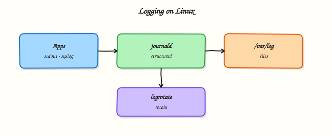

# Logging — syslog, journald, and logrotate

## Overview

If it is not logged, it did not happen in the incident review. On modern Ubuntu, **journald** collects structured logs from the kernel, services, and stdout/stderr of systemd units. You read them with **`journalctl`**. Many programs still write classic text logs under `/var/log`, often via **syslog** (rsyslog or syslog-ng). **logrotate** compresses and retires those text files so disks do not fill forever.

In Cloud and DevOps work you follow a unit with `journalctl -u`, correlate boot windows with `--since`, and ensure application file logs have a **logrotate** rule. Silent log growth is a common cause of disk-full outages. In this tutorial you will query the journal, write a sample app log, add a logrotate configuration, force a rotation, and save proof under `~/rebash-linux/lab18`.

In production, ship important logs to a central system, restrict who can read authentication logs, and alert when journal or `/var/log` mounts grow too fast.

This is **Tutorial 18** in **Module 12: Logging & Monitoring** of the REBASH Academy **Linux for Cloud & DevOps Engineers** series. It is written for Linux administrators, DevOps engineers, Site Reliability Engineering (SRE), and platform engineers.

## Prerequisites

- [Scheduling with cron, at, and Timers](scheduling-cron-at-and-timers.md)
- A **practice Ubuntu 22.04/24.04 VM** with `sudo`
- Packages: `systemd` (journalctl), `logrotate` (usually installed)

## Learning Objectives

By the end of this tutorial, you will be able to:

- [ ] Query journald with `journalctl` filters (`-u`, `--since`, `-p`)
- [ ] Explain how journald relates to classic `/var/log` syslog files
- [ ] Create a logrotate rule for an application log and force a rotation
- [ ] Prove rotation with timestamps and rotated filenames
- [ ] Pack evidence under `~/rebash-linux/lab18`

## Architecture

Applications and units emit logs to journald and/or text files; logrotate manages text file retention; operators query with journalctl and inspect `/var/log`.



## Theory

### What it is

**journald** stores binary, indexed logs. **syslog** daemons traditionally write text files such as `/var/log/syslog`. **logrotate** runs on a schedule (often daily via cron/timers) to rotate, compress, and delete old log files based on rules in `/etc/logrotate.conf` and `/etc/logrotate.d/`.

```bash title="Terminal"
journalctl -xe
journalctl -u ssh.service -n 20 --no-pager
ls /var/log
```

### Why it matters

Without retention, logs fill disks. Without query skills, incidents take longer. Central logging (Elastic, Loki, CloudWatch, and similar) still starts with correct host-side collection and rotation.

### How it works

1. Units log to the journal (and sometimes to files).  
2. Operators filter with `journalctl`.  
3. File logs grow under `/var/log` or app directories.  
4. logrotate renames/compresses and may signal the app (`postrotate`).

| Tool | Best for |
|------|----------|
| `journalctl` | systemd units, boots, priorities |
| `/var/log/*` | Classic app/syslog text |
| `logrotate` | Retention for text logs |

### Common pitfalls

- Forgetting `Storage=` / vacuum settings until the journal fills `/var`.  
- Rotating a log without telling the app to reopen the file (needs `postrotate` or copytruncate carefully).  
- Reading only `/var/log/syslog` when the service only logs to the journal.  
- World-readable logs that contain secrets.

## Hands-on Lab

### Objective

Query journald, create a sample application log with a dedicated logrotate rule, force rotation, and save evidence under `~/rebash-linux/lab18`.

### Prerequisites

- Ubuntu with `sudo`, `journalctl`, `logrotate`

### Lab environment

Workspace: `~/rebash-linux/lab18`

```bash title="Terminal"
mkdir -p ~/rebash-linux/lab18 && cd ~/rebash-linux/lab18
set -euo pipefail
test -n "$(command -v journalctl)"
test -n "$(command -v logrotate)"
journalctl --version | head -n 1 | tee journalctl-version.txt
```

!!! example "Expected output"
    `journalctl` and `logrotate` exist; version file written.


### Real-world scenario

A small app writes to `/var/log/rebash-lab18/app.log`. Disk alerts fired last month because nothing rotated that file. You add a logrotate rule, prove a forced rotation, and show how to pull matching journal lines for the same host window.

### Step-by-step tasks

#### Task 1 – Query journald

```bash title="Terminal"
cd ~/rebash-linux/lab18
set -euo pipefail

journalctl -b -n 30 --no-pager | tee journal-boot-tail.txt
journalctl -p err..alert -n 20 --no-pager | tee journal-err.txt || true
journalctl --list-boots | tee journal-boots.txt
# Logger message into syslog/journal
logger -t rebash-lab18 "rebash lab18 marker $(date -Is)"
sleep 1
journalctl -t rebash-lab18 -n 5 --no-pager | tee journal-marker.txt
grep -F 'rebash lab18 marker' journal-marker.txt
```

!!! example "Expected output"
    `journal-marker.txt` contains your logger line; boot list captured.


#### Task 2 – Application log + logrotate rule

```bash title="Terminal"
cd ~/rebash-linux/lab18
set -euo pipefail

sudo mkdir -p /var/log/rebash-lab18
sudo chown "$USER":"$USER" /var/log/rebash-lab18
printf 'line-%s\n' $(seq 1 200) > /var/log/rebash-lab18/app.log
wc -l /var/log/rebash-lab18/app.log | tee app-lines-before.txt

sudo tee /etc/logrotate.d/rebash-lab18 >/dev/null << 'EOF'
/var/log/rebash-lab18/*.log {
    daily
    missingok
    rotate 3
    compress
    delaycompress
    notifempty
    copytruncate
}
EOF

# Syntax check (logrotate -d is dry-run debug)
sudo logrotate -d /etc/logrotate.d/rebash-lab18 2>&1 | tee logrotate-debug.txt
grep -Ei 'rebash-lab18|app.log' logrotate-debug.txt
```

!!! example "Expected output"
    `app.log` has 200 lines; debug output mentions the lab path; rule file installed.


#### Task 3 – Force rotation and evidence pack

```bash title="Terminal"
cd ~/rebash-linux/lab18
set -euo pipefail

# Force rotation even if not "daily" yet
sudo logrotate -f /etc/logrotate.d/rebash-lab18
ls -la /var/log/rebash-lab18/ | tee log-dir-after.txt
# With copytruncate, original app.log remains; a rotated copy appears (name varies)
test -f /var/log/rebash-lab18/app.log
ls /var/log/rebash-lab18/app.log* | tee rotated-names.txt
test "$(ls /var/log/rebash-lab18/app.log* | wc -l)" -ge 2

tar -czf logging-evidence.tgz \
  journalctl-version.txt journal-boot-tail.txt journal-err.txt \
  journal-boots.txt journal-marker.txt \
  app-lines-before.txt logrotate-debug.txt log-dir-after.txt rotated-names.txt
ls -l logging-evidence.tgz | tee evidence-ls.txt
```

!!! example "Expected output"
    more than one `app.log*` name after forced rotate; evidence archive exists.


### Validation steps

- [ ] `journalctl -t rebash-lab18` shows the marker
- [ ] `/etc/logrotate.d/rebash-lab18` exists
- [ ] Forced rotation created a rotated file alongside `app.log`
- [ ] `logging-evidence.tgz` exists under `~/rebash-linux/lab18`

### Common errors and fixes

| Error | Cause | Fix |
|-------|-------|-----|
| Permission denied on `/var/log` | Need root for system paths | Use `sudo` for mkdir/logrotate |
| No rotated file after `-f` | Rule path mismatch / `notifempty` | Confirm path; ensure log has content |
| `journalctl` empty for tag | logger failed / wrong filter | Re-run `logger`; try `journalctl -n 50` |
| Disk still filling | Journal vacuum not set / other logs | Check `journalctl --disk-usage`; rotate other paths |

### Challenge exercise

Write `/etc/logrotate.d/rebash-lab18-size` that rotates `/var/log/rebash-lab18/app.log` when it exceeds `1k` (`size 1k`), force it after appending more lines, and save `ls -la` output to `size-rotate.txt`. Remove the extra rule in Cleanup.

### Learning outcomes

- Filtered journald by boot, priority, and tag
- Installed a logrotate drop-in and forced rotation
- Proved rotated filenames on disk
- Saved logging evidence for a ticket

### Cleanup

```bash title="Terminal"
cd ~/rebash-linux/lab18
set -euo pipefail
sudo rm -f /etc/logrotate.d/rebash-lab18 /etc/logrotate.d/rebash-lab18-size
sudo rm -rf /var/log/rebash-lab18
# Keep logging-evidence.tgz if you want it
```

## Validation

- [ ] Lab finished under `~/rebash-linux/lab18/` with evidence files
- [ ] You can explain journald vs text syslog files
- [ ] You know why every long-lived app log needs rotation
- [ ] You can find a service’s recent logs with `journalctl -u`

## Code Walkthrough

Incident logging path:

1. Identify the unit or log file  
2. `journalctl -u … --since …`  
3. Check `/var/log` and disk (`df`)  
4. Confirm logrotate rules exist and ran  
5. Forward critical logs centrally  

## Security Considerations

- Restrict permissions on auth and application logs  
- Do not log secrets (tokens, passwords)  
- Limit who can run `journalctl` as root on multi-tenant hosts  
- Protect log shipping credentials  
- Retain logs long enough for investigations, not forever on the host disk  

## Common Mistakes

!!! warning "Only watching `/var/log/syslog`"
    Many units log only to the journal. **Fix:** start with `journalctl -u servicename`.

!!! warning "Rotating without reopening the file"
    The app may keep writing to a deleted inode. **Fix:** use a proper `postrotate` reload, or carefully use `copytruncate` when appropriate.

!!! warning "No vacuum on journal storage"
    `/var` fills with journal data. **Fix:** configure `SystemMaxUse=` / vacuum; monitor `journalctl --disk-usage`.

!!! warning "World-readable app logs"
    Sensitive data leaks. **Fix:** mode `640`/`640`-style ownership to the app group.

## Best Practices

- One logrotate file per application under `/etc/logrotate.d/`  
- Prefer structured logs and correlation IDs  
- Alert on log volume spikes and disk use  
- Document where each critical service logs  
- Test `logrotate -d` before production changes  

## Troubleshooting

| Symptom | Likely cause | Fix |
|---------|--------------|-----|
| Empty `journalctl -u` | Wrong unit name / stdout not captured | Check `systemctl status`; unit `StandardOutput` |
| Log file not rotating | Rule not matched / logrotate not run | `logrotate -d`; check timers/cron |
| Disk full under `/var/log` | Missing rotate / huge dumps | Rotate, truncate carefully, expand disk |
| Gaps in logs | Time skew / wiped journal | Fix NTP; check persistence settings |
| Permission denied reading journal | Non-root / not in `adm`/`systemd-journal` | Use sudo or add user to the right group |

## Summary

journald holds structured unit logs; syslog files still matter; logrotate keeps text logs from filling disks. Query with purpose, rotate every long-lived file log, and prove it. Next: [Host Monitoring — vmstat, iostat, sar](host-monitoring-vmstat-iostat-sar.md).

## Interview Questions

**1. What is the difference between journald and classic syslog files?**

??? success "Reveal answer"
    **journald** stores structured, indexed logs from the kernel and systemd units, queried with `journalctl`. **Classic syslog** usually writes plain text files under `/var/log`. Many hosts use both: units → journal, and some apps/syslog rules → text files that **logrotate** manages.

**2. How do you show logs for one service since one hour ago?**

??? success "Reveal answer"
    Example: `journalctl -u myapp.service --since "1 hour ago" --no-pager`. Add `-p err` to focus on errors, or `-f` to follow. Confirm the exact unit name with `systemctl list-units`.

**3. Why must application file logs have logrotate rules?**

??? success "Reveal answer"
    Without rotation, logs grow until the filesystem is full, causing outages. logrotate enforces retention (how many copies, compression, when to delete). Every long-lived path under `/var/log` or an app directory needs an owner and a rule.

**4. What goes wrong if you rotate a log but the process keeps the old file descriptor open?**

??? success "Reveal answer"
    The process keeps writing to the old inode; the new log file stays empty and disk may not free as expected. Fix with a `postrotate` script that signals the app to reopen logs, or use carefully designed `copytruncate` where appropriate.

**5. How would you investigate “disk full” when `/var` is the mount that filled?**

??? success "Reveal answer"
    Run `df -hT`/`du` on `/var`, check `/var/log` and journal disk use (`journalctl --disk-usage`), identify the largest files, rotate or purge safely, fix the missing retention rule, then confirm `df` recovered. Attach before/after proof.

**6. Which journalctl filters do you use most in production?**

??? success "Reveal answer"
    Commonly `-u` (unit), `--since`/`--until`, `-b` (boot), `-p` (priority), and `-f` (follow). Tags (`-t`) help for `logger` markers and some apps.

**7. How do host logs relate to Kubernetes or container platforms?**

??? success "Reveal answer"
    Containers often log to stdout (collected by the runtime) while the node still has journald for kubelet/container runtime and system units. Engineers need both cluster log pipelines and node `journalctl` skills when the node itself is unhealthy.

## Related Tutorials

- [Linux for Cloud & DevOps – Overview](index.md)
- [Scheduling with cron, at, and Timers](scheduling-cron-at-and-timers.md) *(previous)*
- [Host Monitoring — vmstat, iostat, sar](host-monitoring-vmstat-iostat-sar.md) *(next)*
- [systemd Services and journalctl](systemd-services-and-journalctl.md) *(related)*

## References

- [`journalctl(1)`](https://www.freedesktop.org/software/systemd/man/journalctl.html) — systemd journal  
- [`logrotate(8)`](https://manpages.ubuntu.com/manpages/jammy/en/man8/logrotate.8.html) — Ubuntu man-pages  
- Track index: [Linux for Cloud & DevOps Engineers](index.md)
