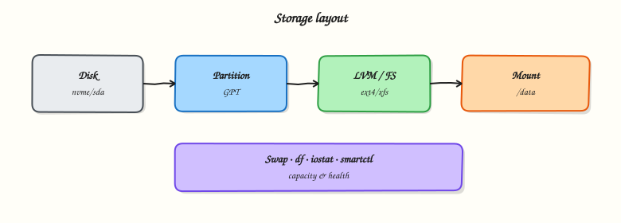

# LVM, Swap, and Disk Monitoring

## Overview

LVM turns “we need 50 GiB more” into an online extend instead of a migration weekend.

This is **Tutorial 13** in **Module 8: Storage Management** of the REBASH Academy **Linux for Cloud & DevOps Engineers** series — written for administrators, DevOps engineers, SREs, and platform engineers operating production Linux.

## Prerequisites

- Storage — Disks, Partitions, and Filesystems
- Terminal access with a regular user account (sudo where noted)

## Learning Objectives

By the end of this tutorial, you will be able to:

- [ ] Apply the core ideas of “LVM, Swap, and Disk Monitoring” on a real Linux host
- [ ] Use modern tools (`ip`/`ss`, `systemctl`/`journalctl`) where they apply
- [ ] Complete the lab under `~/rebash-linux/` with clear outputs
- [ ] Relate this topic to Cloud, DevOps, and production operations
- [ ] Explain the failure modes you would check first in an incident

## Architecture

Linux ops work sits between humans/automation and the kernel, services, and network. This topic’s control points are shown below.



## Theory

### What it is

**Logical Volume Manager (LVM)** inserts a flexible layer between disks and filesystems: physical volumes (PV) feed a volume group (VG) pool, from which you carve logical volumes (LV) to format and mount. **Swap** is disk-backed virtual memory used under memory pressure (or for hibernation features on some platforms). **Disk monitoring** watches capacity (`df`/`du`), inodes, and I/O pressure (`iostat`, cloud metrics) so you grow volumes *before* outages.

### Why it matters

LVM lets you extend filesystems online when a database grows — a frequent cloud operations task. Swap thrashing destroys latency even when CPU looks idle. Silent disk fill on `/var` takes down logging, containers, and package installs. Combining LVM growth procedures with alerts at 80/90% utilisation is standard SRE hygiene.

### How it works

Typical LVM flow: `pvcreate` → `vgcreate` → `lvcreate` → `mkfs` → mount. Inspect with `pvs`, `vgs`, `lvs`. Extend with `lvextend`, then grow the filesystem (`resize2fs` for ext4, `xfs_growfs` for XFS — XFS cannot shrink). Swap appears in `swapon --show` and `free -h`; create with `mkswap` and enable via `swapon` plus an `fstab` entry when policy requires it. Monitor capacity per mount and inode use; watch `wa` in `vmstat` and util/await in `iostat` for saturation. On cloud disks, also track burst credits and volume IOPS limits outside the guest.

### Key concepts and comparisons

| Object | Role |
|--------|------|
| PV | Disk/partition owned by LVM |
| VG | Pool of storage |
| LV | Allocated volume you format |

| Signal | Tool |
|--------|------|
| Capacity / inodes | `df -h`, `df -i` |
| Hot directories | `du` |
| I/O pressure | `iostat`, `iotop` |
| Swap activity | `vmstat` `si`/`so`, `free` |

| Growth step | ext4 | XFS |
|-------------|------|-----|
| After `lvextend` | `resize2fs` | `xfs_growfs` (mounted) |

### Common pitfalls

- Running `resize2fs` on XFS (wrong tool) or trying to shrink XFS.
- Extending the LV but forgetting to grow the filesystem — `df` stays unchanged.
- Enabling large swap on latency-sensitive nodes and masking memory leaks.
- Alerting only on root disk while LVM data volumes fill unnoticed.
- Growing cloud volumes in the console but not rescanning/resizing inside the guest.

## Hands-on Lab

Create a workspace for this tutorial.

```bash
mkdir -p ~/rebash-linux/lab13 && cd ~/rebash-linux/lab13
```

**Focus:** inspect pvs/vgs/lvs if present; review swap; script a df alert stub

### Step 1 – LVM/swap/monitor snapshot

```bash
{
  echo '=== LVM ==='
  sudo pvs 2>/dev/null || echo 'no PVs'
  sudo vgs 2>/dev/null || true
  sudo lvs 2>/dev/null || true
  echo '=== Swap ==='
  swapon --show || true
  free -h
  echo '=== Disk ==='
  df -h
} | tee storage-health.txt
```

### Final step – Cleanup note

```bash
# Keep ~/rebash-linux/ for later tutorials; destroy disposable cloud resources from this lab
```

## Validation

- [ ] Lab commands run under `~/rebash-linux/lab13/`
- [ ] You can explain each Theory bullet in your own words
- [ ] You used modern tooling where applicable (`ip`/`ss`, `systemctl`/`journalctl`)
- [ ] You can describe one production failure mode for this topic

## Code Walkthrough

Production Linux practice for **LVM, Swap, and Disk Monitoring** always combines:

1. Inspect before you change (`status`, `df`, `ip`, logs)
2. Prefer reversible, documented changes (config management, drop-ins)
3. Capture evidence (command output, journal snippets) for handovers
4. Prefer `systemctl`/`journalctl` and `ip`/`ss` over legacy tools
5. Least privilege — escalate with `sudo` only when required

Keep runbooks short enough to follow at 03:00. Automate the boring checks; keep humans for judgement.

## Security Considerations

- Treat host access and sudo as privileged — audit who can do what
- Never paste secrets into shell history, tickets, or screenshots
- Validate device names and paths before destructive disk or `rm` operations
- Prefer key-based SSH and deny password auth on internet-facing hosts
- Collect logs centrally; restrict who can read authentication and audit trails

## Common Mistakes

!!! warning "Using legacy networking tools by default"
    `ifconfig`/`netstat` are missing or incomplete on modern images. **Fix:** use `ip` and `ss`.

!!! warning "Editing vendor unit files in place"
    Package upgrades overwrite `/lib/systemd/system`. **Fix:** `systemctl edit` drop-ins under `/etc`.

!!! warning "Trusting df without checking inodes and mounts"
    A full `/var` or exhausted inodes looks different from root. **Fix:** `df -h`, `df -i`, and `findmnt`.

## Best Practices

- Golden images + config as code over snowflake hosts
- Alert on symptoms (failed units, disk, load) with runbooks attached
- Time-sync (chrony) everywhere — logs and TLS depend on it
- Separate OS and data volumes on Cloud VMs
- Practise restore and rescue paths before you need them

## Troubleshooting

| Symptom | Likely cause | Fix |
|---------|--------------|-----|
| Permission denied | Mode/owner/ACL/MAC | `namei -l`, `id`, `getfacl`, SELinux/AppArmor logs |
| No route / timeout | Routing, DNS, firewall | `ip route`, `dig`, `ss`, security groups |
| Service won’t start | Unit/config/deps | `systemctl status`, `journalctl -u`, config `-t` |
| Disk full | Logs, containers, deleted-open | `df`/`du`, `lsof +L1`, rotate/expand |
| High load | CPU, I/O wait, thrash | `vmstat`, `iostat`, `ps` |

## Summary

**LVM, Swap, and Disk Monitoring** is essential for Cloud and DevOps engineers operating Linux hosts. Practise the lab until the inspection path is muscle memory, then continue the track.

## Interview Questions

1. How does this topic show up when operating Cloud VMs or Kubernetes nodes?
2. What would you check first if this area misbehaves in production?
3. Which modern Linux tools replace older equivalents here?
4. What security control should accompany this capability?
5. How would you automate verification of this topic in CI or a cron/timer job?

!!! tip "Sample answer — question 2"
    Start with blast radius and recent changes, then gather host signals (`systemctl --failed`, `df`, `ip`/`ss`, `journalctl`) before making changes. Fix forward with evidence, not guesswork.

## Related Tutorials

- [Linux for Cloud & DevOps – Category Overview](index.md)
- [Storage — Disks, Partitions, and Filesystems](storage-disks-partitions-and-filesystems.md) *(previous)*
- [Linux Networking Tools](linux-networking-tools.md) *(next)*
- [Learning Paths](../learning-paths/index.md)

## References

- [Linux man-pages project](https://www.kernel.org/doc/man-pages/)
- [systemd documentation](https://systemd.io/)
- [Filesystem Hierarchy Standard](https://refspecs.linuxfoundation.org/FHS_3.0/fhs-3.0.html)
- Track index: [Linux for Cloud & DevOps Engineers](index.md)
