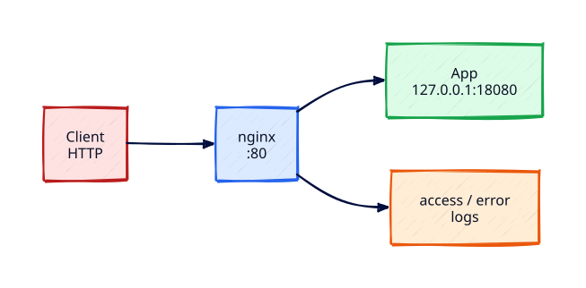

# nginx Web Server and Reverse Proxy

## Overview

Most Linux app servers do not expose application ports publicly. **nginx** terminates HTTP at the edge, serves static assets efficiently, and **reverse-proxies** dynamic traffic to an upstream process bound to `127.0.0.1`. That pattern is the same mental model you will later see with Ingress and load balancers — first learn it on a single Ubuntu host.

This tutorial installs nginx, publishes a static site, runs a tiny upstream on localhost, and configures `proxy_pass` with log inspection and a deliberate 502 drill.

This is **Tutorial 22** in **Module 7: Advanced Linux Servers**.

## Prerequisites

- Complete [Linux Server Baseline and Lifecycle](linux-server-baseline-and-lifecycle.md)
- Complete [Linux Networking Essentials](linux-networking-essentials.md) (listeners / bind addresses)
- Ubuntu 22.04+ with `sudo`
- Port 80 free on the lab VM (or adjust)

## Learning Objectives

By the end of this tutorial, you will be able to:

- [ ] Install and enable nginx on Ubuntu
- [ ] Serve a static site from `/var/www`
- [ ] Reverse-proxy to an upstream on `127.0.0.1`
- [ ] Manage site configs via `sites-available` / `sites-enabled`
- [ ] Validate with `nginx -t`, `curl`, and access/error logs

## Architecture

Clients hit nginx on port 80; nginx proxies to an app listening only on localhost.



## Theory

### Why nginx in front?

| Concern | Direct app on :8080 public | nginx edge |
|---------|----------------------------|------------|
| TLS | App must implement | Terminate at nginx (next tutorial) |
| Static files | Waste app workers | Served efficiently by nginx |
| Buffering / timeouts | Ad hoc | Central `proxy_*` knobs |
| Exposure | App bind mistakes | App stays on 127.0.0.1 |

### Config layout (Debian/Ubuntu)

| Path | Role |
|------|------|
| `/etc/nginx/nginx.conf` | Global settings, includes |
| `/etc/nginx/sites-available/` | Available virtual hosts |
| `/etc/nginx/sites-enabled/` | Symlinks to enabled sites |
| `/var/log/nginx/access.log` | Access log |
| `/var/log/nginx/error.log` | Error log |

Test config before reload: `sudo nginx -t` then `sudo systemctl reload nginx`.

### Reverse proxy essentials

```nginx
location /api/ {
    proxy_pass http://127.0.0.1:18080/;
    proxy_set_header Host $host;
    proxy_set_header X-Real-IP $remote_addr;
    proxy_set_header X-Forwarded-For $proxy_add_x_forwarded_for;
    proxy_set_header X-Forwarded-Proto $scheme;
}
```

Upstream must be reachable **from the nginx host**. If the app binds `127.0.0.1` only, remote clients never touch it directly — that is intentional.

### Health and failure modes

- **502 Bad Gateway** — upstream down or wrong `proxy_pass`
- **Connection refused** to :80 — nginx not listening / firewall
- **404** — wrong `root` or location

Always compare `curl http://127.0.0.1/` (edge) vs `curl http://127.0.0.1:18080/` (upstream).


### systemd for the real upstream

In production the Python one-liner becomes a `User=`/`WorkingDirectory=` unit under `/etc/systemd/system/`. Pair with the [Linux Production Incident Triage](../labs/linux-production-incident-triage.md) lab pattern: unit, journald, and localhost health check before nginx proxies to it.

### Rate limiting and buffers (preview)

nginx can limit request rates and buffer slow clients — useful before you move to dedicated WAFs. Start with correct timeouts (`proxy_read_timeout`) so long requests fail loudly instead of hanging workers.


## Hands-on Lab

### Step 1 – Install nginx

```bash
sudo apt update
sudo apt install -y nginx
sudo systemctl enable --now nginx
systemctl is-active nginx
curl -sS -o /dev/null -w "%{http_code}\n" http://127.0.0.1/
```

**Expected output:** `active` and HTTP `200` for the default welcome page.

### Step 2 – Static site

```bash
sudo mkdir -p /var/www/rebash-static
echo '<h1>REBASH static</h1>' | sudo tee /var/www/rebash-static/index.html
sudo tee /etc/nginx/sites-available/rebash-static << 'EOF'
server {
    listen 80 default_server;
    listen [::]:80 default_server;
    server_name _;
    root /var/www/rebash-static;
    index index.html;
    location / {
        try_files $uri $uri/ =404;
    }
}
EOF
sudo rm -f /etc/nginx/sites-enabled/default
sudo ln -sf /etc/nginx/sites-available/rebash-static /etc/nginx/sites-enabled/rebash-static
sudo nginx -t && sudo systemctl reload nginx
curl -sS http://127.0.0.1/ | head -5
```

**Expected output:** Config OK; HTML contains `REBASH static`.

### Step 3 – Local upstream app

```bash
python3 - <<'PY' >/tmp/rebash-upstream.log 2>&1 &
from http.server import BaseHTTPRequestHandler, HTTPServer
class H(BaseHTTPRequestHandler):
    def do_GET(self):
        body = b'{"service":"rebash-upstream","ok":true}\n'
        self.send_response(200)
        self.send_header('Content-Type', 'application/json')
        self.send_header('Content-Length', str(len(body)))
        self.end_headers()
        self.wfile.write(body)
    def log_message(self, *a):
        return
HTTPServer(('127.0.0.1', 18080), H).serve_forever()
PY
echo $! > /tmp/rebash-upstream.pid
sleep 1
curl -sS http://127.0.0.1:18080/
ss -tln | grep 18080
```

**Expected output:** JSON OK; listener on `127.0.0.1:18080`.

### Step 4 – Reverse proxy location

```bash
sudo tee /etc/nginx/sites-available/rebash-static << 'EOF'
server {
    listen 80 default_server;
    listen [::]:80 default_server;
    server_name _;
    root /var/www/rebash-static;
    index index.html;

    location / {
        try_files $uri $uri/ =404;
    }

    location /api/ {
        proxy_pass http://127.0.0.1:18080/;
        proxy_http_version 1.1;
        proxy_set_header Host $host;
        proxy_set_header X-Real-IP $remote_addr;
        proxy_set_header X-Forwarded-For $proxy_add_x_forwarded_for;
        proxy_set_header X-Forwarded-Proto $scheme;
    }
}
EOF
sudo nginx -t && sudo systemctl reload nginx
curl -sS http://127.0.0.1/api/
```

**Expected output:** `/api/` returns upstream JSON.

### Step 5 – Logs

```bash
sudo tail -n 5 /var/log/nginx/access.log
sudo tail -n 5 /var/log/nginx/error.log || true
```

**Expected output:** Access lines for `/` and `/api/`; error log quiet on success.

### Step 6 – Induce and fix a 502

```bash
kill "$(cat /tmp/rebash-upstream.pid)" 2>/dev/null || true
curl -sS -o /dev/null -w "%{http_code}\n" http://127.0.0.1/api/ || true
python3 - <<'PY' >/tmp/rebash-upstream.log 2>&1 &
from http.server import BaseHTTPRequestHandler, HTTPServer
class H(BaseHTTPRequestHandler):
    def do_GET(self):
        self.send_response(200); self.end_headers(); self.wfile.write(b'{"ok":true}\n')
    def log_message(self, *a):
        return
HTTPServer(('127.0.0.1', 18080), H).serve_forever()
PY
echo $! > /tmp/rebash-upstream.pid
sleep 1
curl -sS -o /dev/null -w "%{http_code}\n" http://127.0.0.1/api/
```

**Expected output:** Failure while upstream dead; `200` after restart.

### Step 7 – Cleanup upstream process

```bash
kill "$(cat /tmp/rebash-upstream.pid)" 2>/dev/null || true
rm -f /tmp/rebash-upstream.pid /tmp/rebash-upstream.log
```

## Validation

| Check | Pass criteria |
|-------|----------------|
| nginx active | `systemctl is-active nginx` → active |
| Static | `GET /` returns REBASH static |
| Proxy | `GET /api/` returns upstream when running |
| Config | `nginx -t` succeeds |

## Code Walkthrough

| Command / path | Description |
|----------------|-------------|
| `nginx -t` | Validate configuration syntax |
| `sites-available` / `sites-enabled` | Enable virtual hosts via symlink |
| `proxy_pass` | Forward to upstream URL |
| `/var/log/nginx/*` | Access and error diagnostics |

## Code Examples

```bash
sudo ss -tulpn | grep nginx
sudo nginx -T 2>/dev/null | grep -E 'listen |server_name |proxy_pass' | head -40
```

## Security Considerations

Keep upstreams on localhost. Do not expose `:18080` via firewall. Set sensible `client_max_body_size`, hide version (`server_tokens off`), and move to TLS in the next tutorial before production traffic.

## Common Mistakes

| Mistake | Why it hurts | Fix |
|---------|--------------|-----|
| App on `0.0.0.0:18080` | Bypasses nginx controls | Bind `127.0.0.1` |
| Wrong `proxy_pass` slash | Broken upstream paths | Match location slash rules |
| Reload without `nginx -t` | Outage | Always test then reload |
| Leaving default site | Confusing vhost selection | Explicit default_server |

## Best Practices

1. One site file per application
2. Reload for config changes when possible
3. Health-check upstreams before public exposure
4. Document the bind matrix: edge vs localhost ports
5. Ship access logs to your collector in production

## Troubleshooting

| Symptom | Likely cause | Resolution |
|---------|--------------|------------|
| 502 | Upstream down / wrong port | Start app; fix `proxy_pass` |
| 404 on static | Wrong `root` | Fix path and permissions |
| Permission denied | Root dir mode | Adjust ownership carefully |
| Port 80 in use | Another process | `ss -tulpn \| grep :80` |

## Summary

You placed nginx at the HTTP edge, served static content, and proxied to a localhost upstream — the core Linux app-server pattern before TLS and containers.

## Interview Questions

**Q1 — Why reverse-proxy instead of exposing the app port?**

*Sample answer:* Centralise TLS, static content, buffering, and exposure control; keep the app on localhost.

**Q2 — What usually causes nginx 502?**

*Sample answer:* Upstream not listening, crashed workers, or incorrect `proxy_pass` host/port.

**Q3 — Difference between restart and reload?**

*Sample answer:* Reload applies config with less disruption; restart drops connections.

**Q4 — How do you debug which server block is used?**

*Sample answer:* `nginx -T`, check `server_name`/`default_server`, test with `curl -H 'Host: ...'`.

**Q5 — Where should the app listen in this design?**

*Sample answer:* `127.0.0.1` on a private port; only nginx listens publicly on 80/443.

## Related Tutorials

- Previous: [Linux Server Baseline and Lifecycle](linux-server-baseline-and-lifecycle.md)
- Next: [TLS Certificates on Linux Servers](tls-certificates-on-linux-servers.md)
- [Linux Networking Essentials](linux-networking-essentials.md)
- [Troubleshooting Linux Systems](troubleshooting-linux-systems.md)
- [Docker](../docker/index.md)

## References

1. [nginx Beginner’s Guide](https://nginx.org/en/docs/beginners_guide.html)
2. [ngx_http_proxy_module](https://nginx.org/en/docs/http/ngx_http_proxy_module.html)
3. [Ubuntu nginx docs](https://ubuntu.com/server/docs/web-servers-nginx)
