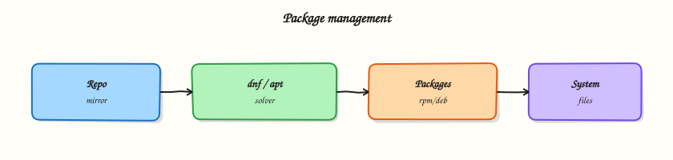

# Package Management

## Overview

Installing and updating software is weekly work on Linux servers. This tutorial teaches the package manager workflow and how to read the errors when a dependency fails.

**Plain problem:** Your teammate says “run `apt install nginx`”. On another server the same command fails because that host uses **`dnf`** (Red Hat family) or **`apk`** (Alpine). Installing the wrong way wastes time and can break production images.

A **package manager** is the distro’s official shop for software: it downloads signed packages, tracks versions, and removes files cleanly. Unpatched packages are security debt — attackers exploit known bugs in old versions.

This tutorial answers, in order:

1. What is a package and a package manager?
2. How does **`apt`** work on Ubuntu?
3. What are **`dnf`**, **`yum`**, and **`apk`**?
4. How do you install, query, hold, and remove a package safely?
5. How do you prove package state for a ticket or interview?

This is **Tutorial 10** in **Module 10: Package Management** of the REBASH Academy **Linux for Cloud & DevOps Engineers** series — practical Linux for Cloud and DevOps work.

## Prerequisites

- A practice Ubuntu 22.04/24.04 VM, cloud Free Tier VM, or Windows Subsystem for Linux (WSL2) Ubuntu
- SSH or local terminal access
- A normal user account with `sudo` when the lab asks for it
- Completed [SSH and Remote Access](ssh-and-remote-access.md) or equivalent comfort in a terminal

You do **not** need to have built software from source before.

## Learning Objectives

By the end of this tutorial, you will be able to:

- [ ] Explain what a package manager does in plain language
- [ ] Refresh metadata, install, query, and remove packages with `apt` on Ubuntu
- [ ] Map `apt` commands to `dnf`/`yum`/`apk` equivalents on other distros
- [ ] Place an **apt hold** so a package does not upgrade by accident
- [ ] Save a package evidence pack for tickets or interviews
- [ ] Answer common fresher interview questions on package management

## Architecture

Your shell talks to the package manager (`apt`), which reads package lists from repositories on the internet (or a mirror), verifies signatures, and installs files into standard paths (`/usr/bin`, `/lib`, …). Lower-level tools (`dpkg` on Debian family, `rpm` on RHEL family) track what is installed on disk.



## Theory

### The problem (before any jargon)

You join a team and need **tree** (a small directory-listing tool) on a build server. You Google “install tree linux” and see five different command sets. You pick one at random. Half work; half fail with “command not found” for the package manager itself.

The fix is always the same: **identify the distro family first** (`cat /etc/os-release`), then use that family’s package manager.

### What is a package? (simple words)

**Analogy:** A **package** is a pre-packed box from a trusted warehouse — the program, its libraries, and a manifest saying which files go where. The **package manager** is the shop clerk: finds the box, checks the seal (signature), unpacks it, and records what you own so uninstall is clean.

| Term | Plain meaning |
|------|----------------|
| **Package** | Archive of software + metadata (name, version, dependencies) |
| **Repository (repo)** | Server listing available packages for your distro |
| **Package manager** | Tool that installs, updates, and removes packages (`apt`, `dnf`, …) |
| **Dependency** | Another package this one needs to run |
| **Hold / pin** | Mark a package so it does not auto-upgrade |

**What you can say in an interview:** “On Ubuntu I use `apt` to install from signed repositories; I always refresh metadata with `update` before `upgrade`, and I query installed version before blaming the app.”

### apt on Ubuntu and Debian

| Goal | Command |
|------|---------|
| Refresh package lists | `sudo apt update` |
| Upgrade installed packages | `sudo apt upgrade` |
| Install a package | `sudo apt install <name>` |
| Show installed version | `apt list --installed <name>` |
| Show files from a package | `dpkg -L <name>` |
| Remove package | `sudo apt remove <name>` |
| Prevent upgrade | `sudo apt-mark hold <name>` |

**Tiny example — check if `curl` is installed:**

``` {.bash .ra-terminal title="Terminal"}
apt list --installed curl 2>/dev/null | head -5
dpkg -l curl 2>/dev/null | tail -1
```

### Other families (you will meet these at work)

| Family | Tool | Install example | Query example |
|--------|------|-----------------|---------------|
| Debian / Ubuntu | `apt` / `dpkg` | `sudo apt install tree` | `dpkg -l tree` |
| RHEL / Rocky / Amazon Linux | `dnf` / `rpm` | `sudo dnf install tree` | `rpm -q tree` |
| Alpine (containers) | `apk` | `apk add tree` | `apk info tree` |
| SUSE | `zypper` | `sudo zypper install tree` | `rpm -q tree` |

**Interview line:** “I never assume `apt`; I read `/etc/os-release` and use the matching tool.”

### update vs upgrade vs dist-upgrade

- **`apt update`** — downloads new package *lists* (catalogues). Does not change installed software.
- **`apt upgrade`** — installs newer versions of packages already installed (safe default).
- **`apt full-upgrade`** — may remove/replace packages to resolve dependency conflicts (use with care on production; test first).

### Holds, snapshots, and production habits

Golden images and Configuration Management (Ansible, cloud-init) assume a known package set. An accidental kernel or OpenSSL upgrade during an incident window can break apps. **`apt-mark hold`** pins one package. Teams also snapshot disks or bake new images instead of upgrading live servers blindly.

### Common pitfalls

- Running `apt install` without `sudo update` first (stale lists → “package not found”)
- Using Ubuntu tutorials on Rocky Linux (`dnf` not `apt`)
- Confusing “remove package” with “delete my data in `/home`” (config files may remain — use `purge` when appropriate)
- Installing random `.deb` files from the internet without checking signatures

## Hands-on Lab

### Objective

Install and query **tree**, place a hold, remove it cleanly, and save a package evidence pack under `~/rebash-linux/lab16`.

### Prerequisites

| Item | Notes |
|------|--------|
| Ubuntu practice host | 22.04 or 24.04 |
| Network | Outbound HTTPS to Ubuntu mirrors |
| `sudo` | Required for install/remove |

### Lab environment

``` {.bash .ra-terminal title="Terminal"}
mkdir -p ~/rebash-linux/lab16 && cd ~/rebash-linux/lab16
cat /etc/os-release | grep -E '^(NAME|VERSION_ID)='
```

### Real-world scenario

Your mentor asks: “Install `tree` on the build agent, confirm the version, pin it so tonight’s auto-upgrade does not change it, then show me how you would remove it after the test.” This lab is that ticket with proof files.

### Step-by-step tasks

#### Task 1 – Refresh metadata and install tree

``` {.bash .ra-terminal title="Terminal"}
cd ~/rebash-linux/lab16
sudo apt update 2>&1 | tee apt-update.log
sudo apt install -y tree 2>&1 | tee apt-install-tree.log
command -v tree
tree --version | tee tree-version.txt
test -s tree-version.txt
```

!!! example "Expected output"
    `command -v tree` prints a path such as `/usr/bin/tree`. `tree-version.txt` shows a version line.


#### Task 2 – Query files and place a hold

``` {.bash .ra-terminal title="Terminal"}
cd ~/rebash-linux/lab16
dpkg -L tree | head -20 | tee tree-files-head.txt
apt list --installed tree 2>/dev/null | tee tree-installed.txt
sudo apt-mark hold tree
apt-mark showhold | tee hold-list.txt
grep -q tree hold-list.txt
```

!!! example "Expected output"
    `hold-list.txt` contains `tree`. `tree-installed.txt` shows `installed` status.


#### Task 3 – Break, fix, and prove (simulate stale install attempt)

Create `bad-install-notes.md`:

```markdown title="bad-install-notes.md"
# Wrong-family mistake (lab note)

If you run `dnf install tree` on Ubuntu, you get "command not found" for dnf.
Fix: use `apt` after confirming NAME=Ubuntu in /etc/os-release.
```

``` {.bash .ra-terminal title="Terminal"}
cd ~/rebash-linux/lab16
! command -v dnf && echo "dnf absent on Ubuntu — expected" | tee dnf-check.txt
sudo apt-mark unhold tree
sudo apt remove -y tree
! command -v tree && echo "tree removed OK" | tee remove-proof.txt
sudo apt install -y tree
tree --version | tee tree-version-after-reinstall.txt
echo "lab16 package evidence OK" | tee evidence.txt
ls -la
```

!!! example "Expected output"
    `remove-proof.txt` confirms `tree` was absent after remove. Reinstall succeeds; `evidence.txt` marks completion.


### Validation steps

- [ ] `apt update` and `apt install tree` completed without errors
- [ ] You demonstrated hold and unhold with `apt-mark`
- [ ] Evidence files exist under `~/rebash-linux/lab16`
- [ ] You can explain `apt` vs `dnf` without notes

### Common errors and fixes

| Error | Cause | Fix |
|-------|-------|-----|
| `E: Unable to locate package tree` | Stale lists or wrong distro | Run `sudo apt update`; confirm Ubuntu with `/etc/os-release` |
| `E: Could not get lock` | Another apt process running | Wait or identify process: `ps aux \| grep apt` |
| `dpkg: error processing` | Interrupted install | `sudo dpkg --configure -a` then retry |
| `hold` ignored in upgrade | Used `unattended-upgrades` override | Check `/etc/apt/apt.conf.d/`; document exception |

### Challenge exercise

Create `family-cheatsheet.md` with one install and one query command each for **apt**, **dnf**, and **apk** in your own words.

``` {.bash .ra-terminal title="Terminal"}
cd ~/rebash-linux/lab16
test -s family-cheatsheet.md
echo "challenge OK" | tee challenge.txt
```

### Learning outcomes

- You installed and removed a real package on Ubuntu
- You used hold/unhold like a cautious operator
- You have interview-ready evidence of package state

### Cleanup

``` {.bash .ra-terminal title="Terminal"}
cd ~/rebash-linux/lab16
sudo apt-mark unhold tree 2>/dev/null || true
# Optional: sudo apt remove -y tree
# Keep evidence files for revision
```

## Validation

- [ ] Lab completed under `~/rebash-linux/lab16`
- [ ] Can map three package managers to three distro families
- [ ] Ready for scheduling and automation next

## Code Walkthrough

1. **`apt update` before install** — refreshes catalogues; prevents “not found” on valid packages.
2. **`dpkg -L`** — shows which files a package owns; useful when config paths confuse you.
3. **`apt-mark hold`** — production pin for one package; document why in tickets.
4. **Remove then reinstall** — proves you understand lifecycle, not only install.
5. **Log with `tee`** — attaches command output to evidence files for mentors.

## Security Considerations

- Install only from your distro’s signed repositories unless security team approves exceptions.
- Patch regularly; unpatched OpenSSH, OpenSSL, and glibc CVEs are common breach paths.
- Do not `curl | bash` random install scripts on production hosts.
- Review what a package installs (`dpkg -L`) before adding to golden images.
- Use `sudo` for package changes; do not run daily work as root.

## Common Mistakes

!!! warning "Skipping apt update"
    Always refresh lists before install or upgrade on Ubuntu. Stale metadata causes false “package not found” errors.

!!! warning "Mixing distro tutorials"
    Rocky Linux needs `dnf`. Alpine containers need `apk`. Ubuntu needs `apt`. Check `/etc/os-release` first.

!!! warning "Removing without checking dependents"
    Removing a library package can break other apps. Use `apt remove` and read proposed changes; test on non-production first.

## Best Practices

- Document package versions in change tickets
- Test upgrades in staging before production
- Use holds sparingly and with expiry notes
- Align CI runner images with production distro families
- Keep a personal cheatsheet for apt/dnf/apk equivalents

## Troubleshooting

| Symptom | Likely cause | Fix |
|---------|--------------|-----|
| Package not found after update | Wrong repo or typo | `apt search tree`; check `/etc/apt/sources.list` |
| Half-installed package | Interrupted apt | `sudo dpkg --configure -a`; `sudo apt -f install` |
| Disk full during install | Log or `/var` full | `df -h`; clean `/var/cache/apt/archives` with `sudo apt clean` |
| Version mismatch in app | Held or pinned package | `apt-mark showhold`; `apt policy <pkg>` |

## Summary

**Package managers** are how Linux distros install software safely and repeatably. On Ubuntu, **`apt`** is your daily tool: **update** lists, **install** or **upgrade**, **query** with `dpkg`/`apt list`, and **hold** when you must pin a version. Always match the tool to the distro family you identified first.

## Interview Questions

**1. What does a Linux package manager do?**

??? success "Reveal answer"
    It downloads software from trusted repositories, resolves dependencies, installs files to standard paths, records what is installed, and removes packages cleanly. Examples: `apt` (Debian/Ubuntu), `dnf` (RHEL family), `apk` (Alpine).

**2. What is the difference between `apt update` and `apt upgrade`?**

??? success "Reveal answer"
    `update` refreshes the package catalogue from repositories — it does not upgrade installed software. `upgrade` installs newer versions of packages already on the system. Always update before upgrade or install on Ubuntu.

**3. How do you check which version of a package is installed on Ubuntu?**

??? success "Reveal answer"
    `apt list --installed <name>` or `dpkg -l <name>`. For file locations: `dpkg -L <name>`. On RHEL family: `rpm -q <name>`.

**4. You SSH to an unknown host and `apt` is not found. What next?**

??? success "Reveal answer"
    Read `/etc/os-release` for distro family. Use `dnf`/`yum` on RHEL/Rocky/Amazon Linux, `apk` on Alpine, `zypper` on SUSE. Never assume Ubuntu.

**5. What is an apt hold and when would you use it?**

??? success "Reveal answer"
    `apt-mark hold <pkg>` prevents that package from being upgraded. Use when a new version breaks your app and you need time to test — document the hold and remove it after fix. Not a substitute for proper staging.

**6. Why do Alpine container images use `apk` instead of `apt`?**

??? success "Reveal answer"
    Alpine is a different distro family with `musl` libc and small images. It uses `apk`. Binaries built for glibc Ubuntu may not run on Alpine — choose base images deliberately.

**7. How do unpatched packages create security risk?**

??? success "Reveal answer"
    Public CVE databases list known bugs in specific package versions. Attackers scan for old OpenSSH, web servers, or libraries. Regular patched upgrades (or rebuilt golden images) close those holes. Package managers are the primary patch path on Linux servers.

## Related Tutorials

- Previous: [SSH and Remote Access](ssh-and-remote-access.md)
- Next: [Scheduling with cron, at, and Timers](scheduling-cron-at-and-timers.md)
- Standalone lab: [Linux ops toolkit](../labs/linux-ops-toolkit-lab.md)

## References

- [Ubuntu apt man page](https://manpages.ubuntu.com/manpages/noble/man8/apt.8.html)
- [Debian dpkg documentation](https://wiki.debian.org/dpkg)
- [Red Hat dnf documentation](https://docs.redhat.com/en/documentation/red_hat_enterprise_linux/9/html/managing_software_with_the_dnf_tool/index)
